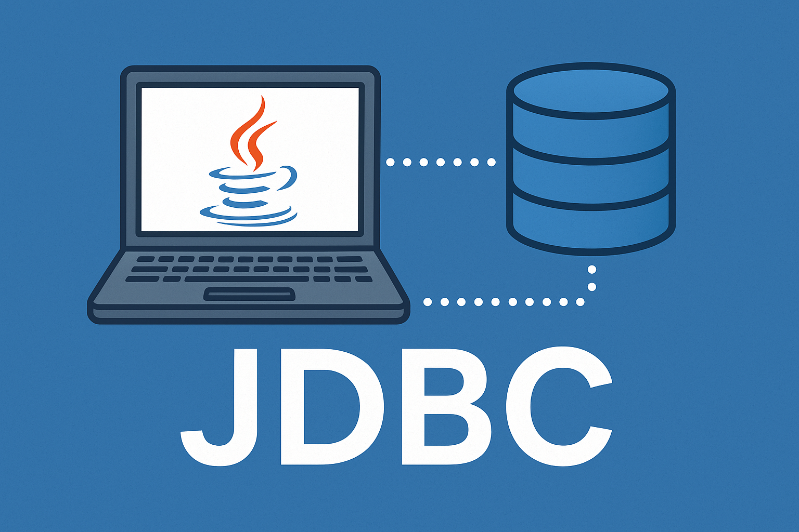

# JDBC的查询操作
ResultSet 是 JDBC （Java 数据库连接） API 提供的接口，它用于表示 SQL 查询的结果集。ResultSet 对象中包含了查询结果的所有行，可以通过 next() 方法逐行地获取并处理每一行的数据。它最常用于执行 SELECT 语句查询出来的结果集。

ResultSet 的遍历是基于 JDBC 的流式处理机制的，即一行一行地获取结果，避免将所有结果全部取出后再进行处理导致内存溢出问题。

在使用 ResultSet 遍历查询结果时，一般会采用以下步骤：

1. 执行 SQL 查询，获取 ResultSet 对象。
2. 使用 ResultSet 的 next() 方法移动游标指向结果集的下一行，判断是否有更多的数据行。
3. 如果有更多的数据行，则使用 ResultSet 对象提供的 getXXX() 方法获取当前行的各个字段（XXX 表示不同的数据类型）。例如，getLong("id") 方法用于获取当前行的 id 列对应的 Long 类型的值。
4. 处理当前行的数据，例如将其存入 Java 对象中。
5. 重复执行步骤 2~4，直到结果集中的所有行都被遍历完毕。
6. 调用 ResultSet 的 close() 方法释放资源。

需要注意的是，在使用完 ResultSet 对象之后，需要及时关闭它，以释放数据库资源并避免潜在的内存泄漏问题。否则，如果在多个线程中打开了多个 ResultSet 对象，并且没有正确关闭它们的话，可能会导致数据库连接过多，从而影响系统的稳定性和性能。


## 通过列索引获取数据（以String类型获取）
需求：获取t_user表中所有数据，在控制台打印输出每一行的数据。
```sql
select id,name,password,realname,gender,tel from t_user;
```
要查询的数据如下图：

代码如下（重点关注第4步 第5步 第6步）：
```java
import java.sql.DriverManager;
import java.sql.SQLException;
import java.sql.Connection;
import java.sql.Statement;
import java.util.ResourceBundle;
import java.sql.ResultSet;

public class JDBCTest09 {
    public static void main(String[] args){
        
    	// 通过以下代码获取属性文件中的配置信息
		ResourceBundle bundle = ResourceBundle.getBundle("jdbc");
		String driver = bundle.getString("driver");
		String url = bundle.getString("url");
		String user = bundle.getString("user");
		String password = bundle.getString("password");

        Connection conn = null;
        Statement stmt = null;
        ResultSet rs = null;
        try {
            // 1. 注册驱动
            Class.forName(driver);

            // 2. 获取连接
            conn = DriverManager.getConnection(url, user, password);

            // 3. 获取数据库操作对象
            stmt = conn.createStatement();

            // 4. 执行SQL语句
            String sql = "select id,name,password,realname,gender,tel from t_user";
            rs = stmt.executeQuery(sql);

            // 5. 处理查询结果集（这里的处理方式就是：遍历所有数据并输出）
            while(rs.next()){
                String id = rs.getString(1);
                String name = rs.getString(2);
                String pwd = rs.getString(3);
                String realname = rs.getString(4);
                String gender = rs.getString(5);
                String tel = rs.getString(6);
                System.out.println(id + "\t" + name + "\t" + pwd + "\t" + realname + "\t" + gender + "\t" + tel);
            }
            
        } catch(SQLException | ClassNotFoundException e){
            e.printStackTrace();
        } finally {
            // 6. 释放资源
            if(rs != null){
                try{
                    rs.close();
                }catch(SQLException e){
                    e.printStackTrace();
                }
            }
            if(stmt != null){
                try{
                    stmt.close();
                }catch(SQLException e){
                    e.printStackTrace();
                }
            }
            if(conn != null){
                try{
                    conn.close();
                }catch(SQLException e){
                    e.printStackTrace();
                }
            }
        }
    }
}
```

执行结果如下：


代码解读：
```java
// 4. 执行SQL语句
String sql = "select id,name,password,realname,gender,tel from t_user";
rs = stmt.executeQuery(sql);
```
执行insert delete update语句的时候，调用Statement接口的executeUpdate()方法。
执行select语句的时候，**调用Statement接口的executeQuery()方法**。执行select语句后返回结果集对象：ResultSet。

代码解读：
```java
// 5. 处理查询结果集（这里的处理方式就是：遍历所有数据并输出）
while(rs.next()){
    String id = rs.getString(1);
    String name = rs.getString(2);
    String pwd = rs.getString(3);
    String realname = rs.getString(4);
    String gender = rs.getString(5);
    String tel = rs.getString(6);
    System.out.println(id + "\t" + name + "\t" + pwd + "\t" + realname + "\t" + gender + "\t" + tel);
}
```

- **rs.next() 将游标移动到下一行，如果移动后指向的这一行有数据则返回true，没有数据则返回false。**
- **while循环体当中的代码是处理当前游标指向的这一行的数据。（注意：是处理的一行数据）**
- **rs.getString(int columnIndex) 其中 int columnIndex 是查询结果的列下标，列下标从1开始，以1递增。**


- **rs.getString(...) 方法在执行时，不管底层数据库中的数据类型是什么，统一以字符串String类型来获取。**

代码解读：
```java
// 6. 释放资源
if(rs != null){
    try{
        rs.close();
    }catch(SQLException e){
        e.printStackTrace();
    }
}
if(stmt != null){
    try{
        stmt.close();
    }catch(SQLException e){
        e.printStackTrace();
    }
}
if(conn != null){
    try{
        conn.close();
    }catch(SQLException e){
        e.printStackTrace();
    }
}
```
ResultSet最终也是需要关闭的。**先关闭ResultSet，再关闭Statement，最后关闭Connection**。


## 通过列名获取数据（以String类型获取）
获取当前行的数据，不仅可以通过列下标获取，还可以通过查询结果的列名来获取，通常这种方式是被推荐的，因为可读性好。
例如这样的SQL：
```sql
select id, name as username, realname from t_user;
```
执行结果是：

我们可以按照查询结果的列名来获取数据：

**注意：是根据查询结果的列名，而不是表中的列名。以上查询的时候将字段name起别名username了，所以要根据username来获取，而不能再根据name来获取了。**
```java
import java.sql.DriverManager;
import java.sql.SQLException;
import java.sql.Connection;
import java.sql.Statement;
import java.util.ResourceBundle;
import java.sql.ResultSet;

public class JDBCTest10 {
    public static void main(String[] args){
        
    	// 通过以下代码获取属性文件中的配置信息
		ResourceBundle bundle = ResourceBundle.getBundle("jdbc");
		String driver = bundle.getString("driver");
		String url = bundle.getString("url");
		String user = bundle.getString("user");
		String password = bundle.getString("password");

        Connection conn = null;
        Statement stmt = null;
        ResultSet rs = null;
        try {
            // 1. 注册驱动
            Class.forName(driver);

            // 2. 获取连接
            conn = DriverManager.getConnection(url, user, password);

            // 3. 获取数据库操作对象
            stmt = conn.createStatement();

            // 4. 执行SQL语句
            String sql = "select id,name as username,realname from t_user";
            rs = stmt.executeQuery(sql);

            // 5. 处理查询结果集（这里的处理方式就是：遍历所有数据并输出）
            while(rs.next()){
                String id = rs.getString("id");
                String name = rs.getString("username");
                String realname = rs.getString("realname");
                System.out.println(id + "\t" + name + "\t" + realname);
            }
            
        } catch(SQLException | ClassNotFoundException e){
            e.printStackTrace();
        } finally {
            // 6. 释放资源
            if(rs != null){
                try{
                    rs.close();
                }catch(SQLException e){
                    e.printStackTrace();
                }
            }
            if(stmt != null){
                try{
                    stmt.close();
                }catch(SQLException e){
                    e.printStackTrace();
                }
            }
            if(conn != null){
                try{
                    conn.close();
                }catch(SQLException e){
                    e.printStackTrace();
                }
            }
        }
    }
}
```

执行结果如下：


如果将上面代码中`rs.getString("username")`修改为`rs.getString("name")`，执行就会出现以下错误：

提示name列是不存在的。所以一定是根据查询结果中的列名来获取，而不是表中原始的列名。


## 以指定的类型获取数据
前面的程序可以看到，不管数据库表中是什么数据类型，都以String类型返回。当然，也能以指定类型返回。
使用PowerDesigner再设计一张商品表：t_product，使用Navicat for MySQL工具准备数据如下：


id以long类型获取，name以String类型获取，price以double类型获取，create_time以java.sql.Date类型获取，代码如下：
```java
import java.sql.DriverManager;
import java.sql.SQLException;
import java.sql.Connection;
import java.sql.Statement;
import java.util.ResourceBundle;
import java.sql.ResultSet;

public class JDBCTest11 {
    public static void main(String[] args){
        
    	// 通过以下代码获取属性文件中的配置信息
		ResourceBundle bundle = ResourceBundle.getBundle("jdbc");
		String driver = bundle.getString("driver");
		String url = bundle.getString("url");
		String user = bundle.getString("user");
		String password = bundle.getString("password");

        Connection conn = null;
        Statement stmt = null;
        ResultSet rs = null;
        try {
            // 1. 注册驱动
            Class.forName(driver);

            // 2. 获取连接
            conn = DriverManager.getConnection(url, user, password);

            // 3. 获取数据库操作对象
            stmt = conn.createStatement();

            // 4. 执行SQL语句
            String sql = "select id,name,price,create_time as createTime from t_product";
            rs = stmt.executeQuery(sql);

            // 5. 处理查询结果集（这里的处理方式就是：遍历所有数据并输出）
            while(rs.next()){
                long id = rs.getLong("id");
                String name = rs.getString("name");
                double price = rs.getDouble("price");
                java.sql.Date createTime = rs.getDate("createTime");
                // 以指定类型获取后是可以直接用的，例如获取到价格后，统一让价格乘以2
                System.out.println(id + "\t" + name + "\t" + price * 2 + "\t" + createTime);
            }
            
        } catch(SQLException | ClassNotFoundException e){
            e.printStackTrace();
        } finally {
            // 6. 释放资源
            if(rs != null){
                try{
                    rs.close();
                }catch(SQLException e){
                    e.printStackTrace();
                }
            }
            if(stmt != null){
                try{
                    stmt.close();
                }catch(SQLException e){
                    e.printStackTrace();
                }
            }
            if(conn != null){
                try{
                    conn.close();
                }catch(SQLException e){
                    e.printStackTrace();
                }
            }
        }
    }
}
```

执行结果如下：


## 获取结果集的元数据信息（了解）
ResultSetMetaData 是一个接口，用于描述 ResultSet 中的元数据信息，即查询结果集的结构信息，例如查询结果集中包含了哪些列，每个列的数据类型、长度、标识符等。

ResultSetMetaData 可以通过 ResultSet 接口的 getMetaData() 方法获取，一般在对 ResultSet 进行元数据信息处理时使用。例如，可以使用 ResultSetMetaData 对象获取查询结果中列的信息，如列名、列的类型、列的长度等。通过 ResultSetMetaData 接口的方法，可以实现对查询结果的基本描述信息操作，例如获取查询结果集中有多少列、列的类型、列的标识符等。以下是一段通过 ResultSetMetaData 获取查询结果中列的信息的示例代码：

```java
import java.sql.DriverManager;
import java.sql.SQLException;
import java.sql.Connection;
import java.sql.Statement;
import java.util.ResourceBundle;
import java.sql.ResultSet;
import java.sql.ResultSetMetaData;

public class JDBCTest12 {
    public static void main(String[] args){
        
    	// 通过以下代码获取属性文件中的配置信息
		ResourceBundle bundle = ResourceBundle.getBundle("jdbc");
		String driver = bundle.getString("driver");
		String url = bundle.getString("url");
		String user = bundle.getString("user");
		String password = bundle.getString("password");

        Connection conn = null;
        Statement stmt = null;
        ResultSet rs = null;
        try {
            // 1. 注册驱动
            Class.forName(driver);

            // 2. 获取连接
            conn = DriverManager.getConnection(url, user, password);

            // 3. 获取数据库操作对象
            stmt = conn.createStatement();

            // 4. 执行SQL语句
            String sql = "select id,name,price,create_time as createTime from t_product";
            rs = stmt.executeQuery(sql);

            // 获取元数据信息
            ResultSetMetaData rsmd = rs.getMetaData();
            int columnCount = rsmd.getColumnCount();
            for (int i = 1; i <= columnCount; i++) {
                System.out.println("列名：" + rsmd.getColumnName(i) + "，数据类型：" + rsmd.getColumnTypeName(i) +
                                   "，列的长度：" + rsmd.getColumnDisplaySize(i));
            }
            
        } catch(SQLException | ClassNotFoundException e){
            e.printStackTrace();
        } finally {
            // 6. 释放资源
            if(rs != null){
                try{
                    rs.close();
                }catch(SQLException e){
                    e.printStackTrace();
                }
            }
            if(stmt != null){
                try{
                    stmt.close();
                }catch(SQLException e){
                    e.printStackTrace();
                }
            }
            if(conn != null){
                try{
                    conn.close();
                }catch(SQLException e){
                    e.printStackTrace();
                }
            }
        }
    }
}
```

执行结果如下：


在上面的代码中，我们首先创建了一个 Statement 对象，然后执行了一条 SQL 查询语句，生成了一个 ResultSet 对象。接下来，我们通过 ResultSet 对象的 getMetaData() 方法获取了 ResultSetMetaData 对象，进而获取了查询结果中列的信息并进行输出。需要注意的是，在进行列信息的获取时，列的编号从 1 开始计算。该示例代码将获取查询结果集中所有列名、数据类型以及长度等信息。


# 获取新增行的主键值
有很多表的主键字段值都是自增的，在某些特殊的业务环境下，当我们插入了新数据后，希望能够获取到这条新数据的主键值，应该如何获取呢？
在 JDBC 中，如果要获取插入数据后的主键值，可以使用 Statement 接口的 executeUpdate() 方法的重载版本，该方法接受一个额外的参数，用于指定是否需要获取自动生成的主键值。然后，通过以下两个步骤获取插入数据后的主键值：

1.  在执行 executeUpdate() 方法时指定一个标志位，表示需要返回插入的主键值。
2.  调用 Statement 对象的 getGeneratedKeys() 方法，返回一个包含插入的主键值的 ResultSet 对象。 

```java
import java.sql.DriverManager;
import java.sql.SQLException;
import java.sql.Connection;
import java.sql.Statement;
import java.util.ResourceBundle;
import java.sql.ResultSet;

public class JDBCTest13 {
    public static void main(String[] args){
        
    	// 通过以下代码获取属性文件中的配置信息
		ResourceBundle bundle = ResourceBundle.getBundle("jdbc");
		String driver = bundle.getString("driver");
		String url = bundle.getString("url");
		String user = bundle.getString("user");
		String password = bundle.getString("password");

        Connection conn = null;
        Statement stmt = null;
        ResultSet rs = null;
        try {
            // 1. 注册驱动
            Class.forName(driver);

            // 2. 获取连接
            conn = DriverManager.getConnection(url, user, password);

            // 3. 获取数据库操作对象
            stmt = conn.createStatement();

            // 4. 执行SQL语句
            String sql = "insert into t_user(name,password,realname,gender,tel) values('zhangsan','111','张三','男','19856525352')";
            // 第一步
            int count = stmt.executeUpdate(sql, Statement.RETURN_GENERATED_KEYS);
            // 第二步
            rs = stmt.getGeneratedKeys();
            if(rs.next()){
                int id = rs.getInt(1);
                System.out.println("新增数据行的主键值：" + id);
            }
            
        } catch(SQLException | ClassNotFoundException e){
            e.printStackTrace();
        } finally {
            // 6. 释放资源
            if(rs != null){
                try{
                    rs.close();
                }catch(SQLException e){
                    e.printStackTrace();
                }
            }
            if(stmt != null){
                try{
                    stmt.close();
                }catch(SQLException e){
                    e.printStackTrace();
                }
            }
            if(conn != null){
                try{
                    conn.close();
                }catch(SQLException e){
                    e.printStackTrace();
                }
            }
        }
    }
}
```

执行结果如下：


以上代码中，我们将 Statement.RETURN_GENERATED_KEYS 传递给 executeUpdate() 方法，以指定需要获取插入的主键值。然后，通过调用 Statement 对象的 getGeneratedKeys() 方法获取包含插入的主键值的 ResultSet 对象，通过 ResultSet 对象获取主键值。需要注意的是，在使用 Statement 对象的 getGeneratedKeys() 方法获取自动生成的主键值时，主键值的获取方式具有一定的差异，需要根据不同的数据库种类和版本来进行调整。
