## IO流概述

### 简介

- **I/O 是 Input 和 Output 的缩写，IO 技术是非常实用的技术，用于 `处理设备之间的数据传输` ，如：读写文件、网络通讯等。**

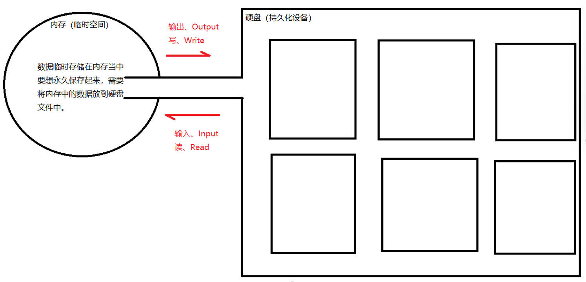

### 什么是IO流？

1. **IO流指的是：程序中`数据的流动`。数据可以`从内存流动到硬盘(输出)`，也可以`从硬盘流动到内存(输入)`。**

2. **Java中IO流最基本的作用是：完成文件的`读和写`。**

* 其中，IO 流可以将程序中的数据保存（写出）到本地文件中，我们称之为：`写`（Output，写出数据）。


* 其中，IO 流可以将本地文件中的数据读取（加载）到程序中，我们称之为：`读`（Input，读取数据）。


* 在 IO 流中，是以`程序`作为参照物来看读写的方向的。

> [!NOTE]
>
> * ① 是程序在读取文件中的数据，也是程序在向文件中写出数据。
> * ② 因为程序是运行在内存中，所以也可以将`内存`作为参照物来看读写的方向的。


### IO流的分类？

> **根据数据流向分为：输入和输出是相对于内存而言的。**

+ 输入流：从硬盘到内存。(输入又叫做读：read)

+ 输出流：从内存到硬盘。（输出又叫做写：write）

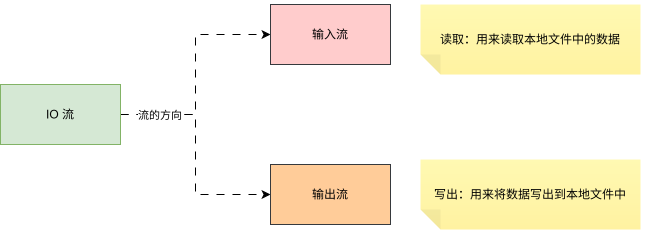


> **根据读写数据形式分为：**

+ 字节流：一次读取一个字节。适合读取非文本数据。例如图片、声音、视频等文件。（当然字节流是万能的。什么都可以读和写。）

+ 字符流：一次读取一个字符。只适合读取普通文本。不适合读取二进制文件。因为字符流统一使用Unicode编码，可以避免出现编码混乱的问题。

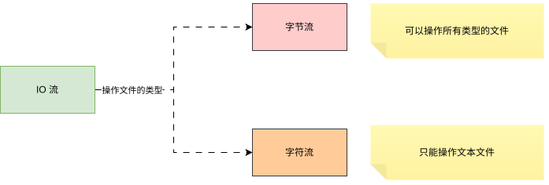

>  [!CAUTION]
>
> **注意：Java的所有IO流中凡是以`Stream结尾`的都是`字节流`。凡是以`Reader和Writer结尾`的都是`字符流`。**


> **根据流在IO操作中的作用和实现方式来分类:**

+ 节点流：节点流`负责数据源和数据目的地`的`连接`，是IO中最基本的组成部分。

+ 处理流：处理流对节点流进行`装饰/包装`，提供`更多高级处理操作`，方便用户进行数据处理。


> **Java中已经将io流实现了，在`java.io`包下，可以直接使用。**


## IO流的体系结构

### 概述

①下图是常用的IO流。实际上IO流远远不止这些。

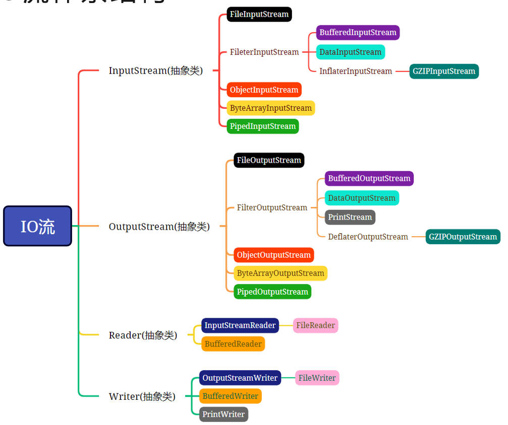

②**InputStream：字节输入流**

③**OutputStream：字节输出流**

④**Reader：字符输入流**

⑤**Writer：字符输出流**

⑥以上4个流都是抽象类，是所有IO流的四大头领！！！

⑦**所有的流`都实现了Closeable接口`，都有`close()方法`，流用完要关闭。**

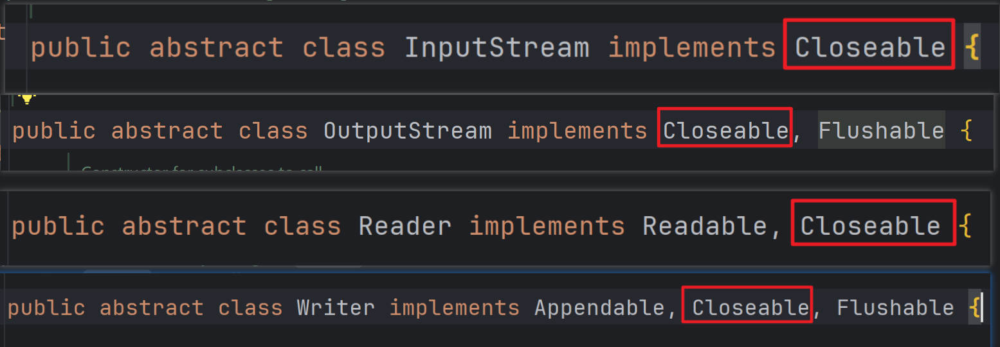

⑧**所有的输出流`都实现了Flushable接口`，都有`flush()方法`，flush方法的作用是，`将缓存清空，全部写出`。养成好习惯，以防数据丢失。**

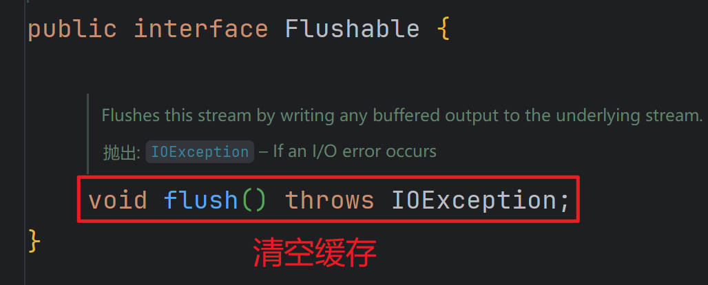


### IO 流体系

* IO 流按照`操作文件的类型`进行分类，可以分为`字节流`和`字符流`：

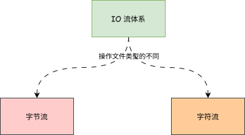

* 以`字节流`为例，按照`流的方向`进行分类，可以分为`字节输入流`和`字节输出流`：

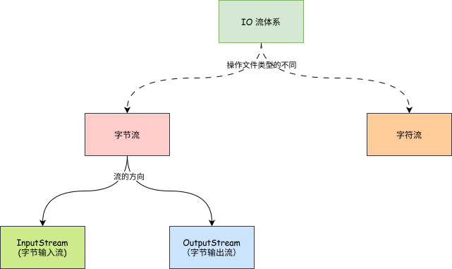


* 以`字符流`为例，按照`流的方向`进行分类，可以分为`字符输入流`和`字符输出流`：

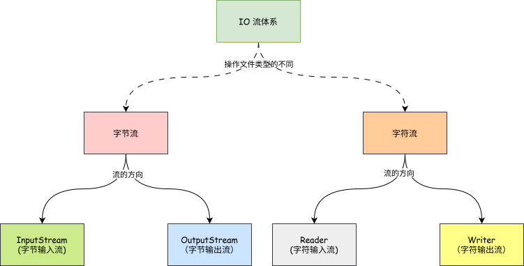

* 但是，InputStream、OutputStream、Reader 以及 Writer 都是抽象类，是不能实例化的：

> [!NOTE]
>
> ::: code-group
>
> ```java [InputStream.java]
> public abstract class InputStream implements Closeable {}
> ```
>
> ```java [OutputStream.java]
> public abstract class OutputStream implements Closeable, Flushable {}
> ```
>
> ```java [Reader.java]
> public abstract class Reader implements Readable, Closeable {}
> ```
>
> ```java [Writer.java]
> public abstract class Writer implements Appendable, Closeable, Flushable {}
> ```
>
> :::

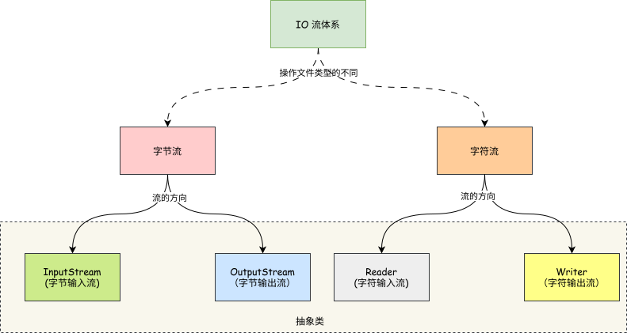

> [!NOTE]
>
> 为了创建流的实例（对象），我们还需要它们的子类！！！

* 以字节输入流（InputStream）为例，其子类是 FileInputStream，如下所示：

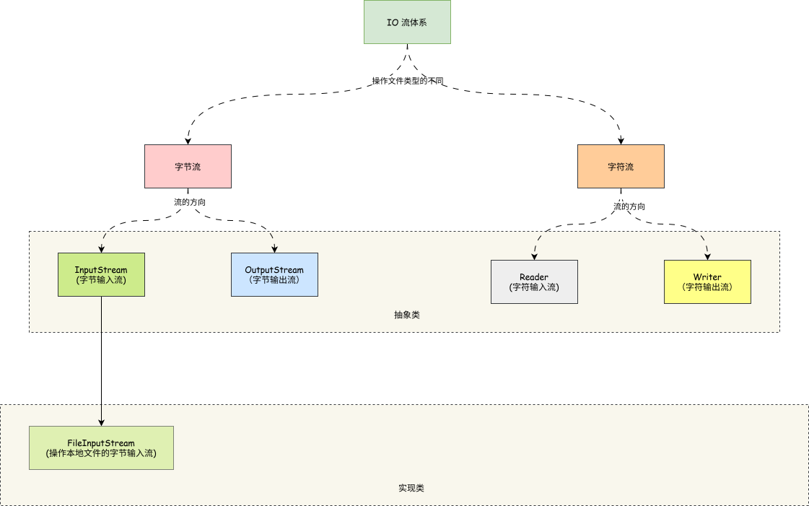

* 以字节输出流（OutputStream）为例，其子类是 FileOutputStream，如下所示：

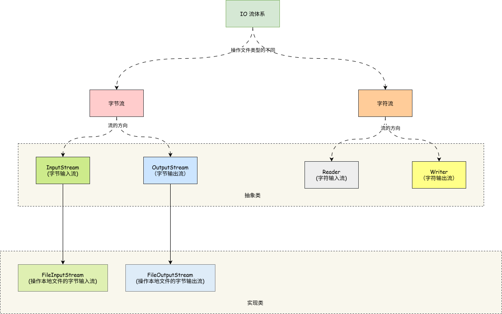

* 同理，字符输入流（Reader）和字符输出流（Writer）的继承体系就是这样，如下所示：

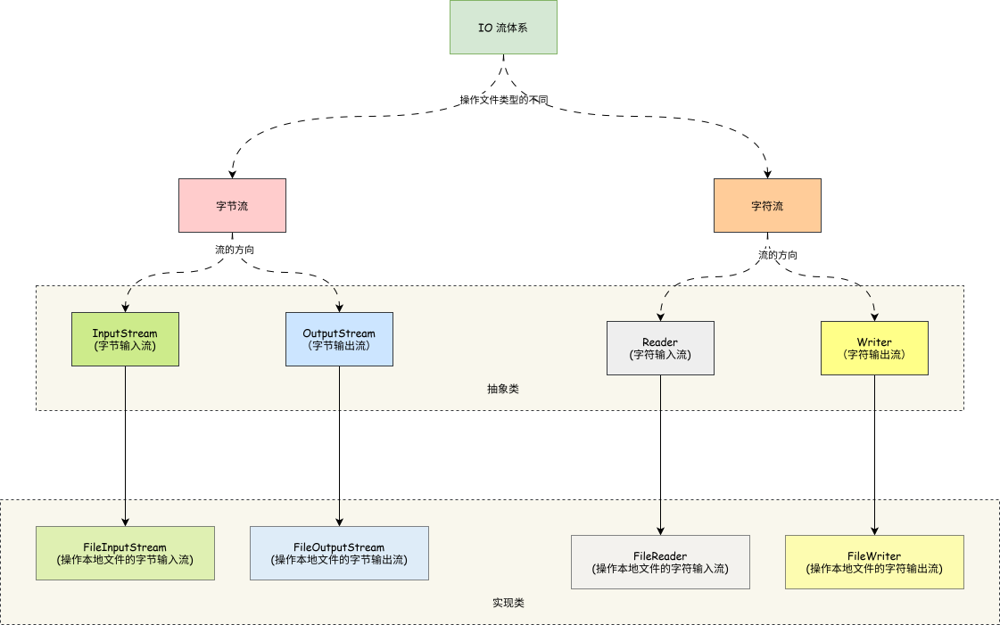


## 字符集

### 概述

* 之前，我们在学习字节流的时候，提过读取文件的时候，文件中的内容尽量是英文：

```java [Test.java]
package com.github.file;

import java.io.FileInputStream;
import java.io.IOException;
import java.io.InputStream;

public class Test {
    public static void main(String[] args) throws IOException {
        // 创建输入流对象
        InputStream is = new FileInputStream("day23\\a.txt");
        // 读取数据
        // 一次读取一个字节，读取的数据是在 ASCII 码表上字符对应的数字
        // 读取到文件末尾，返回 -1
        int b;
        while ((b = is.read()) != -1) {
            System.out.println(Character.toChars(b));
        }
        // 释放资源
        is.close();

    }
}
```

> 

* 但是，劳资不信这个邪，我就要在读取文件的时候，文件中的内容是中文：

```java [Test.java]
package com.github.file;

import java.io.FileInputStream;
import java.io.IOException;
import java.io.InputStream;

public class Test {
    public static void main(String[] args) throws IOException {
        // 创建输入流对象
        InputStream is = new FileInputStream("day23\\a.txt");
        // 读取数据
        // 一次读取一个字节，读取的数据是在 ASCII 码表上字符对应的数字
        // 读取到文件末尾，返回 -1
        int b;
        while ((b = is.read()) != -1) {
            System.out.println(Character.toChars(b));
        }
        // 释放资源
        is.close();

    }
}
```

> 

> [!IMPORTANT]
>
> 我们会发现结果是乱码，要解释这个原因，就要将要学习`字符集`和`编码方式（编码规则）`有关了。


### 计算机的存储规则

#### 概述

* 要学习`字符集`和`编码方式（编码规则）`，我们有必要回顾之前学习过的`计算机的存储规则`。

#### 计算机的存储规则

* 在计算机中，任意的数据都是以二进制的形式进行存储的，包括：数字、字符、图片、视频等。


* 其实，所谓的二进制就是`0`或`1`，中文称为“比特”，英文称为“bit ”。

> [!NOTE]
>
> * ① 1 bit 只能存储 0 或 1 ，可以存储 2^1 个数字，即：可以表示 2 个数字。
> * ② 计算机中最小的存储单元是 bit 。


* 但是，一个`bit`能存储的数据太少了，通常我们会将`8`个`bit`分为一组，中文称为“字节”，英文称为“Byte”。

> [!NOTE]
>
> * ① 1 Byte 是 8 bit，可以存储 2^8 个数字，即：可以表示 256 个数字。
> * ② 计算机中最基本的存储单元是 Byte 。

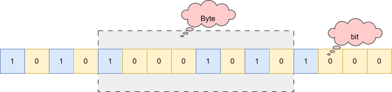

> [!IMPORTANT]
>
> * ① 计算机存储英文的时候，1 个字节就可以了，因为英文字母一共 26 个，就算大小写也只有 52 个。
> * ② 计算机到底是如何存储英文的，就和将要学习的`字符集`和`编码方式（编码规则）`有关了。


### 字符集和编码方式（编码规则）

#### 概述

* 字符（Character）是各种文字和符号的总称，如：各个国家的文字、标点符号、数字符号等。

> [!NOTE]
>
> 在 Java 中，我们使用单引号`''`来将`字符`括起来，并使用`char` 来表示`字符`的`数据类型`：
>
> ```java
> char c = '1';
> char c2 = 'A';
> char c3 = '我';
> char c4 = '&';
> ```

* 字符集（Character Set）：字符集是字符的集合，规则了有哪些“字符”可以使用。

> [!NOTE]
>
> 字符集可以理解为：有哪些字符可以用！！！
>
> * ① ASCII 字符集包含了 A-Z、a-z、0-9 以及一些标点符号。
> * ② Unicode 字符集包含了世界上绝大多数的文字和符号，如：中文、日文、阿拉伯文、emoji 等。
> * ③ 常见的字符集：`ASCII`、`GBK` 以及 `Unicode` 。

* 编码方式（Character Encoding，计算机的存储规则）：就是如何将字符转换为二进制数字的规则，以便计算机可以进行存储和传输。

> [!NOTE]
>
> 编码方式可以理解为：字符是如何转变为 0 或 1 。
>
> * ① 每个字符分配一个或多个字节的二进制代码，如：ASCII 字符集，使用 1 个字节存储英文字符；而 GBK 字符集，使用 2 个字节存储汉字字符。
> * ② 同一个字符集可以有多种编码方式，如：Unicode 字符集中的编码方式有 UTF-16、UTF-32 以及 UTF-8 。


#### ASCII 字符集（ASCII 编码规则）

##### ASCII 字符集

* ASCII 字符集是基于`拉丁字母`的一套电脑字符集。

> [!NOTE]
>
> ASCII 是 American Standard Code for Information Interchange（美国信息互换标准代码）的缩写。

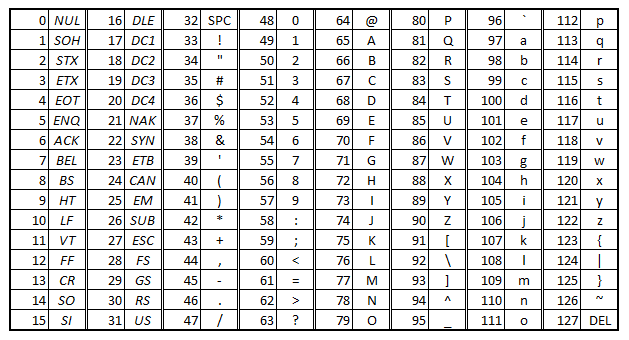

* 在 ASCII 字符集中记录了 128 个数据，包含了 A-Z、a-z、0-9 以及一些标点符号。

> [!NOTE]
>
> * ① ASCII 字符集对于大多数基于`拉丁字母`体系的国家来说够用了，如：美国、英国等。
> * ② 字符集可以理解为：有哪些字符可以用，如：`a`可以使用，而`汉`就不可以。


##### ASCII 编码规则

* 在 ASCII 字符集中记录了 128 个数据，包含了 A-Z、a-z、0-9 以及一些标点符号。

> [!NOTE]
>
> ASCII 字符集中字符的序号是 0 - 127 。


* 计算机在存储 ASCII 字符集的字符的时候，首先需要去 ASCII 字符集中查询字符对应的数字：


* 对于英文字符`a`，其在 ASCII 字符集中的数字编号是`97`，换算为二进制是`110 0001`，难道就这样直接存储到计算机中？

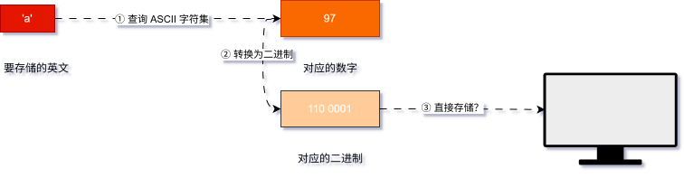

* 当然不对，因为计算机中最基本的存储单元是字节（Byte）。

> [!NOTE]
>
> 一个字节是 8 bit，而 97 的二进制只有 7 bit ，不足一个字节（Byte），是不能直接存储的！！！


* 计算机需要进行编码（将字符集中查询到的数据（十进制数字），按照一定的规则进行计算），变为计算机中实际能存储的二进制数据。

> [!NOTE]
>
> ASCII 的编码方式（编码规则，计算机的存储规则）：直接在前面补 0 ，形成 8 bit。

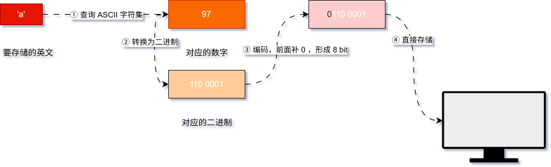

* 如果要进行读取操作，只需要将计算机中存储的二进制数据进行解码（将实际存储在计算机中的二进制数据，按照一定的规则进行计算），还原为字符集中对应的数据（十进制数字）：

> [!NOTE]
>
> ASCII 的解码方式（解码规则，计算机的解码规则）：直接转为十进制。

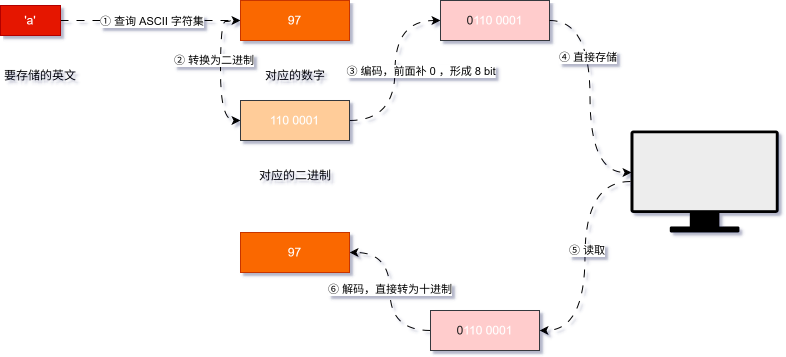

* 再根据获取到的数据（十进制数字）去 ASCII 字符集中查询对应的字符，即：英文字符`a`：


* 但是，我们经常会在网站上会看到这样的 ASCII 表，其实只是为了方便我们查看而已！！！


#### 其他字符集

* `ASCII`字符集中是没有汉字的，为了在计算机中表示汉字，必须设计一个字符集，让每个汉字和一个唯一的数字产生对应关系。
* `GB2312`字符集：1981 年 5 月 1 日实施的简体中文汉字编码国家标准。GB2312 对汉字采用双字节编码，收录 7445 个图形字符，其中包括 6763 个汉字。自 2017 年 3 月 23 日起，该标准转化为推荐性标准：GB/T2312-1980，不再强制执行。

* `BIG5`字符集：台湾地区繁体中文标准字符集，采用双字节编码，原始版本共收录 13053 个中文字，1984 年实施。后续版本增加 F9D6-F9DC 七个汉字，汉字总数 13060 个。
* `GBK`字符集：1995 年 12 月发布的汉字编码国家标准，是对 GB2312 编码的扩充，对汉字采用双字节编码。GBK 字符集共收录 21003 个汉字，包含国家标准 GB13000-1 中的全部中日韩汉字，和 BIG5 编码中的所有汉字。
* `GB18030`字符集：2000 年 3 月 17 日发布的汉字编码国家标准，是对 GBK 编码的扩充，覆盖中文、日文、朝鲜语和中国少数民族文字，其中收录 27484 个汉字。GB18030 字符集采用单字节、双字节和四字节三种方式对字符编码。兼容 GBK 和 GB2312 字符集。2005 年 11 月 8 日，发布了修订版本：GB18030-2005，共收录汉字七万余个。2022 年 7 月 19 日，发布了第二次修订版本：GB18030-2022，收录汉字总数八万余个。

* `Unicode`字符集：国际标准字符集，它将世界各种语言的每个字符定义一个唯一的编码，以满足跨语言、跨平台的文本信息转换。Unicode 采用四个字节为每个字符编码。

> [!NOTE]
>
> 在实际开发中，对我们最为重要的就是`GBK`字符集和`Unicode`字符集：
>
> * ① `GBK`字符集是 Windows 简体中文操作系统默认的字符集。
> * ② `Unicode`字符集和我们之后的工作息息相关。


#### GBK 字符集（GBK 编码规则）

##### 存储英文

* GBK 字符集是兼容 ASCII 字符集，即：GBK 字符集也是使用 1 个字节来存储英文的。

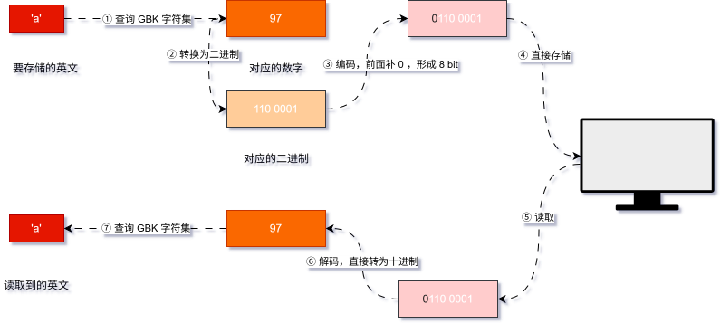


##### 存储中文

* 假设要存储的中文是`汉`，在 GBK 字符集中查询到的数字编号是`47802`，转换为二进制是`10111010 10111010`，需要 2 个字节来存储：

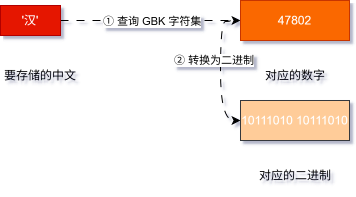

* GBK 字符集有如下的两个规律：
  * ① 汉字使用 2 个字节存储（理论上可以存储 2^16 = 65536 个字符，实际上一共存储了21886 个字符 ）。
  * ② 高位字节的二进制一定以 1 开头，转为十进制之后就是负数，如：47802 转换为十进制就是 `-70, -70`。

> [!NOTE]
>
> 之所以这么设计，就是为了兼容 ASCII 字符集：
>
> * ① ASCII 字符集（GBK 字符集兼容）在进行字符存储的时候，是二进制前补 0，即：以 `0` 开头 。
> * ② GBK 字符集在存储汉字的时候，二进制是以 `1` 开头的。
>
> 底层也正是通过上述的规则来区分到底是存储的`中文`还是存储的`英文`！！！

* 计算机需要进行编码（将字符集中查询到的数据（十进制数字），按照一定的规则进行计算），变为计算机中实际能存储的二进制数据。

> [!NOTE]
>
> GBK 的编码方式（编码规则，计算机的存储规则）：什么都不做，直接存储。

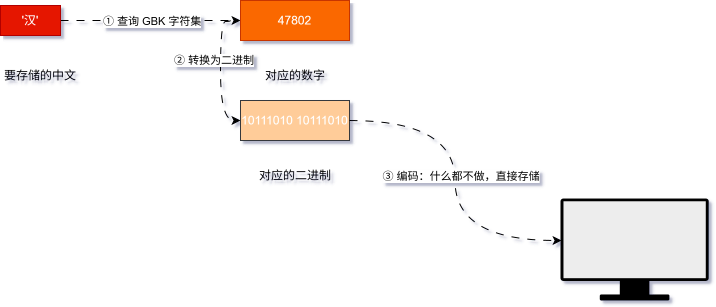


* 如果要进行读取操作，只需要将计算机中存储的二进制数据进行解码（将实际存储在计算机中的二进制数据，按照一定的规则进行计算），还原为字符集中对应的数据（十进制数字）：

> [!NOTE]
>
> ASCII 的解码方式（解码规则，计算机的解码规则）：直接转为十进制。

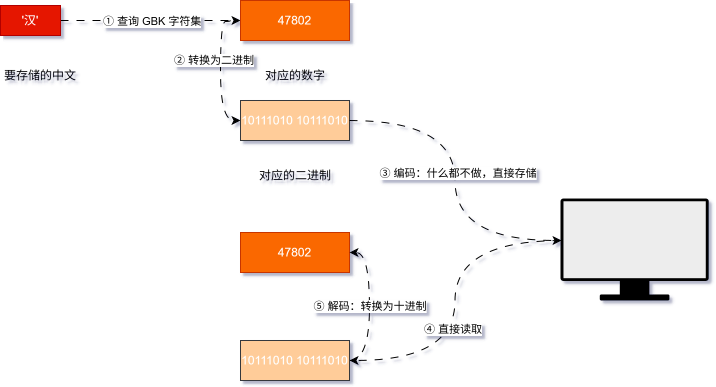

* 再根据获取到的数据（十进制数字）去 GBK 字符集中查询对应的字符，即：英文字符`汉`：

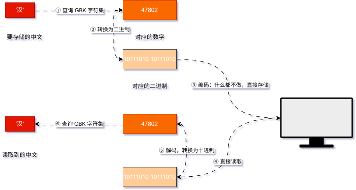


#### Unicode 字符集

##### 概述

* 为了方便美国人民（拉丁体系）使用计算机，美国推出了 ASCII 字符集。
* 为了方便中国人民（象形文字）使用计算机，中国推出了 GBK 字符集。
* ...

> [!NOTE]
>
> 各个国家都推出了属于自己的字符集，这很不利于软件的推广以及传播（用不了别的国家的软件）！！！

* 为了解决这个问题，由美国牵头，并联合各大电脑厂商组成了联盟，制定了 Unicode 字符集。


##### 存储规则

* 和之前一样，字符进行存储的时候，需要根据字符去字符集中查询对应的数字编号：


* 接着将数字编号转换为二进制数：

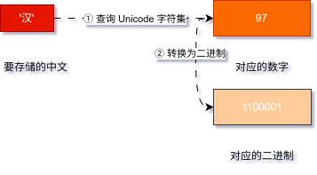

* 计算机需要进行编码，变为计算机中实际能存储的二进制数据。

> [!NOTE]
>
> 编码：将字符集中查询到的数据（十进制数字），按照一定的规则进行计算。

* 在 Uncode 字符集中有三种编码方式：
  * UTF-16：用 2 - 4 个字节保存。
  * UTF-32：用 4 个字节保存。
  * UTF-8：用 1 - 4 个字节。

> [!NOTE]
>
> UTF，Uniode Transfer Format，将 Unicode 中的数字进行转换格式化。

* 最开始出现的编码方式是`UTF-16`，其使用`2 - 4`个字节来保存。

> [!NOTE]
>
> * ① 因为最常用的是转换为`16`bit，所以命名为`UTF-16`。
> * ② UTF-16 对拉丁体系的文字（英文）非常不友好，本来可以使用 1 个字节存储，却需要使用 2 个字节存储，浪费空间！！！

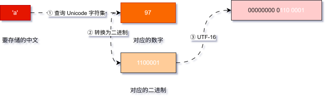

* 接着有出现的编码方式是`UTF-32`，其使用`4`个字节来保存。

> [!NOTE]
>
> * ① 因为固定使用`32`个bit，所以命名为`UTF-32`。
> * ② UTF-32 对拉丁体系的文字（英文）更加不优化，固定使用4个字节来存储，更加浪费空间！！！

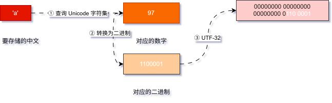

* 之后出现了我们经常使用的编码方式`UTF-8`，其使用`1-4`个字节来保存。

> [!NOTE]
>
> * ① UTF-8 的规则：
>   * `如果是 ASCII 字符集中出现的英文字母，统一使用  1 个字节来存储`。
>   * 如果是拉丁文、希腊文等，统一使用 2 个字节来存储。
>   * `如果是中日韩、东南亚、中东文字，统一使用 3 个字节来存储`。
>   * 如果是其他语言，统一使用功 4 个字节来存储。
> * ② UTF-8 的编码方式（具体细节）：
>
> | UTF-8 编码方式           | 二进制                                      |
> | ------------------------ | ------------------------------------------- |
> | ASCII 码                 | `0`xxxxxxx                                  |
> | 拉丁文、希腊文等         | `110`xxxxx `10`xxxxxx                       |
> | 中日韩、东南亚、中东文字 | `1110`xxxx `10`xxxxxx `10`xxxxxx            |
> | 其他语言                 | `11110`xxx `10`xxxxxx `10`xxxxxx `10`xxxxxx |

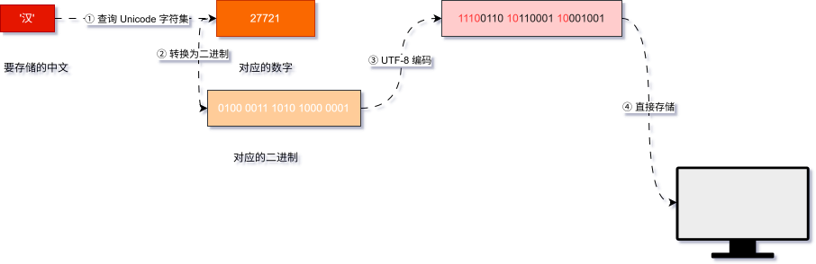

* 之后的读取，就是其存储的相反操作：

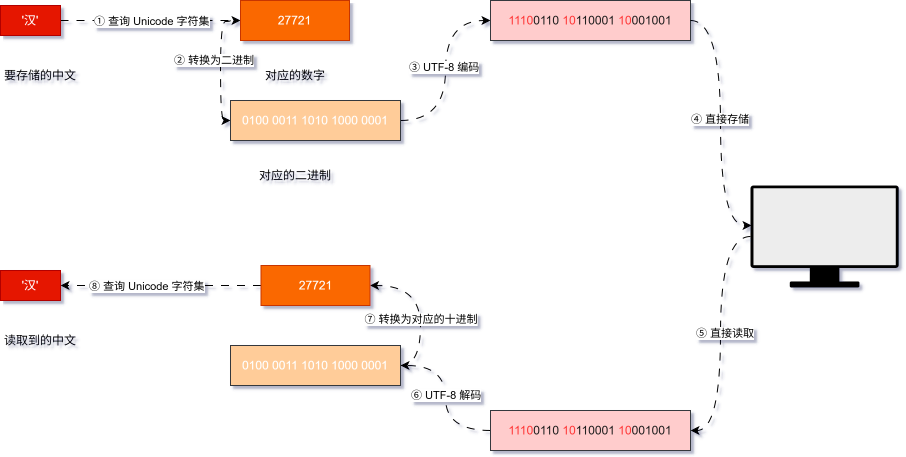


##### 总结

* Unicode 是字符集，UTF-8 是Unicode 字符集中最常用的一种编码方式。

> [!NOTE]
>
> 在实际开发中，我们通常不会区分的这么明显；很多时候，我们也会将 UTF-8 说成字符编码或字符集。

* UTF-8 编码格式的规则：

| 语言 | UTF-8 编码规则                                               |
| ---- | ------------------------------------------------------------ |
| 英文 | 一个英文占 1 个字节，二进制第一位是 0，转成十进制是正数。    |
| 中文 | 一个中文占 3 个字节，二进制第一位是1，第一个字节转成十进制是负数。 |


#### Java 对字符集的支持

* Java 提供了获取字符集的方法：

| Charset 类                                                   | 描述                                   |
| ------------------------------------------------------------ | -------------------------------------- |
| `public static SortedMap<String,Charset> availableCharsets()` | 获取 Java 平台支持的所有字符集         |
| `public static Charset defaultCharset() `                    | 获取当前默认的字符集                   |
| `public static Charset forName(String charsetName) `         | 获取指定名称的字符集                   |
| `public static boolean isSupported(String charsetName)`      | 判断当前 Java 平台是否支持指定的字符集 |

* 对于标准的字符集，Java 也提供了常量定义：

| StandardCharsets 类                                          | 描述                     |
| ------------------------------------------------------------ | ------------------------ |
| `public static final Charset US_ASCII = sun.nio.cs.US_ASCII.INSTANCE;` | ASCII 字符集             |
| `public static final Charset ISO_8859_1 = sun.nio.cs.ISO_8859_1.INSTANCE;` | ISO_8859_1 字符集        |
| `public static final Charset UTF_8 = sun.nio.cs.UTF_8.INSTANCE;` | UTF-8 编码（字符集）     |
| `public static final Charset UTF_16BE = new sun.nio.cs.UTF_16BE();` | UTF_16BE 编码（字符集）  |
| `public static final Charset UTF_16LE = new sun.nio.cs.UTF_16LE();` | UTF_16LE  编码（字符集） |
| `public static final Charset UTF_16 = new sun.nio.cs.UTF_16();` | UTF_16 编码（字符集）    |


* 示例：

```java
package com.github.io;

import java.io.IOException;
import java.nio.charset.Charset;
import java.util.SortedMap;

public class Test {
    public static void main(String[] args) throws IOException {
        SortedMap<String, Charset> stringCharsetSortedMap = Charset.availableCharsets();
        System.out.println(stringCharsetSortedMap.size()); // 173

        Charset charset = Charset.defaultCharset();
        System.out.println(charset); // UTF-8

        Charset charset2 = Charset.forName("GBK");
        System.out.println(charset2); // GBK

        System.out.println(Charset.isSupported("GBK")); // true
    }
}
```


* 示例：

```java
package com.github.io;

import java.io.IOException;
import java.nio.charset.StandardCharsets;

public class Test {
    public static void main(String[] args) throws IOException {
        System.out.println(StandardCharsets.US_ASCII);
        System.out.println(StandardCharsets.UTF_8);
        System.out.println(StandardCharsets.UTF_16);
    }
}
```


### 乱码以及解决方案

#### 概述

* 乱码出现的原因 1 ：读取数据时未读完整个汉字。
* 乱码出现的原因 2 ：编码的方式和解码的方式不统一。


#### 原因一

* 假设有这样的字符串 `abb爱你`，其 UTF-8 编码是这样的，如下所示：


* 现在，使用字节流去读取数据（一次读取一个字节），就是这样的，如下所示：

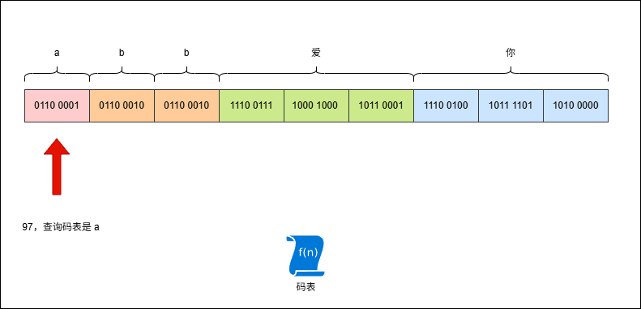


#### 原因二

* 假设有这样的字符串 `abb爱你`，其 UTF-8 编码是这样的，如下所示：


* 但是，此时我使用 GBK 来解码，就是这样的，如下所示：

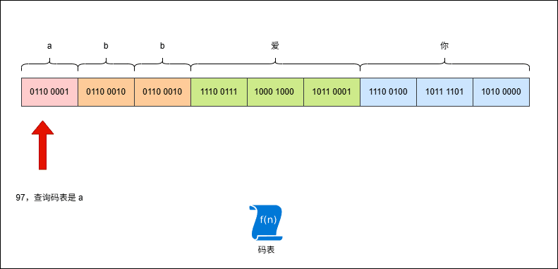


#### 如何解决乱码？

* 针对原因一的解决方案：不要使用字节流来读取文本。
* 针对原因二的解决方案：编码和解码使用同一个编码规则（编码方式）。


#### 扩展

* 【问】字节流读取中文会乱码，但是为什么拷贝文件不会乱码？

```java
package com.github.io;

import java.io.*;

public class Test {
    public static void main(String[] args) throws IOException {
        InputStream is = new FileInputStream("d:/a.txt");
        OutputStream os = new FileOutputStream("d:/b.txt");
        int b;
        while ((b = is.read()) != -1) {
            os.write(b);
        }
        os.close();
        is.close();
    }
}
```

* 【答】因为是一个字节一个字节拷贝的，数据并没有丢失。

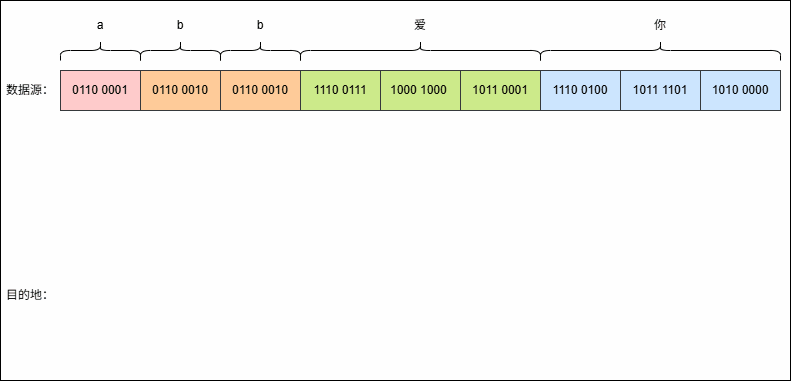


#### 扩展

* Java 提供了编码方法：

| String 类中的编码方法                          | 描述                                            |
| ---------------------------------------------- | ----------------------------------------------- |
| `public byte[] getBytes() {}`                  | 使用默认的方式进行编码（IDEA 中，默认是 UTF-8） |
| `public byte[] getBytes(Charset charset) {}`   | 使用指定的方式进行编码                          |
| `public byte[] getBytes(String charsetName){}` | 使用指定的方式进行编码                          |

* Java 提供了解码的方式：

| String 类中的解码方法                               | 描述                                            |
| --------------------------------------------------- | ----------------------------------------------- |
| `public String(byte[] bytes) {}`                    | 使用默认的方式进行解码（IDEA 中，默认是 UTF-8） |
| `public String(byte bytes[], Charset charset) {}`   | 使用指定的方式进行解码                          |
| `public String(byte bytes[], String charsetName){}` | 使用指定的方式进行解码                          |


* 示例：

```java
package com.github.io;

import java.io.IOException;
import java.util.Arrays;

public class Test {
    public static void main(String[] args) throws IOException {
        // 编码
        String str = "abb我爱你";
        byte[] bytes = str.getBytes();
        // [97, 98, 98, -26, -120, -111, -25, -120, -79, -28, -67, -96]
        System.out.println(Arrays.toString(bytes));

        // 解码
        String result = new String(bytes);
        // abb我爱你
        System.out.println(result);
    }
}
```


## 字节流


### FileInputStream

### 概述

```java
java.io.FileInputStream:
      1. 称为文件字节输入流。负责读。
          
      2. 是一个万能流，任何文件都能读。但还是建议读二进制文件。例如：图片，声音，视频等。
          
      3. 但是FileInputStream肯定也是可以读普通文本的。只不过一次读取一个字节。容易出现乱码问题。
          
      4. FileInputStream的常用构造方法：
          FileInputStream(String name) 通过文件路径构建一个文件字节输入流对象。
          
      5. FileInputStream的常用方法：
          int read(); 调用一次read()方法则读取一个字节，返回读到的字节本身。如果读不到任何数据则返回 -1
          int read(byte[] b); 一次最多可以读到b.length个字节(只要文件内容足够多)。返回值是读取到的字节数量。如果这一次没有读取到任何数据，则返回 -1
          int read(byte[] b, int off, int len); 一次读取len个字节。将读到的数据从byte数组的off位置开始放。
          void close() 关闭流
          long skip(long n); 跳过n个字节。
          int available(); 获取流中剩余的估计字节数。
```


### 常用方法

#### 一次读取一个字节

```java
 int read(); 调用一次read()方法则读取一个字节，返回读到的字节本身。如果读不到任何数据则返回 -1
```

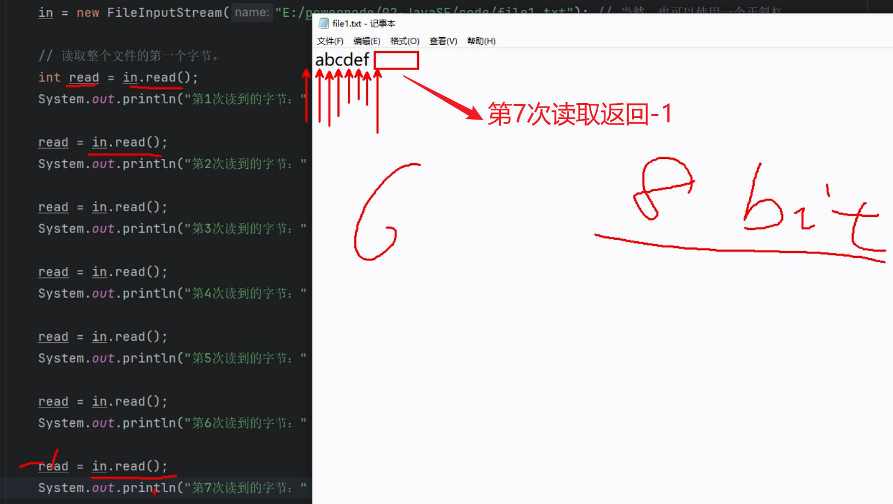

```java
package com.powernode.javase.io;

import java.io.FileInputStream;
import java.io.IOException;
import java.io.InputStream;

/**
1. FileInputStream的常用方法：
       int read(); 调用一次read()方法则读取一个字节，返回读到的字节本身。如果读不到任何数据则返回 -1
 */
public class FileInputStreamTest01 {
    public static void main(String[] args) {
        InputStream in = null;
        try {
            // in = new FileInputStream("D:\\0-JavaSE\\powernode-java\\file1.txt"); // 注意：这种写法需要两个反斜杠。
            in = new FileInputStream("D:/0-JavaSE/powernode-java/file1.txt"); // 当然，也可以使用一个正斜杠。


            // 读取整个文件的第一个字节。
            /*int read = in.read();
            System.out.println("第1次读到的字节：" + read); // 第1次读到的字节：97

            read = in.read();
            System.out.println("第2次读到的字节：" + read); // 第2次读到的字节：98

            read = in.read();
            System.out.println("第3次读到的字节：" + read); // 第3次读到的字节：99

            read = in.read();
            System.out.println("第4次读到的字节：" + read); // 第4次读到的字节：100

            read = in.read();
            System.out.println("第5次读到的字节：" + read); // 第5次读到的字节：101

            read = in.read();
            System.out.println("第6次读到的字节：" + read); // 第6次读到的字节：102

            read = in.read();
            System.out.println("第7次读到的字节：" + read); // 第7次读到的字节：-1*/

            // 第一次使用循环改进(死循环)
            /*while (true) {
                int readByte = in.read();
                if (readByte == -1) break;
                System.out.println(readByte);
                *//*
                97
                98
                99
                100
                101
                102
                 *//*
            }*/

            // 改进循环
            int readByte = 0;
            while ((readByte = in.read()) != -1) {
                System.out.println(readByte);
                /*
                97
                98
                99
                100
                101
                102*/
            }


        } catch (IOException e) {
            e.printStackTrace();
        }finally {
            // 关闭之前进行空处理
            if (in != null) {
                // 处理异常
                try {
                    in.close();
                } catch (IOException e) {
                    e.printStackTrace();
                }
            }

        }
    }
}
```


#### 读取-1的问题

```java
每个文件末尾都会有一个"结束标记",这个"结束标记"我们看不见,摸不着
    
而read()方法规定,如果读到了文件的结束标记,方法直接返回-1    
```

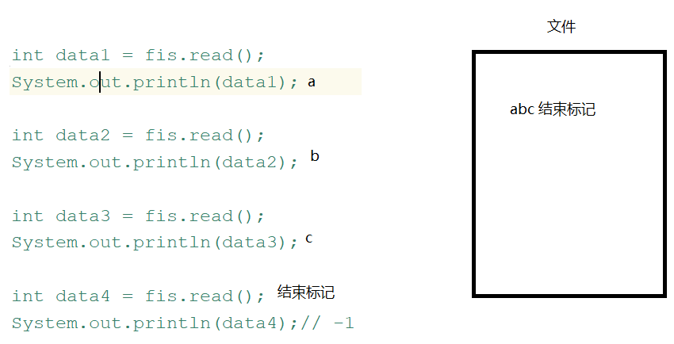


#### 一次读取一个字节数组

```java
int read(byte[] b); 一次最多可以读到b.length个字节(只要文件内容足够多)。返回值是读取到的字节数量。如果这一次没有读取到任何数据，则返回 -1
```

```java
package com.powernode.javase.io;

import java.io.FileInputStream;
import java.io.FileNotFoundException;
import java.io.IOException;

/**
 * 测试：int read(byte[] b); 一次最多可以读到b.length个字节(只要文件内容足够多)。返回值是读取到的字节数量。如果这一次没有读取到任何数据，则返回 -1
 */
public class FileInputStreamTest02 {
    public static void main(String[] args) {
        FileInputStream fis = null;

        try {
            fis = new FileInputStream("D:\\0-JavaSE\\powernode-java\\file1.txt");

            // 开始读
            // 提前准备一个byte[]数组(一次最多读取4个字节)
            byte[] bytes = new byte[4];

            // 第一次读
           /* int readCount = fis.read(bytes);
            System.out.println("第一次读取到的字节数量：" + readCount); // 第一次读取到的字节数量：4*/

            // 将byte数组转换成字符串
           /* String s1 = new String(bytes);
            System.out.println(s1); // abcd*/
           /* String s1 = new String(bytes, 0, readCount);
            System.out.println(s1); // abcd*/

            // 第二次读
           /* readCount = fis.read(bytes);
            System.out.println("第二次读取到的字节数量：" + readCount); // 第二次读取到的字节数量：2*/

            // 将byte数组转换成字符串
            /*String s2 = new String(bytes);
            System.out.println(s2); // efcd*/
           /* String s2 = new String(bytes, 0, readCount);
            System.out.println(s2); // ef*/

            // 第三次读
            /*readCount = fis.read(bytes);
            System.out.println("第三次读取到的字节数量：" + readCount); // 第三次读取到的字节数量：-1
*/
            // 第四次读
            /*readCount = fis.read(bytes);
            System.out.println("第四次读取到的字节数量：" + readCount); // 第四次读取到的字节数量：-1*/

            // 循环
            /*while(true){
                int readCount = fis.read(bytes);
                if(readCount==-1) break;
                String s = new String(bytes,0,readCount);
                System.out.print(s); // abcdef
            }*/

            // 优化循环
            int readCount = 0;
            while ((readCount = fis.read(bytes)) != -1) {
                System.out.print(new String(bytes, 0, readCount)); // abcdef
            }


        } catch (FileNotFoundException e) {
            e.printStackTrace();
        }catch (IOException e){
            e.printStackTrace();
        }
        finally {
            if (fis != null) {
                try {
                    fis.close();
                } catch (IOException e) {
                    e.printStackTrace();
                }
            }
        }
    }
}
```


#### 一次读取字节数组一部分

```java
int read(byte[] b, int off, int len);
         b:写的数组
         off:从数组的哪个索引开始写
         len:写多少个
一次读取len个字节。将读到的数据从byte数组的off位置开始放。
    
long skip(long n); 跳过n个字节。
    
int available(); 获取流中剩余的估计字节数。
```

```java
package com.powernode.javase.io;

import java.io.FileInputStream;
import java.io.FileNotFoundException;
import java.io.IOException;

/**
 * 测试：
 * int read(byte[] b, int off, int len); 一次读取len个字节。将读到的数据从byte数组的off位置开始放。
 * long skip(long n); 跳过n个字节。
 * int available(); 获取流中剩余的估计字节数。
 */
public class FileInputStreamTest03 {
    public static void main(String[] args) {
        FileInputStream fis = null;

        try {
            fis = new FileInputStream("D:\\0-JavaSE\\powernode-java\\file1.txt");

            /*byte[] bytes = new byte[10];

            int readCount = fis.read(bytes, 2, 5);
            System.out.println("读取到了多少个字节：" + readCount); // 读取到了多少个字节：5

            // 遍历
            for (byte b : bytes) {
                System.out.println(b);
                *//*
                0
                0
                97
                98
                99
                100
                101
                0
                0
                0
                 *//*
            }*/

           /* int readByte = fis.read();
            System.out.println(readByte); // 97*/

            // 跳过两个
            fis.skip(2);

            readByte = fis.read();
            System.out.println(readByte); // 100

            System.out.println("还剩几个字节没有读取？" + fis.available()); // 还剩几个字节没有读取？2

            // 简化步骤
            byte[] bytes = new byte[fis.available()];
            int readCount = fis.read(bytes);
            System.out.println(new String(bytes, 0, readCount)); // abcdef

        } catch (FileNotFoundException e) {
            throw new RuntimeException(e);
        } catch (IOException e) {
            throw new RuntimeException(e);
        } finally {
            if (fis != null) {
                try {
                    fis.close();
                } catch (IOException e) {
                    e.printStackTrace();
                }
            }
        }
    }
}
```


### FileOutputStream

#### 概述

```java
java.io.FileOutputStream
1. 文件字节输出流，负责写。

2. 常用构造方法：

FileOutputStream(String name)
	创建一个文件字节输出流对象，这个流在使用的时候，最开始会将原文件内容全部清空，然后写入。
         
FileOutputStream(String name, boolean append)
	创建一个文件字节输出流对象，当append是true的时候，不会清空原文件的内容，在原文件的末尾追加写入。
	创建一个文件字节输出流对象，当append是false的时候，会清空原文件的内容，然后写入。

注意：
	append==true表示：不会清空原文件内容，在原文件内容后面追加。
	append==false表示：清空原文件内容，在文件中写入。

3. 常用方法：
	void close();
	void flush();
	void write(int b); 写一个字节
	void write(byte[] b); 将整个byte字节数组写出
	void write(byte[] b, int off, int len) 将byte字节数组的一部分写出。
```


### 常用构造方法

```java
常用构造方法：

FileOutputStream(String name)
	创建一个文件字节输出流对象，这个流在使用的时候，最开始会将原文件内容全部清空，然后写入。
         
FileOutputStream(String name, boolean append)
	创建一个文件字节输出流对象，当append是true的时候，不会清空原文件的内容，在原文件的末尾追加写入。
	创建一个文件字节输出流对象，当append是false的时候，会清空原文件的内容，然后写入。
```


#### append==true

```java
append==true表示：不会清空原文件内容，在原文件内容后面追加。
(out = new FileOutputStream("E:\\powernode\\02-JavaSE\\code\\file2.txt", true);)
```

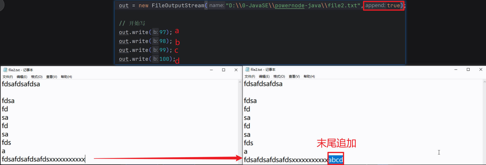


#### append==false

```java
append==false表示：清空原文件内容，在文件中写入。
(以下两行代码一样:
out = new FileOutputStream("E:\\powernode\\02-JavaSE\\code\\file2.txt");
out = new FileOutputStream("E:\\powernode\\02-JavaSE\\code\\file2.txt", false);)
```

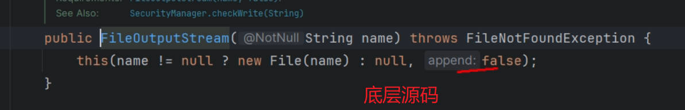

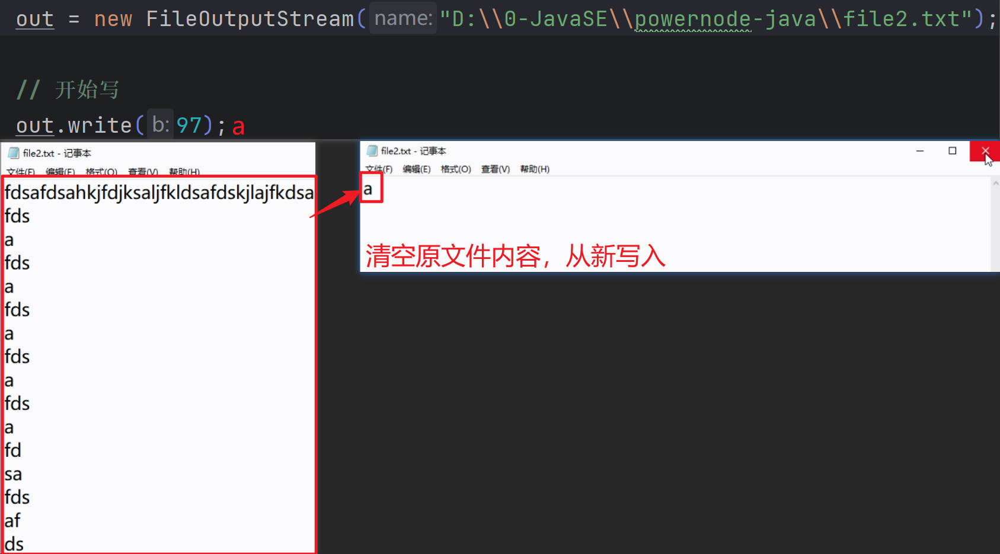


### 常用方法

```java
常用方法：
	void close();
	void flush();
	void write(int b); 写一个字节
	void write(byte[] b); 将整个byte字节数组写出
	void write(byte[] b, int off, int len) 将byte字节数组的一部分写出。
```

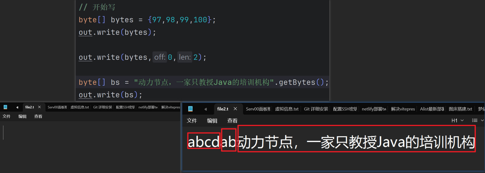

> **测试示例：**
>
> ```java
> package com.powernode.javase.io;
> 
> import java.io.FileNotFoundException;
> import java.io.FileOutputStream;
> import java.io.IOException;
> 
> public class FileOutputStreamTest01 {
>     public static void main(String[] args) {
>         // 创建文件字节输出流对象
>         FileOutputStream out = null;
>         try {
>             // out = new FileOutputStream("D:\\0-JavaSE\\powernode-java\\file2.txt", true);
> 
>             // 以下两行代码一样。
>             /*out = new FileOutputStream("E:\\powernode\\02-JavaSE\\code\\file2.txt");
>             out = new FileOutputStream("E:\\powernode\\02-JavaSE\\code\\file2.txt", false);*/
> 
>             out = new FileOutputStream("D:\\0-JavaSE\\powernode-java\\file2.txt");
> 
>             // 开始写
>             /*out.write(97);
>             out.write(98);
>             out.write(99);
>             out.write(100);*/
> 
>             // 开始写
>             byte[] bytes = {97,98,99,100};
>             out.write(bytes); // abcd
> 
>             out.write(bytes,0,2); // ab
> 
>             byte[] bs = "动力节点，一家只教授Java的培训机构".getBytes();
>             out.write(bs); // 动力节点，一家只教授Java的培训机构
> 
>             // 记着刷新
>             out.flush();
>         } catch (FileNotFoundException e) {
>             throw  new RuntimeException(e);
>         }catch (IOException e) {
>             throw  new RuntimeException(e);
>         }finally {
>             // 关闭资源
>             if (out != null) {
>                 try {
>                     out.close();
>                 } catch (IOException e) {
>                     throw new RuntimeException(e);
>                 }
>             }
>         }
>     }
> }
> ```


### 字节流完成文件的复制


#### 分析

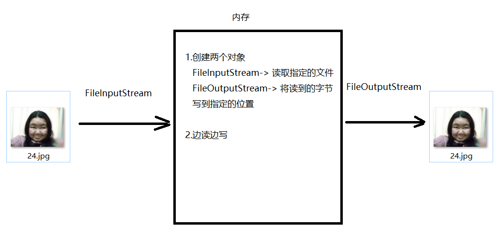


#### 实现

```java
package com.powernode.javase.io;

import java.io.FileInputStream;
import java.io.FileNotFoundException;
import java.io.FileOutputStream;
import java.io.IOException;

/**
 * 文件拷贝，实现原理：
 * 使用FileInputStream读文件，使用FileOutputStream写文件。
 * 一边读一边写。
 */
public class FileInputOutputStreamCopy {
    public static void main(String[] args) {
        // 输入流
        FileInputStream in = null;
        // 输出流
        FileOutputStream out = null;

        try {
            in = new FileInputStream("D:\\0-JavaSE\\powernode-java\\文件一\\Maven.png");
            out = new FileOutputStream("D:\\0-JavaSE\\powernode-java\\文件二\\Maven.png");


            // 一次至少拷贝1KB
            byte[] bytes = new byte[1024];
            // 边读边写
            int readCount = 0;
            while ((readCount = in.read(bytes)) != -1) {
                out.write(bytes, 0, readCount);
            }

            // 刷新
            out.flush();
        } catch (FileNotFoundException e) {
            throw new RuntimeException(e);
        } catch (IOException e) {
            throw new RuntimeException(e);
        } finally {
            // 关闭（分别try..catch..）
            if (in != null) {
                try {
                    in.close();
                } catch (IOException e) {
                    throw new RuntimeException(e);
                }
            }
            if (out != null) {
                try {
                    out.close();
                } catch (IOException e) {
                    throw new RuntimeException(e);
                }
            }
        }
    }
}
```

> **测试效果：**
>
> `图片原始位置：`
>
> 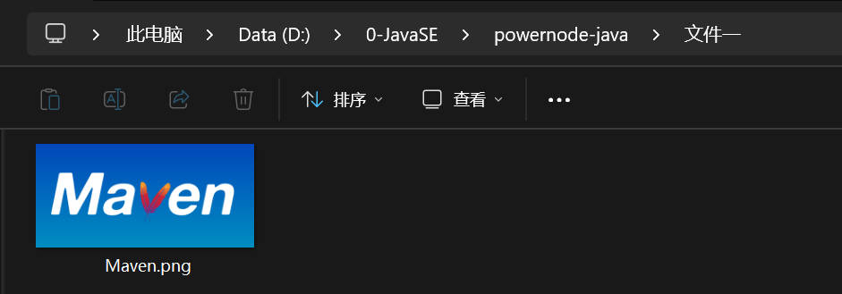
>
> `图片复制目标位置：`
>
> 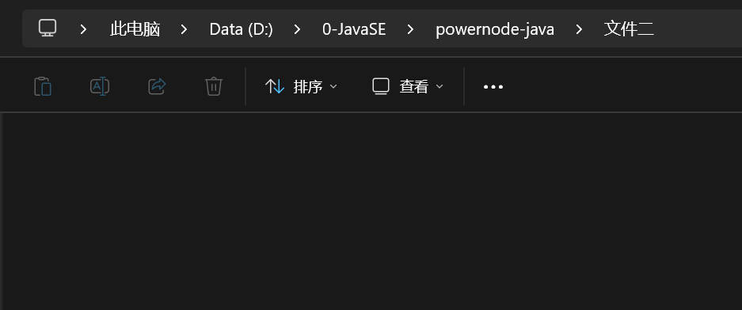
>
> **程序运行后图片复制目标位置：**
>
> 


## Java7的新特性：try-with-resources(io异常处理方式,资源自动关闭)

```java
Java7的新特性：try-with-resources(资源自动关闭)
凡是实现了AutoCloseable接口的流都可以使用try-with-resources。都会自动关闭

try-with-resources语法格式：
         try(
             声明流;
             声明流;
             声明流;
             声明流;
             声明流;
        ){
             
	   }catch(Exception e){
        
       }
```

> **示例1:**

```java
package com.powernode.javase.io;

import java.io.FileInputStream;
import java.io.FileNotFoundException;
import java.io.FileOutputStream;
import java.io.IOException;

public class TryWithResources {
    public static void main(String[] args) {
        // 测试try-with-resources语法
        FileInputStream in2 = null;
        try(FileInputStream in = new FileInputStream("D:\\0-JavaSE\\powernode-java\\file1.txt")){

            in2 = in;
        } catch (FileNotFoundException e) {
            throw new RuntimeException(e);
        } catch (IOException e) {
            throw new RuntimeException(e);
        }

        try {
            System.out.println(in2.read());
        } catch (IOException e) {
            e.printStackTrace();
        }
    }
}
```

> **测试：**
>
> 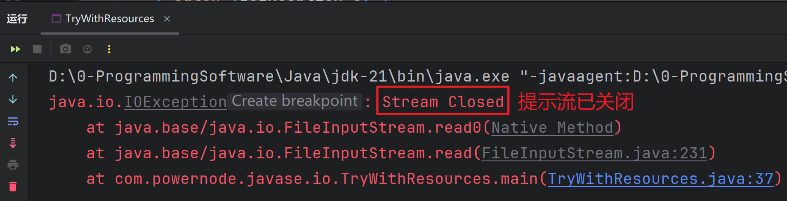


> **示例2：**

```java
package com.powernode.javase.io;

import java.io.FileInputStream;
import java.io.FileNotFoundException;
import java.io.FileOutputStream;
import java.io.IOException;

public class TryWithResources {
    public static void main(String[] args) {
        // 测试try-with-resources语法
        try(FileInputStream in = new FileInputStream("D:\\0-JavaSE\\powernode-java\\file1.txt");
            FileOutputStream out = new FileOutputStream("D:\\0-JavaSE\\powernode-java\\文件二\\file1.txt")){

            byte[] bytes = new byte[1024];
            int readCount = 0;
            while ((readCount = in.read(bytes)) != -1) {
                out.write(bytes, 0, readCount);
            }

        }catch (FileNotFoundException e){
            throw new  RuntimeException(e);
        }catch (IOException e){
            throw new  RuntimeException(e);
        }
    }
}
```

> **测试：**
>
> 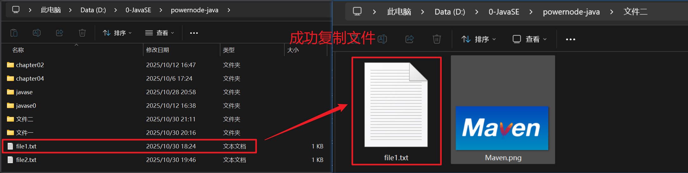


## 字符流


### 字节流读取中文的问题

```java
1.注意:
  字节流是万能流,更侧重于文件复制,但是尽量不要边读边看
      
2.原因:
  UTF-8:一个汉字占3个字节
  GBK:一个中文占2个字节
      
  如果按照字节读取,每次读取的字节没有构成一个汉字的字节数,就直接输出,汉字是显示不了的
      
3.解决: 
  将文本文档中的内容,按照字符去操作
```

> **话说回来:**
>
> 1.**按照字符去操作编码也要一致,如果不一致,照样会乱码**
>
> 2.**按照字节流去操作即使编码一致,边读边看,也有可能乱码**


### FileReader

> **字符流`专门操作文本文档的`,但是`复制操作`不要用`字符流`,要用`字节流`**

```java
1.概述:字符输入流 -> Reader -> 是一个抽象类
      子类:FileReader
2.作用:将文本文档中的内容读取到内存中来
3.构造:
  FileReader(File file)
  FileReader(String fileName)
4.方法:
  int read() -> 一次读取一个字符,返回的是读取字符对应的int值 
  int read(char[] cbuf) -> 一次读取一个字符数组,返回的是读取个数  
  int read(char[] cbuf, int off, int len) -> 一次读取一个字符数组一部分,返回的是读取个数
           cbuf:读取的数组
           off:从数组的哪个索引开始读
           len:读多少个
  void close() -> 关闭资源 
  long skip(long n); 跳过n个字节
```

```java
package com.powernode.javase.io;

import java.io.FileNotFoundException;
import java.io.FileReader;
import java.io.IOException;

/**
 * 文件字符输入流。读。以字符的形式读文件。一次至少读取一个完整的字符。
 */
public class FileReaderTest01 {
    public static void main(String[] args) {
        try(FileReader reader = new FileReader("D:\\0-JavaSE\\powernode-java\\file1.txt")){

            // 开始读
            char[] chars = new char[3];
            int readCount = 0;
            while((readCount = reader.read(chars)) != -1){
                System.out.print(new String(chars,0,readCount)); // abcdef
            }

        } catch (FileNotFoundException e) {
            throw new RuntimeException(e);
        } catch (IOException e) {
            throw new RuntimeException(e);
        }
    }
}
```


### FileWriter

```java
1.概述:字符输出流 -> Writer -> 抽象类
  子类:FileWriter
2.作用:将数据写到文件中
3.构造:
  FileWriter(File file) 
  FileWriter(String fileName)     
  FileWriter(String fileName, boolean append) -> 追加,续写 
4.方法:
  void write(int c) -> 一次写一个字符 
  void write(char[] cbuf) 一次写一个字符数组 
  void write(char[] cbuf, int off, int len) 一次写一个字符数组一部分  
  void write(String str) 直接写一个字符串
  void write(String str, int off, int len); 一次写一个字符数组一部分
  void flush()  将缓冲区中的数据刷到文件中 // 将缓冲区中的数据刷到文件中,后续流对象还能继续使用    
  void close()  关流 // 先刷新后关闭,后续流对象不能使用了  
  Writer append(CharSequence csq, int start, int end) -> 追加,续写
      
5.注意:FileWriterr底层自带一个缓冲区,我们写的数据会先保存到缓冲区中,所以我们需要将缓冲区中的数据刷到文件中
```

```java
package com.powernode.javase.io;

import java.io.FileWriter;
import java.io.IOException;

/**
 * 文件字符输出流。写。（写普通文本用的。）
 */
public class FileWriterTest01 {
    public static void main(String[] args) {
        try(FileWriter writer = new FileWriter("D:\\0-JavaSE\\powernode-java\\file3.txt")){
            // 开始写
            writer.write("hello world");
            writer.append("\n");
            writer.write("张三李四王五赵六",2,2);
            writer.append("\n");
            writer.write("张三李四王五".toCharArray());
            writer.append("\n");
            writer.write("张三李四王五".toCharArray(),2,2);
            writer.append("\n");

            writer.append("a");
            writer.append("b");
            writer.append("c");
            writer.append("d");


            // 建议手动刷新
            writer.flush();
        } catch (IOException e) {
            throw new RuntimeException(e);
        }
    }
}
```

> **测试:**
>
> 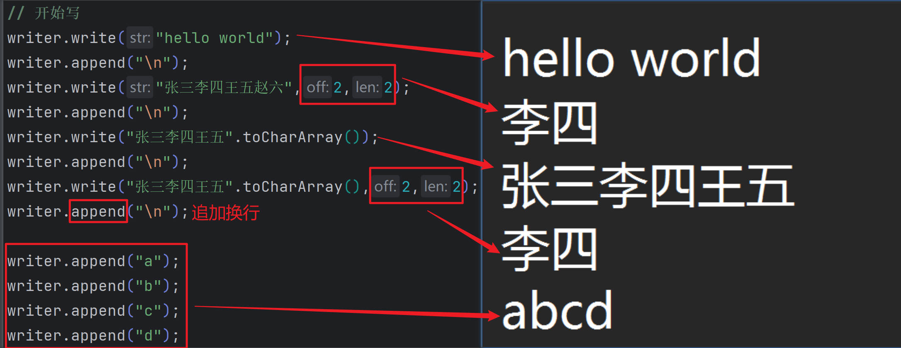


### 字符流完成文件的复制(普通文本文件)

> **提示：使用文件字符输入输出流进行文件复制，但是这种方式`只能复制普通文本文件`。**
>
> 
>
> **注意:复制非文本文件以外的`文件将无法正常打开`**

#### 分析

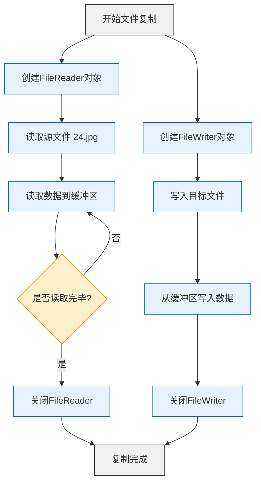
```mermaid
graph TD
    A[开始文件复制] --> B[创建FileReader对象]
    A --> C[创建FileWriter对象]
    
    B --> D[读取源文件 24.jpg]
    C --> E[写入目标文件]
    
    D --> F[读取数据到缓冲区]
    E --> G[从缓冲区写入数据]
    
    F --> H{是否读取完毕?}
    H -->|否| F
    H -->|是| I[关闭FileReader]
    
    G --> J[关闭FileWriter]
    
    I --> K[复制完成]
    J --> K
    
    %% 样式匹配图片风格
    classDef box fill:#f0f0f0,stroke:#333,stroke-width:1px
    classDef process fill:#e6f3ff,stroke:#0066cc,stroke-width:1px
    classDef decision fill:#fff0cc,stroke:#ff9900,stroke-width:1px
    
    class A,B,C,D,E,F,G,H,I,J,K box
    class B,C,D,E,F,G,I,J process
    class H decision
```


#### 实现

```java
package com.powernode.javase.io;

import java.io.FileNotFoundException;
import java.io.FileReader;
import java.io.FileWriter;
import java.io.IOException;

/**
 * 使用文件字符输入输出流进行文件复制，但是这种方式只能复制普通文本文件。
 */
public class FileReaderFileWriterCopy {
    public static void main(String[] args) {
        try(FileReader reader = new FileReader("D:\\0-JavaSE\\powernode-java\\file3.txt");
            FileWriter writer = new FileWriter("D:\\0-JavaSE\\powernode-java\\文件二\\file3.txt")){

            // 一边读一边写
            char[] chars = new char[3];
            int readCount = 0;
            while ((readCount = reader.read(chars)) != -1) {
                writer.write(chars, 0, readCount);
            }

            // 刷新
            writer.flush();
        } catch (FileNotFoundException e) {
            throw new RuntimeException(e);
        } catch (IOException e) {
            throw new RuntimeException(e);
        }
    }
}
```

> **测试:**
>
> 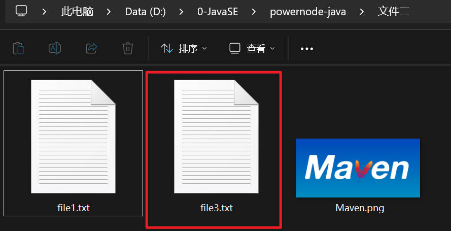


## 文件的路径问题

```java
package com.powernode.javase.io;

import java.io.FileInputStream;
import java.io.IOException;

/**
 * 关于IO流中读写文件时，文件的路径问题。
 */
public class AboutFilePath {
    public static void main(String[] args)throws IOException {
       FileInputStream in = new FileInputStream("D:\\0-JavaSE\\powernode-java\\file1.txt"); // 注意：这种写法需要两个反斜杠。
       FileInputStream in = new FileInputStream("D:/0-JavaSE/powernode-java/file1.txt"); // 当然，也可以使用一个正斜杠。


        // 我们尝试使用相对路径
        // 相对路径一定要搞清楚当前路径是哪里？相对路径一定是从当前所在的路径开始。
        // 在IDEA工具中，默认的当前路径是 project 的根。（项目的根就是当前路径）
        FileInputStream in = new  FileInputStream("log");


        // 读log2文件
        FileInputStream in = new FileInputStream("chapter08/src/log2");


        // 新的内容
        // 以下讲解内容有一些代码是和线程有关系的。大致理解一下。
        // 或者说这个代码死记硬背也是可以的。
        // 从类路径当中加载资源。
        // Thread.currentThread() 获取当前线程
        // Thread.currentThread().getContextClassLoader() 获取当前线程的类加载器
        // getResource()方法就表示从类的根路径下开始加载资源
        // 注意：这种方式只能从类路径当中加载资源。如果这个资源是放在类路径之外的，这种方式不合适。
        // 如果你代码是以下这种写法的，表示当前路径就是类的根路径。自动从类的根路径下开始加载资源。
        // 这种方式的优点：通用，在进行系统移植的时候，这种方式仍然是通用的。适应性强。
        // 这种方式的缺点：资源必须放在类路径当中。没有在类路径下，是无法加载到的。
        String path = Thread.currentThread().getContextClassLoader().getResource("test/file").getPath();
        System.out.println(path);

        FileInputStream in = new FileInputStream(path);
    }
}
```


## 缓冲流

### 概述

* 缓冲流就是对基本流进行了一层封装，额外增加了一些新的功能，如：基本流操作效率太慢，给它们增加缓冲区。

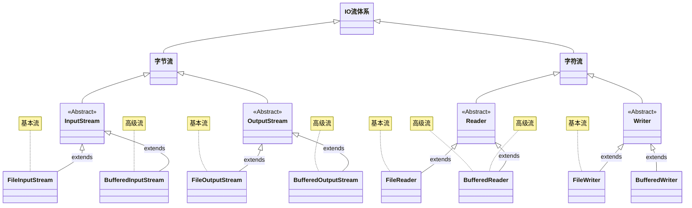
```mermaid
classDiagram
    IO 流体系 <|-- 字节流 
    IO 流体系 <|-- 字符流 
    字节流 <|-- InputStream 
    字节流 <|-- OutputStream 
    字符流 <|-- Reader 
    字符流 <|-- Writer 
    InputStream <|-- FileInputStream :extends
    note for FileInputStream "基本流" 
    InputStream <|-- BufferedInputStream :extends
    note for BufferedInputStream "高级流" 
    OutputStream <|-- FileOutputStream :extends
    note for FileOutputStream "基本流" 
    OutputStream <|-- BufferedOutputStream :extends
    note for BufferedOutputStream "高级流" 
    Reader <|-- FileReader :extends
    note for FileReader "基本流" 
    Reader <|-- BufferedReader :extends
    note for BufferedReader "高级流"
    Writer <|-- FileWriter :extends
    note for FileWriter "基本流" 
    Writer <|-- BufferedWriter :extends
    note for BufferedReader "高级流"
    class InputStream{
        <<Abstract>>
    }
    class OutputStream{
        <<Abstract>>
    }
    class Reader{
        <<Abstract>>
    }
    class Writer{
        <<Abstract>>
    }

```

* `字节流`的`基本流`是没有缓冲区的，而`字节流`的`缓冲流`提供了缓冲区，所以效率提升的很明显。
* `字符流`的`基本流`本来就有缓冲区，所以`字符流`的`缓冲流`的效率提升的并不是很明显；但是，字符流的缓冲流提供了几个好用的方法。


### 字节缓冲流


#### BufferedInputStream

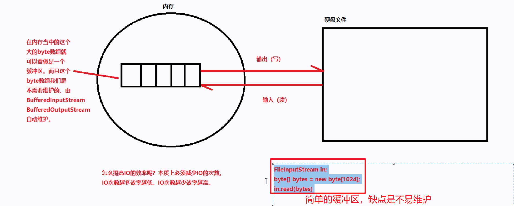

```java
1. java.io.BufferedInputStream的用法和FileInputStream用法相同。

2. 他们的不同点是：
     FileInputStream是节点流。
     BufferedInputStream是缓冲流(包装流/处理流)。这个流的效率高。自带缓冲区。并且自己维护这个缓冲区。读大文件的时候建议采用这个缓冲流来读取。

3. BufferedInputStream对 FileInputStream 进行了功能增强。增加了一个缓冲区的功能。

4. 怎么创建一个BufferedInputStream对象呢？构造方法：
      BufferedInputStream(InputStream in)
```

```java
package com.powernode.javase.io;

import java.io.BufferedInputStream;
import java.io.FileInputStream;
import java.io.IOException;

public class BufferedInputStreamTest01 {
    public static void main(String[] args) {
        BufferedInputStream bis = null;
        try {
            // 创建节点流
            //FileInputStream in = new FileInputStream("file.txt");
            // 创建包装流
            //bis = new BufferedInputStream(in);

            // 组合起来写
            bis = new BufferedInputStream(new FileInputStream("D:\\0-JavaSE\\powernode-java\\file3.txt"));

            // 读，和FileInputStream用法完全相同
            byte[] bytes = new byte[1024];
            int readCount = 0;
            while ((readCount = bis.read(bytes)) != -1) {
                System.out.println(new String(bytes, 0, readCount));
            }

        } catch (Exception e) {
            e.printStackTrace();
        }finally {
            // 包装流以及节点流，你只需要关闭最外层的那个包装流即可。节点流不需要手动关闭。
            if (bis != null) {
                try {
                    bis.close();
                } catch (IOException e) {
                    e.printStackTrace();
                }
            }
        }
    }
}
```

> **测试:**
>
> 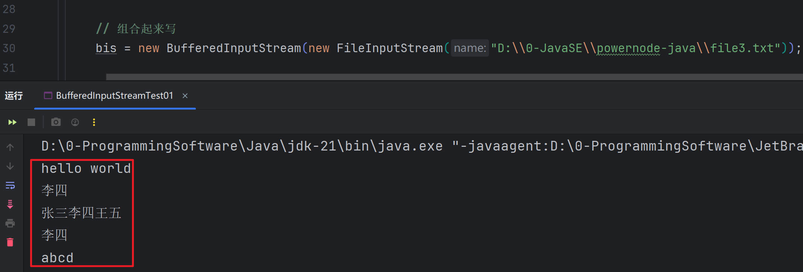


#### BufferedOutputStream

```java
1. java.io.BufferedOutputStream也是一个缓冲流。属于输出流。
    
2. 怎么创建BufferedOutputStream对象？
     BufferedOutputStream(OutputStream out)
    
3. FileOutputStream是节点流。 BufferedOutputStream是包装流。
```

```java
package com.powernode.javase.io;

import java.io.BufferedOutputStream;
import java.io.FileOutputStream;
import java.io.IOException;

public class BufferedOutputStreamTest01 {
    public static void main(String[] args) {
        BufferedOutputStream bos = null;
        try {
            bos = new BufferedOutputStream(new FileOutputStream("D:\\0-JavaSE\\powernode-java\\file3.txt"));

            bos.write("动力节点".getBytes());

            // 缓冲流需要手动刷新。
            bos.flush();
        } catch (Exception e) {
            e.printStackTrace();
        }finally {
            if (bos != null) {
                try {
                    // 只需要关闭最外层的包装流即可。
                    bos.close();
                } catch (IOException e) {
                    e.printStackTrace();
                }
            }
        }
    }
}
```

> **测试:**
>
> 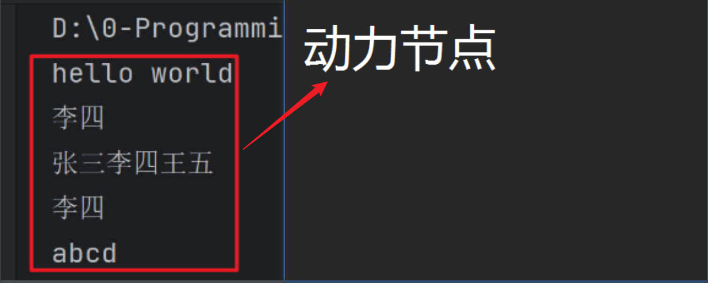


#### 字节缓冲流完成文件的复制

```java
package com.powernode.javase.io;

import java.io.*;

/**
 * 使用BufferedInputStream BufferedOutputStream完成文件的复制。
 */
public class BufferedInputOutputStreamCopy {
    public static void main(String[] args) {

        long begin = System.currentTimeMillis();

        try(BufferedInputStream bis = new BufferedInputStream(new FileInputStream("E:\\powernode\\02-JavaSE\\video\\上\\012-第一章Java的加载与执行原理.avi"));
            BufferedOutputStream bos = new BufferedOutputStream(new FileOutputStream("E:/012-第一章Java的加载与执行原理.avi"))){

            // 一边读一边写
            byte[] bytes = new byte[1024];
            int readCount = 0;
            while((readCount = bis.read(bytes)) != -1){
                bos.write(bytes, 0, readCount);
            }

            // 手动刷新
            bos.flush();

        } catch (FileNotFoundException e) {
            throw new RuntimeException(e);
        } catch (IOException e) {
            throw new RuntimeException(e);
        }

        long end = System.currentTimeMillis();
        System.out.println("带有缓冲区的拷贝耗时"+(end - begin)+"毫秒"); // 671
    }
}
```


### 字符缓冲流


