## 标识符

### 什么是标识符

1. 在Java中，标识符是用来给`变量`、`方法`、`类`和`包`等命名的字符序列。

2. 标识符的长度`没有限制`，但是建议使用`有意义的、简洁的`标识符，以提高代码的`可读性和可维护性`。

### 标识符可以标识什么

1. 变量名
2. 方法名
3. 类名、接口名、枚举名、注解名
4. 包名
5. 常量名
......

### 标识符的命名规则

1. 标识符可以由字母、数字、下划线(_)和美元符号($)组成，不能含有其他符号。（java支持全球所有语言，所以这里的 字母 指的是任何一个国家的文字都可以）

2. 标识符不能以数字开头。

3. 标识符不能是Java中的关键字，如public、class、void等。

4. 标识符是区分大小写的，即Foo和foo是两个不同的标识符。

5. 标识符的长度没有限制，但是Java建议使用有意义的、简短的标识符。

### 标识符的命名规范

1. 见名知意

2. 驼峰式命名方式

3. 类名、接口名、枚举、注解：首字母大写，后面每个单词首字母大写。（StudentService，UserService）

4. 变量名和方法名：首字母小写，后面每个单词首字母大写。（doSome，doOther）

5. 常量名：全部大写，每个单词用下划线连接。（LOGIN_SUCCESS，SYSTEM_ERROR）

6. 包名：全部小写


### 示例代码
```java title="Java"
/*
标识符
	1. 什么是标识符？
		在源代码中程序员自己有权利命名的单词都是标识符。

	2. 标识符可以标识什么？
		变量名，方法名，类名...

	3. 标识符的命名规则？
		* 标识符只能由数字，字母，_，$组成，不能含有其它字符。
			（这里的“字母”代表的是任何一个国家的文字,Java是采用Unicode编码，支持全球任何一个国家的语言）
		* 标识符不能以数字开头。
		* 标识符严格区分大小写。
		* 关键字不能做标识符。
		* 标识符理论上没有长度限制，但是最好不要太长。

	4. 标识符的命名规范？
		* 见名知意。
		* 遵循驼峰式命名方式。StudentService,BankService....
		* 类名，接口名：首字母大写，后面每个单词首字母大写。StudentService, BankService....
		* 变量名,方法名：首字母小写，后面每个单词首字母大写。productPrice, stuName, customerName, customerAge, doSome....
		* 常量名：全部大写，每个单词之间采用“_”分隔。LOGIN_SUCCESS, LOGIN_ERROR, MATH_PAI
		* 包名：全部小写。 powernode

*/
public class IdentifierTest01{
    public static void main(String[] args){

        // 定义一个变量，用来存储一个人的年龄
        // age是一个变量名，是一个标识符
        int age = 20;

        int age_  = 20;

        int $_age = 20;

        int $_age123 = 50;

        //int 1$_age = 50;

        int 年龄 = 50;

        int a = 100;

        int A = 100;

        String name = "jackson";

        //String address# = "北京海淀区";
    }
}

// 学生类  这是一个类名，是一个标识符
class 学生类{

}

/*
class public {

}
*/
```


### 判断标识符是否合法

```java title="Java"
myVariable ——>合法

2name ——>不合法，以数字开头

first.name ——>不合法，以点号开头

studentName ——>合法

public  ——>不合法，是关键字

public1 ——>合法

address# ——>不合法，以#号开头

MAX_SIZE ——>合法

id# ——>不合法，以#号开头

_id ——>合法

@age ——>合法，注解名

$money ——>合法

你好 ——>合法
```


## 关键字

### 什么是关键字

1. 在java语言当中，具有特殊含义的单词。

2. 每个关键字都已经被java语言本身占用了，不能拿关键字做标识符。

3. java语言中所有的关键字都是全部小写。


### Java关键字有哪些

1. Java关键字有哪些

2. Java关键字都是小写的。

3. 关键字列表如下：
```java title="Java"
abstract, assert, boolean, break, byte, case, catch, char, class, continue, default, do, double, else, enum, extends, final, finally, float, for, if, implements, import, instanceof, int, interface, long, native, new, package, private, protected, public, return, short, static, strictfp, super, switch, synchronized, this, throw, throws, transient, try, void, volatile, while
```
4. Java保留字：`goto`，`const`


### 示例代码
```java title="Java"
/*
什么是关键字？
	在java语言当中，具有特殊含义的单词。
	每个关键字都已经被java语言本身占用了，不能拿关键字做标识符。
	java语言中所有的关键字都是全部小写。

以下程序中哪些单词是关键字？
	public
	class
	static
	void
*/
public class KeywordsTest01 {
	public static void main(String[] args){
		System.out.println("关键字");
	}
}
```

## 字面量

### 什么是字面量

> `字面量`指的是`在程序中直接使用的数据`，字面量是Java中最基本的表达式，`不需要进行计算或转换，直接使用即可`。


### Java中有哪些字面量

```java title="Java"
整数型：10、-5、0、100

浮点型：3.14、-0.5、1.0

布尔型：true、false

字符型：'a'、'b'、'c'、'1'、'2'、'国'

字符串型："Hello"、"World"、"Java"、"你好呀"
```


#### 示例代码

```java title="Java"
/*
Java中的字面量：
	1. 什么是字面量？
		程序中的数据就是字面量。字面量是Java中最基本的表达式，无需转换，直接使用。
	2. 字面量包括哪些类型？
		整数型字面量: 10 20 100 -1 0 -100
		浮点型字面量: 3.0 3.14 3.1415926
		布尔型字面量: true false
		字符型字面量: 'a' '国' 'b'
		字符串型字面量："abc" "a" "hello"
*/
public class ConstTest01 {
	public static void main(String[] args){

		// 整数型的字面量
		System.out.println(10);
		System.out.println(-100);

		// 浮点型的字面量
		System.out.println(3.14);

		// 布尔型字面量
		System.out.println(true); // true代表真
		System.out.println(false); // false代表假

		// 字符型字面量（单个字符）
		// 所有字符型字面量必须使用单引号括起来。
		System.out.println('A');
		System.out.println('中');
		System.out.println('T');
		//System.out.println('AB'); // 编译报错。

		// 字符串型字面量
		// 所有的字符串型字面量都必须使用双引号括起来。
		System.out.println("动力节点");
		System.out.println("A");
		System.out.println("Hello World!");

		System.out.println("10");
		System.out.println("true");
	}
}
```


### 加号运算符 +

1. 作用1：**`求和（当加号两边都是数字时进行求和运算）`**

2. 作用2：**`字符串拼接`（当加号两边`有任意一边是字符串类型`时会进行`字符串拼接`，结果还是`一个字符串`）**


#### 示例代码

```java title="Java"
/*
java语言中的 + 运算符：

	1. + 运算符在java语言中有两个作用？
		第一个作用：求和
		第二个作用：字符串拼接

	2. 什么情况下是求和？
		+ 两边如果都是数字，会进行求和运算。

	3. 什么情况下是字符串拼接？
		+ 两边只要有一边是字符串，一定会做字符串的拼接操作，并且拼接完之后的结果还是一个字符串。
*/
public class PlusTest01{
	public static void main(String[] args){

		// 求和
		System.out.println(10 + 20); // 30
		
		// 字符串拼接
		System.out.println("10" + 20); // "1020"

		// 一个表达式当中出现多个 +，顺序是怎样的？如果没有小括号，遵循从左向右。
		// 第一个 + 是求和
		// 第二个 + 是字符拼接
		System.out.println(10 + 20 + "30"); // "3030"

		// 添加了小括号优先级比较高。
		// 这两个 + 都是字符串拼接。
		System.out.println(10 + (20 + "30")); // "102030"

		System.out.println("10" + 20 + 30); // "102030"

		System.out.println("10" + (20 + 30)); // "1050"
	}
}
```

**输出结果：**


## 变量

### 什么是变量

1. `变量`是`内存当中的一块空间`。是`计算机中存储数据最基本的单元`。

2. **变量三要素：**

> **`数据类型（决定空间大小）【int, double, String】`**

> **`变量名（只要是合法的标识符即可）`**

> **`变量值（变量中具体存储的数据）`**

> **注意：`变量名`和`变量值`是`一一对应的`。**

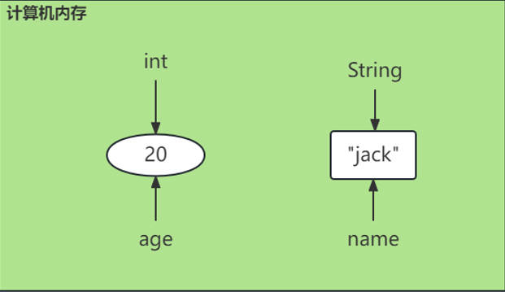

3. **变量的声明、赋值、访问**

```java title="Java"
int i; // 声明一个整数型的变量，起名i

i = 100; // 给变量i赋值100

System.out.println(i); // 访问i变量：读操作

i = 200; // 访问i变量：改操作【给变量i重新赋值200】
```

### 变量的声明、赋值、访问语法格式
```java title="Java"
/*
变量
	1. 什么是变量？
		变量是内存中的一块空间。是计算机中存储数据的最基本的单元。
		变量是用来解决数据存储问题的。
		先把数据存储起来，后续的程序需要使用的时候，可以从变量中取来用。

	2. 变量的三要素？
		* 数据类型
		* 变量名
		* 变量值
		注意：
			数据类型是决定空间大小的。
			数据类型 和 值的数据类型 要一致。
	
	3. 变量的声明、赋值、访问。
		声明(定义)语法格式：
			数据类型 变量名;
			
			数据类型：
				int	整数型
				double 浮点型
				String 字符串型
				......
		
		赋值的语法格式：
			变量名 = 变量值;
		
		访问怎么做？
			访问包括两种情况：一种是读，一种是修改。
			读：System.out.println(变量名);
			修改：变量名 = 变量值;
*/
public class VarTest01{
	public static void main(String[] args){

		// 声明/定义一个int类型的变量，起名age，用来存储人的年龄
		int age;

		// 给age变量赋值
		age = 20;

		// 读
		System.out.println("年龄=" + age); ——> 字符串拼接

		// 改（重新赋值）
		age = 30;

		// 读
		System.out.println("年龄=" + age);

		age = 60;
		System.out.println("年龄=" + age);

		// 不兼容的类型: String无法转换为int
		//age = "50";

		// 定义一个变量，用来存储数学当中的π
		double π = 3.14;

		System.out.println("圆周率：" + π);


		// 声明一个String类型的name变量，用来存储人的姓名
		// 变量的声明和赋值可以一块完成。
		String name = "jack";
		System.out.println("name = " + name);

		// 可以重新赋值
		name = "lucy";

		System.out.println("name = " + name);
	}
}
```
**输出结果：**

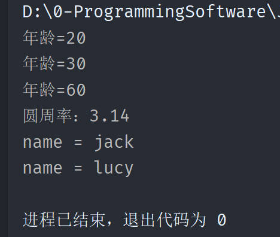


### 变量的作用

1. **`变量的存在会让程序更加便于维护。`**

```java title="Java"
System.out.println(100 + 111);
System.out.println(100 + 222);

以上代码的设计就不如以下的代码：
int num = 100;
System.out.println(num + 111);
System.out.println(num + 222);
```

2. **`变量的存在可以增强程序的可读性。`**

```java title="Java"
System.out.println(3.14 * 10 * 10);

以上代码的设计就不如以下的代码：
double π = 3.14;
int r = 10;
System.out.println(π * r * r);
```

#### 示例代码

```java title="Java"
/*
	变量的作用：
		第一个作用：便于代码的维护。
		第二个作用：增强代码的可读性。
*/
public class VarTest02{
	public static void main(String[] args){
		/*		
		System.out.println(100 + 456);
		System.out.println(100 + 111);
		System.out.println(100 + 222);
		System.out.println(100 + 235);
		System.out.println(100 + 789);
		System.out.println(100 + 999);
		System.out.println(100 + 666);
		System.out.println(100 + 888);
		*/

		// 新的需求来了：要计算50和后面数字的和。
		// 问题：修改的位置太多了。不好维护。
		/*
		System.out.println(50 + 456);
		System.out.println(50 + 111);
		System.out.println(50 + 222);
		System.out.println(50 + 235);
		System.out.println(50 + 789);
		System.out.println(50 + 999);
		System.out.println(50 + 666);
		System.out.println(50 + 888);
		*/

		int num = 50;
		System.out.println(num + 456);
		System.out.println(num + 111);
		System.out.println(num + 222);
		System.out.println(num + 235);
		System.out.println(num + 789);
		System.out.println(num + 999);
		System.out.println(num + 666);
		System.out.println(num + 888);

		// 需求：请编写程序，计算半径是10.0cm的圆的面积。
		// 假如不用变量。
		System.out.println(3.14 * 10.0 * 10.0);

		// 怎么增强可读性。
		double π = 3.14;
		double r = 10.0;
		System.out.println(π * r * r);
	}
}
```


### 变量的小细节

1. 变量必须先声明，再赋值，才能访问

2. 方法体当中的代码遵循自上而下的顺序依次逐行执行，变量先访问，再声明肯定是不行的

3. 一行代码上可以同时声明多个变量

4. 在同一个作用域当中，变量名不能重名，可以重新赋值

5. 变量值的数据类型必须和变量的数据类型一致，这样是不允许的：String name = 100;


#### 示例代码
```java title="Java"
/*
变量使用的小细节：
	1.变量必须先声明，再赋值，才能访问
	2.方法体当中的代码遵循自上而下的顺序依次逐行执行，变量先访问，再声明肯定是不行的
	3.一行代码上可以同时声明多个变量
	4.在同一个作用域当中，变量名不能重名，可以重新赋值
*/
public class VarTest03 {
	public static void main(String[] args){
		
		// 变量必须先声明，再赋值，才能访问。
		int age;
		// 错误: 可能尚未初始化变量age
		//System.out.println(age);

		//方法体当中的代码遵循自上而下的顺序依次逐行执行，变量先访问，再声明肯定是不行的
		// 错误: 找不到符号
		//System.out.println("name = " + name);
		String name = "jack";

		
		// 一行代码上可以同时声明多个变量
		// 以下代码含义：声明三个int类型的变量a b c，其中a和b没有赋值，c赋值300
		int a,b,c = 300;
		a = 50;
		System.out.println(a);
		b = 80;
		System.out.println(b);
		System.out.println(c);

		int x = 500, y = 600, z = 700;

		System.out.println(x + y + z);

		// 在同一个作用域当中，变量名不能重名，可以重新赋值
		// 作用域就是有效范围。在java中，一个{}就是一个作用域。
		int i = 100;
		// 错误: 已在方法 main(String[])中定义了变量 i
		//int i = 200;
		
		// 可以重新赋值。
		i = 200;

		System.out.println(i);
		
	}
}
```
**输出结果：**

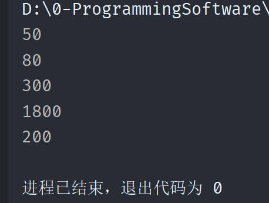


### 变量的作用域

1. `作用域`就是`变量的有效范围`。变量的作用域是怎样的呢？用一句大白话就可以概括了：`出了大括号就不认识了`。

2. 作用域的不同主要是因为`声明在不同位置的变量具有不同的生命周期`。所谓的生命周期是：`从内存开辟到内存释放`。

3. **Java遵循`就近原则`**

#### 示例代码
```java title="Java"
/*
	变量的作用域：

		1. 什么是作用域？
			变量的有效范围。在java程序中通常是一个{}对应一个作用域。

		2. 记住一句话：出了大括号就不认识了。
*/
public class VarTest04 {

	public static void main(String[] args){
		
		// age是main方法中声明的。所以作用域是整个main方法。
		// 在main方法体当中是有效的变量。
		int age = 20;
		System.out.println("age = " + age);

		int num = 100;

		if(num > 50){
			int i = 666;
			System.out.println("i = " + (i + age));
		}
		
		// 错误: 找不到符号
		//System.out.println("i = " + i);
	}

	// 另一个方法。
	public static void doSome(){
		// 错误: 找不到符号
		//System.out.println("age = " + age);
	}
}
```

**输出结果：**

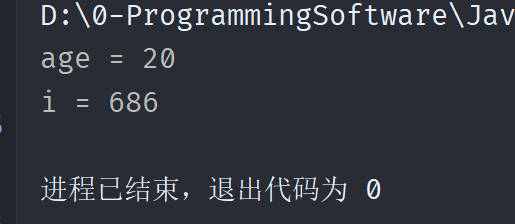


### 变量的分类

1. 局部变量：`在方法体中声明的变量`，只能在当前方法体中使用。

2. 成员变量：`在类体中声明的变量`，可以被类的所有方法使用。

3. 静态变量：`在类体中声明的变量`，可以被类的所有实例对象使用。

4. 常量：`在类体中声明的变量`，只能被类的所有实例对象使用，且只能赋值一次。

#### 示例代码

```java title="Java"
/*
	变量的分类：
		变量可以根据定义的/声明的位置来进行分类，可以分为两大类：
			* 一类：局部变量
			* 另一类：成员变量
				* 静态变量
				* 实例变量 
*/
public class VarTest05 {

	public static void main(String[] args){
		
		// 凡是在方法体当中定义的变量，一定是局部变量。
		// 局部变量只在当前方法体当中有效。
		int a = 100;

	}


	// 在类体当中定义的变量叫做成员变量。
	// 实例变量
	int b = 200;

	// 静态变量
	static int c = 300;
}
```


## 二进制


### 二进制概述

计算机底层只能识别`二进制`。计算机底层只识别二进制是因为计算机内部的`电子元件`只能识别`两种状态`，即`开和关`，或者`高电平和低电平`。二进制正好可以用两种状态来表示`数字和字符`，因此成为了计算机`最基本的表示方法`。在计算机内部，所有的数据都被转化为`二进制形式`进行`处理和存储`。虽然计算机可以通过不同的`编程语言和程序`来处理不同的`数据类型和格式`，但最终都需要将其转化为二进制形式才能被计算机底层识别和处理。

### 什么是二进制

1. 十进制：满十进一

2. 二进制：满二进一

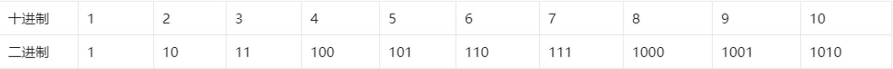


### 十进制转二进制

1. 除以2，余数为0，则该位为0，除以2，余数为1，则该位为1。

2. 重复以上过程，直到商为0。

3. 倒序排列，得到的就是二进制数。

#### 示例代码

```java title="Java"
/*
二进制与十进制的转换：

1. 十进制如何转换为二进制？
	除2取余，一直到商0为止，最后将所有的余数逆序输出。

	将75转换成二进制：1001011

2. 二进制如何转换为十进制？
	每一位与权值相乘，最后求和。
	将二进制1001011转换成十进制：75

*/
public class BinaryTest01{
	public static void main(String[] args){
		
		// 这是一个二进制的字面量。
		// 二进制的字面量需要以 0b 开头。
		System.out.println(0b1001011); // 75
	}
}
```
> **注意：`二进制的字面量`需要以 `0b `开头。**

**输出结果：**

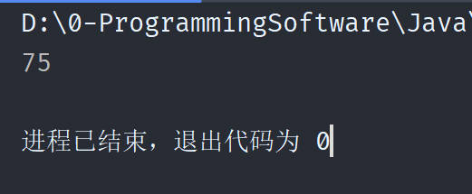


### 二进制转十进制

1. 将二进制数每一位权值找出来，然后每个权值与对应二进制位相乘，最后将它们相加，即可得到十进制数。

2. 什么是权值？
在二进制中，权值指的是每个位所代表的数值大小，即二进制中每个位的位置所代表的数值大小。

> **例如，在`二进制数1101`中，`最高位的权值为8`，`次高位的权值为4`，`第三位的权值为2`，`最低位的权值为1`。**

3. 例如，二进制数1101转换为十进制数的计算过程如下：

> **`1×2³ + 1×2² + 0×2¹ + 1×2⁰ = 8 + 4 + 0 + 1 = 13`**


### 练习题

> **将以下`十进制的数字转换为二进制`：**

243——>11110011

165——>10100101

89——>01011001

> **将以下`二进制的数字转换为十进制`：**

101010——>42

111100——>60

011001——>25


## 八进制与十六进制

### 什么是八进制

1. 八进制：`八`个`0`和`7`个`1`组成的数。

2. 八进制的表示方法：`以0开头`，`0~7`表示。

3. 满八进一

### 八进制与十进制之间的转换

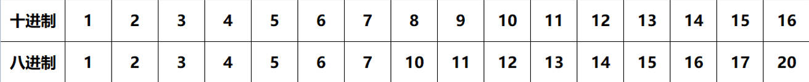

1. 十进制转八进制：除以8取余，一直到商为0为止，最后将所有的余数逆序输出。

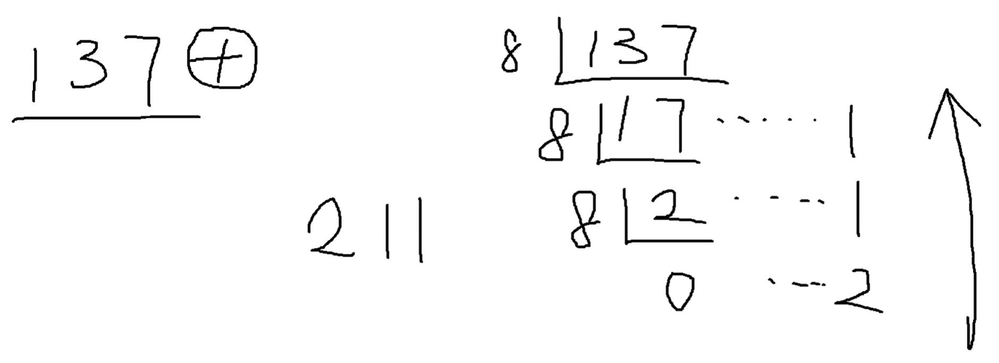

2. 八进制转十进制：每一位与权值相乘，最后求和。

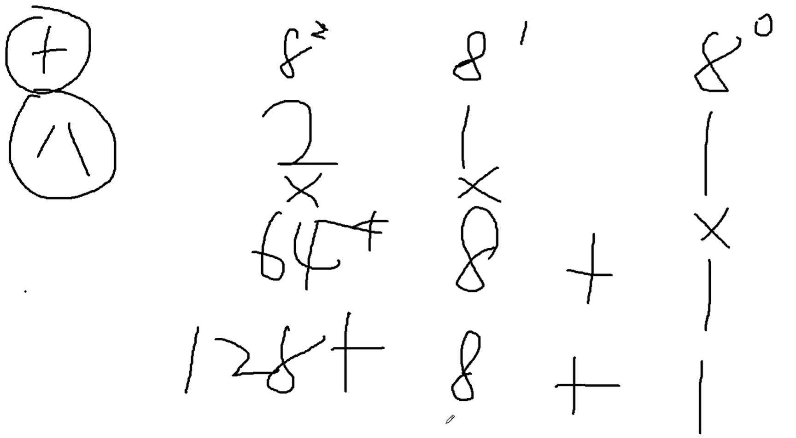


#### 示例代码

```java title="Java"
/*
1. 八进制：满八进一
2. 
	十进制 1 2 3 4 5 6 7 8  9  10 11 12 13 14 15 16
	八进制 1 2 3 4 5 6 7 10 11 12 13 14 15 16 17 20

3. 十进制转换成八进制：
	除8取余，一直到商0为止，最后将所有的余数逆序输出。

4. 八进制转换成十进制：
	每一位与权值相乘，最后求和。
*/
public class BaJinZhiTest01{
	public static void main(String[] args){
	
		// 十进制转换成八进制
		// 以下字面量是一个八进制的字面量。
		// java中规定，以0开始的字面量是一个八进制的字面量。
		System.out.println(0211); // 137

	}
}
```
**输出结果：**

```java title="Java"
137
```

> **简便方法：先将`十进制转换为二进制`，再转换为`八进制`。**

```java title="Java"
137转化为二进制：10 001 001

10001001转化为八进制：211
```


### 什么是十六进制

1. 十六进制：`十`六`个`0`到`9`和`A`到`F`（`10`到`15`）组成的数。

2. 十六进制的表示方法：`以0x或0X开头`，`0~9`和`A~F`表示。

3. 满十六进一

### 十六进制与十进制之间的转换

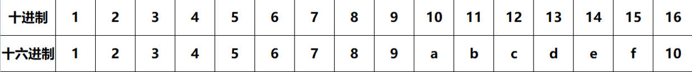

1. 十进制转十六进制：除以16取余，一直到商为0为止，最后将所有的余数逆序输出。

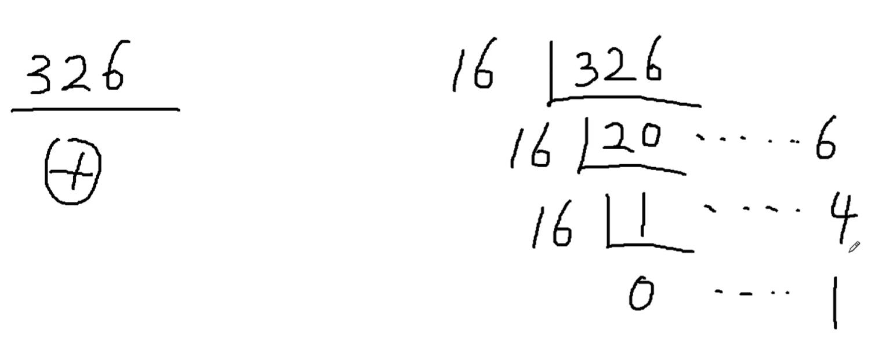

2. 十六进制转十进制：每一位与权值相乘，最后求和。

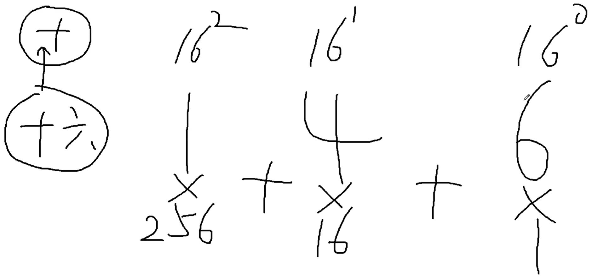 


#### 示例代码

```java title="Java"
/*
1. 十六进制：满十六进一
2. 
	十进制		1 2 3 4 5 6 7 8 9 10 11 12 13 14 15 16 17 18 19 20 21 22 23 24 25 26 27 28 29 30 31 32
	十六进制	1 2 3 4 5 6 7 8 9 a  b  c  d  e  f  10 11 12 13 14 15 16 17 18 19 1a 1b 1c 1d 1e 1f 20

3. 十进制转换成十六进制：
	除16取余，一直到商0为止，最后将所有的余数逆序输出。

4. 十六进制转换成十进制：
	每一位与权值相乘，最后求和。
*/
public class ShiLiuJinZhiTest01 {
	public static void main(String[] args){

		// 十进制转换成十六进制
		// 如果一个字面量以0x开始，后面的值是一个十六进制的值。
		System.out.println(0x146); // 326
	}
}
```
**输出结果：**

```java title="Java"
326
```

> **简便方法：先将`十进制转换为二进制`，再转换为`十六进制`。**

```java title="Java"
326转化为二进制：0001 0100 0110

0001 0100 0110 转化为十六进制：146
```


## 总结二进制、十进制、八进制、十六进制的转换方法

1. 二进制：满二进一，`0b`开头。

2. 十进制：满十进一。

3. 八进制：满八进一，`0`开头。

4. 十六进制：满十六进一，`0x`或`0X`开头。

### 示例代码

```java title="Java"
public class JinZhiZhuanHuan {
	public static void main(String[] args){
		// 十进制
		System.out.println(10); // 10
		// 八进制
		System.out.println(010); // 8
		// 二进制
		System.out.println(0b10); // 2
		// 十六进制
		System.out.println(0x10); // 16
	}
}
```
**输出结果：**

```java title="Java"
10
8
2
16
```