## 标识符

### 什么是标识符

1. 在Java中，标识符是用来给`变量`、`方法`、`类`和`包`等命名的字符序列。

2. 标识符的长度`没有限制`，但是建议使用`有意义的、简洁的`标识符，以提高代码的`可读性和可维护性`。

### 标识符可以标识什么

1. 变量名
2. 方法名
3. 类名、接口名、枚举名、注解名
4. 包名
5. 常量名
......

### 标识符的命名规则

1. 标识符可以由字母、数字、下划线(_)和美元符号($)组成，不能含有其他符号。（java支持全球所有语言，所以这里的 字母 指的是任何一个国家的文字都可以）

2. 标识符不能以数字开头。

3. 标识符不能是Java中的关键字，如public、class、void等。

4. 标识符是区分大小写的，即Foo和foo是两个不同的标识符。

5. 标识符的长度没有限制，但是Java建议使用有意义的、简短的标识符。

### 标识符的命名规范

1. 见名知意

2. 驼峰式命名方式

3. 类名、接口名、枚举、注解：首字母大写，后面每个单词首字母大写。（StudentService，UserService）

4. 变量名和方法名：首字母小写，后面每个单词首字母大写。（doSome，doOther）

5. 常量名：全部大写，每个单词用下划线连接。（LOGIN_SUCCESS，SYSTEM_ERROR）

6. 包名：全部小写


### 示例代码
```java title="Java"
/*
标识符
	1. 什么是标识符？
		在源代码中程序员自己有权利命名的单词都是标识符。

	2. 标识符可以标识什么？
		变量名，方法名，类名...

	3. 标识符的命名规则？
		* 标识符只能由数字，字母，_，$组成，不能含有其它字符。
			（这里的“字母”代表的是任何一个国家的文字,Java是采用Unicode编码，支持全球任何一个国家的语言）
		* 标识符不能以数字开头。
		* 标识符严格区分大小写。
		* 关键字不能做标识符。
		* 标识符理论上没有长度限制，但是最好不要太长。

	4. 标识符的命名规范？
		* 见名知意。
		* 遵循驼峰式命名方式。StudentService,BankService....
		* 类名，接口名：首字母大写，后面每个单词首字母大写。StudentService, BankService....
		* 变量名,方法名：首字母小写，后面每个单词首字母大写。productPrice, stuName, customerName, customerAge, doSome....
		* 常量名：全部大写，每个单词之间采用“_”分隔。LOGIN_SUCCESS, LOGIN_ERROR, MATH_PAI
		* 包名：全部小写。 powernode

*/
public class IdentifierTest01{
    public static void main(String[] args){

        // 定义一个变量，用来存储一个人的年龄
        // age是一个变量名，是一个标识符
        int age = 20;

        int age_  = 20;

        int $_age = 20;

        int $_age123 = 50;

        //int 1$_age = 50;

        int 年龄 = 50;

        int a = 100;

        int A = 100;

        String name = "jackson";

        //String address# = "北京海淀区";
    }
}

// 学生类  这是一个类名，是一个标识符
class 学生类{

}

/*
class public {

}
*/
```


### 判断标识符是否合法

```java title="Java"
myVariable ——>合法

2name ——>不合法，以数字开头

first.name ——>不合法，以点号开头

studentName ——>合法

public  ——>不合法，是关键字

public1 ——>合法

address# ——>不合法，以#号开头

MAX_SIZE ——>合法

id# ——>不合法，以#号开头

_id ——>合法

@age ——>合法，注解名

$money ——>合法

你好 ——>合法
```


## 关键字

### 什么是关键字

1. 在java语言当中，具有特殊含义的单词。

2. 每个关键字都已经被java语言本身占用了，不能拿关键字做标识符。

3. java语言中所有的关键字都是全部小写。


### Java关键字有哪些

1. Java关键字有哪些

2. Java关键字都是小写的。

3. 关键字列表如下：
```java title="Java"
abstract, assert, boolean, break, byte, case, catch, char, class, continue, default, do, double, else, enum, extends, final, finally, float, for, if, implements, import, instanceof, int, interface, long, native, new, package, private, protected, public, return, short, static, strictfp, super, switch, synchronized, this, throw, throws, transient, try, void, volatile, while
```
4. Java保留字：`goto`，`const`


### 示例代码
```java title="Java"
/*
什么是关键字？
	在java语言当中，具有特殊含义的单词。
	每个关键字都已经被java语言本身占用了，不能拿关键字做标识符。
	java语言中所有的关键字都是全部小写。

以下程序中哪些单词是关键字？
	public
	class
	static
	void
*/
public class KeywordsTest01 {
	public static void main(String[] args){
		System.out.println("关键字");
	}
}
```

## 字面量

### 什么是字面量

> `字面量`指的是`在程序中直接使用的数据`，字面量是Java中最基本的表达式，`不需要进行计算或转换，直接使用即可`。


### Java中有哪些字面量

```java title="Java"
整数型：10、-5、0、100

浮点型：3.14、-0.5、1.0

布尔型：true、false

字符型：'a'、'b'、'c'、'1'、'2'、'国'

字符串型："Hello"、"World"、"Java"、"你好呀"
```


#### 示例代码

```java title="Java"
/*
Java中的字面量：
	1. 什么是字面量？
		程序中的数据就是字面量。字面量是Java中最基本的表达式，无需转换，直接使用。
	2. 字面量包括哪些类型？
		整数型字面量: 10 20 100 -1 0 -100
		浮点型字面量: 3.0 3.14 3.1415926
		布尔型字面量: true false
		字符型字面量: 'a' '国' 'b'
		字符串型字面量："abc" "a" "hello"
*/
public class ConstTest01 {
	public static void main(String[] args){

		// 整数型的字面量
		System.out.println(10);
		System.out.println(-100);

		// 浮点型的字面量
		System.out.println(3.14);

		// 布尔型字面量
		System.out.println(true); // true代表真
		System.out.println(false); // false代表假

		// 字符型字面量（单个字符）
		// 所有字符型字面量必须使用单引号括起来。
		System.out.println('A');
		System.out.println('中');
		System.out.println('T');
		//System.out.println('AB'); // 编译报错。

		// 字符串型字面量
		// 所有的字符串型字面量都必须使用双引号括起来。
		System.out.println("动力节点");
		System.out.println("A");
		System.out.println("Hello World!");

		System.out.println("10");
		System.out.println("true");
	}
}
```


### 加号运算符 +

1. 作用1：**`求和（当加号两边都是数字时进行求和运算）`**

2. 作用2：**`字符串拼接`（当加号两边`有任意一边是字符串类型`时会进行`字符串拼接`，结果还是`一个字符串`）**


#### 示例代码

```java title="Java"
/*
java语言中的 + 运算符：

	1. + 运算符在java语言中有两个作用？
		第一个作用：求和
		第二个作用：字符串拼接

	2. 什么情况下是求和？
		+ 两边如果都是数字，会进行求和运算。

	3. 什么情况下是字符串拼接？
		+ 两边只要有一边是字符串，一定会做字符串的拼接操作，并且拼接完之后的结果还是一个字符串。
*/
public class PlusTest01{
	public static void main(String[] args){

		// 求和
		System.out.println(10 + 20); // 30
		
		// 字符串拼接
		System.out.println("10" + 20); // "1020"

		// 一个表达式当中出现多个 +，顺序是怎样的？如果没有小括号，遵循从左向右。
		// 第一个 + 是求和
		// 第二个 + 是字符拼接
		System.out.println(10 + 20 + "30"); // "3030"

		// 添加了小括号优先级比较高。
		// 这两个 + 都是字符串拼接。
		System.out.println(10 + (20 + "30")); // "102030"

		System.out.println("10" + 20 + 30); // "102030"

		System.out.println("10" + (20 + 30)); // "1050"
	}
}
```

**输出结果：**


## 变量

### 什么是变量

1. `变量`是`内存当中的一块空间`。是`计算机中存储数据最基本的单元`。

2. **变量三要素：**

> **`数据类型（决定空间大小）【int, double, String】`**

> **`变量名（只要是合法的标识符即可）`**

> **`变量值（变量中具体存储的数据）`**

> **注意：`变量名`和`变量值`是`一一对应的`。**


3. **变量的声明、赋值、访问**

```java title="Java"
int i; // 声明一个整数型的变量，起名i

i = 100; // 给变量i赋值100

System.out.println(i); // 访问i变量：读操作

i = 200; // 访问i变量：改操作【给变量i重新赋值200】
```

### 变量的声明、赋值、访问语法格式
```java title="Java"
/*
变量
	1. 什么是变量？
		变量是内存中的一块空间。是计算机中存储数据的最基本的单元。
		变量是用来解决数据存储问题的。
		先把数据存储起来，后续的程序需要使用的时候，可以从变量中取来用。

	2. 变量的三要素？
		* 数据类型
		* 变量名
		* 变量值
		注意：
			数据类型是决定空间大小的。
			数据类型 和 值的数据类型 要一致。
	
	3. 变量的声明、赋值、访问。
		声明(定义)语法格式：
			数据类型 变量名;
			
			数据类型：
				int	整数型
				double 浮点型
				String 字符串型
				......
		
		赋值的语法格式：
			变量名 = 变量值;
		
		访问怎么做？
			访问包括两种情况：一种是读，一种是修改。
			读：System.out.println(变量名);
			修改：变量名 = 变量值;
*/
public class VarTest01{
	public static void main(String[] args){

		// 声明/定义一个int类型的变量，起名age，用来存储人的年龄
		int age;

		// 给age变量赋值
		age = 20;

		// 读
		System.out.println("年龄=" + age); ——> 字符串拼接

		// 改（重新赋值）
		age = 30;

		// 读
		System.out.println("年龄=" + age);

		age = 60;
		System.out.println("年龄=" + age);

		// 不兼容的类型: String无法转换为int
		//age = "50";

		// 定义一个变量，用来存储数学当中的π
		double π = 3.14;

		System.out.println("圆周率：" + π);


		// 声明一个String类型的name变量，用来存储人的姓名
		// 变量的声明和赋值可以一块完成。
		String name = "jack";
		System.out.println("name = " + name);

		// 可以重新赋值
		name = "lucy";

		System.out.println("name = " + name);
	}
}
```
**输出结果：**


### 变量的作用

1. **`变量的存在会让程序更加便于维护。`**

```java title="Java"
System.out.println(100 + 111);
System.out.println(100 + 222);

以上代码的设计就不如以下的代码：
int num = 100;
System.out.println(num + 111);
System.out.println(num + 222);
```

2. **`变量的存在可以增强程序的可读性。`**

```java title="Java"
System.out.println(3.14 * 10 * 10);

以上代码的设计就不如以下的代码：
double π = 3.14;
int r = 10;
System.out.println(π * r * r);
```

#### 示例代码

```java title="Java"
/*
	变量的作用：
		第一个作用：便于代码的维护。
		第二个作用：增强代码的可读性。
*/
public class VarTest02{
	public static void main(String[] args){
		/*		
		System.out.println(100 + 456);
		System.out.println(100 + 111);
		System.out.println(100 + 222);
		System.out.println(100 + 235);
		System.out.println(100 + 789);
		System.out.println(100 + 999);
		System.out.println(100 + 666);
		System.out.println(100 + 888);
		*/

		// 新的需求来了：要计算50和后面数字的和。
		// 问题：修改的位置太多了。不好维护。
		/*
		System.out.println(50 + 456);
		System.out.println(50 + 111);
		System.out.println(50 + 222);
		System.out.println(50 + 235);
		System.out.println(50 + 789);
		System.out.println(50 + 999);
		System.out.println(50 + 666);
		System.out.println(50 + 888);
		*/

		int num = 50;
		System.out.println(num + 456);
		System.out.println(num + 111);
		System.out.println(num + 222);
		System.out.println(num + 235);
		System.out.println(num + 789);
		System.out.println(num + 999);
		System.out.println(num + 666);
		System.out.println(num + 888);

		// 需求：请编写程序，计算半径是10.0cm的圆的面积。
		// 假如不用变量。
		System.out.println(3.14 * 10.0 * 10.0);

		// 怎么增强可读性。
		double π = 3.14;
		double r = 10.0;
		System.out.println(π * r * r);
	}
}
```


### 变量的小细节

1. 变量必须先声明，再赋值，才能访问

2. 方法体当中的代码遵循自上而下的顺序依次逐行执行，变量先访问，再声明肯定是不行的

3. 一行代码上可以同时声明多个变量

4. 在同一个作用域当中，变量名不能重名，可以重新赋值

5. 变量值的数据类型必须和变量的数据类型一致，这样是不允许的：String name = 100;


#### 示例代码
```java title="Java"
/*
变量使用的小细节：
	1.变量必须先声明，再赋值，才能访问
	2.方法体当中的代码遵循自上而下的顺序依次逐行执行，变量先访问，再声明肯定是不行的
	3.一行代码上可以同时声明多个变量
	4.在同一个作用域当中，变量名不能重名，可以重新赋值
*/
public class VarTest03 {
	public static void main(String[] args){
		
		// 变量必须先声明，再赋值，才能访问。
		int age;
		// 错误: 可能尚未初始化变量age
		//System.out.println(age);

		//方法体当中的代码遵循自上而下的顺序依次逐行执行，变量先访问，再声明肯定是不行的
		// 错误: 找不到符号
		//System.out.println("name = " + name);
		String name = "jack";

		
		// 一行代码上可以同时声明多个变量
		// 以下代码含义：声明三个int类型的变量a b c，其中a和b没有赋值，c赋值300
		int a,b,c = 300;
		a = 50;
		System.out.println(a);
		b = 80;
		System.out.println(b);
		System.out.println(c);

		int x = 500, y = 600, z = 700;

		System.out.println(x + y + z);

		// 在同一个作用域当中，变量名不能重名，可以重新赋值
		// 作用域就是有效范围。在java中，一个{}就是一个作用域。
		int i = 100;
		// 错误: 已在方法 main(String[])中定义了变量 i
		//int i = 200;
		
		// 可以重新赋值。
		i = 200;

		System.out.println(i);
		
	}
}
```
**输出结果：**


### 变量的作用域

1. `作用域`就是`变量的有效范围`。变量的作用域是怎样的呢？用一句大白话就可以概括了：`出了大括号就不认识了`。

2. 作用域的不同主要是因为`声明在不同位置的变量具有不同的生命周期`。所谓的生命周期是：`从内存开辟到内存释放`。

3. **Java遵循`就近原则`**

#### 示例代码
```java title="Java"
/*
	变量的作用域：

		1. 什么是作用域？
			变量的有效范围。在java程序中通常是一个{}对应一个作用域。

		2. 记住一句话：出了大括号就不认识了。
*/
public class VarTest04 {

	public static void main(String[] args){
		
		// age是main方法中声明的。所以作用域是整个main方法。
		// 在main方法体当中是有效的变量。
		int age = 20;
		System.out.println("age = " + age);

		int num = 100;

		if(num > 50){
			int i = 666;
			System.out.println("i = " + (i + age));
		}
		
		// 错误: 找不到符号
		//System.out.println("i = " + i);
	}

	// 另一个方法。
	public static void doSome(){
		// 错误: 找不到符号
		//System.out.println("age = " + age);
	}
}
```

**输出结果：**


### 变量的分类

1. 局部变量：`在方法体中声明的变量`，只能在当前方法体中使用。

2. 成员变量：`在类体中声明的变量`，可以被类的所有方法使用。

3. 静态变量：`在类体中声明的变量`，可以被类的所有实例对象使用。

4. 常量：`在类体中声明的变量`，只能被类的所有实例对象使用，且只能赋值一次。

#### 示例代码

```java title="Java"
/*
	变量的分类：
		变量可以根据定义的/声明的位置来进行分类，可以分为两大类：
			* 一类：局部变量
			* 另一类：成员变量
				* 静态变量
				* 实例变量 
*/
public class VarTest05 {

	public static void main(String[] args){
		
		// 凡是在方法体当中定义的变量，一定是局部变量。
		// 局部变量只在当前方法体当中有效。
		int a = 100;

	}


	// 在类体当中定义的变量叫做成员变量。
	// 实例变量
	int b = 200;

	// 静态变量
	static int c = 300;
}
```


## 二进制


### 二进制概述

计算机底层只能识别`二进制`。计算机底层只识别二进制是因为计算机内部的`电子元件`只能识别`两种状态`，即`开和关`，或者`高电平和低电平`。二进制正好可以用两种状态来表示`数字和字符`，因此成为了计算机`最基本的表示方法`。在计算机内部，所有的数据都被转化为`二进制形式`进行`处理和存储`。虽然计算机可以通过不同的`编程语言和程序`来处理不同的`数据类型和格式`，但最终都需要将其转化为二进制形式才能被计算机底层识别和处理。

### 什么是二进制

1. 十进制：满十进一

2. 二进制：满二进一


### 十进制转二进制

1. 除以2，余数为0，则该位为0，除以2，余数为1，则该位为1。

2. 重复以上过程，直到商为0。

3. 倒序排列，得到的就是二进制数。

#### 示例代码

```java title="Java"
/*
二进制与十进制的转换：

1. 十进制如何转换为二进制？
	除2取余，一直到商0为止，最后将所有的余数逆序输出。

	将75转换成二进制：1001011

2. 二进制如何转换为十进制？
	每一位与权值相乘，最后求和。
	将二进制1001011转换成十进制：75

*/
public class BinaryTest01{
	public static void main(String[] args){
		
		// 这是一个二进制的字面量。
		// 二进制的字面量需要以 0b 开头。
		System.out.println(0b1001011); // 75
	}
}
```
> **注意：`二进制的字面量`需要以 `0b `开头。**

**输出结果：**


### 二进制转十进制

1. 将二进制数每一位权值找出来，然后每个权值与对应二进制位相乘，最后将它们相加，即可得到十进制数。

2. 什么是权值？
在二进制中，权值指的是每个位所代表的数值大小，即二进制中每个位的位置所代表的数值大小。

> **例如，在`二进制数1101`中，`最高位的权值为8`，`次高位的权值为4`，`第三位的权值为2`，`最低位的权值为1`。**

3. 例如，二进制数1101转换为十进制数的计算过程如下：

> **`1×2³ + 1×2² + 0×2¹ + 1×2⁰ = 8 + 4 + 0 + 1 = 13`**


### 练习题

> **将以下`十进制的数字转换为二进制`：**

243——>11110011

165——>10100101

89——>01011001

> **将以下`二进制的数字转换为十进制`：**

101010——>42

111100——>60

011001——>25


## 八进制与十六进制

### 什么是八进制

1. 八进制：`八`个`0`和`7`个`1`组成的数。

2. 八进制的表示方法：`以0开头`，`0~7`表示。

3. 满八进一

### 八进制与十进制之间的转换


1. 十进制转八进制：除以8取余，一直到商为0为止，最后将所有的余数逆序输出。


2. 八进制转十进制：每一位与权值相乘，最后求和。


#### 示例代码

```java title="Java"
/*
1. 八进制：满八进一
2. 
	十进制 1 2 3 4 5 6 7 8  9  10 11 12 13 14 15 16
	八进制 1 2 3 4 5 6 7 10 11 12 13 14 15 16 17 20

3. 十进制转换成八进制：
	除8取余，一直到商0为止，最后将所有的余数逆序输出。

4. 八进制转换成十进制：
	每一位与权值相乘，最后求和。
*/
public class BaJinZhiTest01{
	public static void main(String[] args){
	
		// 十进制转换成八进制
		// 以下字面量是一个八进制的字面量。
		// java中规定，以0开始的字面量是一个八进制的字面量。
		System.out.println(0211); // 137

	}
}
```
**输出结果：**

```java title="Java"
137
```

> **简便方法：先将`十进制转换为二进制`，再转换为`八进制`。**

```java title="Java"
137转化为二进制：10 001 001

10001001转化为八进制：211
```


### 什么是十六进制

1. 十六进制：`十`六`个`0`到`9`和`A`到`F`（`10`到`15`）组成的数。

2. 十六进制的表示方法：`以0x或0X开头`，`0~9`和`A~F`表示。

3. 满十六进一

### 十六进制与十进制之间的转换


1. 十进制转十六进制：除以16取余，一直到商为0为止，最后将所有的余数逆序输出。


2. 十六进制转十进制：每一位与权值相乘，最后求和。

 


#### 示例代码

```java title="Java"
/*
1. 十六进制：满十六进一
2. 
	十进制		1 2 3 4 5 6 7 8 9 10 11 12 13 14 15 16 17 18 19 20 21 22 23 24 25 26 27 28 29 30 31 32
	十六进制	1 2 3 4 5 6 7 8 9 a  b  c  d  e  f  10 11 12 13 14 15 16 17 18 19 1a 1b 1c 1d 1e 1f 20

3. 十进制转换成十六进制：
	除16取余，一直到商0为止，最后将所有的余数逆序输出。

4. 十六进制转换成十进制：
	每一位与权值相乘，最后求和。
*/
public class ShiLiuJinZhiTest01 {
	public static void main(String[] args){

		// 十进制转换成十六进制
		// 如果一个字面量以0x开始，后面的值是一个十六进制的值。
		System.out.println(0x146); // 326
	}
}
```
**输出结果：**

```java title="Java"
326
```

> **简便方法：先将`十进制转换为二进制`，再转换为`十六进制`。**

```java title="Java"
326转化为二进制：0001 0100 0110

0001 0100 0110 转化为十六进制：146
```


## 总结二进制、十进制、八进制、十六进制的转换方法

1. 二进制：满二进一，`0b`开头。

2. 十进制：满十进一。

3. 八进制：满八进一，`0`开头。

4. 十六进制：满十六进一，`0x`或`0X`开头。

### 示例代码

```java title="Java"
public class JinZhiZhuanHuan {
	public static void main(String[] args){
		// 十进制
		System.out.println(10); // 10
		// 八进制
		System.out.println(010); // 8
		// 二进制
		System.out.println(0b10); // 2
		// 十六进制
		System.out.println(0x10); // 16
	}
}
```
**输出结果：**

```java title="Java"
10
8
2
16
```


## 原码、反码、补码

### byte与bit

1. byte（字节）是`计算机存储`和`处理数据`的`基本单位`，通常由`8个比特（bit）组成`。`每个比特（bit）`是计算机中`最小的存储单位`，只能存储0或1两个状态。因此，`一个字节（byte）可以存储8个比特（bit）`的数据。

2. 两者之间的关系是，`1 byte = 8 bit`，即8个比特（bit）组成一个字节（byte）。

3. 在计算机中，数据通常以`字节（byte）为单位进行存储和传输`，而比特（bit）则是用来表示`数据的最小单位`。

```java title="Java"
1KB = 1024byte

1MB = 1024KB

1GB = 1024MB

1TB = 1024GB
```


### 原码、反码、补码的概念

1. 原码反码补码是计算机二进制的三种表示形式。

2. 计算机在底层都是采用二进制补码形式表示的。

3. 二进制位最高位称为符号位，`0为正数`，`1为负数`。


### 正数的原码反码补码

> **正数的`原码、反码、补码`都是`相同`的。**

>> **请问`127的原码反码补码`分别是多少？**

```java title="Java"
十进制数: 127

原码：0111 1111

反码：0111 1111

补码：0111 1111
```

### 负数的原码反码补码

> **负数的原码运算规则：`将绝对值转换为二进制后，最高位改为1。`**

1. 原码：直接将数值按照正负数的形式翻译成二进制得到的就是原码。

2. 反码：将原码的符号位不变，其他位依次按位取反就可以得到反码。

3. 补码：反码+1就得到补码。

> **负数的`原码、反码、补码`都是`不同的`！**

>> **请问`-5的原码、反码、补码`分别是多少？**

```java title="Java"
十进制数: -5

原码：10000101

反码：11111010 （原则是：以原码作为参考，符号位不变，其他位取反）

补码：11111011 （原则是：以反码作为参考，符号位不变，加1）
```

>> **请问`-20的原码、反码、补码`分别是多少？**

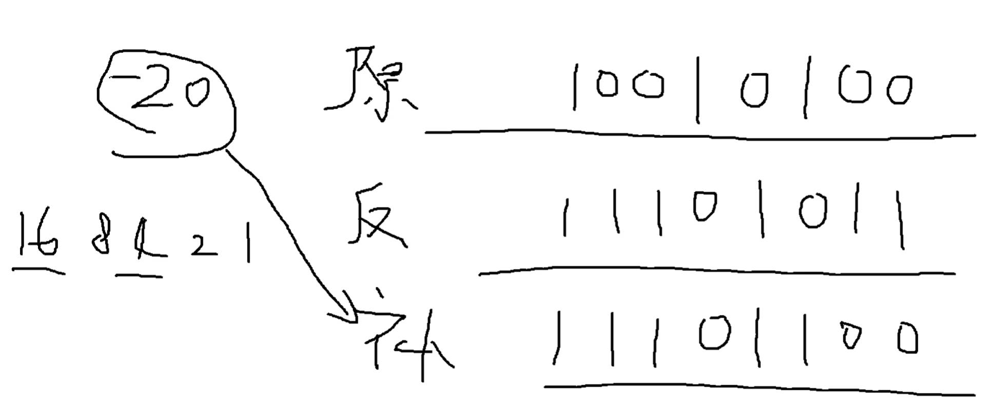


>> **请问`-128的原码、反码、补码`分别是多少？**

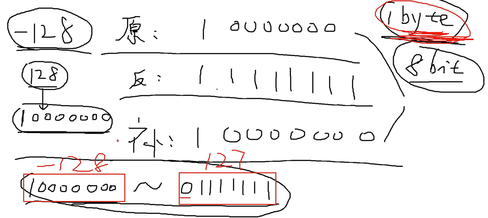

> 注意：**-128的原码、补码都是`相同`的。,可以推出byte的范围：`byte的范围是-128~127`。**


### 负数补码求原码

> **负数的补码求原码：`将补码的符号位不变，其他位取反，再加1`。**

```java title="Java"
补码：10001100

反码：11110011

原码：11110100

十进制数: -116
```


### 计算机底层为什么采用补码(了解)

1. 可以简化电路设计：采用补码形式可以将加减法运算转化为相同的操作，从而简化电路设计。 

2. 解决了0的正负问题：在原码中，0有两个表示，+0和-0，这样会导致计算结果不唯一，而在补码中，0只有一种表示，即全0，可以避免这个问题。 

3. 解决了负数溢出问题：在原码中，负数的表示范围比正数少1，这样在进行减法运算时容易出现负数溢出的情况，而在补码中，负数的表示范围与正数相同，可以避免负数溢出的问题。 

4. 方便计算机进行运算：补码形式可以方便计算机进行加减法运算，而且可以使用相同的电路进行运算，从而提高了计算机的运算效率。 

>**可以计算一下 `-3 + 2`，看看能不能理解！！！**

**以原码形式计算：**

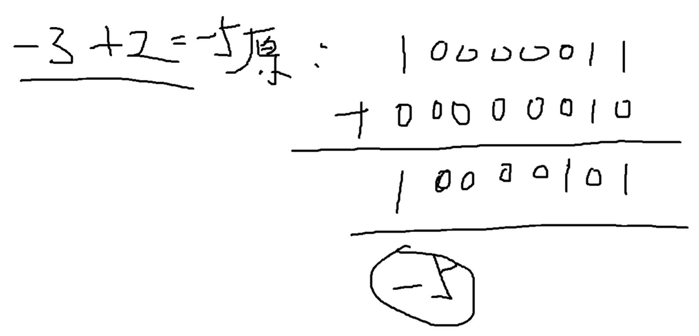

**以补码形式计算：**

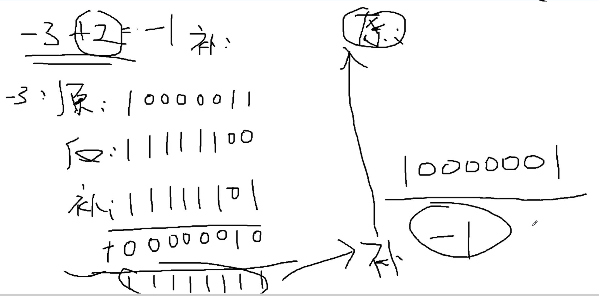


## 数据类型-概述

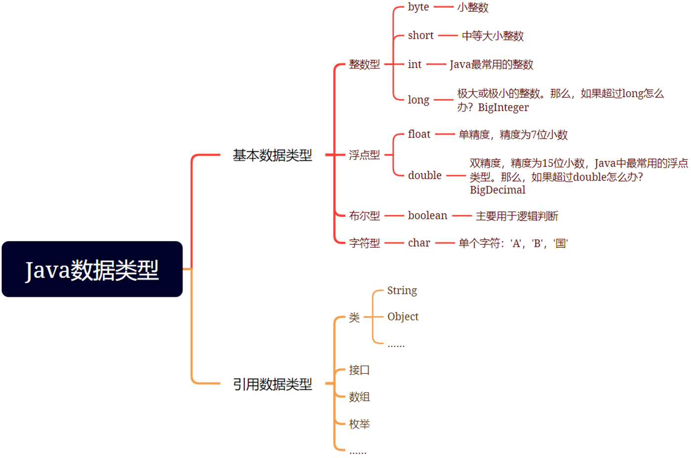

1. 数据类型作用？

决定给变量分配多大的空间。

2. 为什么要学习数据类型？

为了定义变量。


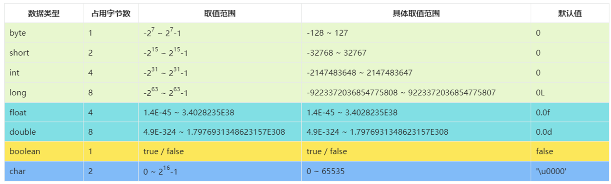


> 关于默认值：**`Java语言中变量`必须`先声明，再赋值`，才能使用。对于`局部变量`来说`必须手动赋值`，而对于`成员变量`来说，如果`没有手动赋值`，`系统会自动赋默认值`。**

关于八种基本数据类型的默认值：
| 数据类型 | 默认值 |
|----------|---------|
| byte | 0 |
| short | 0 |
| int | 0 |
| long | 0L |
| float | 0.0F |
| double | 0.0 |
| boolean | false |
| char | \u0000 |
|所有的引用数据类型|默认值是：null|

**示例代码：**

```java title="Java"
/*
	关于八种基本数据类型的默认值：
		数据类型		默认值
		---------------------------------
		byte			0
		short			0
		int				0
		long			0L
		float			0.0F
		double			0.0
		boolean			false
		char			\u0000

		所有的引用数据类型，默认值是：null

	语法规则：
		在java中，如果成员变量没有手动赋值，系统会赋默认值
*/
public class DefaultValueTest{

	// 成员变量：1.静态变量  2.实例变量。
	// 静态变量
	static int k;

	static boolean sex;

	static String name;

	public static void main(String[] args){

		// 变量必须先声明，再赋值，才能访问。
		int i; // 局部变量
		// 错误: 可能尚未初始化变量i
		//System.out.println(i);

		i = 100;

		System.out.println(i);

		System.out.println("k = " + k);

		System.out.println("sex = " + sex);

		System.out.println("name = " + name);
	}
}
```
**输出结果：**

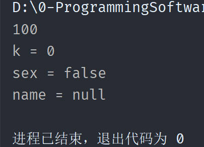


### 数据类型-整型

#### 整数型字面量的四种表示形式

1. 十进制表示法：以数字0-9组成的常数，默认为十进制表示法。
例如：int a = 10;

2. 二进制表示法：以0b或0B开头的常数，由0和1组合而成。
例如：int b = 0b101;

3. 八进制表示法：以0开头的常数，由数字0-7组成。
例如：int c = 012;

4. 十六进制表示法：以0x或0X开头的常数，由0-9和A-F（大小写均可）组成。
例如：int d = 0x1F;


**示例代码：**
```java title="Java"
/*
	java语言中整数型字面量有四种表示形式。
*/
public class IntTest01{
	public static void main(String[] args){
		int a = 10;
		int b = 0b10;
		int c = 010;
		int d = 0x10;
		System.out.println(a); // 10
		System.out.println(b); // 2
		System.out.println(c); // 8
		System.out.println(d); // 16
		System.out.println(a + b + c + d); // 36
	}
}
```
**输出结果：**

```java title="Java"
10
2
8
16
36
```

#### 整数型字面量默认当做int处理

> **Java中整数型字面量`默认被当做int类型`来处理，如果要表示`long类型的整数`，需要在`字面量后面加上'L'或'l'标记`。例如，下面是表示`int和long`类型整数的字面量的示例：**

```java title="Java"

int x = 10; // 10是一个int类型的字面量
long y = 10L; // 10L是一个long类型的字面量
```
**需要注意的是，`大小写字母'L'和'l'的使用没有区别`，但是`容易被误解为数字1`，因此`建议使用大写字母`。**


#### 自动类型转换

> **在Java中，对于基本数据类型来说，`小容量是可以直接赋值给大容量`的，这被称为自动类型转换。对于数字类型来说大小关系为：`byte < short < int < long < float < double`**


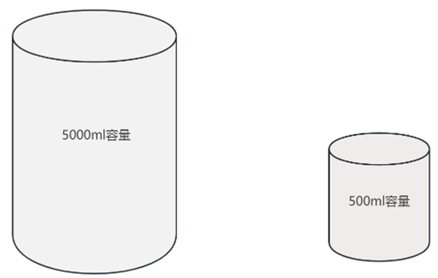


**示例代码：**
```java title="Java"
/*
	1.java中任何一个“整数型字面量”都会默认被当做int类型来处理。
	2.java中允许小容量的数据直接赋值给大容量的变量。
		byte < short < int < long < float < double
	3.如果在整数型字面量后面添加 L 或者 l，那么这个整数型字面量就会被当做long类型来处理了。建议大L。
*/
public class IntTest02{
	public static void main(String[] args){
		
		// 这个没有类型转换。
		// = 是赋值运算符，=的右边先执行。
		// 程序先执行右边，分配一块空间去存储100这个数字，给100分配的是4个字节。(当做int来处理)
		// a变量正好也是4个字节。所以不存在类型转换。
		int a = 100;

		// 100 是4个字节。
		// b 是8个字节。
		// 小容量可以自动赋值给大容量，叫做自动类型转换。
		long b = 100;

		// 100L一上来就是分配8个字节。所以这个代码不存在类型转换。
		long c = 100L;

		// 2147483647 一上来就被当做int来处理，4个字节。
		// d是8个字节。存在自动类型转换。
		long d = 2147483647;
		System.out.println(d);

		// 错误: 整数太大（不是long存不下。）
		// 原因是：2147483648默认被当做int来处理，分配4个字节。4个字节本身是无法存储2147483648
		//long e = 2147483648;
		//System.out.println(e);

		// 怎么解决？添加一个L。
		long e = 2147483648L;
		System.out.println(e);

	}
}
```


> **经典面试题：**

```java title="Java"
请看以下代码有什么问题吗？
long z = 2147483648;

编译报错，原因是2147483648被当做int类型处理，而该数字本身已经超出了int最大值，如何修改？

long z = 2147483648L;
```


#### 强制类型转换

1. Java中`大容量是无法直接转换成小容量`的。因为这种操作可能会`导致精度损失`，所以这种行为交给了程序员来决定，当然这种后果自然是程序员自己去承担。因此在代码中需要程序员自己亲手加上`强制类型转换符`，程序`才能编译通过`

2. 强制类型转换时，底层二进制是如何变化的？原则：`砍掉左侧多余的二进制`。

3. 强制类型转换时，`精度可能会损失，也可能不会损失`，这要看`具体的数据是否真正的超出了强转后的类型的取值范围`。如下图：`水可能溢出，也可能不会溢出，这要看真实存放的水有多少`

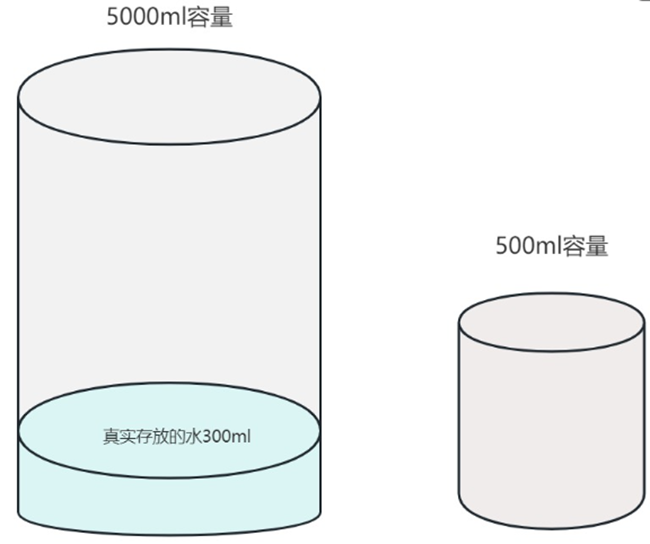


**示例代码：**
```java title="Java"
/*
	强制类型转换。
		1. java中大容量不能直接赋值给小容量。（大容量是不能自动转换成小容量的。）
		2. 大容量转换成小容量的时候，想让其编译通过的话，必须由程序员手动添加“强制类型转换符”来操作。
		3. 强制类型转换之后，编译通过，运行时可能损失精度，也可能不会损失精度，具体要看数据的真实大小。
*/
public class IntTest03{
	public static void main(String[] args){
		
		long x = 1000L;

		// 错误: 不兼容的类型: 从long转换到int可能会有损失
		//int y = x;

		// 强制类型转换。
		int y = (int)x;


		long a = 55L;

		int b = (int)a;

		System.out.println("b = " + b); // 55


		// 分析程序执行结果。
		int k = 128;

		byte e = (byte)k;

		System.out.println("e = " + e); // -128

		// 分析程序的执行结果：
		int m = 129;
		byte n = (byte)m;
		System.out.println("n = " + n); // -127

		// 自动类型转换。
		double d = 1;
		System.out.println(d); // 1.0

	}
}
```
**输出结果：**

```java title="Java"
b = 55
e = -128
n = -127
1.0
```

##### 强制类型转换-大容量转换成小容量

```java title="Java"
long a = 55;

int b = (int)a;

System.out.println("b = " + b); // 55
```
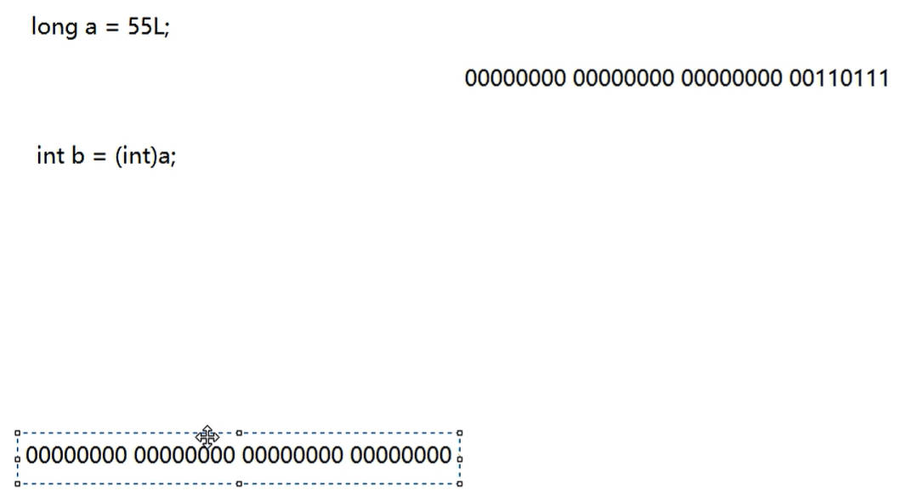


##### 强制类型转换-小容量转换成大容量

```java title="Java"
int k = 128;

byte e = (byte)k;

System.out.println("e = " + e); // -128
```
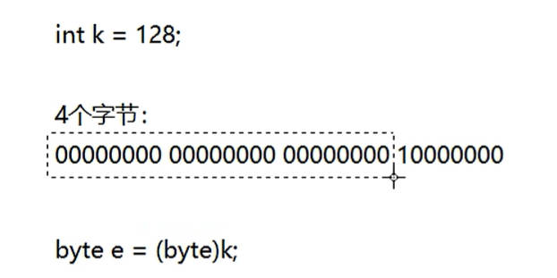

```java title="Java"
// 分析程序的执行结果：
int m = 129;
byte n = (byte)m;
System.out.println("n = " + n); // -127
```
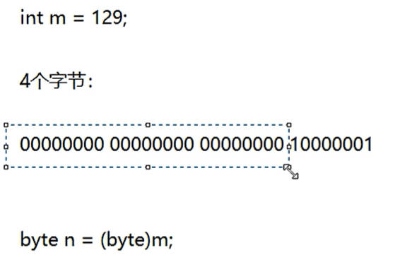

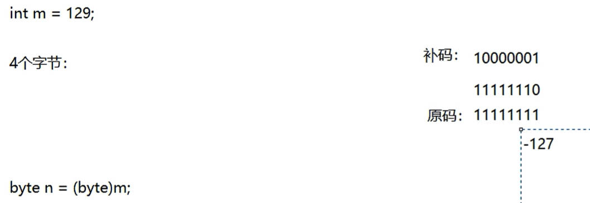


4. 请推算结果：byte b = (byte)150;

> **推算过程：**

```java title="Java"
int a = 150;

byte b = (byte)a;

System.out.println(b); // 126
```

> **分析过程：**

```java title="Java"
int a = 150;

150的二进制表示为：00000000 00000000 00000000 10010110

byte b = (byte)a;

强制转换为byte时，截取低8位：10010110(补码)

最高位为1，表示负数。补码转原码的步骤：

保持符号位不变，其余位取反：11101001。

加1得到原码绝对值：11101001 + 1 = 11101010（即十进制的106）。

因此，补码10010110对应的十进制值为 -106。

System.out.println(b); // -106
```
> **结果：**

```java title="Java"
-106
```

#### 当整数字面量没有超出byte的范围

> **在Java中有这样一个规定，当`整数型字面量没有超出byte的范围`：可以`直接赋值给byte类型的变量`。**

```java title="Java"
byte b = 127; // 这是允许的
很显然，这是一种编译优化。同时也是为了方便程序员写代码。
```

```java title="Java"
如果超出了范围，例如：
byte b = 128; // 编译报错
这样就会报错，需要做强制类型转换，例如：
byte b = (byte)128;
```

> **在整数类型中，`除了byte`有这个待遇之外，`short同样也是支持`的。也就是说：如果`整数型字面量没有超出short取值范围时`，也是`支持直接赋值`的。**


**示例代码：**
```java title="Java"

/*
	请记住这个语法规则：
		1.当一个整数型字面量没有超出byte的取值范围的时候，可以直接赋值给byte类型的变量。
		2.当一个整数型字面量没有超出short的取值范围的时候，可以直接赋值给short类型的变量。
*/
public class IntTest04{
	public static void main(String[] args){

		// 可以直接赋值，不需要强制类型转换。
		byte b = 1;

		// 可以直接赋值，不需要强制类型转换。
		byte a = 127;

		// 编译报错，因为128超出byte取值范围了。
		//byte c = 128;

		// 如果想编译通过，只能做强制类型转换了。
		byte c = (byte)128;
		System.out.println(c); // -128

		// short取值范围：-32768 ~ 32767
		// 通过
		short s = 32767;
		
		// 编译报错。
		//short s1 = 32768;

		// 必须强制类型转换
		short s1 = (short)32768;
		System.out.println(s1); // -32768

	}
}
```


#### 两个int类型做运算

> **在Java中，两个int类型的数据做运算，最终的结果还是int类型。**

```java title="Java"
int a = 10;

int b = 3;

// 应该是这样的结果：3.33333333333333333333...
// 但java中不是，结果是：int类型的3
System.out.println(a / b); // 3
```

#### 多种数据类型混合运算

> **在Java中，当`多种数据类型混合运算`时，会先将所有`数据转换成容量最大`的那种数据类型，然后再进行计算。**

```java title="Java"

byte x = 10;

int y = 3;

long z = 100L;

// 编译报错。
//int result = x + y + z;

// 修改
long result = x + y + z;

System.out.println(result); // 113
```


#### 编译器的小心思

1. 以下程序编译通过：

```java title="Java"
byte x = 10 / 3;

为什么编译通过？这种情况下都是字面量的时候，编译器可以在编译阶段得出结果是3，而3没有超出byte取值范围。可以直接赋值。
```

2. 以下程序编译报错：

```java title="Java"
int a = 10;

int b = 3;

byte x = a / b;

为什么编译失败？这种a和b都是变量的情况下，编译器是无法在编译阶段得出结果的，编译器只能检测到结果是int类型。int类型不能直接赋值给byte类型变量。
```

3. 怎么解决？要么把x变量声明为int类型，要么强制类型转换，例如：

```java title="Java"
int a = 10;

int b = 3;

byte x = (byte)(a / b);

这里需要注意的是：注意小括号的添加，如果不添加小括号，例如：
int a = 10;

int b = 3;

byte x = (byte)a / b;
这样还是编译报错，因为只是将a强转为byte了，b还是int。byte和int混合运算，结果还是int类型。
```

**示例代码：**
```java title="Java"
/*
编译器的小心思：
*/
public class IntTest06{
	public static void main(String[] args){

		// 这条语法规则需要记住：byte和short混合运算的时候，各自先转换成int再做运算。
		// byte + byte --> int
		// byte + short --> int
		// short + short --> int
		short m = 10;
		byte n = 10;
		// 编译器报错。最后结果是int类型，不能使用short变量接收。
		//short result = m + n;
		int result = m + n;
		System.out.println("result = " + result);

		// 编译优化：以下代码10/3，编译阶段会直接计算出结果是3
		// 编译之后的class文件中直接就是：byte b = 3;
		byte b = 10 / 3;
		System.out.println(b);
		
		byte x = 10;
		byte y = 3;
		// 编译器报错
		// 编译阶段只知道x/y结果是int类型，但是编译阶段不知道具体的结果是多少。
		//byte c = x / y;
		
		// 修改。
		int c = x / y;
		
		byte e = 3;
		// 编译报错
		//byte f = 10 / e;

		// 第一种修改方式：
		//int f = 10 / e;

		// 第二种修改方式：
		//byte f = (byte)10 / e; // 这是错误的。

		byte f = (byte)(10 / e); // 这是正确的。
	}
}
```


### 数据类型-浮点型

#### 浮点型字面量默认被当做double

1. Java中，浮点型字面量默认被当做double类型，如果要当做float类型，需要在数字后面添加 F 或 f。

```java title="Java"
float f = 3.0; // 编译报错

报错原因是：3.0 默认被当做double类型，大容量无法直接赋值给小容量。如何修改：

float f = 3.0F;
```

2. 另外，可以通过以下程序的输出结果看到，double精度高于float：

```java title="Java"
double d = 1.5656856894;
System.out.println(d);

输出结果：1.5656856894

float f = 1.5656856894F;
System.out.println(f);

输出结果：1.5656856
原因：float最多精度是7位，double最大精度是16位。
```

**示例代码：**

```java title="Java"
/*
	浮点型数据：
		1.包括两个类型：
			float(4个字节)：单精度，可以精确到7位小数。
			double(8个字节)：双精度，可以精确到15位小数。
		2. double是常用的。
		3. 浮点型的字面量默认都会被当做double类型来处理，如果想让其当做float类型来处理的话，需要在字面量后面添加F/f
*/
public class FloatTest01{
	public static void main(String[] args){
		
		// 不存在类型转换。
		double d = 3.14;

		// 编译报错
		// 3.14默认是double类型,8个字节。
		// f变量是4个字节，大容量不能直接转换成小容量。
		//float f = 3.14;

		// 修改
		// 第一种方案：不存在类型转换
		//float f = 3.14F;

		// 第二种方案：借助强制类型转换
		float f = (float)3.14;

		double x = 1.5656856894;
		System.out.println(x);

		float y = 1.5656856894F;
		System.out.println(y);

	}
}
```


#### 浮点型数据两种表示形式

> **第一种形式：`十进制`**

```java title="Java"
double x = 1.23;

double y = 0.23;

double z = .23;
```

> **第二种形式：`科学计数法`**

```java title="Java"
double x = 0.123E2; // 0.123 * 10的平方

double y = 123.34E-2; // 123.34 / 10的平方
```


**示例代码：**

```java title="Java"
/*
浮点型数据有两种表示方式：
	第一种形式：十进制
		double x = 1.23;
		double y = 0.23;
		double z = .23;
	第二种形式：科学计数法
		double x = 0.123E2; // 0.123 * 10的平方
		double y = 123.34E-2; // 123.34 / 10的平方
*/
public class FloatTest02{
	public static void main(String[] args){
		double x = 1.23;
		double y = 0.23;
		double z = .23;

		System.out.println(x);
		System.out.println(y);
		System.out.println(z);

		double a = 0.123E2;
		System.out.println(a); // 12.3

		double b = 123.34E-2;
		System.out.println(b); // 1.2334
	}
}
```


#### 浮点型数据存储原理

1. 符号位：`0`表示`正数`。`1`表示`负数`。

2. 指数位：比如小数0.123E30，其中`30就是指数`。表示`0.123 * 10的30次幂`。所以也有把指数位叫做`偏移量`的。`最大偏移量127`。

3. 尾数位：`浮点数的小数部分`的`有效数字`。例如：0.00123，那么尾数位存储`123对应的二进制`。

4. 从浮点型数据存储原理上可以看到，二进制中的指数位决定了数字呈指数级增大。因此`float虽然是4个字节`，但却可以表示`比long更大的数值`。因此`float容量比long的容量大`。float是一个近似值，因此`不精确`。

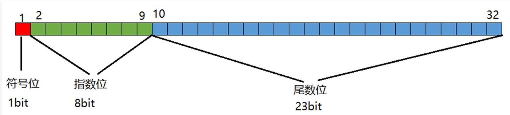

1. 符号位：`0`表示`正数`。`1`表示`负数`。

2. 指数位：`8位`。表示`2的多少次方`。

3. 尾数位：`23位`。表示`小数部分的有效数字`。


#### 浮点型数据使用注意事项

1. 一旦有浮点型数据参与运算得出的结果，一定不要使用“==”与其它数字进行“相等比较”

2. 不要这样：

```java title="Java"
double x = 6.9;
double y = 3.0;
double z = x / y;

if(z == 2.3){
    System.out.println("相等");
}
// 输出结果：false
出现这样的结果是因为：z的值是 2.3000000000000003，而 2.3 是double类型，在计算机底层存储的都是它的近似值。
```

3. 可以这样：

```java title="Java"
double x = 6.9;
double y = 3.0;
double z = x / y;

if(z - 2.3 < 0.000001){
    System.out.println("相等");
}
```

**示例代码：**

```java title="Java"
/*
一旦有浮点型数据参与运算得出的结果，一定不要使用“==”与其它数字进行“相等比较”
主要原因是：任何浮点型数据，在计算机底层存储的都是它的近似值。
*/
public class FloatTest03{
	public static void main(String[] args){

		double a = 6.9;

		double b = 3.0;

		double c = a / b;

		System.out.println("c = " + c); // c = 2.3000000000000003

		System.out.println(c == 2.3); // false

		/*
		if(c == 2.3){
			System.out.println("相等");
		}
		*/

		if(c - 2.3 < 0.00000001){
			System.out.println("相等");
		}
	}
}
```
**输出结果：**

```java title="Java"
c = 2.3000000000000003
false
相等
```


### 数据类型-字符型

#### 字符型char

1. 占用`两个字节`，`0~65535`，和short容量相同，但`char可以取更大的整数`

2. `单个字符`，使用`单引号`括起来，**`不能是多个字符`**

3. 可以保存一个`汉字`

4. `char c = ‘’;` 这是`不允许的`

5. `char c = ‘\u0000’;` 这表示`一个空字符`，也是char的默认值。`\u0000`是一个`Unicode码`。

6. **`空字符`与`空格字符`是`不同的`。`空字符`表示`什么也没有`。`空格字符`表示`一个空格`。**

**示例代码：**

```java title="Java"
/*
	char类型：
		1. char类型是字符型。
		2. char类型占用2个字节。
		3. char类型取值范围：0-65535
			char和short都是2个字节。
			char可以取到更大的正整数。
			char和short所能表示的数量是一样的。
		4. 在java中，字符char类型的字面量必须使用单引号括起来：
			'A' 'a' '中'
		5. 在java中，char类型统一采用的字符编码方式：Unicode编码
		6. 在java中，char可以存储一个汉字。
		7. char的默认值是：\u0000
*/
public class CharTest01{
	public static void main(String[] args){
		char c1 = 'A';
		char c2 = 'B';
		System.out.println(c1);
		System.out.println(c2);
		char c3 = 'a';
		System.out.println(c3);
		char c4 = '中';
		System.out.println(c4);
		
		// 错误：不兼容的类型: String无法转换为char
		//char c5 = "国";

		// 编译错误
		//char c6 = 'ab';
		
		// 错误: 空字符文字
		//char c7 = '';

		char x = '\u0000';
		System.out.print(x + "abc");

	}
}
```

**输出结果：**

```java title="Java"
A
B
a
中
  abc ——> abc前面有一个空格
```

**总结：**

```java title="Java"
char类型变量定义有三种方式
第一种：char c = 'A';
第二种：char c = '\u0041';
第三种：char c = 65;
```


#### 转义字符

1. `\t`: 表示`制表符`，相当于按下`Tab 键`

2. `\n`: 表示`换行符`

3. `\"`: 表示`双引号（"）`

4. `\'`: 表示`单引号（'）`

5. `\\`: 表示`反斜线（\）本身`

6. `\uXXXX`: 表示`Unicode码`。`XXXX`表示`4位16进制数`。表示一个`Unicode字符`。例如：`\u0041`表示`A`。

**示例代码：**

```java title="Java"
/*
转义字符：
\t: 表示制表符，相当于按下 Tab 键
\n: 表示换行符
\": 表示双引号（"）
\': 表示单引号（'）
\\: 表示反斜线（\）本身
*/
public class CharTest02{
	public static void main(String[] args){
		// 这是一个普通的t字符
		char c1 = 't';

		// 按说应该编译报错。因为看到的是一个字符串。不是字符。
		// 但是编译通过了，说明这是1个字符。
		// 这个字符叫做：制表符。tab
		// \ 反斜杠在java语言中具有转义功能。把普通的t字符转义成了制表符tab。
		char c2 = '\t';

		System.out.println("abc" + c2 + "def");

		// \n 换行符
		System.out.print("hello\n");
		System.out.print("world\n");
		System.out.print("test\n\n\n\n\n\n");

		// \"
		// 需求：输出一个双引号到控制台。
		//System.out.println("""); //编译报错
		System.out.println("\""); 
		System.out.println("\"\""); 
		System.out.println('"');


		// 需求：输出一个单引号到控制台
		System.out.println("'");
		// 编译错误
		//System.out.println(''');
		System.out.println('\'');

		// 字符char只能是单个字符。
		//System.out.println('\'\'');

		// 需求：输出一个反斜杠到控制台。 \
		//System.out.println("\"); // 编译错误

		// 在java中两个 \\ ，最终转换完成之后是一个普通的 \ 字符。
		System.out.println("\\");

		System.out.println("\\\\");
	}
}
```

**输出结果：**

```java title="Java"
abc	def
hello
world
test
1 // 5个换行符
2
3
4
5 // 5个换行符
"
""
"
'
'
\
\\
```


#### 字符编码

1. 字符编码是人为规定的`文字`与`二进制`之间的`转换关系`。

2. 在早期计算机系统中，字符编码主要采用的是 `ASCII 编码`，采用`1个字节编码`。`最多`可以表示`256个字符`。（实际上`ASCII码表只用了128个`。），程序员需要记住这几个:

```java title="Java"
a 对应ASCII码 97（b是98，以此类推）

A 对应ASCII码 65（B是66，以此类推）

0 对应ASCII码 48（1是49，以此类推）
```

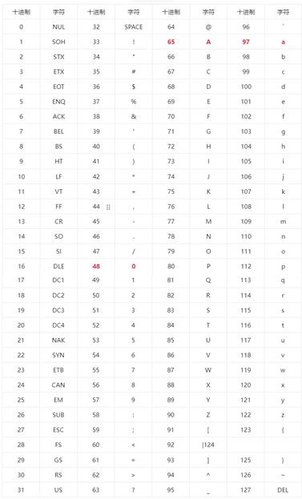

**编码和解码过程：**

1. 编码：把`字符`转换成`二进制`。

2. 解码：把`二进制`转换成`字符`。

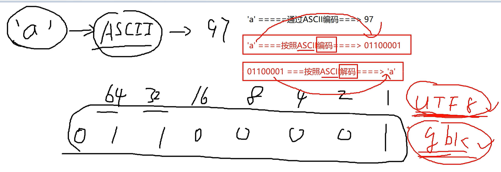


#### 什么是编码？什么是解码？乱码是怎么产生的？(了解)

1. 字符在计算机系统中，`解码（Decoding）`和`编码（Encoding）`是两个常用的概念，分别表示`将二进制数据转换为字符`和`将字符转换为二进制数据`。

2. `编码`是`将字符转换为二进制数据的过程`。`解码`是`将二进制数据转换为字符的过程`。例如：

```java title="Java"
'a' ---------按照ASCII码表编码-----------> 01100001

01100001 --------按照ASCII码表解码------------> 'a'
```

3. `乱码`是指`在字符编码和解码的过程中，由于编码和解码所采用的字符集不一致`，或者编码和解码所采用的字符集不支持某些字符，导致最终显示的字符与原始字符不一致。为了避免乱码的问题，我们需要统一使用一个字符集，并且在进行字符编码和解码时要保持一致。


#### 常见的字符编码(了解)

1. ASCII 编码（American Standard Code for Information Interchange：美国信息交换标准编码）：采用1个字节编码，包括字母、数字、符号和控制字符等。 

2. Latin-1编码（ISO 8859-1），采用`1个字节编码`。该编码方式是为了表示欧洲语言（如荷兰语、西班牙语、法语、德语等）中的字符而设计的，共支持 256 个字符。

3. ANSI 编码（American National Standards Institute：美国国家标准协会）：采用`1个字节编码`，支持英文、拉丁文等字符。两个ANSI码可以表示一个汉字。 

4. Unicode 编码：可表示所有语言的字符。采用`了十六进制表示`，占用 2 个字节或 4 个字节，最多可表示超过一百万个字符。 （使用这种方式是有点浪费空间的，例如**`英文字符'a'`其实`采用一个字节存储`就够了**。）

5. UTF-8 编码（Unicode Transformation Format，8-bit）：`基于 Unicode 编码的可变长度字符编码`，能够支持多语言和国际化的需求，使用 1~4 个字节来表示一个字符，是目前 Web 开发中最常用的字符编码方式。 （`一个英文字母1个字节，一个汉字3个字节`。）

6. UTF-16 编码：`基于 Unicode 编码的可变长度字符编码`，使用 `2 或 4 个字节来表示一个字符`，应用于很多较早的系统和编程语言中。 （一个英文字母2个字节。一个汉字4个字节。）

7. UTF-32编码：`基于Unicode编码的固定长度字符编码`，其特点是`每个字符占用4个字节`。


#### 常见的字符编码(了解)

1. GB2312 编码（小）：是中国国家标准的简体中文字符集，使用 `2 个字节来表示一个汉字`，是 `GBK 编码的前身`。 

2. GBK 编码（Guo Biao Ku）（中）：是针对中文设计的一个汉字编码方式，使用 `2 个字节来表示一个汉字`，能够`表示中国内地的所有汉字`。 

3. GB18030编码（大）：是中国国家标准GB 18030-2005《信息技术 中文编码字符集》中规定的字符集编码方案，用于取代GB2312和GBK编码。

4. Big5 编码（大五码）：是`台湾地区的繁体中文字符集`，使用 `2 个字节来表示一个汉字`，适用于`使用繁体中文的应用场景`。

> **每种编码方式都有其特点和适用场景。在进行软件开发、网站开发和数据存储时，需要根据实际情况选择适合的编码方式。**


#### Unicode码表的一部分

Unicode码表的一部分如下所示：

网络上也有很多在线转码工具，例如：`http://www.jsons.cn/unicode/`

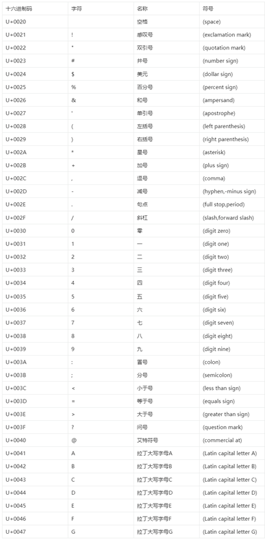

**示例代码：**

```java title="Java"
// Java采用的是：Unicode编码
// 大总结：当整数型字面量没有超出byte short char的范围，可以直接将其赋值给byte short char类型的变量。
// char类型变量定义有三种方式
// 第一种：char c = 'A';
// 第二种：char c = '\u0041';
// 第三种：char c = 65;
public class CharTest03{
    public static void main(String[] args){

        char c1 = 'A';
        System.out.println(c1);

        // \\u 后面是一个十六进制的数字，这个十六进制是字符对应的Unicode码
        // 表面看是一个字符串，实际上只是一个字符。
        char c2 = '\u0041';
        System.out.println(c2);

        // 当整数型字面量没有超出char的取值范围，可以直接将其赋值给char类型的变量。
        // 当声明char类型变量的时候，如果值是一个整数型字面量，那么这个字面量会被当做ASCII码值来处理。
        char c3 = 97;
        char c4 = 65535;
        //char c5 = 65536; // 错误的。
        byte b = 1;
        short s = 1;
        System.out.println(c3); // 'a'

        char x = '\u4e2d';
        System.out.println(x);

    }
}
```

**输出结果：**

```java title="Java"
A
A
a
中
```


#### char参与的运算

1. Java中允许将一个`整数`赋值给`char类型`变量，但这个`整数会被当做ASCII码值`来处理

2. **需要特别注意的是，`这个码值有要求`，`不能超出char的取值范围*`*

3. 只要`没有超出byte short char的取值范围`，是可以`直接赋值给byte short char类型变量`的

4. System.out.println('a' + 1);结果是什么？

```java title="Java"
System.out.println('a' + 1); // 98

a表示字符'a'的ASCII码值97，1表示整数1。
```

5. char c = 'a' + 1;结果是什么？

```java title="Java"
char c = 'a' + 1; // 'b'

a表示字符'a'的ASCII码值97，1表示整数1。
97 + 1 = 98
98对应的字符是'b'
```

6. 以下程序结果是什么？

```java title="Java"
byte b = 1;
short s = 1;
char c = 1;
short num = b + s + c;
```
**运行结果：**

```java title="Java"
编译错误

不兼容的类型: 从int转换到short可能会有损失精度

第一种修改方式：

int num = b + s + c;

第二种修改方式：

short num = (short)(b + s + c);
```


7. byte short char混合运算时，各自会先转换成int再做运算!!!!!

**示例代码：**

```java title="Java"

// char参与的运算
public class CharTest04{
	public static void main(String[] args){
		
		/*
			有一个运算规则需要记住：
				byte short char混合运算的时候，各自先转换成int再做运算。
		*/
		System.out.println('a' + 1); // 98

		char x = 'a' + 1;
		System.out.println(x); // 'b'

		byte b = 1;
		short s = 1;
		char c = 1;
		//short num = b + s + c;

		// 第一种修改方式
		// int num = b + s + c;

		// 第二种修改方式
		short num = (short)(b + s + c);

		System.out.println(num);

		/*
			多种数据类型混合运算的时候，各自先转换成最大的再做运算。
		*/
		int k = 100;
		short e = 200;
		long f = 300L;
		double d = 3.0;

		// 错误的
		//long result = k + e + f + d;

		double result = k + e + f + d;

		System.out.println(result);

	}
}
```

**输出结果：**

```java title="Java"
98
b
3
603.0
```


#### boolean类型

1. boolean类型只有两个值：`true、false`。`没有其它值，没有0和1这一说`。

2. 通常用于表示一些逻辑上的真假值，并在程序中进行逻辑控制，例如以下代码：

```java title="Java"
boolean gender = true;

if(gender){
    System.out.println("男");
}else{
    System.out.println("女");
}
```

**示例代码：**

```java title="Java"

/*
	布尔型：boolean
		1. 在java中。boolean值只有两个true false，没有1和0这一说。
		2. boolean类型的数据主要用在哪里呢？
			逻辑判断，条件判断....
*/
public class BooleanTest01{
	public static void main(String[] args){
		
		// 不兼容的类型: int无法转换为boolean
		//boolean flag = 1;

		boolean flag = true;

		boolean gender = false;

		if(gender){
			System.out.println("男士");
		}else{
			System.out.println("女士");
		}

		int a = 1000;
		int b = 200;

		System.out.println(a > b);

		if(a > b){
			System.out.println(a + ">" + b);
		}else{
			System.out.println(a + "<" + b);
		}

	}
}
```

**输出结果：**

```java title="Java"
女士
true
1000>200
```


### 数据类型-作业题

1. 请定义合理的变量用来存储个人信息（姓名、年龄、性别、联系电话），并编写程序定义这些变量，给变量赋值，并打印输出。输出效果如下

姓名		年龄		性别		联系电话
张三		20		男		12545457585
李四		30		女		15622525855

**示例代码：**

```java title="Java"
public class DataTypeHomework01{
	public static void main(String[] args){
		Sting name = "张三";
		int age1 = 20;
		char gender1 = '男';
		String tel1 = "12545457585";

		Sting name = "李四";
		int age2 = 30;
		char gender2 = '女';
		String tel2 = "15622525855";

		System.out.println("姓名\t年龄\t性别\t联系电话");

		System.out.println(name + "\t" + age1 + "\t" + gender1 + "\t" + tel1);

		System.out.println(name + "\t" + age2 + "\t" + gender2 + "\t" + tel2);
	}
}
```
**输出结果：**

```java title="Java"
姓名	年龄	性别	联系电话
张三	20	    男	  12545457585
李四	30	    女	  15622525855
```


2. 有`两个变量a和b`，`a变量`中存储的`数据100`，`b变量`中存储的`数据200`，请编写程序`交换两个变量中的数据`。让`a变量存储200`，让`b变量存储100`。并且`计算两个int类型数据的和`，要求`最终输出200+100=300`的效果。

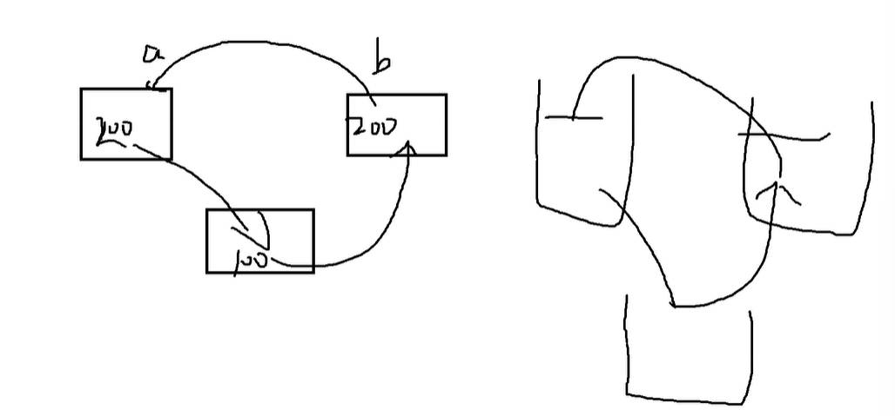

**示例代码：**

```java title="Java"
public class DataTypeHomework02{
	public static void main(String[] args){
		int a = 100;
		int b = 200;
	
		// 交换两个变量中的数据
		int temp = a;
		a = b;
		b = temp;

		int result = a + b;

		System.out.println(a + "+" + b + "=" + result);
		// System.out.println(a+ "+需要变量动态的插入=" + result ); 

		简单实现一个登录功能
		String username = "jackson";
        
		// 掌握字符串的拼接技巧。（将变量拼接到一个字符串当中。）
		System.out.println("登录成功，欢迎 " + name + " 回来");

	}
}
```
**输出结果：**

```java title="Java"
200+100=300
登录成功, 欢迎jackson回来
```

3. 请分析以下程序中哪些是可以编译通过的，哪些是报错的

> **总结：`基本数据类型转换规则`**

1. 八种基本数据类型中除了boolean类型之外，剩下7个都是可以互相转换的。

2. 小容量可以自动转换成大容量，称为自动类型转换，容量从小到大排序：
		byte < short < int < long < float < double
		       char  <
3. 大容量不能自动转换成小容量，必须添加强制类型转换符，编译才能通过。但是运行时可能损失精度。

4. 当整数型字面量没有超出byte short char的范围时，可以直接将其赋值给byte short char类型的变量。

5. byte short char混合运算时，各自先转换成int再做运算。

6. 多种数据类型混合运算时，各自先转换成最大的容量，再做运算。

```java title="Java"
/*
总结：基本数据类型转换规则
	1.八种基本数据类型中除了boolean类型之外，剩下7个都是可以互相转换的。
	2.小容量可以自动转换成大容量，称为自动类型转换，容量从小到大排序：
		byte < short < int < long < float < double
		       char  <
	3.大容量不能自动转换成小容量，必须添加强制类型转换符，编译才能通过。但是运行时可能损失精度。
	4.当整数型字面量没有超出byte short char的范围时，可以直接将其赋值给byte short char类型的变量。
	5.byte short char混合运算时，各自先转换成int再做运算。
	6.多种数据类型混合运算时，各自先转换成最大的容量，再做运算。
*/
public class DataTypeHomework03{
	public static void main(String[] args){
		// 通过
		short s = 100;
		// 报错：大容量不能直接赋值给小容量
		s = s - 99;
		// 通过
		byte b = 100;
		// 报错
		b = b + 1;
		// 通过
		char c = 'a';
		// 通过
		int i = 20;
		// 通过
		float f = .3F;
		// 通过
		double d = c + i + f;
		// 通过
		byte b1 = 11;
		// 通过
		short s1 = 22;
		// 报错
		short x = b1 + s1;
	}
}
```

## 键盘录入_Scanner

```java
1.概述:是java定义好的一个类
2.作用:将数据通过键盘录入的形式放到代码中参与运行 
3.位置:java.util
4.使用:
  a.导包:通过导包找到要使用的类 -> 导包位置:类上
    import java.util.Scanner -> 导入的是哪个包下的哪个类
      
  b.创建对象
    Scanner 变量名 = new Scanner(System.in);

  c.调用方法,实现键盘录入
    变量名.nextInt() 输入整数int型的
    变量名.next() 输入字符串  String型的  
```

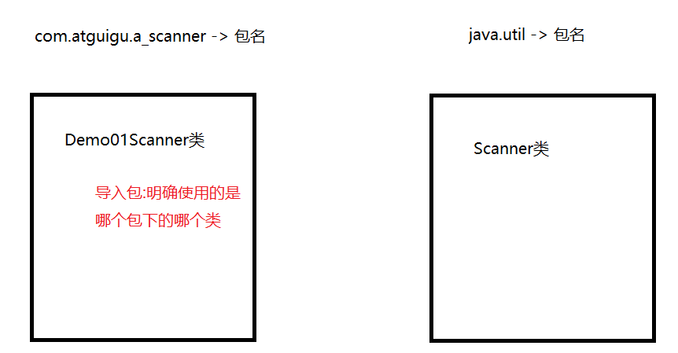

**示例代码：**
```java
public class Demo01Scanner {
    public static void main(String[] args) {
        //创建对象
        Scanner sc = new Scanner(System.in);
        //录入int型整数
        int data1 = sc.nextInt();
        System.out.println("data1 = " + data1);

        //录入String型字符串
        String data2 = sc.next();
        System.out.println("data2 = " + data2);
    }
}

====================================================
public class Demo02Scanner {
    public static void main(String[] args) {
        //创建对象
        Scanner sc = new Scanner(System.in);
        //录入int型整数
        int old1 = sc.nextInt();
        int old2 = sc.nextInt();
        int old3 = sc.nextInt();

        int temp = old1>old2?old1:old2;
        int max = temp>old3?temp:old3;
        System.out.println(max);
    }
}
    
```

> ```java
> 变量名.next():录入字符串 -> 遇到空格和回车就结束录入了
> 变量名.nextLine():录入字符串 -> 遇到回车就结束录入了
> ```
>
> ```java
> public class Demo03Scanner {
>     public static void main(String[] args) {
>         Scanner sc = new Scanner(System.in);
>         String data1 = sc.next();
>         String data2 = sc.nextLine();
>         System.out.println(data1);
>         System.out.println(data2);
>     }
> }
> ```
>
> ```java
> Exception in thread "main" java.util.InputMismatchException -> 输入类型不匹配异常
> 	at java.base/java.util.Scanner.throwFor(Scanner.java:939)
> 	at java.base/java.util.Scanner.next(Scanner.java:1594)
> 	at java.base/java.util.Scanner.nextInt(Scanner.java:2258)
> 	at java.base/java.util.Scanner.nextInt(Scanner.java:2212)
> 	at com.atguigu.a_scanner.Demo04Scanner.main(Demo04Scanner.java:8)
>     
> 原因:录入的数据和要求的数据类型不一致    
> ```
>

## 运算符-概述

**算术运算符：+、-、*、/、%、++、-- (重点)**

**关系运算符：==、!=、>、>=、<、<= (重点)**

**逻辑运算符：&、|、!、&&、|| (重点)**

**按位运算符：&、|、^、~、<<、>>、>>> (重点)**

**赋值运算符：=、+=、-=、*=、/=、%=、&=、|=、^=、<<=、>>=、>>>= (重点)**

**条件运算符：?: (重点)**

instanceof运算符：instanceof (了解, Java面向对象学习)

new运算符：new (了解, Java面向对象学习)

.运算符：. (了解, Java方法学习)

> **注意：运算符有`优先级`，关于优先级不需要记忆，不确定的`添加小括号`，添加小括号的`优先级高`，会先`执行`**


### 算术运算符

1. + ：求和、字符串拼接、正数

```java title="Java"
int a = 10;
int b = +3;
int c = a + b;
System.out.println(a + "+" + b + "=" + c);

输出：10+3=13
```

2. - ：相减、负数

```java title="Java"
int d = 10;
int e = -3;
int f = d - e;
System.out.println(d + "-(" + e + ")=" + f); // 13

输出：10-(-3)=13
```

3. * ：乘积

```java title="Java"
int x = 10;
int y = 3;
System.out.println(x + "*" + y + "=" + x * y); // 30

输出：10*3=30
```

4. / ：商（除法）

```java title="Java"
int m = 10;
int n = 3;
System.out.println(m + "/" + n + "=" + m / n); // 3

输出：10/3=3
```

5. % ：取模（求余数）

```java title="Java"
int x = 10;
int y = 3;
System.out.println(x % y); // 1

输出：1
```

6. 取模公式：x - x / y * y

```java title="Java"
// x - x / y * y
// -10 - (-10) / 3 * 3
// -10 - (-3) * 3
// -10 - (-9)
// -10 + 9
// -1
x = -10;
System.out.println(x % y); // -1

输出：-1


// x - x / y * y
// 10 - 10 / (-3) * (-3)
// 10 - (-3) * (-3)
// 10 - 9
// 1
x = 10;
y = -3;
System.out.println(x % y); // 1

输出：1
```

7. ++ ：自加1

```java title="Java"
int i = 10;
// 一元运算符
i++;
System.out.println("i = " + i); // 11

输出：i = 11
```

8. -- ：自减1

```java title="Java"
i = 100;
i--;
System.out.println("i = " + i); // 99

输出：i = 99
```

**示例代码:**

```java title="Java"
/*
	算术运算符：
		1. 算术运算符包括哪些？
			+ ： 求和，字符串拼接，正数
			- ： 相减，负数
			* ： 乘积
			/ ： 商（除以）
			% ： 取模（求余数）
					取模公式：x - x / y * y
			++ ：让变量自身加1
			-- ：让变量自身减1
*/
public class OperatorTest01{
	public static void main(String[] args){
		
		int a = 10;
		int b = +3;
		int c = a + b;
		System.out.println(a + "+" + b + "=" + c);

		int d = 10;
		int e = -3;
		int f = d - e;
		System.out.println(d + "-(" + e + ")=" + f);

		/*
		int x = 10;
		int y = 3;
		System.out.println(x + "*" + y + "=" + x * y);
		*/

		int m = 10;
		int n = 3;
		System.out.println(m + "/" + n + "=" + m / n);
		
		int x = 10;
		int y = 3;
		System.out.println(x % y); // 1

		// x - x / y * y
		// -10 - (-10) / 3 * 3
		// -10 - (-3) * 3
		// -10 - (-9)
		// -10 + 9
		// -1
		x = -10;
		System.out.println(x % y); // -1


		// x - x / y * y
		// 10 - 10 / (-3) * (-3)
		// 10 - (-3) * (-3)
		// 10 - 9
		// 1
		x = 10;
		y = -3;
		System.out.println(x % y); // 1

		int i = 10;
		// 一元运算符
		i++;
		System.out.println("i = " + i); // 11

		i = 100;
		i--;
		System.out.println("i = " + i); // 99

	}
}
```

**输出结果:**

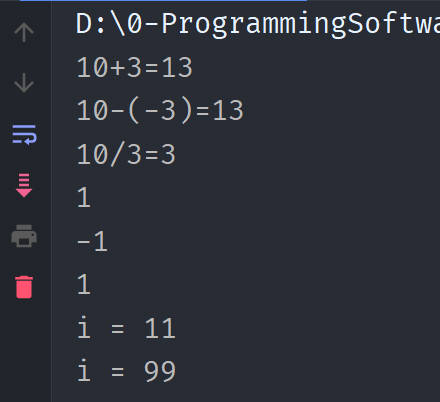


#### ++ 自加1 和 -- 自减1 (面试重点)

1. ++ 可以出现在变量前，也可以出现在变量后。

++i; 可以
i++; 也可以

像++这种运算符，只有一边有操作数，我们把这种运算符称为：一元运算符。

a + b，这里的+两边有两个操作数，所以这种运算符被称为：二元运算符。

2. 无论++出现在变量前，还是变量后，执行结束后，都会让变量中的值自加1.

3. 当 ++ 出现在变量后？？？？

先赋值后自加1

4. 当 ++ 出现在变量前？？？？

先自加1后赋值

**示例代码:**

```java title="Java"
/*
++ 自加1
-- 自减1

1. ++ 可以出现在变量前，也可以出现在变量后。
		++i; 可以
		i++; 也可以

		像++这种运算符，只有一边有操作数，我们把这种运算符称为：一元运算符。

		a + b，这里的+两边有两个操作数，所以这种运算符被称为：二元运算符。

2. 无论++出现在变量前，还是变量后，执行结束后，都会让变量中的值自加1.

3. 当 ++ 出现在变量后？？？？
		先赋值后自加1

4. 当 ++ 出现在变量前？？？？
		先自加1后赋值。	
*/
public class OperatorTest02{
	public static void main(String[] args){
		int i = 10;
		i++;
		System.out.println("i = " + i); // 11

		int a = 10;
		++a;
		System.out.println("a = " + a); // 11

		int k = 10;
		int f = k++; // 运算原理：先将k中的值赋值给f，然后k变量自己再加1
		System.out.println("k = " + k); // 11
		System.out.println("f = " + f); // 10

		int e = 100;
		int x = ++e;
		System.out.println("e = " + e); // 101
		System.out.println("x = " + x); // 101

		int y = 100;
		System.out.println(y++); // 100
		System.out.println(y); // 101

		int z = 100;
		System.out.println(++z); //101
		System.out.println(z); //101
	}
}

/*
PrintStream中的源码：
public void println(int x) {
        if (getClass() == PrintStream.class) {
            writeln(String.valueOf(x));
        } else {
            synchronized (this) {
                print(x);
                newLine();
            }
        }
    }
*/
```

**输出结果:**

```java title="Java"
i = 11
a = 11
k = 11
f = 10
e = 101
x = 101
100
101
101
101
```

#### 栈数据结构（Stack）

> **栈结构特点：**

1. 先进后出

2. 后进先出

> **相关术语：**

1. 入栈、压栈、push

2. 出栈、弹栈、pop

3. 栈帧

4. 栈顶、栈底

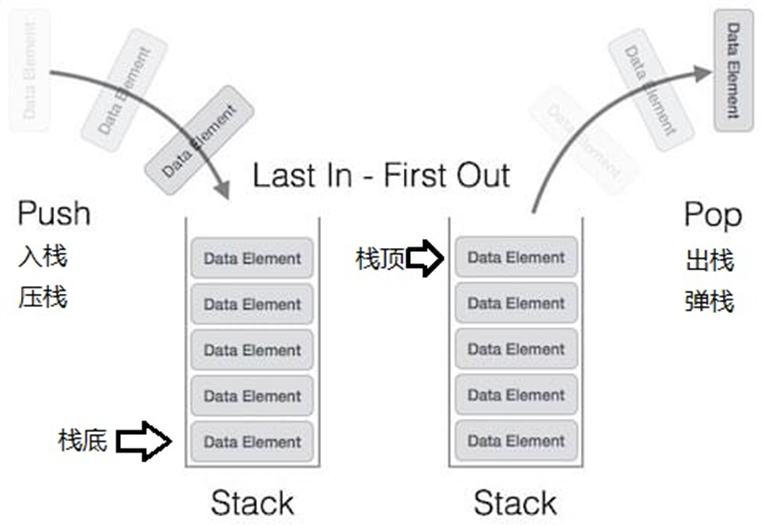

##### 字节码解读

1. 查看字节码的命令：javap -c 字节码文件

2. 查看以下程序的字节码

```java title="Java"
public class ReadClass{
    	public static void main(String[] args){
        	int i = 10;
            int j = i;
            j++;
    }
}

字节码解读：
/*
Compiled from "ReadClass.java"
public class ReadClass {
  public ReadClass();
    Code:
       0: aload_0
       1: invokespecial #1                  // Method java/lang/Object."<init>":()V
       4: return

  public static void main(java.lang.String[]);
    Code:
       0: bipush        10
       2: istore_1
       3: iload_1
       4: istore_2
       5: iinc          2, 1
       8: return
}
*/
1. bipush 10：将字面量压入操作数栈

2. istore_1：将操作数栈顶的10弹出，然后将其存放到局部变量表的第1个位置

3. iload_1：将局部变量表的第1个位置的数据压入操作数栈

4. istore_2：将操作数栈顶的11弹出，然后将其存放到局部变量表的第2个位置

5. iinc 2, 1：将局部变量表的第2个位置数据加1，然后存放到局部变量表的第2个位置

6. return：结束方法
```

3. 查看字节码：javap -c ReadClass.class

4. **字节码指令：(重点)**

> **bipush指令：将字面量压入操作数栈**

> **istore_1指令：将操作数栈中顶部数据弹出，然后将该数据存放到局部变量表的第1个位置**

> **iload_1指令：将局部变量表1号槽位的数据压入操作数栈**

> **iinc指令：将局部变量表中第1个位置数据加1**

5. 什么是局部变量表和操作数栈？

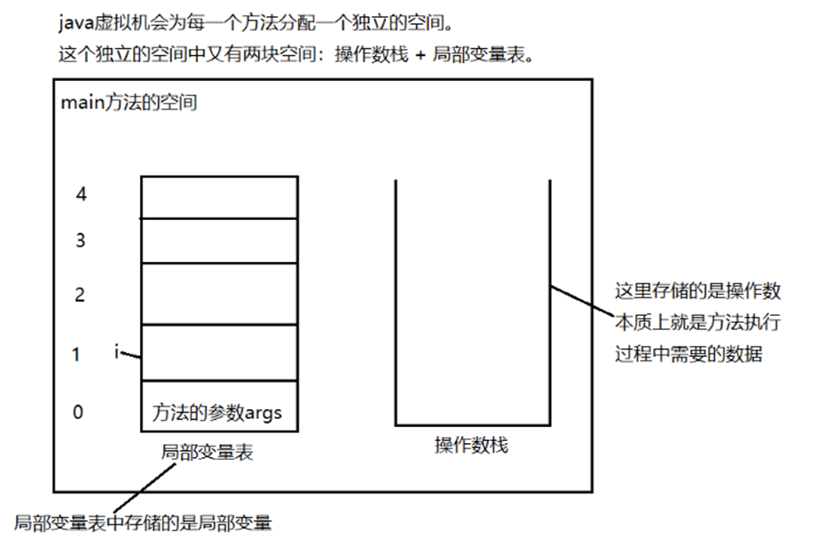

6. 字节码原理演示

> **字节码指令：**

1. bipush        10

2. istore_1

3. iload_1

4. istore_2

5. iinc          2, 1

6. return

> **字节码指令执行过程：**

1. bipush 10：将字面量压入操作数栈

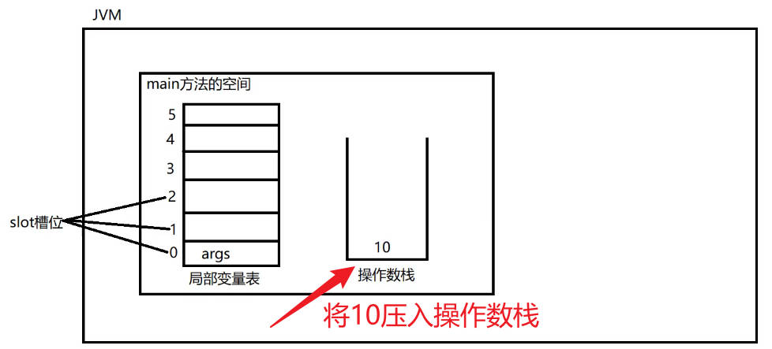

2. istore_1：将操作数栈顶的10弹出，然后将其存放到局部变量表的第1个位置

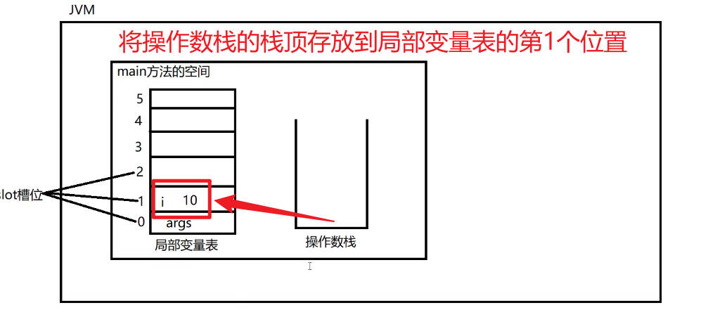

3. iload_1：将局部变量表的第1个位置的数据压入操作数栈

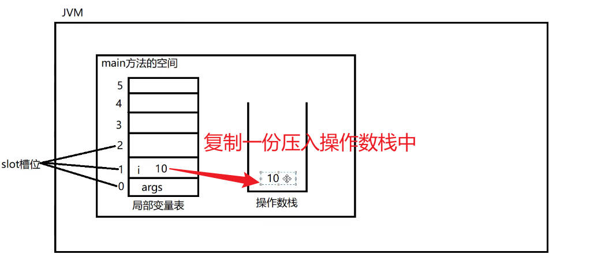

4. istore_2：将操作数栈顶的10弹出，然后将其存放到局部变量表的第2个位置

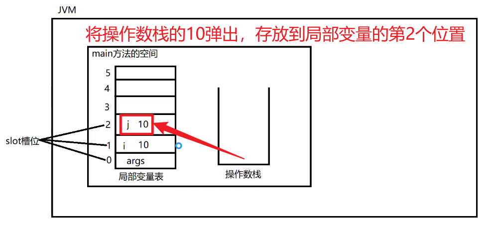

5. iinc 2, 1：将局部变量表的第2个位置数据加1，然后存放到局部变量表的第2个位置

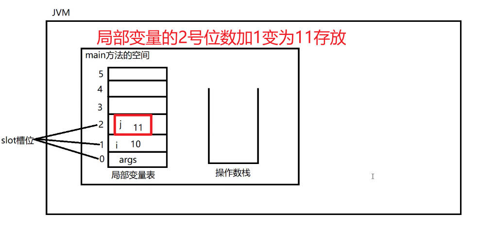

6. return：结束方法

**示例代码:**

```java title="Java"
例1：
public class ReadClass01 {
    public static void main(String[] args) {
        int i = 10;


    }
}

/*
Compiled from "ReadClass01.java"
public class ReadClass01 {
  public ReadClass01();
    Code:
       0: aload_0
       1: invokespecial #1                  // Method java/lang/Object."<init>":()V
       4: return

  public static void main(java.lang.String[]);
    Code:
       0: bipush        10
       2: istore_1
       3: return
}
*/


例2：
public class ReadClass02 {
    public static void main(String[] args) {
        int i = 10;
        int j = i;
    }
}

/*
Compiled from "ReadClass02.java"
public class ReadClass02 {
  public ReadClass02();
    Code:
       0: aload_0
       1: invokespecial #1                  // Method java/lang/Object."<init>":()V
       4: return

  public static void main(java.lang.String[]);
    Code:
       0: bipush        10
       2: istore_1
       3: iload_1
       4: istore_2
       5: return
}
*/


例3：
public class ReadClass03 {
    public static void main(String[] args) {
        int i = 10;
        int j = i;
        j++;
    }
}

/*
Compiled from "ReadClass03.java"
public class ReadClass03 {
  public ReadClass03();
    Code:
       0: aload_0
       1: invokespecial #1                  // Method java/lang/Object."<init>":()V
       4: return

  public static void main(java.lang.String[]);
    Code:
       0: bipush        10
       2: istore_1
       3: iload_1
       4: istore_2
       5: iinc          2, 1
       8: return
}
*/


例4：
public class ReadClass04 {
    public static void main(String[] args) {
        int i = 10;
        int j = i++;
    }
}

/*
Compiled from "ReadClass04.java"
public class ReadClass04 {
  public ReadClass04();
    Code:
       0: aload_0
       1: invokespecial #1                  // Method java/lang/Object."<init>":()V
       4: return

  public static void main(java.lang.String[]);
    Code:
       0: bipush        10
       2: istore_1
       3: iload_1
       4: iinc          1, 1
       7: istore_2
       8: return
}
*/


例5：
public class ReadClass05 {
    public static void main(String[] args) {
        int i =10;
        int j = ++i;
    }
}

/*
Compiled from "ReadClass05.java"
public class ReadClass05 {
  public ReadClass05();
    Code:
       0: aload_0
       1: invokespecial #1                  // Method java/lang/Object."<init>":()V
       4: return

  public static void main(java.lang.String[]);
    Code:
       0: bipush        10
       2: istore_1
       3: iinc          1, 1
       6: iload_1
       7: istore_2
       8: return
}
*/
```


#### 算术运算符作业

> **题目1：采用字节码解读的方式分析以下`代码的区别`**

```java title="Java"
int i = 10;
int k = i++;

先赋值后自加1

int i = 10;
int k = ++i;

先自加1后赋值
```

> **题目2：以下程序`输出结果`是？**

```java title="Java"
int a = 5;
int b = a++;
b = a++;
System.out.println("a = " + a); // 7
System.out.println("b = " + b); // 6

int c = 10;
int d = --c;
System.out.println("c = " + c); // 9
System.out.println("d = " + d); // 9
```

题目3：以下程序输出结果是？

```java title="Java"
int i = 10;
int k = i++ + ++i;
System.out.println(k); // 22
1. i++ 先自加1，然后赋值给k
2. ++i 先自加1，然后赋值给k
3. 所以k = 10 + 12 = 22


int f = 10;
int m = f++ +f;
System.out.println(m); // 21
1. f++ 先自加1，然后赋值给m
2. f 再自加1，然后赋值给m
3. 所以m = 10 + 11 = 21

System.out.println(f); // 11
1. f++ 先自加1，然后赋值给f
2. 所以f = 11
```

> **题目4：以下程序输出结果是？`经典面试题`**

```java title="Java"
int i = 10;
i = i++;
System.out.println(i); // 10
（底层实现原理，实际上是找了一个临时的变量，将10先存起来一份。再做  ++，然后将10再重新覆盖掉11）

/*
	int j = 10;
	int temp = j;
	j++;
	j = temp;
*/
/*
    0: bipush       10
    2: istore_1
    3: iload_1
    4: iinc        1, 1
    7: istore_1
}
*/


int i = 10;
i = ++i;
System.out.println(i); // 11
```

> **题目5：从键盘上接收一个整数三位数，请分别输出它的个位、十位、百位。**

```java title="Java"
/*
题目5：从键盘上接收一个整数三位数，请分别输出它的个位、十位、百位。
*/
public class OperatorHomework04 {
    public static void main(String[] args) {
        java.util.Scanner scanner = new java.util.Scanner(System.in);
        System.out.println("请输入一个三位数: ");
        int num = scanner.nextInt();

        System.out.println("个位：" + num % 10); // 取余数
        System.out.println("十位：" + num / 10 % 10); // 取商和余数
        System.out.println("百位：" + num / 100); // 取商
    }
}
```
**输出结果:**
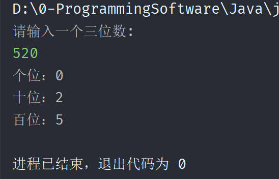


> **题目6：681分钟是多少个小时+多少分钟。**

```java title="Java"
/*
题目6：681分钟是多少个小时+多少分钟。
*/
public class OperatorHomework05 {
    public static void main(String[] args) {
        int total = 681;

        int h = total / 60; // 取商

        int m = total % 60; // 取余数

        System.out.println(total + "分钟是" + h + "小时" + m + "分钟");
    }
}
```
**输出结果:**

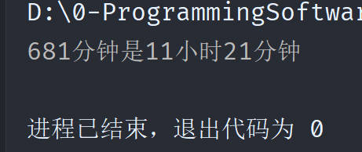


### 关系运算符

1. 关系运算符又叫做`比较运算符`。包括：`>、 >=、 <、 <=、 ==、 !=`

2. 所有关系运算符的`运算结果都是布尔类型`，`不是true，就是false`。

```java title="Java"
/*
	关系运算符：
		>
		>=
		<
		<=
		==
		!=
	
	所有的关系运算符运算结果一定是布尔类型：true/false

	= 赋值运算符
	== 可以比较两个值是否相等

	关系运算符又叫做比较运算符。
*/
public class OperatorTest03{
	public static void main(String[] args){
		int a = 10;
		int b = 10;
		System.out.println(a > b); // false
		System.out.println(a >= b); // true
		System.out.println(a < b); // false
		System.out.println(a <= b); // true
		System.out.println(a == b); // true
		System.out.println(a != b); // false
	}
}
```


### 逻辑运算符

1. **逻辑运算符：`&（逻辑与）`、 `|（逻辑或）`、 `!（逻辑非）`、`^（逻辑异或）`、` &&（短路与）`、 `||（短路或）`**

2. **逻辑运算符特点：`逻辑运算符两边的操作数`要求`必须是布尔类型`，并且最终运算`结果也一定是布尔类型`。**

3. **`逻辑与&`：`两边操作数都是true，结果才是true`。可以翻译为“并且”。**

4. **`逻辑或|`：`两边操作数只要有一个是true，结果就是true`。可以翻译为“或者”。**

5. **`逻辑非!`： `!false就是true，!true就是false`。**

6. **`逻辑异或^`：`咱俩不一样`，`结果`就是`true`。**

7. **`短路与&&`：`和逻辑与&的运算结果相同`。只是存在一种`短路现象`。`（左边操作数为false时，右边操作数不执行）`**

8. **`短路或||`：`和逻辑或|的运算结果相同`。只是存在一种`短路现象`。`（左边操作数为true时，右边操作数不执行）`**

9. 虽然短路与&&效率高于逻辑与&，但逻辑与&也有用武之地，具体看需求是怎样的。

**示例代码:**
```java title="Java"
/*
逻辑运算符
1.逻辑运算符有哪些？ 
	&	逻辑与（并且）   左右两边都是true，结果就是true。只要有一个是false，结果就是false。
	|	逻辑或（或者）	  左右两边只要有一个是true，结果就是true。两边都是false，结果才是false。
	^	逻辑异或		  咱俩不一样，结果就是true。
	!	逻辑非			  !false结果就是true。!true结果就是false。

	&&	短路与（并且）   和逻辑与运算结果是完全相同的，没有区别。只不过&&存在短路现象。（左边是false发生短路现象。）
	||	短路或（或者）   和逻辑或运算结果是完全相同的，没有区别。只不过||存在短路现象。（左边是true发生短路现象。）

	注意：开发中优先使用短路与和短路或，效率较高。

2. 逻辑运算符的特点：
	逻辑运算符两边的操作数要求是布尔类型。
	并且最终运算结果也是一个布尔类型。

*/
public class OperatorTest04{
	public static void main(String[] args){
		int a = 100;
		int b = 99;

		System.out.println(a > b & a > ++b); // false

		System.out.println(true & true); // true
		System.out.println(true & false); // false
		System.out.println(false & true); // false
		System.out.println(false & false); // false

		System.out.println(true | true); // true
		System.out.println(true | false); // true
		System.out.println(false | true); // true
		System.out.println(false | false); // false

		System.out.println(!false); // true
		System.out.println(!true); // false

		System.out.println(true ^ false); // true
		System.out.println(false ^ true); // true
		System.out.println(true ^ true); // false
		System.out.println(false ^ false); // false

		
		/*
		int x = 99;
		int y = 100;
		// 逻辑与 &
		System.out.println(x > y & x > ++y);
		System.out.println("y = " + y); // 101
		*/

		int x = 99;
		int y = 100;
		// 短路与 &&
		System.out.println(x > y && x > ++y);
		System.out.println("y = " + y); // 100
	}
}
```


### 按位运算符

> **按位运算符用于在`二进制位`级别上`处理整数数据`。主要包括：**

1. 左移 <<

2. 右移 >>

3. 无符号右移 >>>

4. 按位与 &

5. 按位或 |

6. 按位异或 ^

7. 按位取反 ~

> **注意：按位运算符的操作数要求`必须是整数`。否则会`出现编译错误`**


#### 左移 <<

> 它能够将一个二进制数的所有位向左移动指定的位数。左移运算符的运算规则如下：

1. **将二进制数左移n位，相当于将数值乘以2的n次方。**

例如，将二进制数0b1011左移2位，即为0b101100，相当于将11乘以2的2次方（即4），得到44。

2. **`左移运算符不会改变操作数的符号`。`左移后，右补0`。**

无论操作数是正数、负数还是零，左移运算符都只进行位级移动，不会改变符号。

3. **左移运算符会对溢出进行截断。**

4. 应用一下：如何将2快速变成8？(经典面试题)

```java title="Java"
/*
经典面试题：怎么让2快速变成8？
*/
int x = 2;

//System.out.println(x * 4);

System.out.println(x << 2);
```

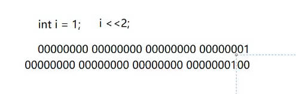


**示例代码:**

```java title="Java"
/*
	按位运算符：
		1. 左移运算符 <<

		2. 规则：
			左移n位，结果是乘以2的n次方。
		
		3. 溢出的会被截断。右侧补0.

		4. 左移的时候符号位不变。

		5. 注意：任何位运算符，操作的都是补码。
*/
public class OperatorTest05{
	public static void main(String[] args){
		
		/*
			原码：00000000 00000000 00000000 00000001
			反码：00000000 00000000 00000000 00000001
			补码：   00000000 00000000 00000000 00000001
			左移3位：00000 00000000 00000000 00000001000（补码）
		*/
		int a = 1;
		System.out.println(a << 3); // 8（1 * 2的3次方）
		
		/*
			原码：00000000 00000000 00000000 10000000
			反码：00000000 00000000 00000000 10000000
			补码：   00000000 00000000 00000000 10000000
			左移2位：000000 00000000 00000000 1000000000
		*/
		int b = 128;
		System.out.println(b << 2); // 512（128 * 2的2次方）

		
		/*
			原码：10000000 00000000 00000000 01100100
			反码：11111111 11111111 11111111 10011011
			补码：   11111111 11111111 11111111 10011100
			左移2位：111111 11111111 11111111 1001110000（补码）
			原码：   100000 00000000 00000000 0110010000
		*/
		int c = -100;
		System.out.println(c << 2); // -400（-100 * 2的2次方）


		/*
			经典面试题：怎么让2快速变成8？
		*/
		int x = 2;

		//System.out.println(x * 4);

		System.out.println(x << 2);

	}
}
```

**输出结果:**

```java title="Java"
8
512
-400
```

#### 右移 >>

> **它能够将一个二进制数的所有位向右移动指定的位数。右移运算符的运算规则如下：**

1. 将二进制数右移n位，相当于将数值除以2的n次方。

例如，将二进制数0b101100右移2位，即为0b1011，相当于将44除以2的2次方（即4），得到11。

2. 右移运算符对正数、负数和零的处理方式不同。

**对于正数，符号位不变，右移时左补0**

**对于负数，符号位不变，右移时左补1。**

**对于零，右移运算符操作后结果仍为零。**

3. 右移运算符会对溢出进行截断。


**示例代码:**

```java title="Java"
/*
右移运算符 >>

	它能够将一个二进制数的所有位向右移动指定的位数。右移运算符的运算规则如下：

		1. 将二进制数右移n位，相当于将数值除以2的n次方。

		2. 右移运算符对正数、负数和零的处理方式不同。
			对于正数，符号位不变，右移时左补0
			对于负数，符号位不变，右移时左补1。
			对于零，右移运算符操作后结果仍为零。

		3. 右移运算符会对溢出进行截断。

*/
public class OperatorTest06{
	public static void main(String[] args){
		/*
			原码：00000000 00000000 00000000 00000001
			反码：00000000 00000000 00000000 00000001
			补码：   00000000 00000000 00000000 00000001
			右移1位：000000000 00000000 00000000 0000000
		*/
		int a = 1;
		System.out.println(a >> 1); // 0

		/*
			00000000 00000000 0000000 10000000
			000000000000 00000000 0000000 1000
		*/
		int b = 128;
		System.out.println(b >> 4); // 8

		/*
			原码：10000000 00000000 00000000 10000000
			反码：11111111 11111111 11111111 01111111
			补码：11111111 11111111 11111111 10000000
			右移：111111111111 11111111 11111111 1000（补码）
			原码：100000000000 00000000 00000000 1000
		*/
		int c = -128;
		System.out.println(c >> 4); // -8
	}
}
```

**输出结果:**

```java title="Java"
0
8
-8
```

#### 无符号右移 >>>

**它能够将一个二进制数的所有位向右移动指定的位数，而`不考虑符号位`。无符号右移运算符的运算规则如下：**

1. 将二进制数右移n位，相当于将`数值除以2的n次方`，并将`最高位填充为0`。

2. 任意一个数字经过无符号右移之后，最终结果一定是非负数（0或正整数）

3. 无符号右移运算符对溢出进行截断。

**示例代码:**

```java title="Java"
/*
无符号右移：>>>
	1. 溢出后的截断。
	2. 无符号右移之后，最终的结果一定是0或者正整数。
	3. 无符号右移之后，左侧补0.（不管是正数还是负数，都是补0）
*/
public class OperatorTest07{
	public static void main(String[] args){
		
		/*
			原码：10000000
			反码：11111111
				  10000000（补码）
			      00100000（无符号右移2位）
		*/
		byte b = -128;
		
		/*
			为什么输出结果不是32？
				b >>> 2。
				byte和int混合运算。会先将byte转换成int，再做运算。
			
			int b = -128;
			原码：10000000 00000000 00000000 10000000
			反码：11111111 11111111 11111111 01111111
			补码：11111111 11111111 11111111 10000000
			右移：0011111111 11111111 11111111 100000（补码）
		*/
		System.out.println(b >>> 2); // 1073741792

		//System.out.println(0b00111111111111111111111111100000); // 1073741792

		// 11100000（补码）
		// 10100000（原码）
		System.out.println((byte)(b >>> 2)); // -32

		/*
			原码：10000000 00000000 00000000 01011010
			反码：11111111 11111111 11111111 10100101
			补码：11111111 11111111 11111111 10100110
			右移：00011111111 11111111 11111111 10100
		*/
		int x = -90;
		System.out.println(x >>> 3);
		System.out.println(0b00011111111111111111111111110100);

		/*
			00000000 00000000 00000000 01011010
			00000000000 00000000 00000000 01011
		*/
		int y = 90;
		System.out.println(y >>> 3); // 11
	}
}
```

**输出结果:**

```java title="Java"
1073741792
-32
536870900
536870900
11
```


#### 按位与 &

**按位与运算符：&**
```java title="Java"
`1&1 -> 1`
`1&0 -> 0`
`0&1 -> 0`
`0&0 -> 0`
```

1. 将两个整数的二进制表示`按位进行与运算`，只有当相应的`二进制位都为1`时，`结果才为1`，`否则结果为0`

```java title="Java"
int a = 32;
int b = 25;
System.out.println(a & b); // 0

a的二进制：00100000
b的二进制：00011001
按位与之后：00000000
```

> **应用一下：请使用`按位与运算符判断`某个数字`是否为奇数`？**

**思路：拿着这个数字和1进行按位与，如果结果是1，则表示该数字为奇数。**

```java title="Java"
/*
怎么判断一个数字是否为奇数？
	第一种方式：对2取模，结果不等于0，表示奇数。
	第二种方式：让这个数字和1进行按位与操作，结果是1，表示是奇数。
		*/
int num = 35;

if(num % 2 != 0){
	System.out.println(num + "是奇数");
}

		/*
			00100011
		  & 00000001
		  -------------
		    00000001
		*/
if((num & 1) == 1){ // 注意运算符优先级问题。
	System.out.println(num + "是奇数");
	// 先计算num & 1，再进行判断。
	// 1 & 1 = 1
}
```


**示例代码:**

```java title="Java"
/*
	按位运算符：
		按位与运算符：&
		1&1 -> 1
		1&0 -> 0
		0&1 -> 0
		0&0 -> 0
*/

public class OperatorTest08{
	public static void main(String[] args){
		// 00100011
		int a = 35;
		// 00011010
		int b = 26;
		/*
			00100011
		&   00011010
		-------------------
		    00000010
		*/
		System.out.println(a & b); // 2

		/*
			怎么判断一个数字是否为奇数？
				第一种方式：对2取模，结果不等于0，表示奇数。
				第二种方式：让这个数字和1进行按位与操作，结果是1，表示是奇数。
		*/
		int num = 35;

		if(num % 2 != 0){
			System.out.println(num + "是奇数");
		}

		/*
			00100011
		  & 00000001
		  -------------
		    00000001
		*/
		if((num & 1) == 1){ // 注意运算符优先级问题。
			System.out.println(num + "是奇数");
		}


	}
}
```
**输出结果:**

```java title="Java"
2
35是奇数
35是奇数
```


#### 按位或 |

1. **将两个整数的`二进制表示按位进行或运算`，只有当相应的`二进制位都为0`时，`结果才为0`，`否则结果为1`**

```java title="Java"
int a = 32;
int b = 25;
System.out.println(a | b); // 57

a的二进制：00100000
b的二进制：00011001
按位或之后：00111001
```

2. 应用一下：请将0这个数字中第4位的二进制位设置为1（按位或的具体应用，将某个二进制位设置为1）

```java title="Java"
int flag = 0;
flag = flag | (1 << 3);
System.out.println(flag); // 8

1的二进制：00000001
左移3位：00001000
0的二进制：00000000

按位或之后：00001000
```

**示例代码:**

```java title="Java"
/*
	按位或运算符：
		1|0 ：1
		0|1 ：1
		1|1 ：1
		0|0 ：0
*/
public class OperatorTest09{
	public static void main(String[] args){
		// 00100011
		int a = 35;
		// 00011011
		int b = 27;
		/*
			00100011
		|	00011011
		----------------
			00111011
		*/
		System.out.println(a | b); // 59

		/*
			具体应用：设置标志位。（按位或的具体应用。）
			将0这个数字的二进制位低位第4个二进制位设置为1.
		*/
		int flag = 0;
		flag = flag | (1 << 3);
		System.out.println(flag); // 8

	}
}
```
**输出结果:**

```java title="Java"
59
8
```


#### 按位异或 ^

按位异或：^
	1 ^ 1: 0
	0 ^ 0: 0
	1 ^ 0: 1
	0 ^ 1: 1

1. 将两个整数的二进制表示按位进行`异或运算`，只有当相应的`二进制位不同`，`结果才为1`，`否则结果为0`

```java title="Java"
int a = 100;
int b = 200;
System.out.println(a ^ b); // 172

a的二进制：01100100
b的二进制：11001000
按位异或之后：10101100
```

2. 按位异或运算符具有自反性，所谓的`自反性`是指：`数字A`连续对`数字B`进行`两次按位异或运算`之后，可以`得到原始的数字A`。因为按位异或运算符具有这样的特征，所以在密码学方面应用广泛。通常使用它可以完成加密和解密操作。

3. 应用一下：按位异或可以实现简单的加密和解密。

```java title="Java"
/*
具体应用：加密解密
*/
int data = 2147483647; // 原始数据，这个数据将来要进行加密的。
		
// 对以上的data进行加密
// 秘钥（私人的，只有我知道这个钥匙）
int key = 483;

// 加密
int password = data ^ key;
System.out.println(password); // 2147483164

// 解密
int num = password ^ key;
System.out.println(num);
```

**示例代码:**

```java title="Java"
/*
	按位异或：^
		1 ^ 1: 0
		0 ^ 0: 0
		1 ^ 0: 1
		0 ^ 1: 1
	
	按位异或运算符具有自反性：
		a ^ b ^ b ==> a
*/
public class OperatorTest10{
	public static void main(String[] args){
		// 00001010
		int a = 10;
		// 00000011
		int b = 3;
		/*
			00001010
		^	00000011
		------------------
			00001001

		*/
		System.out.println(a ^ b); // 9
		
		/*
			00001001
		^	00000011
		----------------
			00001010

		*/
		System.out.println(a ^ b ^ b); // 10

		/*
			具体应用：加密解密
		*/
		int data = 2147483647; // 原始数据，这个数据将来要进行加密的。
		
		// 对以上的data进行加密
		// 秘钥（私人的，只有我知道这个钥匙）
		int key = 483;

		// 加密
		int password = data ^ key;
		System.out.println(password); // 2147483164

		// 解密
		int num = password ^ key;
		System.out.println(num);

	}
}
```
**输出结果:**

```java title="Java"
9
10
2147483164
2147483647
```


#### 按位取反 ~

1. 将整数的二进制表示按位进行取反运算，即0变为1，1变为0

```java title="Java"
System.out.println(~100); // -101

100的二进制：01100100
取反后：10011011（这是一个补码哦）
将补码转为原码：11100101 （-101）
```

2. 应用一下：位清除操作（将某个二进制位中指定位清除为0），例如有这样一个二进制：0b1111111111，将第4个低位清除为0

```java title="Java"
/*
	按位取反的具体应用：将某个二进制位清0
*/
int value = 0b1111111111; // 待清0的数据（将低位第4个清0）
int flag = (1 << 3);

左移3位，得到00001000
00000000 00000000 00000000 00001000 // flag

11111111 11111111 11111111 11110111 // flag取反
&00000000 00000000 00000011 11111111 
------------------------------------
00000000 00000000 00000011 11110111

value = value & (~flag);
System.out.println(value); // 1015
```

**示例代码:**

```java title="Java"
/*
	按位取反：
		~
		~1 : 0
		~0 : 1
*/
public class OperatorTest11{

	public static void main(String[] args){

		// 00000000 00000000 00000000 00001010
		int a = 10;
		
		/*
			取反：
			11111111 11111111 11111111 11110101（补码）
			10000000 00000000 00000000 00001011（原码）
		*/
		System.out.println(~a); // -11

		/*
			按位取反的具体应用：将某个二进制位清0
		*/
		int value = 0b1111111111; // 待清0的数据（将低位第4个清0）
		int flag = (1 << 3);

		// 11111111 11111111 11111111 11110111
		//&00000000 00000000 00000011 11111111
		//-------------------------------------
		// 00000000 00000000 00000011 11110111
		value = value & (~flag);

		System.out.println(value);
		System.out.println(0b1111110111);

	}
}
```

**输出结果:**

```java title="Java"
-11
1015
1015
```


### 赋值运算符

1. 基本赋值运算符：=

**= 等号右边先执行，将直接结果赋值给左边的变量**

2. 扩展赋值运算符

+=、-=、*=、/=、%=、&=、|=、^=、>>=、<<=、>>>=

以 `+= `为例。`i += 3; `表示 `i = i + 3;`
`+= 就是先+后=`，也就是`先求和`，然后`将求和的结果重新赋值`。

对于扩展赋值运算符来说，有一个非常重要的运算规则需要注意：扩展赋值运算符不会改变运算结果的类型。**（即使精度损失了，也不会改变运算结果类型。）**

**示例代码:**

```java title="Java"
/*
赋值运算符：

	基本的赋值运算符：
		=

	扩展的赋值运算符：
		+=
		-=
		*=
		/=
		%=
		
		以下的很少用：
			>>=
			<<=
			>>>=
			&=
			|=
			^=
			~=
	
	特别注意：对于扩展赋值运算符来说，中间不能使用空格。
		+= 是正确的。
		+ = 是错误的。
	
	对于扩展的赋值运算符来说，永远都不会改变运算结果类型。哪怕精度损失。
*/
public class OperatorTest12{
	public static void main(String[] args){
		
		// 基本的赋值运算符
		int i = 10;
		
		// 重新赋值
		i = 20;
		System.out.println("i = " + i);

		// 可以
		byte b = 127;
		
		// 报错
		//byte b2 = 128;

		// +=
		int k = 100;
		// 以下这个代码完成了累加，给k再累加200
		k = k + 200;
		System.out.println("k = " + k);

		int e = 100;
		// 累加效果
		e += 200; // 等同于 e = e + 200;
		System.out.println("e = " + e);

		int x = 10;
		x *= 3;
		System.out.println("x = " + x); // 30

		x = 10;
		x /= 3;
		System.out.println("x = " + x); // 3

		x = 10;
		x %= 3;
		System.out.println("x = " + x); // 1

		x -= 100;
		System.out.println("x = " + x); // -99

		/*
			i += 10; 和 i = i + 10; 完全一样吗？
				i += 10; 自带强制类型转换。
				i = i + 10; 没有强制类型转换。
		*/
		byte m = 10;
		// 错误: 不兼容的类型: 从int转换到byte可能会有损失
		//m = m + 20;

		m += 20; // 底层实际上对应的是：m = (byte)(m + 20);
		System.out.println("m = " + m);

		m += 100000; // 底层实际上对应的是：m = (byte)(m + 100000);
		System.out.println("m = " + m);
	} 
}
```
**输出结果:**

```java title="Java"
i = 20
k = 300
e = 300
x = 30
x = 3
x = 1
x = -99
m = 30
m = -66
```


### 条件运算符(三元运算符)

1. 格式：`条件表达式 ? 表达式1 : 表达式2;`

2. 执行流程：首先计算条件表达式的值，如果条件表达式的值为true，则执行表达式1，并返回表达式1的结果；如果条件表达式的值为false，则执行表达式2，并返回表达式2的结果。


3. 下面是一个条件运算符的简单示例：
```java title="Java"
int a = 5, b = 7;
int max = (a > b) ? a : b;
System.out.println("最大值为：" + max);

在上述代码中，首先定义了两个变量 a 和 b，然后使用条件运算符比较这两个变量的大小，取其中较大值作为变量 max 的值，最后输出结果。

当 a > b 的结果为 false 时，条件运算符的结果为表达式2，即 b 的值为变量 max 的值。

当 a > b 的结果为 true 时，条件运算符的结果为表达式1，即 a 的值为变量 max 的值。
```

4. 总的来说，条件运算符在 Java 中的使用相对简单，能够减少代码重复和代码量，常用于简单的条件处理和表达式值的判断。

**示例代码:**
```java title="Java"
/*
	条件运算符：三元运算符：三目运算符：

		1. 语法格式：
			布尔表达式 ? 表达式1 : 表达式2

		2. 运算原理？
			当布尔表达式结果是true的时候，将表达式1的执行结果作为整个表达式的执行结果。
			当布尔表达式结果是false的时候，将表达式2的执行结果作为整个表达式的执行结果。
*/
public class OperatorTest13{
	public static void main(String[] args){
		
		// 不是一个java语句。
		//10;

		// 不是一个java语句。
		//'男';

		boolean sex = false;

		// 不是一个java语句。
		//sex ? '男' : '女';

		System.out.println(sex ? '男' : '女');

		char c = sex ? '男' : '女';
		System.out.println(c);
		
		// 错误: 不兼容的类型: 条件表达式中的类型错误
		//char cc = sex ? '男' : "女";

		System.out.println(sex ? '男' : "女");

		String s = sex ? "男" : "女";
		System.out.println(s);

		/*
			请使用三目运算符完成两个数字中较大数字的筛选。
		*/
		int a = 300;
		int b = 200;
		
		System.out.println(a > b ? a : b);
	}
}
```
**输出结果:**

```java title="Java"
女
女
女
女
300
```

### 运算符-作业题

1. 编写 Java 代码，输入一个半径值，计算圆的面积和周长，并输出结果。注意：圆的面积公式为 π * r * r，周长公式为 2 * π * r，其中 π 取 3.14

```java title="Java"
/*
编写 Java 代码，输入一个半径值，计算圆的面积和周长，并输出结果。注意：圆的面积公式为 π * r * r，周长公式为 2 * π * r，其中 π 取 3.14
*/
import java.util.Scanner;

public class OperHomework01{
    public static void main(String[] args){
        // 1.接收用户的输入，可以让用户输入一个double数据
        Scanner scanner = new Scanner(System.in);
        System.out.print("请输入圆的半径：");
        double r = scanner.nextDouble();

        // 2.计算圆的面积
        // 2.1 定义1个变量：π
        double π = 3.14;

        // 2.2 带入公式计算圆的面积
        double area = π * r * r;

        // 3.计算圆的周长
        // 3.1 带入公式计算圆的周长
        double perimeter = 2 * π * r;

        System.out.println("半径值是" + r + "的圆面积是" + area);
        System.out.println("半径值是" + r + "的圆周长是" + perimeter);
    }
}
```

2. 假设变量 a、b、c 分别为 6、9、10，请编写 Java 代码输出它们的最大值
```java title="Java"
/*
假设变量 a、b、c 分别为 6、9、10，请编写 Java 代码输出它们的最大值
*/
public class OperHomework02{
    public static void main(String[] args){
		int a = 60, b = 66, c = 70;
		int max = a > b ? (a > c ? a : c) : (b > c ? b : c);

		System.out.println(max);

	 }
}
```

3. 编写 Java 代码，输入三个整数，分别判断第一个数是否大于 0，第二个数是否小于 10，第三个数是否是偶数。如果都满足条件，则输出“三个条件都满足”，否则输出“不满足所有条件”

```java title="Java"
/*
编写 Java 代码，输入三个整数，分别判断第一个数是否大于 0，
第二个数是否小于 10，第三个数是否是偶数。如果都满足条件，
则输出“三个条件都满足”，否则输出“不满足所有条件”
*/
import java.util.Scanner;

public class OperHomework03{
	public static void main(String[] args){
		Scanner s = new Scanner(System.in);		
		System.out.println("请依次输入3个整数");
		System.out.print("请输入第一个整数：");
		int a = s.nextInt();
		System.out.print("请输入第二个整数：");
		int b = s.nextInt();
		System.out.print("请输入第三个整数：");
		int c = s.nextInt();

		if(a > 0 && b < 10 && c % 2 == 0){
			System.out.println("三个条件都满足");
		}else{
			System.out.println("不满足所有条件");
		}

		System.out.println((a > 0 && b < 10 && c % 2 == 0) ? "三个条件都满足" : "不满足所有条件");
	}
}
```

4. 编写 Java 代码，输入一个年份，判断它是否是闰年。若该年份能被 4 整除且不能被 100 整除，或者能被 400 整除，则该年份为闰年。输出结果为“该年是闰年”或“该年不是闰年”

```java title="Java"
/*
编写 Java 代码，输入一个年份，判断它是否是闰年。
若该年份能被 4 整除且不能被 100 整除，或者能被 400 整除，则该年份为闰年。
输出结果为“该年是闰年”或“该年不是闰年”
*/
import java.util.Scanner;

public class OperHomework04{
	public static void main(String[] args){
		Scanner s = new Scanner(System.in);
		System.out.print("请输入一个年份：");
		int year = s.nextInt();

		if((year % 4 == 0 && year % 100 != 0) || year % 400 == 0){
			System.out.println(year + "是闰年");
		}else{
			System.out.println(year + "不是闰年");
		}
	}
}
```


## 控制语句-概述

> **控制语句：用于控制程序的`执行流程`，`改变程序执行的次序`。**

1. 分支语句

if语句

switch语句

2. 循环语句

for循环

while循环

do while循环

3. 跳转语句

break语句

continue语句


### 分支语句if

> **if语句：用于判断一个条件是否成立，如果成立则执行if语句块中的语句，否则不执行。**

>> **if语句的`第一种写法`：**

```java title="Java"
if(布尔表达式){
  分支语句;
}
```
> **原理：如果`布尔表达式true`，则`执行分支语句`。如果为`false`，则`不执行`。**


> **练一练：**

1. **编写一个程序，输入一个人的年龄age，如果他的年龄大于等于18岁，则输出"你已经成年了"，否则不输出任何东西。**

```java title="Java"
/*
编写一个程序，输入一个人的年龄age，如果他的年龄大于等于18岁，则输出"你已经成年了"，否则不输出任何东西。
*/
import java.util.Scanner;

public class IfTest01 {
    public static void main(String[] args) {
        // 编写一个程序，输入一个人的年龄age，如果他的年龄大于等于18岁，则输出"你已经成年了"，否则不输出任何东西。
        Scanner s = new Scanner(System.in);
        System.out.print("请输入您的年龄: ");
        int age = s.nextInt();

        if (age >= 18){
            System.out.println("你已经成年了?");
        }
    }
}
```

2. **编写一个程序，输入一个学生的分数score（百分制），如果学生的分数大于等于60，则输出"你已经及格了"，否则不输出任何东西。**

```java title="Java"
/*
编写一个程序，输入一个学生的分数score（百分制），如果学生的分数大于等于60，则输出"你已经及格了"，否则不输出任何东西。
*/
import java.util.Scanner;

public class IfTest02 {
    public static void main(String[] args) {
        Scanner s = new Scanner(System.in);

        System.out.print("请输入您的成绩: ");

        double score = s.nextDouble();

        if(score >= 60){
            System.out.println("恭喜你及格了");
        }
    }
}
```

3. **编写一个程序，输入一个学生的分数score（百分制），如果学生的分数大于等于60，则输出"你已经及格了"，如果学生的分数小于60，则输出“很抱歉，你不及格”。**

```java title="Java"
/*
编写一个程序，输入一个学生的分数score（百分制），如果学生的分数大于等于60，则输出"你已经及格了"，如果学生的分数小于60，则输出“很抱歉，你不及格”。
*/
import java.util.Scanner;

public class IfTest02 {
    public static void main(String[] args) {
        Scanner s = new Scanner(System.in);

        System.out.print("请输入您的成绩: ");

        double score = s.nextDouble();

        if(score >= 60){
            System.out.println("恭喜你及格了");
        }
		
		if(score < 60){
            System.out.println("很抱歉你没有及格");
        }
    }
}
```

>> **if语句的`第二种写法`：**

```java title="Java"
if(布尔表达式){
   分支1;
}else{
   分支2;
}
```
> **原理：如果`布尔表达式true`，则`执行分支1`，否则`执行分支2`。**

1. **编写一个程序，输入一个学生的分数score（百分制），如果学生的分数大于等于60，则输出"你已经及格了"，如果学生的分数小于60，则输出“很抱歉，你不及格”。**

改进版：

```java title="Java"
/*
编写一个程序，输入一个学生的分数score（百分制），
如果学生的分数大于等于60，则输出"你已经及格了"，
如果学生的分数小于60，则输出“很抱歉，你不及格”。
*/
import java.util.Scanner;

public class IfTest02{
	public static void main(String[] args){

		Scanner s = new Scanner(System.in);

		System.out.print("请输入您的成绩：");

		double score = s.nextDouble();
		
		/*
		if(score >= 60){
			System.out.println("你已经及格了");
		}

		if(score < 60){
			System.out.println("很抱歉，你不及格！");
		}
		*/

		// 以上程序的效率比较低，判断了两次。
		// 像这种只有两种情况的，建议使用if else语句。效率高。因为只判断一次。
		if(score >= 60){
			System.out.println("你已经及格了");
		}else{
			System.out.println("很抱歉，你不及格！");
		}

		/*
		if(score >= 60)
			System.out.println("你已经及格了!!!!");
		else
			System.out.println("很抱歉，你不及格！!!!!");
		*/

		/*
		if(score >= 60)
			System.out.println("你已经及格了!!!!");
			System.out.println("Hello World!");
		else
			System.out.println("很抱歉，你不及格！!!!!");
		*/
	}
}
```

> **注意：**

```java title="Java"
if(score >= 60)
	System.out.println("你已经及格了!!!!");
	System.out.println("Hello World!");
else
	System.out.println("很抱歉，你不及格！!!!!");

报错：有eles但是没有if
```

2. **编写一个程序，输入一个数字num，判断它是否为7的倍数。如果是，则输出"num是7的倍数"，否则输出"num不是7的倍数"。**

**编写一个程序，输入一个数字num，判断它是否同时为3的倍数和5的倍数。如果是，则输出"num既是3的倍数又是5的倍数"，否则输出"num不同时是3的倍数和5的倍数"。**

```java title="Java"
/*
编写一个程序，输入一个数字num，判断它是否为7的倍数。如果是，则输出"num是7的倍数"，否则输出"num不是7的倍数"。
*/
import java.util.Scanner;

public class IfTest03 {
    public static void main(String[] args) {
        Scanner s = new Scanner(System.in);

        System.out.print("请输入一个整数: ");

        int num = s.nextInt();

        if(num % 7 == 0){
            System.out.println(num + "是7的倍数");
        }else{
            System.out.println(num + "不是7的倍数");
        }


/*
编写一个程序，输入一个数字num，判断它是否同时为3的倍数和5的倍数。
如果是，则输出"num既是3的倍数又是5的倍数"，否则输出"num不同时是3的倍数和5的倍数"。
*/
        if(num % 3 == 0 && num % 5 == 0){
            System.out.println(num + "既是3的倍数又是5的倍数");
        }else{
            System.out.println(num + "不同时是3的倍数和5的倍数");
        }
    }
}
```

3. 编写程序模拟用户登录，用户名和密码正确则登录成功，反之则登录失败。

```java title="Java"
/*
模拟用户登录，用户名和密码正确则登录成功，反之则登录失败。

注意：字符串的比较不能使用“==”，必须手动调用equals方法来进行比较。（先记住，后面就知道了。）

String name = "admin";

if(name == "admin"){} 这种写法是不专业的，错误的。不建议的。

应该这样写:
	if(   name.equals("admin")    ){}
*/
import java.util.Scanner;

public class IfTest04 {
    public static void main(String[] args) {
        Scanner s = new Scanner(System.in);

        System.out.print("欢迎用户使用本系统, 请先进行用户登录。");

        System.out.print("请输入用户名: ");
        String username = s.next();

        System.out.print("请输入密码: ");
        String password = s.next();

        if (username.equals("admin") && password.equals("abc123")) {
            System.out.print("登录成功");
        } else {
            System.out.print("用户名不存在或者密码错误, 登录失败！");
        }
    }
}
```


>> **if语句的`第三种写法`：**

```java title="Java"
if(布尔表达式){
   分支1;
}else if(布尔表达式){
   分支2;
}else if(布尔表达式){
   分支3;
}
```

> **原理：从上往下`依次判断布尔表达式`，只要遇到`布尔表达式为true`，则`执行对应的分支`，整个if结束。如果都是`false`，`没有分支执行`。**


> **if语句的`第四种写法`：**

```java title="Java"
if(布尔表达式){
   分支1;
}else if(布尔表达式){
   分支2;
}else if(布尔表达式){
   分支3;
}else{
   分支4;
}
```

> **原理：从上往下`依次判断布尔表达式`，只要遇到`布尔表达式为true`，则`执行对应的分支`，`整个if结束`。如果`都是false`，`没则执行`最后的`else分支`。**


>> **练一练：**

1. **编写一个程序，输入一个数字num，判断它是否为正数、负数或零，并输出对应的信息。例如，如果num是正数，则输出"num是正数"，如果num是负数，则输出"num是负数"，如果num等于0，则输出"num等于0"。**


### 分支语句switch

switch语句完整格式：

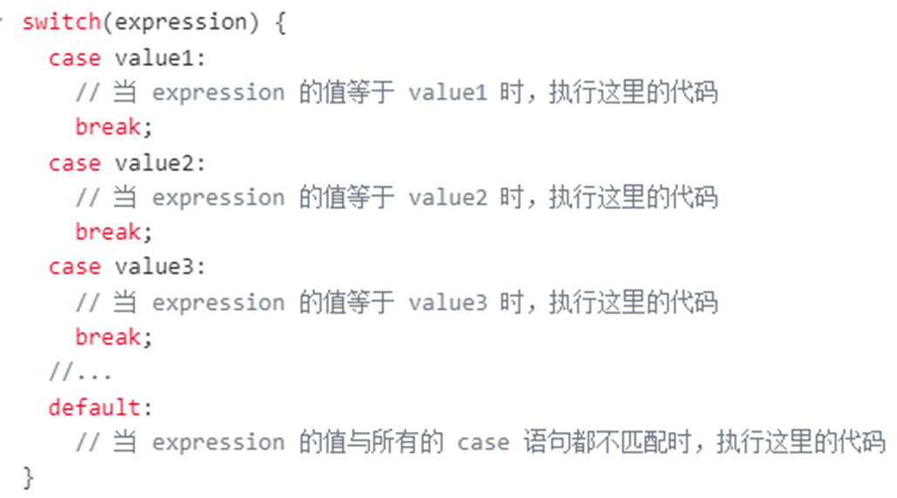

> **注意：**

1. **switch语句中表达式的expression值必须是`int`,`枚举`,`字符串`。**

2. **case标签的值必须是`常量`或`常量表达式`。**

3. **default标签是可选的，如果没有default标签，则执行完所有case标签后，程序会`报错`。**


### 循环语句for

> **for循环：用于`重复执行某段代码`，`直到指定`的`条件为止`。**

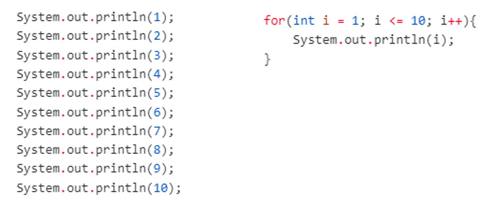

> **for循环原理：**

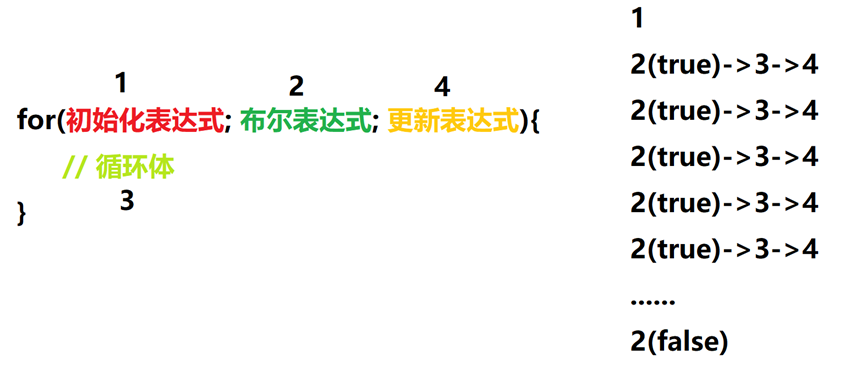

> **注意：**

1. **for循环的`初始化表达式`和`循环条件表达式`是可选的，如果没有，则`循环条件表达式默认为true`。**

2. **for循环的`更新表达式`是可选的，如果没有，则`循环体`只执行一次。**


### 循环语句while

1. **while循环：**

```java title="Java"
while循环语法格式：

while(布尔表达式){
循环体;
}
```
> **while循环：用于`重复执行某段代码`，`直到指定`的`条件为止`。**

> **while循环执行原理：**

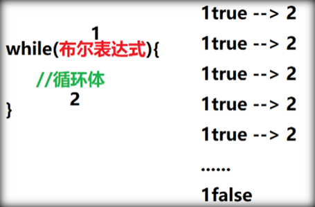

2. 执行原理：只要`布尔表达式`为`true`就会`一直循环`，直到`布尔表达式`结果为`false`，`循环结束`。

3. while循环体的执行次数可能是：`0 - n次`。

4. `for循环`适用于`循环次数固定的`。`while循环`适用于`循环次数不固定的`。


> **练一练：**

猜数字小游戏：程序生成 1~100 之间的一个随机数，要求用户猜这个数是多少，程序做出相应的提示，如果猜中了则输出恭喜信息，并记录猜的次数，如果猜错了可以提示用户再猜一次。使用 while 循环实现游戏的主体流程。


### 循环语句do-while

1. **do while循环：**

```java title="Java"
do while循环语法格式：
do{
循环体;
}while(布尔表达式);
```

2. 执行原理：先执行一次循环体，再判断布尔表达式，为true继续循环，直到布尔表达式结果为false，循环结束。

3. do while循环体的执行次数可能是：1 - n次。

4. do while循环比较适合用在不管条件是否成立，第一次必须要执行的业务。

> **练一练：**

求平均数：要求用户输入一组数字，用 -1 表示输入结束，使用 do-while 循环计算这些数字的平均数并输出。要使用一个计数器来记录输入的数字个数，遇到 -1 则终止输入并计算平均数。


### 跳转语句break

break;
出现在switch语句用来终止switch语句的执行。
出现在循环中，用来终止循环的执行。
break; 用来终止离它最近的循环。
break 循环标记; 用来终止指定的循环。

1. **break语句：**

```java title="Java"
break语句语法格式：
break;
```

2. 作用：用于`跳出循环`，`结束循环`。

3. 注意：break语句只能用于循环语句和switch语句中。


### 跳转语句continue

1. **continue语句：**

```java title="Java"
continue语句语法格式：
continue;
```

continue;
终止当前本次循环，直接进入下一次循环继续执行。
continue; 终止当前本次循环，直接进入离它最近的循环继续。
continue 循环标记; 终止当前本次循环，直接进入指定的循环继续。

2. 作用：用于`跳过当前循环`，`继续下一次循环`。

3. 注意：continue语句只能用于循环语句中。


### 跳转语句return

1. **return语句：**

```java title="Java"
return语句语法格式：
return 表达式;
```

2. 作用：用于`结束方法的执行`，并`返回值`。

3. 注意：return语句只能用于方法中。


### 控制语句-练习题

1. 请设计一个程序，不断的从键盘上接收一个正整数或者负整数，要求计算所有正整数的和，如果接收到0，则程序退出。

2. 请编写一个程序，打印1~100所有的奇数，但是跳过所有以数字 3 结尾的数字。

3. 韩信点兵，三人一组余两人，五人一组余三人，七人一组余四人，请问最少需要多少士兵


## 方法

### 方法是什么，有什么用

1. 方法（Method）是一段可以被重复利用的代码片段。

2. 一个方法一般都是一个独立的功能。

3. 方法只定义，不去调用，是不会执行的。

4. 方法要执行的话，肯定有一个位置调用它。

**示例代码：**

```java title="Java"
/*
	方法的本质到底是什么？方法的作用是什么？
		方法本质上就是一段可以被重复利用的代码片段。
		并且每一个方法都是一个独立的封装好的功能。

	方法只定义，不去调用，是不会执行的。
	方法要执行的话，肯定是有一个位置调用了这个方法。

*/
public class MethodTest02 {
    // 入口
    public static void main(String[] args) {
        // 调用sum方法，完成求和功能。
        // 请编写程序计算100和200的和。
        sum(100, 200); // 方法的调用。

        // 请编写程序计算666和888的和。
        sum(666, 888); // 方法的调用。

        // 请编写程序计算123和456的和。
        sum(123, 456); // 方法的调用。
    }

    // 单独定义一个方法，这个方法完成一个具体的功能。求和功能。
    // 方法的定义。
    public static void sum(int a, int b) {
        int c = a + b;
        System.out.println(a + "+" + b + " = " + c);
    }
}
```

### 方法的定义和调用

1. **语法格式：**

```java title="Java"
语法格式：
[修饰符列表] 返回值类型 方法名(形式参数列表){
    方法体;
}
```

2. 修饰符列表：目前修饰符列表这一块，统一编写`public static`。

3. 返回值类型：		
+ 可以是java语言中`任何一种数据类型`。包括`基本数据类型`，`引用数据类型`。

+ 例如：byte short int long float double boolean char String....

+ 如果方法执行结束的时候没有返回任何数据给调用者，返回值类型写：void。

+ 切记：不能空着不写。

+ 返回值类型是int表示：方法结束的时候会返回一个整数给调用者。
		
+ 返回值类型是String表示：方法结束的时候会返回一个字符串给调用者。

+ 返回值类型是void表示：方法结束的时候不返回任何数据给调用者。

+ 当`返回值类型不是void`的时候，方法在结束的时候`必须使用“return 值;”`语句来`完成数据的返回`。

4. 方法名：只要是合法的标识符即可。但最好见名知意。方法通常反应行为，所以方法名一般为动词。

. 形式参数列表：简称形参。用来接收数据。参数个数0~N个。如果有多个，使用逗号隔开。例如（int a, double b, long c）。每一个形式参数都可以看做局部变量。

5. 每个方法都有`方法体`，方法体是`一对大括号`。在大括号中编写Java语句。

6. 方法的调用：如果修饰符列表中`static关键字`，采用`“类名.方法名(实际参数列表);”`调用方法。

+ 调用者和被调用者在同一个类中，`“类名.”`可以省略。

+ `实际参数列表`：简称`实参`，实参和形参要一一对应，`个数对应`，`数据类型对应`。

7. 调用方法，如果方法执行结束后有返回值，可以采用变量接收该返回值。当然，也可以选择不接收。


1. 方法的定义：

```java title="Java"
修饰符 返回值类型 方法名(参数列表){
   方法体;
}
```

2. 方法的调用：

```java title="Java"
方法名(参数列表);
```

3. 方法的返回值：

```java title="Java"
方法名(参数列表) 返回值;
```

4. 方法的重载：

```java title="Java"
修饰符 返回值类型 方法名(参数列表){
   方法体;
}

修饰符 返回值类型 方法名(参数列表){
   方法体;
}
```

5. 方法的作用域：

```java title="Java"
public class Test{
   public static void main(String[] args){
      int a = 10;
      method(a);
   }

// 定义方法
   public static void method(int a){
      int b = 20;
      System.out.println(a + b);
   }
}
```

任何一个方法有一个`方法体`，方法体是`一对大括号`。


方法的调用：

+ 如果修饰符列表中`static关键字`，采用`“类名.方法名(实际参数列表);”`调用方法。

+ 实际的参数列表：实参和形参要一一对应，个数对应，数据类型对应。


### 方法的重载


### 方法的递归调用

1. 什么是方法的递归调用？

> **本质：`方法自己调用自己`。**

2. 递归时，内存是如何变化的？

> **每一次递归调用，都会在栈内存中开辟一个新的空间。**

3. 递归使用注意事项？

> **`所有的递归调用，必须要有结束条件`。**

4. 递归必须要有结束条件。

5. 递归和循环都能完成的话，优先选择循环。（递归更耗费内存。）

6. 递归有结束条件，就一定不会栈内存溢出吗？

> **`递归调用时，必须保证递归调用的次数必须小于等于结束条件`。**

7. 实际开发中，使用递归时，发生栈内存溢出，你该怎么办？

1. 首先可以调整栈内存的大小。扩大内存。

2. 如果扩大内存之后，仍然发生栈内存溢出，可能是递归结束条件不对，需要进行代码的修改。


> **练一练：**

1. 使用递归计算n的阶乘。

```java title="Java"
public static void main(String[] args) {
	// 计算5的阶乘
    int n = 5;
    int result = num(n);
    System.out.println(n + "的阶乘是：" + result);
}

// 定义一个递归方法
public static int num(int n) {
    if (n == 1) {
        return 1;
    } else {
        return n * num(n - 1);
    }
}
```


2. 假如有一对兔子，从出生后第3个月起每个月都生一对兔子，小兔子长到第三个月后每个月又生一对兔子，假如兔子都不死，请问第n个月后的兔子有多少对