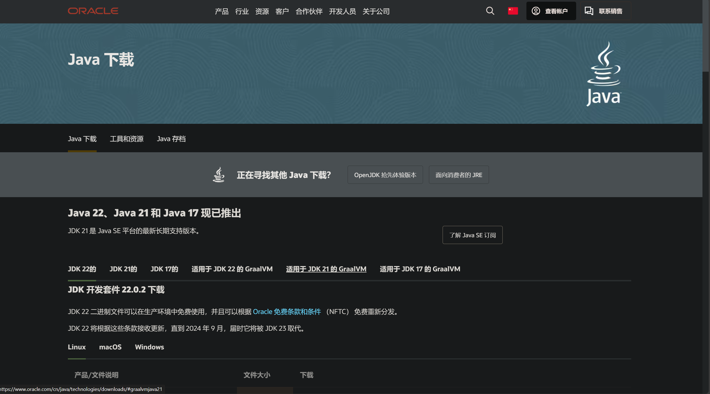
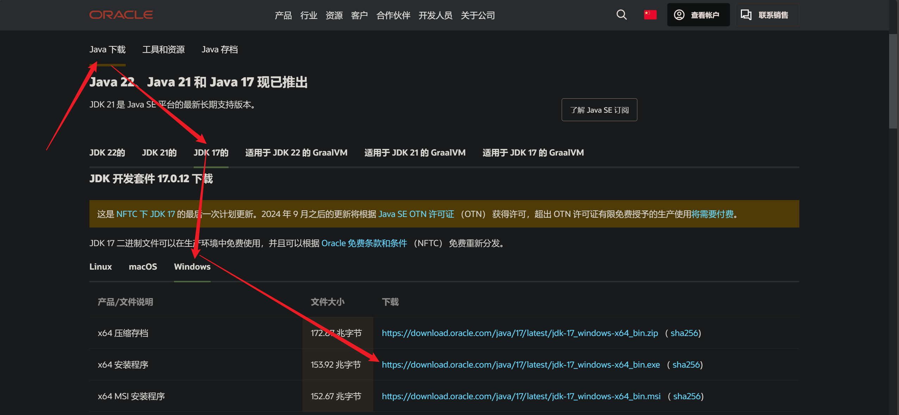
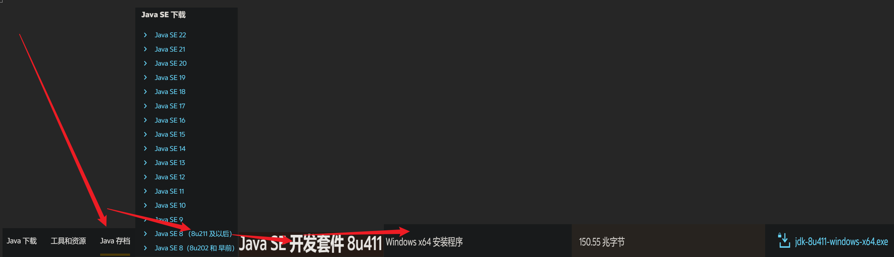
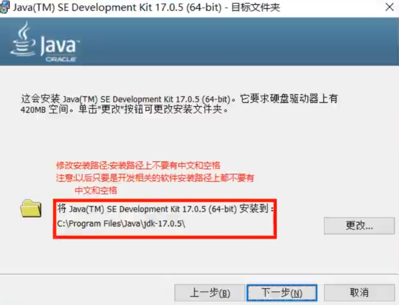
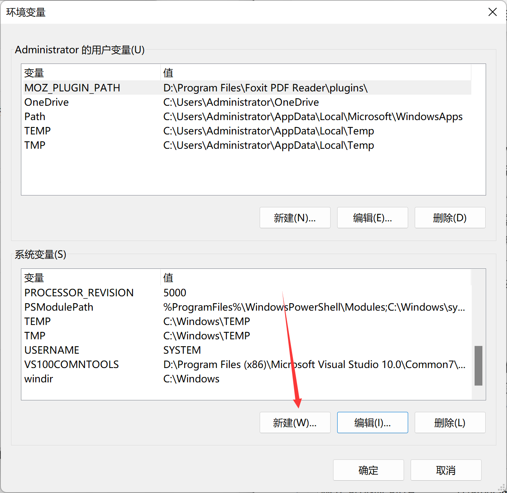
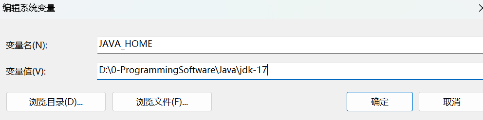
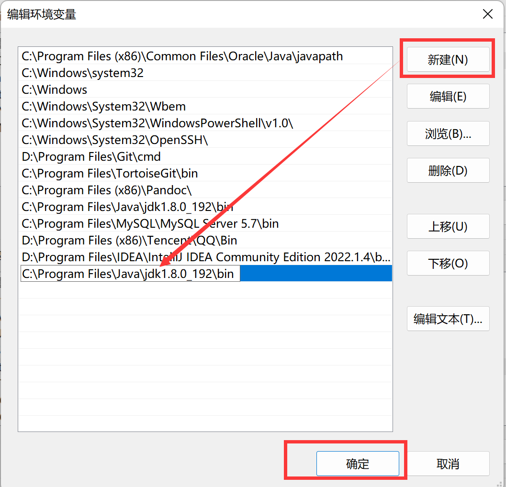
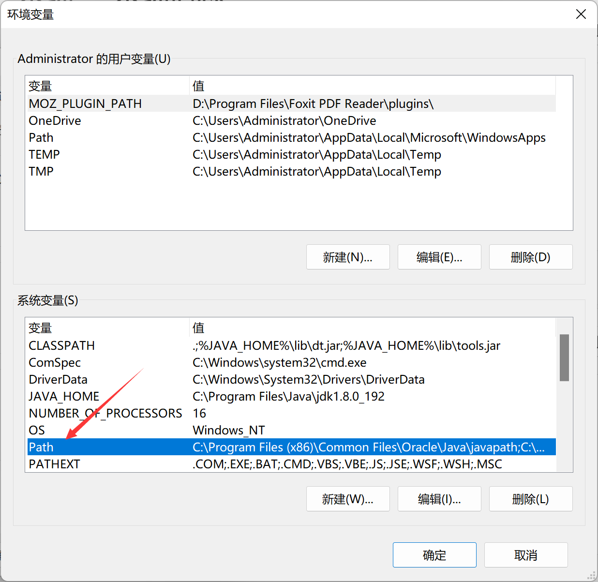
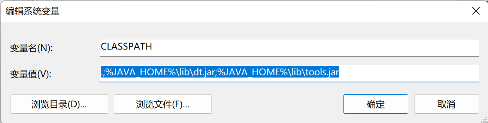
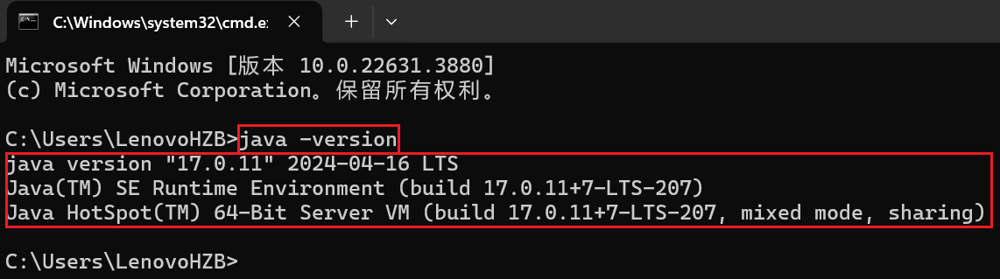

## 前言

这篇博客介绍Java环境的配置，主要是下载JDK，安装JDK，以及`path`、`JAVA_hOME`、`CLASSPAT`的配置，还会介绍配置这些的原因。


## JDK的安装

### 下载JDK

首先，你需要到[Oracle官网](https://www.oracle.com/cn/java/technologies/downloads/)下载Java Development Kit (JDK)安装包。


#### 下载JDK的步骤如下

`第1步`: 进入网站 ——> 

`第2步`: 选择你需要的JDK版本，比如我这里选择的是`JDK 8u411(简称JDK 8)`，`JDK 17`。下面分别演示两个版本的下载过程。

>`JDK 17`




>`JDK 8u411`




>`注意`：官网下载`JDK 8u411`，可能会提示你需要注册登录Oracle账号，这里注册Oracle账号比较麻烦，接下来我给大家提供一个网址，里面有免注册的共用Oracle账号。

[Oracle免注册账号](https://bugmenot.com/view/oracle.com)


### 安装JDK

>安装JDK，点击下载好的安装包，运行`setup.exe`文件，按照提示一步步安装即可。

`建议：安装路径不要有中文或者空格等特殊符号，否则可能会导致配置环境变量失败。`

安装步骤(`以JDK 17为例，安装JDK 8u411的步骤类似`)：

（1）双击jdk-17-windows-x64.exe文件，并单击下一步

（2）修改安装路径，自定义

（3）将安装路径修改为D:\0-ProgrammingSoftware\Java\jdk-17并单击下一步 ——> `这里根据自己的实际情况修改安装路径`

（4）稍后几秒，安装完成




## 配置环境变量 ———> JAVA_HOME、path、CLASSPAT

安装完成后，你需要配置环境变量，让系统能够识别到JDK。

### 打开环境变量编辑器

你可以在开始菜单中搜索`环境变量`或者在`控制面板`中搜索`系统`，然后点击`高级系统设置`->`环境变量`。

### 配置`JAVA_HOME`环境变量

#### 配置原因

`JAVA_HOME`环境变量是JDK的安装目录，它告诉系统到哪里去找Java的运行时环境。

#### 配置方法

首先找到我的电脑图标（就是一个电脑似的图标），然后点击鼠标右键，再点击属性，找到高级系统设置，点击环境变量。弹出下图所示的窗口。



在系统变量里新建一个`JAVA_HOME`，并赋值为JDK的安装目录，如下图所示：    



>注意：这里的路径要根据自己的实际情况修改，比如我这里安装的JDK 17的安装路径是`D:\0-ProgrammingSoftware\Java\jdk-17`，所以`JAVA_HOME`的值就是`D:\0-ProgrammingSoftware\Java\jdk-17`。


### 配置`Path`环境变量

#### 配置原因

因为JDK装好后的两个重要执行文件`javac.exe(代码编译文件)`和`java.exe(代码执行文件)`存在于所装的JDK的bin目录下，`而我们写的Java或者跑的别人的程序一般是放在一个新的目录`，主要是方便管理，如果都放在这里，会很混乱，更何况编译还有class文件生成。

但是，当我们要运行Java程序时，我们需要`编译（需要使用javac.exe）`和`执行（需要使用java.exe）`,而`系统默认`的是在`当前程序`所在的`文件夹目录下去寻找这两个执行文件`，而不会去其他地方找，此时我们就需要配置Path环境变量，使得每次程序运行就`自动到安装JDK的bin目录`下去搜索`javac.exe`和`java.exe`文件。


点击新建，找到 JDK 的安装目录中javac.exe和java.exe所在的目录，把目录复制到这里，点击确认即可，Path路径就设置完毕了。



#### 配置方法

在下面的系统变量框中（Path变量是系统本身就有的），选中Path那一行点击编辑，出现如下界面：



由于JAVA_HOME配置的是JDK的安装目录，所以Path有另一种配置方式，`配置jdk和jre的bin目录`即可，如下所示：

```java title="Java"
%JAVA_HOME%\bin
%JAVA_HOME%\jre\bin

1.其中% %表示引用JAVA_HOME的值
2.这样的好处在于，如果Java安装目录发生变话，
需要修改JAVA_HOME的值，不用再修改Path变量的值
3.部分Windows10的系统在重启之后%JAVA_HOME%\bin配置的失效，
这里解决方法是按上面的那种方法配置全路径即可
```
>注意：Windows 8 ， 10的Path变量配置要友好一些，直接配置一条记录即可，如果是Windows7的话，需要在Path变量的值中使用 ;(英文分号)分割，然后追加Java的安装目录下的bin目录路径即可。


### 配置`CLASSPATH`环境变量

#### 配置原因

CLASSPATH顾名思义为包路径，告诉Java在执行的时候，去哪里找到需要的包和类供程序使用。所以配置时应把包的路径赋值给CLASSPATH。

#### 配置方法

我们在系统变量里新建一个CLASSPATH，赋值如下：

```java title="Java"
.;%JAVA_HOME%\lib\dt.jar;%JAVA_HOME%\lib\tools.jar
```
注意前面的 . 这个点号不能省略掉



此时赋值的路径有三个，以分号为间隔隔开 ，第一个英文的句号表示当前目录路径，第二个目录为lib库中的tools工具包路径，第三个为lib库中的dt包路径。

## 验证JDK安装
安装完成JDK以及相应的配置之后，需要验证是否安装成功，是否配置正常。

+ 第一步：打开cmd命令行窗口，键盘win+r；输入 cmd 打开命令行


+ 第二步：验证JDK安装是否成功，你可以在命令行中输入`java -version`命令，如果出现以下输出，说明JDK安装成功：



+ 第三步：输入java，回车可以出现如下的提示：

```CMD title="CMD"
C:\Users\LenovoHZB>java
用法：java [options] <主类> [args...]
           （执行类）
   或  java [options] -jar <jar 文件> [args...]
           （执行 jar 文件）
   或  java [options] -m <模块>[/<主类>] [args...]
       java [options] --module <模块>[/<主类>] [args...]
           （执行模块中的主类）
   或  java [options] <源文件> [args]
           （执行单个源文件程序）

 将主类、源文件、-jar <jar 文件>、-m 或
 --module <模块>/<主类> 后的参数作为参数
 传递到主类。

 其中，选项包括：

    -cp <目录和 zip/jar 文件的类搜索路径>
    -classpath <目录和 zip/jar 文件的类搜索路径>
    --class-path <目录和 zip/jar 文件的类搜索路径>
                  使用 ; 分隔的, 用于搜索类文件的目录, JAR 档案
                  和 ZIP 档案列表。
    -p <模块路径>
    --module-path <模块路径>...
                  用 ; 分隔的目录列表, 每个目录
                  都是一个包含模块的目录。
    --upgrade-module-path <模块路径>...
                  用 ; 分隔的目录列表, 每个目录
                  都是一个包含模块的目录, 这些模块
                  用于替换运行时映像中的可升级模块
    --add-modules <模块名称>[,<模块名称>...]
                  除了初始模块之外要解析的根模块。
                  <模块名称> 还可以为 ALL-DEFAULT, ALL-SYSTEM,
                  ALL-MODULE-PATH.
    --list-modules
                  列出可观察模块并退出
    -d <module name>
    --describe-module <模块名称>
                  描述模块并退出
    --dry-run     创建 VM 并加载主类, 但不执行 main 方法。
                  此 --dry-run 选项对于验证诸如
                  模块系统配置这样的命令行选项可能非常有用。
    --validate-modules
                  验证所有模块并退出
                  --validate-modules 选项对于查找
                  模块路径中模块的冲突及其他错误可能非常有用。
    -D<名称>=<值>
                  设置系统属性
    -verbose:[class|module|gc|jni]
                  为给定子系统启用详细输出
    -version      将产品版本输出到错误流并退出
    --version     将产品版本输出到输出流并退出
    -showversion  将产品版本输出到错误流并继续
    --show-version
                  将产品版本输出到输出流并继续
    --show-module-resolution
                  在启动过程中显示模块解析输出
    -? -h -help
                  将此帮助消息输出到错误流
    --help        将此帮助消息输出到输出流
    -X            将额外选项的帮助输出到错误流
    --help-extra  将额外选项的帮助输出到输出流
    -ea[:<程序包名称>...|:<类名>]
    -enableassertions[:<程序包名称>...|:<类名>]
                  按指定的粒度启用断言
    -da[:<程序包名称>...|:<类名>]
    -disableassertions[:<程序包名称>...|:<类名>]
                  按指定的粒度禁用断言
    -esa | -enablesystemassertions
                  启用系统断言
    -dsa | -disablesystemassertions
                  禁用系统断言
    -agentlib:<库名>[=<选项>]
                  加载本机代理库 <库名>, 例如 -agentlib:jdwp
                  另请参阅 -agentlib:jdwp=help
    -agentpath:<路径名>[=<选项>]
                  按完整路径名加载本机代理库
    -javaagent:<jar 路径>[=<选项>]
                  加载 Java 编程语言代理, 请参阅 java.lang.instrument
    -splash:<图像路径>
                  使用指定的图像显示启动屏幕
                  自动支持和使用 HiDPI 缩放图像
                  (如果可用)。应始终将未缩放的图像文件名 (例如, image.ext)
                  作为参数传递给 -splash 选项。
                  将自动选取提供的最合适的缩放
                  图像。
                  有关详细信息, 请参阅 SplashScreen API 文档
    @argument 文件
                  一个或多个包含选项的参数文件
    -disable-@files
                  阻止进一步扩展参数文件
    --enable-preview
                  允许类依赖于此发行版的预览功能
要为长选项指定参数, 可以使用 --<名称>=<值> 或
--<名称> <值>。
```

+ 第四步：输入javac，（javac是用来编译.java文件的）：

```CMD title="CMD"
C:\Users\LenovoHZB>javac
用法: javac <options> <source files>
其中, 可能的选项包括:
  @<filename>                  从文件读取选项和文件名
  -Akey[=value]                传递给注释处理程序的选项
  --add-modules <模块>(,<模块>)*
        除了初始模块之外要解析的根模块; 如果 <module>
                为 ALL-MODULE-PATH, 则为模块路径中的所有模块。
  --boot-class-path <path>, -bootclasspath <path>
        覆盖引导类文件的位置
  --class-path <path>, -classpath <path>, -cp <path>
        指定查找用户类文件和注释处理程序的位置
  -d <directory>               指定放置生成的类文件的位置
  -deprecation                 输出使用已过时的 API 的源位置
  --enable-preview             启用预览语言功能。要与 -source 或 --release 一起使用。
  -encoding <encoding>         指定源文件使用的字符编码
  -endorseddirs <dirs>         覆盖签名的标准路径的位置
  -extdirs <dirs>              覆盖所安装扩展的位置
  -g                           生成所有调试信息
  -g:{lines,vars,source}       只生成某些调试信息
  -g:none                      不生成任何调试信息
  -h <directory>               指定放置生成的本机标头文件的位置
  --help, -help, -?            输出此帮助消息
  --help-extra, -X             输出额外选项的帮助
  -implicit:{none,class}       指定是否为隐式引用文件生成类文件
  -J<flag>                     直接将 <标记> 传递给运行时系统
  --limit-modules <模块>(,<模块>)*
        限制可观察模块的领域
  --module <模块>(,<模块>)*, -m <模块>(,<模块>)*
        只编译指定的模块，请检查时间戳
  --module-path <path>, -p <path>
        指定查找应用程序模块的位置
  --module-source-path <module-source-path>
        指定查找多个模块的输入源文件的位置
  --module-version <版本>        指定正在编译的模块版本
  -nowarn                      不生成任何警告
  -parameters                  生成元数据以用于方法参数的反射
  -proc:{none,only,full}       控制是否执行注释处理和/或编译。
  -processor <class1>[,<class2>,<class3>...]
        要运行的注释处理程序的名称; 绕过默认的搜索进程
  --processor-module-path <path>
        指定查找注释处理程序的模块路径
  --processor-path <path>, -processorpath <path>
        指定查找注释处理程序的位置
  -profile <profile>           请确保使用的 API 在指定的配置文件中可用
  --release <release>
        为指定的 Java SE 发行版编译。支持的发行版：7, 8, 9, 10, 11, 12, 13, 14, 15, 16, 17
  -s <directory>               指定放置生成的源文件的位置
  --source <release>, -source <release>
        提供与指定的 Java SE 发行版的源兼容性。支持的发行版：7, 8, 9, 10, 11, 12, 13, 14, 15, 16, 17
  --source-path <path>, -sourcepath <path>
        指定查找输入源文件的位置
  --system <jdk>|none          覆盖系统模块位置
  --target <release>, -target <release>
        生成适合指定的 Java SE 发行版的类文件。支持的发行版：7, 8, 9, 10, 11, 12, 13, 14, 15, 16, 17
  --upgrade-module-path <path>
        覆盖可升级模块位置
  -verbose                     输出有关编译器正在执行的操作的消息
  --version, -version          版本信息
  -Werror                      出现警告时终止编译
```

## 结语

以上就是Windows下Java环境的配置教程，希望对你有所帮助。感谢每一位走到这里的小伙伴，我们可以一起学习交流，一起进步😉！！！加油🏃！！！

