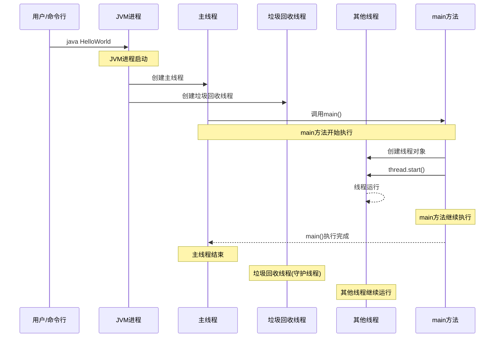
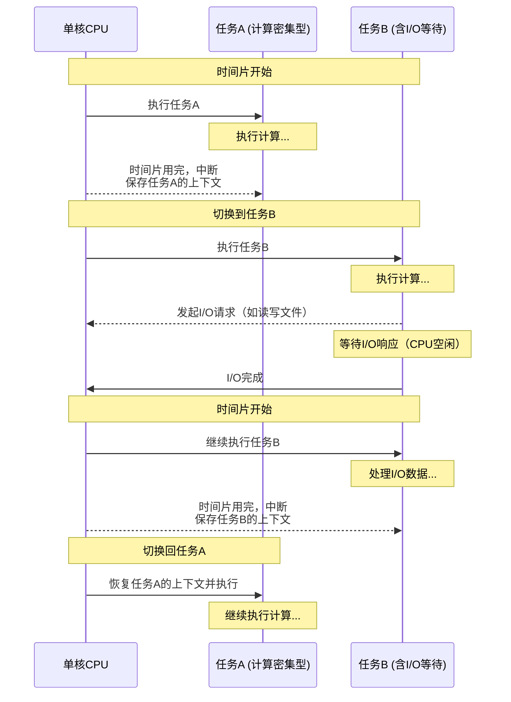
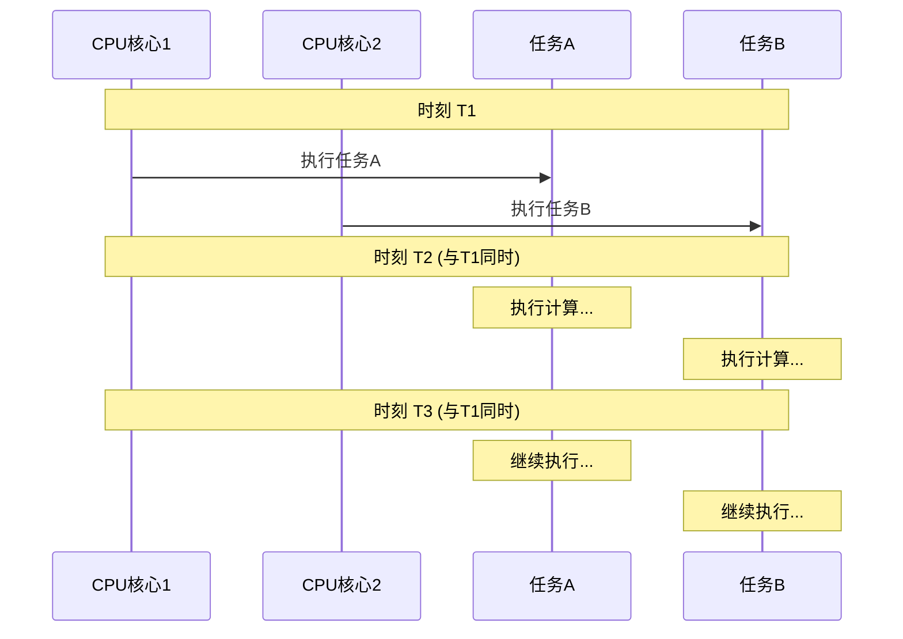
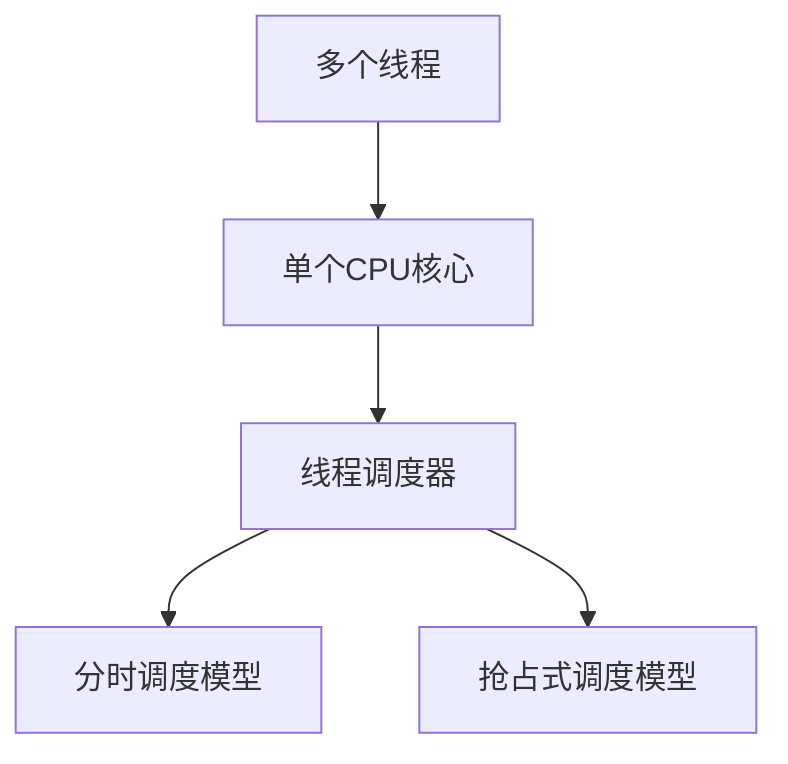
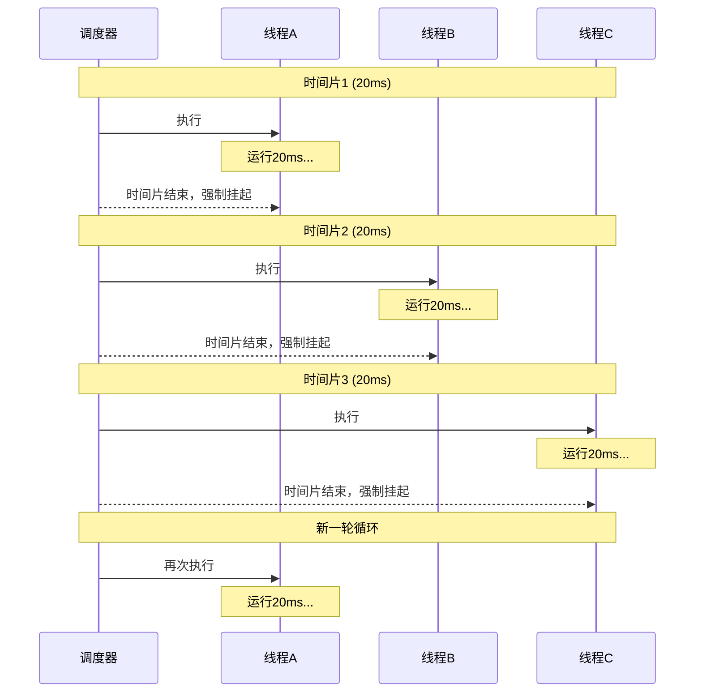
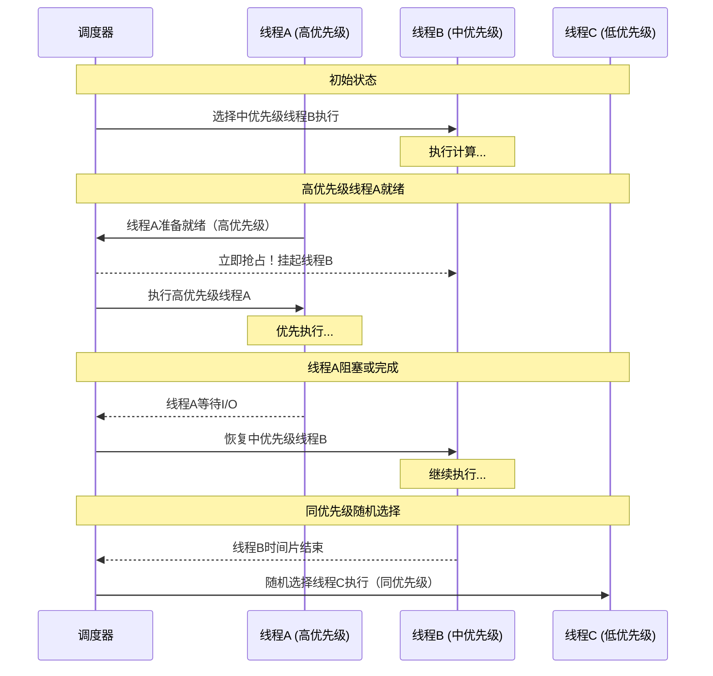
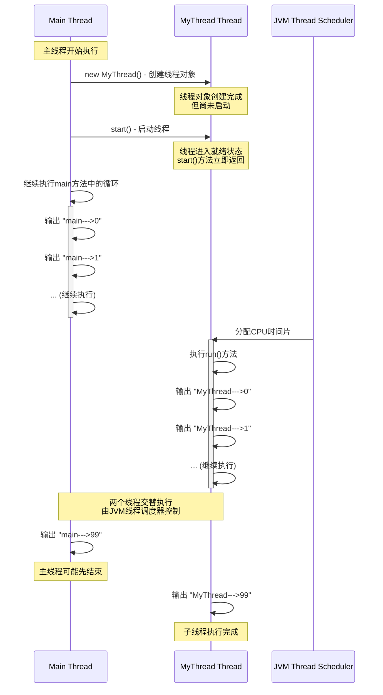
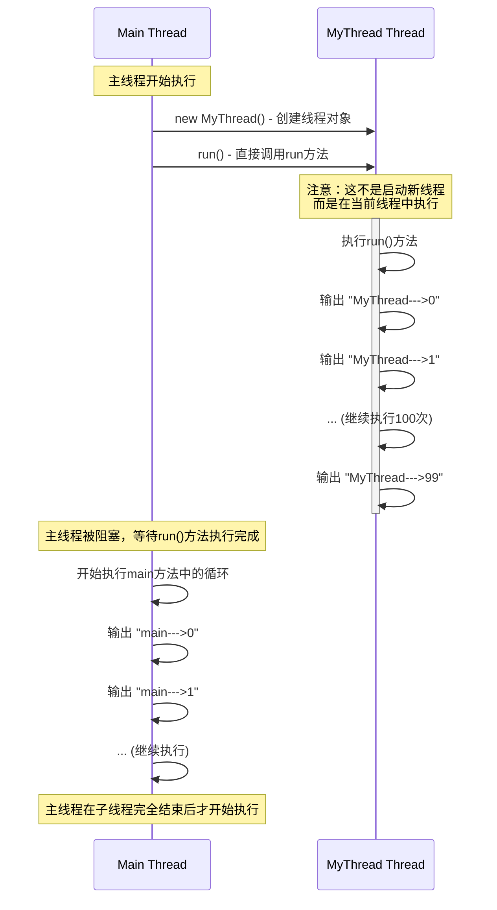
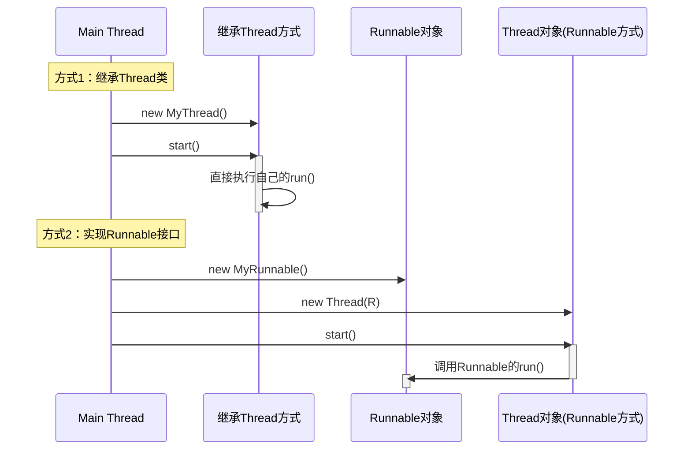

## 线程概述

### 什么是进程？什么是线程？它们的区别？

+ **进程是指操作系统中的一段程序，它是一个正在执行中的程序实例，`具有独立的内存空间和系统资源`，如文件、网络端口等。在计算机程序执行时，`先创建进程，再在进程中进行程序的执行`。一般来说，`一个进程`可以包含`多个线程`。**

> [!NOTE]
>
> **提示:**
>
> * Windows 资源管理器看到的都是进程，进程是操作系统管理的基本单元。
>
> 
>

+ **线程是`指进程中的一个执行单元`，是进程的一部分，它`负责在进程中执行程序代码`。每个线程`都有自己的栈和程序计数器`，并且可以`共享进程的资源`。多个线程`可以在同一时刻执行不同的操作`，从而提高了程序的执行效率。**

> [!NOTE]
>
> **提示:**
>
> * Windows 中查看线程信息，需要借助 [Process Explorer](https://learn.microsoft.com/zh-cn/sysinternals/downloads/process-explorer) 工具。
>
> 
>


+ **现代的操作系统是支持多进程的，也就是可以`启动多个软件`，`一个软件就是一个进程`。称为：`多进程并发`。**

+ **通常一个进程都是`可以启动多个线程的`。称为：`多线程并发`。**


### 多线程的作用？

+ **提高处理效率。（多线程的优点之一是`能够使 CPU 在处理一个任务时同时处理多个线程`，这样可以充分利用 CPU 的资源，提高 CPU 的利用效率。）**


### JVM规范中规定

+ **`堆内存、方法区` 是`线程共享的`。**

+ **`虚拟机栈、本地方法栈、程序计数器 `是`每个线程私有的`。**


### 关于Java程序的运行原理

+ **“java HelloWorld”执行后，会启动JVM，JVM的启动表示一个进程启动了。**

+ **JVM进程会首先启动一个主线程（main-thread），主线程负责调用main方法。因此main方法是在主线程中运行的。**

+ **除了主线程之外，还启动了一个垃圾回收线程。因此启动JVM，至少启动了两个线程。**

+ **在main方法的执行过程中，程序员可以手动创建其他线程对象并启动。**




### 分析程序有多少个线程(练习)

```java
package com.powernode.javase.thread;

/**
 * 分析当前程序有多少个线程？
 *      这个程序除了GC线程之外，只有一个主线程。
 *      在JVM当中只有一个VM Stack。
 *      这个栈底部是main方法。
 *      栈顶部是m3方法。
 */
public class ThreadTest01 {
    public static void main(String[] args) {
        System.out.println("main begin");
        m1();
        System.out.println("main over");
    }

    public static void m1() {
        System.out.println("m1 begin");
        m2();
        System.out.println("m1 over");
    }

    public static void m2() {
        System.out.println("m2 begin");
        m3();
        System.out.println("m2 over");
    }

    public static void m3() {
        System.out.println("m3 execute!");
    }
}
```

> [!NOTE]
>
> **测试:**
>
> ```java
> main begin
> m1 begin
> m2 begin
> m3 execute!
> m2 over
> m1 over
> main over
> ```
>
> ```mermaid
> sequenceDiagram
>     participant Main as 主线程
>     participant VMStack as JVM栈
>     
>     Note over Main, VMStack: 程序开始执行
>     
>     Main->>VMStack: main() 入栈
>     Main->>+Main: System.out.println("main begin")
>     Main-->>-Main: 输出完成
>     Main->>+Main: m1() 调用
>     Main->>VMStack: m1() 入栈
>     
>     Note over Main, VMStack: 进入m1方法
>     Main->>+Main: System.out.println("m1 begin")
>     Main-->>-Main: 输出完成
>     Main->>+Main: m2() 调用
>     Main->>VMStack: m2() 入栈
>     
>     Note over Main, VMStack: 进入m2方法
>     Main->>+Main: System.out.println("m2 begin")
>     Main-->>-Main: 输出完成
>     Main->>+Main: m3() 调用
>     Main->>VMStack: m3() 入栈
>     
>     Note over Main, VMStack: 进入m3方法
>     Main->>+Main: System.out.println("m3 execute!")
>     Main-->>-Main: 输出完成
>     Main->>VMStack: m3() 出栈
>     
>     Note over Main, VMStack: 返回m2方法
>     Main->>+Main: System.out.println("m2 over")
>     Main-->>-Main: 输出完成
>     Main->>VMStack: m2() 出栈
>     
>     Note over Main, VMStack: 返回m1方法
>     Main->>+Main: System.out.println("m1 over")
>     Main-->>-Main: 输出完成
>     Main->>VMStack: m1() 出栈
>     
>     Note over Main, VMStack: 返回main方法
>     Main->>+Main: System.out.println("main over")
>     Main-->>-Main: 输出完成
>     Main->>VMStack: main() 出栈
>     
>     Note over Main, VMStack: 程序执行结束
> ```


## 并发与并行


### 并发（concurrency）

①**使用单核CPU的时候，同一时刻只能有一条指令执行，但多个指令被快速的轮换执行，使得在宏观上具有多个指令同时执行的效果，但在微观上并不是同时执行的，只是把时间分成若干端，使多个指令快速交替的执行。**


②**如上图所示，假设只有一个CPU资源，线程之间要竞争得到执行机会。图中的第一个阶段，在A执行的过程中，B、C不会执行，因为这段时间内这个CPU资源被A竞争到了，同理，第二阶段只有B在执行，第三阶段只有C在执行。其实，并发过程中，A、B、C并不是同时进行的（微观角度），但又是同时进行的（宏观角度）。**

③**在同一个时间点上，一个CPU只能支持一个线程在执行。因为CPU运行的速度很快，CPU使用抢占式调度模式在多个线程间进行着高速的切换，因此我们看起来的感觉就像是多线程一样，也就是看上去就是在同一时刻运行。**


### 并行（parallellism）

①**使用多核CPU的时候，同一时刻，有多条指令在多个CPU上同时执行。**


②**如图所示，在同一时刻，ABC都是同时执行（微观、宏观）**


### 并发编程与并行编程


#### 并发编程

**核心思想：** 在单个CPU核心上，通过时间分片的方式，让多个任务“看起来”是同时进行的。当一个任务等待（如等待I/O操作）时，CPU会立刻切换到另一个任务，从而充分利用CPU资源。

**时序图解释：**

下图展示了在**单核CPU**上，两个任务（任务A和任务B）并发执行的过程。



**时序图关键点：**

1. **单核资源**：整个流程只有一个CPU核心在工作。
2. **时间分片**：CPU将时间分成小片段，轮流分配给任务A和任务B。
3. **上下文切换**：每次切换任务时，CPU需要保存当前任务的状态（上下文），并加载下一个任务的状态。这个过程有一定开销。
4. **利用等待时间**：当任务B进行I/O操作（如读写文件、网络请求）时，它不需要CPU。此时CPU不会傻等，而是立即切换到任务A去执行。**这是并发编程提升效率的关键**。
5. **宏观与微观**：在宏观上（比如1秒钟内），任务A和B都在向前推进，好像是“同时”运行的；但在微观上（纳秒或毫秒级），它们在交替执行。

**并发的主要目的：** 提高程序的响应能力和资源（特别是CPU）的利用率


#### 并行编程

**核心思想：** 利用多个CPU核心，在同一时刻真正同时执行多个任务。

**时序图解释：**

下图展示了在**双核CPU**上，两个任务并行执行的过程。



**时序图关键点：**

1. **多核资源**：有多个CPU核心（这里是两个）作为执行单元。
2. **真正同时**：在同一个时钟周期（时刻T1），核心1执行任务A，核心2执行任务B。它们之间没有“交替”或“抢占”，是物理上的同时执行。
3. **无上下文切换**：每个任务独占一个核心，在其时间片内不需要被中断和切换，因此没有并发模式下的那种上下文切换开销。
4. **效率提升**：理想情况下，双核并行执行两个计算密集型任务，时间可以缩短到单核的一半。

**并行的主要目的：** 大幅提升计算速度，缩短问题的总体解决时间，通常用于处理计算密集型任务（如科学计算、大数据处理、图形渲染）。


#### 总结与关系

| 特性         | 并发                     | 并行             |
| :----------- | :----------------------- | :--------------- |
| **核心数量** | 单核即可                 | 必须多核         |
| **执行方式** | 交替执行                 | 同时执行         |
| **核心目标** | 提高响应和资源利用率     | 提升计算速度     |
| **是否同时** | 宏观同时，微观交替       | 宏观和微观都同时 |
| **适用场景** | I/O密集型任务、Web服务器 | 计算密集型任务   |

**相互关系：**

- **并行是并发的真子集**：一个系统如果可以并行，那么它必然可以并发（因为多个核心可以各自进行任务切换）。但可以并发的系统不一定能并行（比如在单核CPU上）。
- **现代编程通常结合两者**：在一个多核CPU上，可以同时运行多个程序（**并行**），而每个程序内部又通过多线程来实现**并发**。例如，一个Web服务器在8核CPU上运行，它可以同时处理8个用户请求（**并行**），而处理每个请求的线程在遇到数据库查询时，会释放CPU给其他线程使用（**并发**）。


## 线程的调度策略

### 概述

**如果`多个线程`被分配到`一个CPU内核中执行`，则同一时刻`只能允许有一个线程能获得CPU的执行权`，那么进程中的`多个线程`就会`抢夺CPU的执行权`，这就是涉及到`线程调度策略`。**




### 线程的调度模型


#### 分时调度模型

> **所有线程轮流使用CPU的执行权，并且`平均的分配每个线程占用的CPU的时间`。**



**分时调度的关键点**：

- ⏱️ **固定时间片**：每个线程获得相等的CPU时间（如20ms）
- 🔄 **循环轮转**：按顺序轮流执行，保证公平性
- ⏸️ **强制切换**：时间片用完立即挂起，不管任务是否完成
- 🎯 **适用场景**：强调公平性的系统，早期Unix系统


#### 抢占式调度模型

> **让`优先级高的线程`以较大的概率`优先获得CPU的执行权`，如果`线程的优先级相同`，那么就会`随机选择一个线程获得CPU的执行权`，而`Java采用的就是抢占式调用`。**



**抢占式调度的关键点**：

- 🏆 **优先级驱动**：高优先级线程优先执行，并可抢占低优先级线程
- 🎲 **同优先级随机**：优先级相同时，随机选择或轮转
- 🔄 **动态响应**：新就绪的高优先级线程能立即获得CPU
- ⚡ **Java采用**：这正是Java线程调度的方式


#### Java中的抢占式调度示例

```java
public class ThreadPriorityExample {
    public static void main(String[] args) {
        Thread highPriorityThread = new Thread(() -> {
            for (int i = 0; i < 5; i++) {
                System.out.println("高优先级线程执行");
            }
        });
        
        Thread lowPriorityThread = new Thread(() -> {
            for (int i = 0; i < 5; i++) {
                System.out.println("低优先级线程执行");
            }
        });
        
        // 设置优先级（1-10，默认5）
        highPriorityThread.setPriority(Thread.MAX_PRIORITY); // 10
        lowPriorityThread.setPriority(Thread.MIN_PRIORITY);  // 1
        
        lowPriorityThread.start();
        highPriorityThread.start(); // 高优先级线程可能先完成
    }
}
```


## 实现线程


### 第一种方式：继承Thread

```java
在Java语言中，实现线程，有两种方式，第一种方式：
 	第一步：编写一个类继承 java.lang.Thread
 	第二步：重写run方法
 	第三步：new线程对象
 	第四部：调用线程对象的start方法来启动线程。
```

```java
package com.powernode.javase.thread;

public class ThreadTest02 {
    public static void main(String[] args) {
        // 创建线程对象
        //MyThread mt = new MyThread();
        Thread t = new MyThread();

        // 直接调用run方法，不会启动新的线程。
        // java中有一个语法规则：对于方法体当中的代码，必须遵循自上而下的顺序依次逐行执行。
        // run()方法不结束，main方法是无法继续执行的。
        //t.run();

        // 调用start()方法，启动线程
        // java中有一个语法规则：对于方法体当中的代码，必须遵循自上而下的顺序依次逐行执行。
        // start()方法不结束，main方法是无法继续执行的。
        // start()瞬间就会结束，原因这个方法的作用是：启动一个新的线程，只要新线程启动成功了，start()就结束了。
        t.start();

        // 这里编写的代码在main方法中，因此这里的代码属于在主线程中执行。
        for (int i = 0; i < 100; i++) {
            System.out.println("main--->" + i);
        }
    }
}


// 自定义一个线程类
// java.lang.Thread本身就是一个线程。
// MyThread继承Thread，因此MyThread本身也是一个线程。
class MyThread extends Thread {
    @Override
    public void run() {
        for (int i = 0; i < 100; i++) {
            System.out.println("MyThread--->" + i);
        }
    }
}
```


####  正确执行流程（使用start()方法）




>  **使用`start()`方法的输出特点:**
>
> ```java
> main--->0
> MyThread--->0
> main--->1
> MyThread--->1
> main--->2
> MyThread--->2
> ...
> ```
>
> - **两个循环交替执行**
> - **执行顺序不确定，由线程调度器决定**
> - **主线程和子线程并发执行**


#### 错误执行流程（使用run()方法）




> **使用`run()`方法的输出特点：**
>
> ```java
> MyThread--->0
> MyThread--->1
> ...
> MyThread--->99
>     
> main--->0
> main--->1
> ...
> main--->99
> ```
>
> - **先完整执行子线程的run方法**
> - **然后才执行主线程的循环**
> - **实际上是单线程顺序执行**


#### 总结

`start()` vs `run()` 的区别

| 方法      | 作用                                | 线程数量                 | 执行顺序 |
| :-------- | :---------------------------------- | :----------------------- | :------- |
| `start()` | 启动新线程，在新线程中执行run()方法 | 2个线程（主线程+新线程） | 并发执行 |
| `run()`   | 直接调用方法，不会启动新线程        | 1个线程（主线程）        | 顺序执行 |

> 1. **创建线程对象**只是创建了对象，线程并未启动
> 2. **调用`start()`** 会启动新线程，立即返回，主线程继续执行
> 3. **调用`run()`** 只是普通方法调用，不会启动新线程
> 4. **多线程并发执行**时，执行顺序由JVM线程调度器决定，具有不确定性


### 第二种方式：实现Runnable接口

```java
在Java语言中，实现线程，有两种方式，第二种方式：
       第一步：编写一个类实现 java.lang.Runnable接口（可运行的接口）
       第二步：实现接口中的run方法。
       第三步：new线程对象
       第四部：调用线程的start方法启动线程
 
  总结：实现线程两种方式：
       第一种：编写类直接继承Thread
       第二种：编写类实现Runnable接口
 
       推荐使用第二种，因为实现接口的同时，保留了类的继承。
```

```java
package com.powernode.javase.thread;

public class ThreadTest03 {
    public static void main(String[] args) {
        // 创建Runnable对象
        //Runnable r = new MyRunnable();
        // 创建线程对象
        //Thread t1 = new Thread(r);

        // 创建线程对象
        Thread t = new Thread(new MyRunnable());

        // 启动线程
        t.start();

        // 主线程中执行的。
        for (int i = 0; i < 100; i++) {
            System.out.println("main----->" + i);
        }
    }
}


// 严格来说，这个不是一个线程类
// 它是一个普通的类，只不过实现了一个Runnable接口。
class MyRunnable implements Runnable {

    @Override
    public void run() {
        for (int i = 0; i < 100; i++) {
            System.out.println("t----->" + i);
        }
    }
}
```

> **实现Runnable接口方式的执行流程:**
>
> ```mermaid
> sequenceDiagram
>     participant M as Main Thread
>     participant R as MyRunnable对象
>     participant T as Thread对象
>     participant JVM as JVM Thread Scheduler
>     
>     Note over M: 主线程开始执行
>     
>     M->>R: new MyRunnable() - 创建Runnable对象
>     Note over R: 普通对象，不是线程
>     
>     M->>T: new Thread(R) - 创建Thread对象并传入Runnable
>     Note over T: Thread对象持有Runnable引用
>     
>     M->>T: start() - 启动线程
>     Note over T: 线程进入就绪状态<br/>start()方法立即返回
>     
>     par 主线程执行
>         M->>M: 执行main方法中的循环
>         activate M
>         M->>M: 输出 "main----->0"
>         M->>M: 输出 "main----->1"
>         M->>M: ... (继续执行)
>         M->>M: 输出 "main----->99"
>         deactivate M
>     and 子线程执行
>         JVM->>T: 分配CPU时间片
>         activate T
>         T->>R: 调用run()方法
>         activate R
>         R->>R: 输出 "t----->0"
>         R->>R: 输出 "t----->1"
>         R->>R: ... (继续执行)
>         R->>R: 输出 "t----->99"
>         deactivate R
>         deactivate T
>     end
>     
>     Note over M,T: 两个线程并发执行<br/>输出结果交替出现
> ```
>
> **输出结果示例：**
>
> ```java
> main----->0
> t----->0
> main----->1
> t----->1
> main----->2
> t----->2
> ...
> main----->99
> t----->99
> ```


### 两种实现方式的对比



**两种方式的比较:**

| 特性         | 继承Thread类                    | 实现Runnable接口                          |
| :----------- | :------------------------------ | :---------------------------------------- |
| **代码结构** | `class MyThread extends Thread` | `class MyRunnable implements Runnable`    |
| **线程创建** | `Thread t = new MyThread()`     | `Thread t = new Thread(new MyRunnable())` |
| **执行方式** | 直接执行自己的run()方法         | 通过Thread调用Runnable的run()方法         |
| **继承限制** | 占用继承名额                    | 不占用继承名额                            |
| **资源共享** | 每个线程独立实例                | 多个线程可共享同一Runnable实例            |


### 优化方式二(匿名内部类创建多线程)

```java
匿名内部类回顾: 
  1.new 接口/抽象类(){
      重写方法
  }.重写的方法();

  2.接口名/类名 对象名 = new 接口/抽象类(){
      重写方法
  }
    对象名.重写的方法();
```

```java
package com.powernode.javase.thread;

/**
 * 采用匿名内部类的方式，少写一个Runnable接口的实现类。
 */
public class ThreadTest04 {
    public static void main(String[] args) {
        // 创建线程对象
        /*Thread t = new Thread(new Runnable() {
            @Override
            public void run() {
                for (int i = 0; i < 100; i++) {
                    System.out.println("t ---> " + i);
                }
            }
        });

        // 启动线程
        t.start();*/

        new Thread(new Runnable() {
            @Override
            public void run() {
                for (int i = 0; i < 100; i++) {
                    System.out.println("t--->" + i);
                }
            }
        }).start();

        for (int i = 0; i < 100; i++) {
            System.out.println("main ---> " + i);
        }
    }
}
```

> **输出结果示例：**
>
> ```java
> main ---> 0
> main ---> 1
> t--->0
> main ---> 2
> main ---> 3
> main ---> 4
> main ---> 5
> t--->1
> main ---> 6
> ...
> main----->99
> t----->99
> ```


## Thread类中的方法

```java
void start() -> 开启线程,jvm自动调用run方法
    
void run()  -> 设置线程任务,这个run方法是Thread重写的接口Runnable中的run方法
    
String getName()  -> 获取线程名字
    
void setName(String name) -> 给线程设置名字
    
static Thread currentThread() -> 获取正在执行的线程对象(此方法在哪个线程中使用,获取的就是哪个线程对象)   
    
static void sleep(long millis)->线程睡眠,超时后自动醒来继续执行,传递的是毫秒值 
```


