## 异常概述

### 什么是异常？有什么用？

1. Java中的`异常`是指`程序运行时出现了错误或异常情况`，导致`程序无法继续正常执行`的现象。例如，`数组下标越界、空指针异常、类型转换异常`等都属于异常情况。

2. Java提供了`异常处理机制`，即在程序中对可能出现的`异常情况进行捕捉和处理`。异常机制可以帮助程序员更好地管理程序的`错误和异常情况`，避免程序崩溃或出现不可预测的行为。

3. 没有异常机制的话，程序中就可能会出现一些难以调试和预测的异常行为，可能导致程序崩溃，甚至可能造成数据损失或损害用户利益。因此，异常机制是一项非常重要的功能，是`编写可靠程序的基础`。

### 异常在Java中以类和对象的形式存在

1. 现实生活中也有异常，比如`地震，火灾`就是`异常`。也可以提取出`类和对象`，例如：

+ `地震`是`类`：`512大地震、唐山大地震`就是`对象`。

+ `空指针异常`是`类`：发生在`第52行的空指针异常`、发生在`第100行的空指针异常`就是`对象`。

2. 也就是说：在第52行和第100行发生空指针异常的时候，`底层一定分别new了一个NullPointerException对象`。

### 在程序中异常是如何发生的？

+ **第一个阶段：`创建异常对象`**

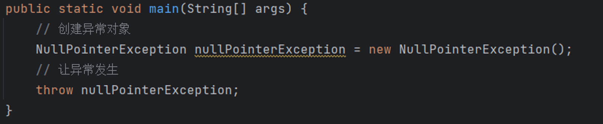

+ **第二个阶段：`让异常发生`**

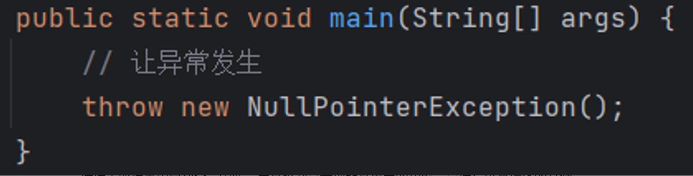

```java
package com.powernode.javase;

/**
 * 异常在程序中到底是如何发生的？
 */
public class ExceptionTest02 {
    public static void main(String[] args) {
        // 异常的发生要经历两个阶段
        // 第一个阶段：创建异常对象
        //NullPointerException e = new NullPointerException();
        // 第二个阶段：让异常发生（手动抛出异常）
        //throw e;

        // 合并一步
        throw new NullPointerException();

    }
}
```

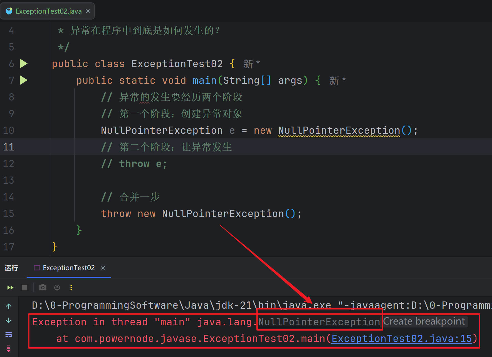


## 异常继承结构

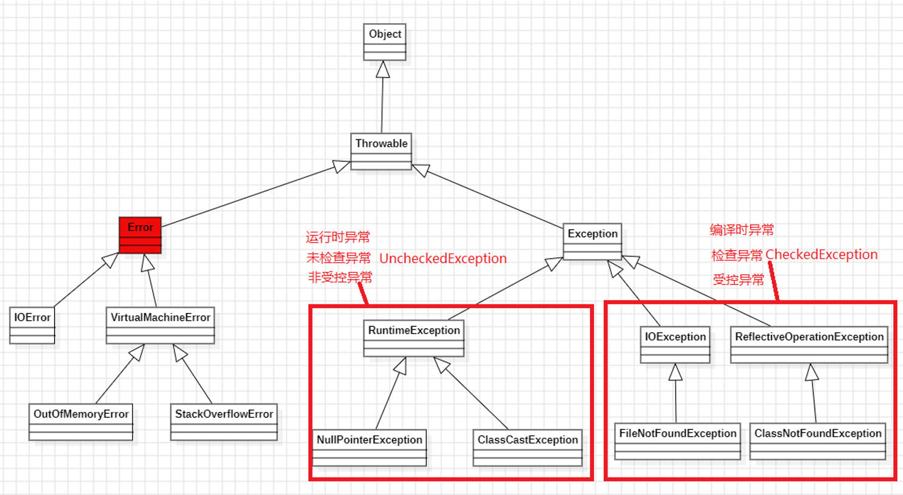

①所有的`异常和错误`都是`可抛出的`。都`继承了Throwable类`。

②`Error`是`无法处理的`，出现后只有一个结果：`JVM终止`。

③`Exception`是`可以处理的`。

④Exception的分类：

1. **所有的`RuntimeException`的子类：运行时异常/未检查异常`(UncheckedException)`/非受控异常**

   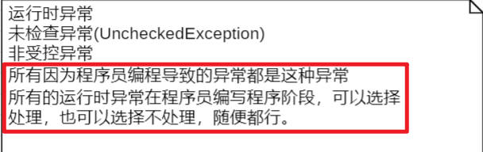

2. **Exception的子类`（除RuntimeException之外）`：编译时异常/检查异常`(CheckedException)`/受控异常**

   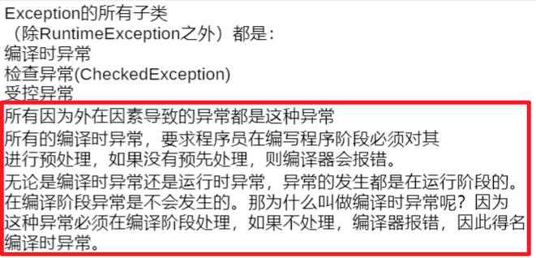

⑤`编译时异常`和`运行时异常`区别：

1. `编译时异常`特点：在`编译阶段必须提前处理`，如果`不处理编译器报错`。

2. `运行时异常`特点：在`编译阶段可以选择处理`，也`可以不处理`，没有硬性要求。

3. `编译时异常`一般是`由外部环境或外在条件引起的`，如`网络故障、磁盘空间不足、文件找不到`等

4. `运行时异常`一般是`由程序员的错误引起的`，并且`不需要强制进行异常处理`

**注意：编译时异常并不是在编译阶段发生的异常，`所有的异常发生都是在运行阶段的`，因为每个异常发生都是会`new异常对象的`，new异常对象只能在`运行阶段完成`。那为什么叫做编译时异常呢？这是因为这种异常必须在`编译阶段提前预处理`，如果`不处理编译器报错`，因此而得名`编译时异常`。**


## 自定义异常

### 自定义异常的步骤 

①**第一步：编写`异常类`继承`Exception/RuntimeException`**

②**第二步：提供`一个无参数构造方法`，再提供`一个带String msg参数的构造方法`，在构造方法中`调用父类的构造方法`。**

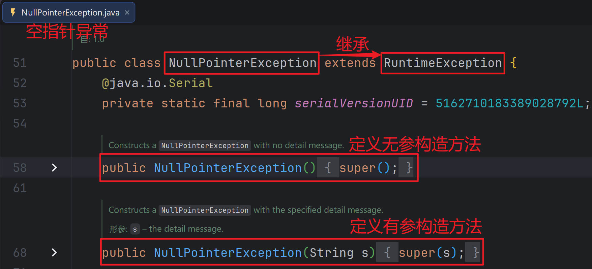

+ 定义一个运行时异常

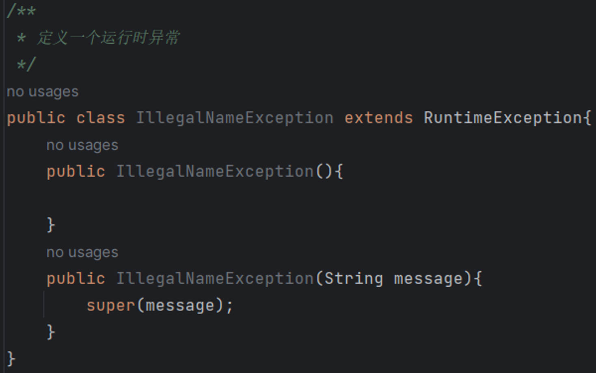

+ 定义一个编译时异常

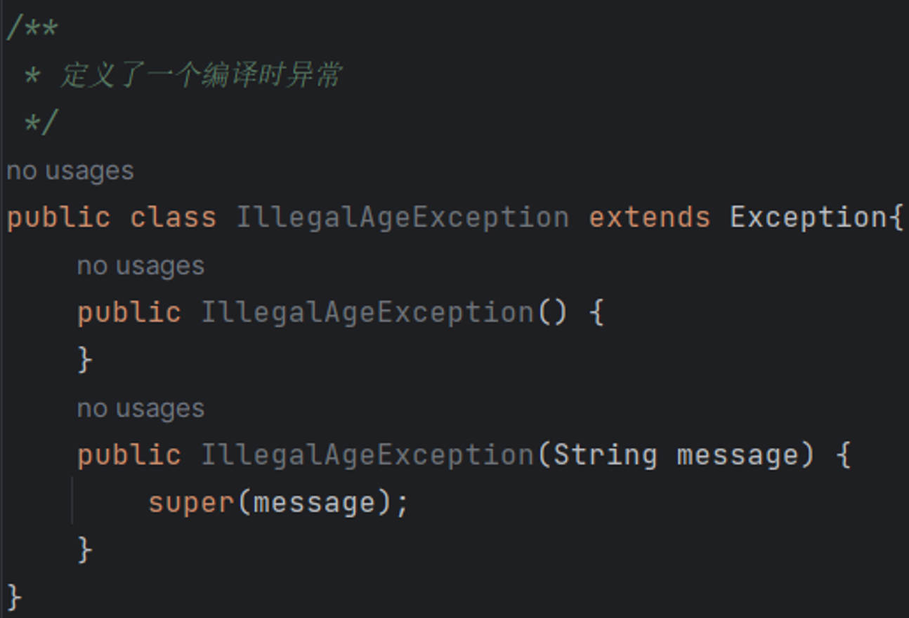


### 自定义异常练习

①定义两个编译时异常：

1. `IllegalNameException` ：**无效名字异常**

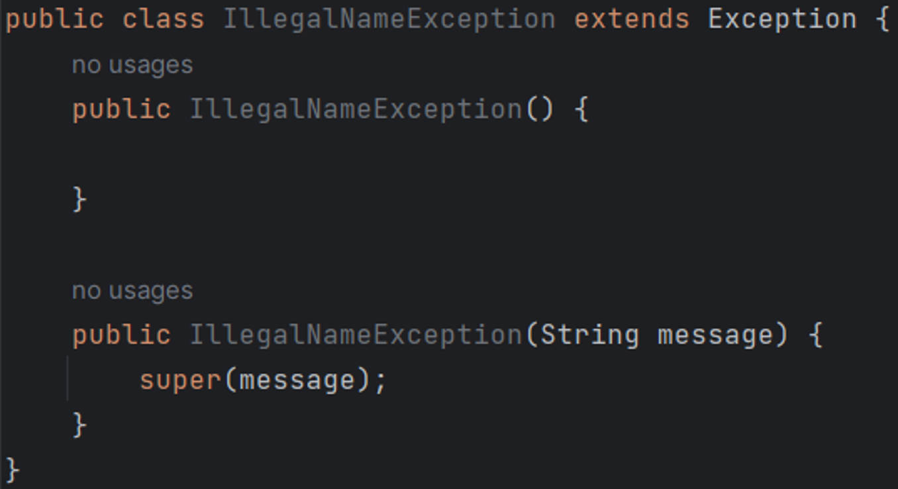

2. `IllegalAgeException`： **无效年龄异常**

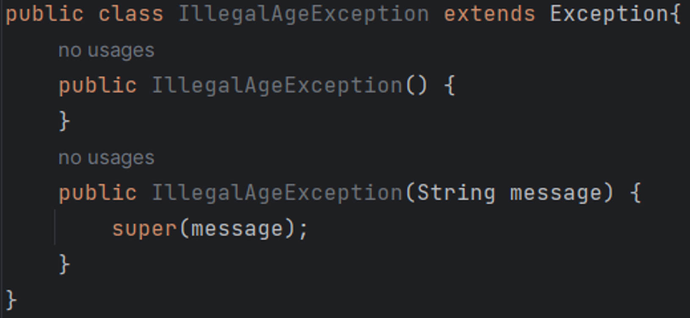

②完成这样的需求：

1. **编写一个用户注册的方法，该方法接收两个参数，一个是用户名，一个是年龄。如果用户名长度在`[6 - 12]位`，并且`年龄大于18岁`时，输出`用户注册成功`。**

2. **如果`用户名长度不是[6 - 12]位`时，让程序出现异常，让`IllegalNameException异常发生`！**

3. **如果`年龄小于18岁`时，让程序出现异常，让`IllegalAgeException异常发生`！**

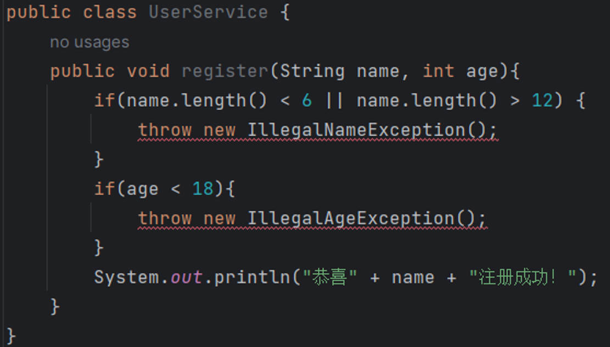


## 异常的处理

异常的处理包括两种方式：

1. **`声明异常`：类似于`推卸责任的处理方式`**

+ 在方法定义时使用`throws关键字声明异常`，告知调用者，调用这个方法`可能会出现异常`。这种处理方式的态度是：**如果出现了异常则会抛给`调用者来处理`。**

2. **`捕捉异常`：真正的`处理捕捉异常`**

+ 在可能出现异常的代码上使用`try..catch`进行`捕捉处理`。这种处理方式的态度是：**把异常抓住。其它方法如果调用这个方法，对于`调用者来说是不知道这个异常发生的`。因为这个`异常被抓住并处理掉了`。**

3. 异常在处理的整个过程中应该是：`声明和捕捉联合使用`。

4. 什么时候捕捉？什么时候声明？

+ 如果异常发生后`需要调用者来处理`的，`需要调用者知道`的，则采用`声明方式`。否则`采用捕捉`。


### 第一种处理方式：声明异常 （**throws**关键字）

如果一个异常发生后希望调用者来处理的，使用声明异常（俗话说：**交给上级处理**）

```java
public void m() throws AException, BException... {}
```

如果`AException`和`BException`都继承了`XException`，那么也可以这样写：

```java
public void m() throws XException{}
```

调用者在调用m()方法时，编译器会检测到该方法上用throws声明了异常，表示可能会抛出异常，编译器会继续检测该异常是否为编译时异常，如果为编译时异常则必须在编译阶段进行处理，如果不处理编译器就会报错。

如果`所有位置都采用throws`，包括`main方法的处理态度也是throws`，如果运行时出现了异常，`最终异常是抛给了main方法的调用者（JVM）`，`JVM`则会`终止程序的执行`。因此为了`保证程序在出现异常后不被中断`，至少`main方法不要再使用throws`进行声明了。

发生异常后，在发生异常的位置上，`往下的代码是不会执行的`，除非进行了异常的捕捉。

```java
package com.powernode.javase;

import com.powernode.javase.exception.IllegalAgeException;
import com.powernode.javase.exception.IllegalNameException;

import java.util.Scanner;

public class ExceptionTest03 {
    // public static void main(String[] args) throws IllegalNameException, IllegalAgeException {
    public static void main(String[] args) throws Exception {
    // public static void main(String[] args) throws IllegalRealnameException, IllegalAgeException {
        Scanner scanner =new Scanner(System.in);
        System.out.println("欢迎使用本系统，先进行用户注册：");
        System.out.print("请输入用户名：");
        String name = scanner.next();
        System.out.print("请输入年龄：");
        int age = scanner.nextInt();

        // 注册
        UserService userService = new UserService();
        userService.register(name, age); // 这里的代码可能出现异常，如果一旦出现异常，后续代码则不再执行。

        System.out.println("main over!");
    }
}

/**
 *用户的业务层
 */
class UserService {
    public void register(String name, int age) throws IllegalNameException, IllegalAgeException {
        System.out.println("正在注册，请稍后....");
        UserDao userDao = new UserDao();
        userDao.save(name, age); //这里有可能出现异常，出现了异常之后，后续程序则不再执行了。
        System.out.println("注册成功，欢迎[" + name +"]");
    }
}


/**
 * 操作数据库的一个类
 */
class UserDao{
    /**
     * 用户要注册，肯定最后用户名和年龄这个用户相关的信息是需要保存的。
     * @param name 用户名
     * @param age 年龄
     */
    public void save(String name, int age) throws IllegalNameException, IllegalAgeException {
        System.out.println("用户["+name+"]的信息正在保存....");
        if(name.length()< 6 || name.length()> 12){
            throw new IllegalNameException();
            // 这里不能写任何代码，因为这里的代码永远都不会执行。
            //System.out.println("hello world");
        }
        if(age < 18){
            throw new IllegalAgeException();
        }
        System.out.println("用户["+name+"]的信息保存成功！");
    }
}
```

> **测试结果:**
>
> 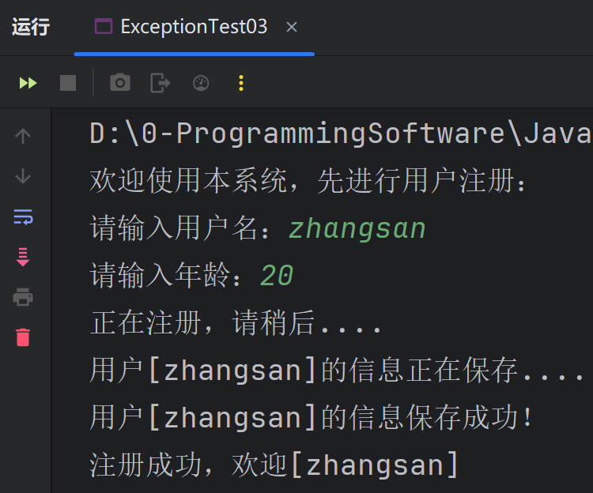
>
> 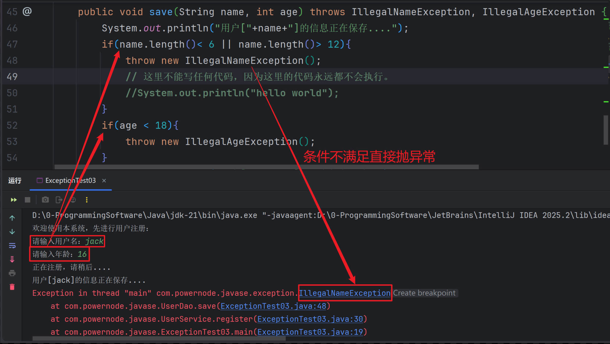


### 第二种处理方式：捕捉异常 (try...catch...关键字)

如果一个异常发生后，`不需要调用者知道`，也`不需要调用者来处理`，选择使用`捕捉方式处理`。

```java
try{
// 尝试执行可能会出现异常的代码
// try块中的代码如果执行出现异常，出现异常的位置往下的代码是不会执行的，直接进入catch块执行
}catch(AException e){
// 如果捕捉到AException类型的异常，在这里处理
}catch(BException e){
// 如果捕捉到BException类型的异常，在这里处理
}catch(XException e){
// 如果捕捉到XException类型的异常，在这里处理
}
// 当try..catch..将所有发生的异常捕捉后，这里的代码是会继续往下执行的。

另外注意：
   1.catch语句块可以看做是分支，try catch语句中，最多只有一个catch分支执行。
   2.catch可以写多个，但是必须遵循自上而下，从小到大。
```

**catch可以`写多个`。并且遵循`自上而下`，`从小到大`。**

```java
try {
      // 可能出现异常的代码
      userService.register(name, age);
      // 如果以上代码出现异常，这里不会执行。
      System.out.println("如果出现异常，这里的代码会不会执行！");
} catch (IllegalNameException e) {
       System.out.println("对不起，用户名不合法！");
} catch (IllegalAgeException e) {
       System.out.println("对不起，年龄不合法！");
}


try {
     // 可能出现异常的代码
     userService.register(name, age);
     // 如果以上代码出现异常，这里不会执行。
     System.out.println("如果出现异常，这里的代码会不会执行！");
} catch(Exception e){
     System.out.println("异常发生了");
}


try {
     // 可能出现异常的代码
     userService.register(name, age);
     // 如果以上代码出现异常，这里不会执行。
     System.out.println("如果出现异常，这里的代码会不会执行！");
}catch(IllegalNameException e){
     System.out.println("名字有问题！");
   //System.out.println(e);//com.powernode.javase.exception.IllegalNameException
}catch(Exception e){
     System.out.println("异常发生了");
}


// 编译报错
try {
     // 可能出现异常的代码
     userService.register(name, age);
     // 如果以上代码出现异常，这里不会执行。
     System.out.println("如果出现异常，这里的代码会不会执行！");
}catch(Exception e){
     System.out.println("异常发生了");
}catch(IllegalAgeException e){

}
```

Java7新特性：`catch后面小括号`中可以编写`多个异常`，使用`运算符“|”隔开`。

```java
// java7的新特性
try {
     // 可能出现异常的代码
     userService.register(name, age);
     // 如果以上代码出现异常，这里不会执行。
     System.out.println("如果出现异常，这里的代码会不会执行！");
}catch(IllegalNameException | IllegalAgeException e){
     System.out.println("对不起，参数不合法！");
}
```

> **小练习:**

```java
package com.powernode.javase.trytest;

import com.powernode.javase.exception.IllegalAgeException;
import com.powernode.javase.exception.IllegalNameException;

import java.util.Scanner;

public class ExceptionTest04 {
    public static void main(String[] args) {
        Scanner scanner =new Scanner(System.in);
        System.out.println("欢迎使用本系统，先进行用户注册：");
        System.out.print("请输入用户名：");
        String name = scanner.next();
        System.out.print("请输入年龄：");
        int age = scanner.nextInt();

        // 注册
        UserService userService = new UserService();
        /*try {
            // 可能出现异常的代码
            userService.register(name, age);
            // 如果以上代码出现异常，这里不会执行。
            System.out.println("如果出现异常，这里的代码会不会执行！");
        } catch (IllegalNameException e) {
            System.out.println("对不起，用户名不合法！");
        } catch (IllegalAgeException e) {
            System.out.println("对不起，年龄不合法！");
        }*/

        /*try {
            // 可能出现异常的代码
            userService.register(name, age);
            // 如果以上代码出现异常，这里不会执行。
            System.out.println("如果出现异常，这里的代码会不会执行！");
        } catch(Exception e){
            System.out.println("异常发生了");
        }*/

        /*try {
            // 可能出现异常的代码
            userService.register(name, age);
            // 如果以上代码出现异常，这里不会执行。
            System.out.println("如果出现异常，这里的代码会不会执行！");
        }catch(IllegalNameException e){
            System.out.println("名字有问题！");
            // System.out.println(e); //com.powernode.javase.exception.IllegalNameException
        }catch(Exception e){
            System.out.println("异常发生了");
        }*/

        // 编译报错
        /*try {
            // 可能出现异常的代码
            userService.register(name, age);
            // 如果以上代码出现异常，这里不会执行。
            System.out.println("如果出现异常，这里的代码会不会执行！");
        }catch(Exception e){
            System.out.println("异常发生了");
        }catch(IllegalAgeException e){

        }*/

        // java7的新特性
        try {
            // 可能出现异常的代码
            userService.register(name, age);
            // 如果以上代码出现异常，这里不会执行。
            System.out.println("如果出现异常，这里的代码会不会执行！");
        }catch(IllegalNameException | IllegalAgeException e){
            System.out.println("对不起，参数不合法！");
        }

        System.out.println("main over!");
    }
}


class UserService {
    public void register(String name, int age) throws IllegalNameException, IllegalAgeException {
        System.out.println("正在注册，请稍后....");
        UserDao userDao = new UserDao();
        userDao.save(name, age);
        System.out.println("注册成功，欢迎[" + name +"]");
    }
}


class UserDao{
    public void save(String name, int age) throws IllegalNameException, IllegalAgeException {
        System.out.println("用户["+name+"]的信息正在保存....");
        if(name.length()< 6 || name.length()> 12){
            throw new IllegalNameException();
        }
        if(age < 18){
            throw new IllegalAgeException();
        }
        System.out.println("用户["+name+"]的信息保存成功！");
    }
}
```

> **测试结果:**
>
> 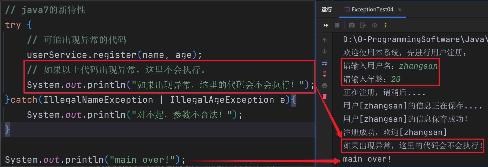
>
> 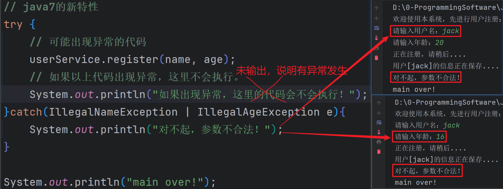


## 异常的常用方法

1. 获取异常的简单描述信息：

+ `nexception.getMessage();`
+ 获取的message是通过`构造方法创建异常对象时传递过去的message`。

```java
try {
    userService.register(name, age);
} catch (IllegalNameException e) {
        // 这个方法可以获取当时创建异常对象时给异常构造方法传递的String message参数的值。
        String  message = e.getMessage();
        System.out.println(message);
} catch (IllegalAgeException e) {
        String  message = e.getMessage();
        System.out.println(message);
}
```

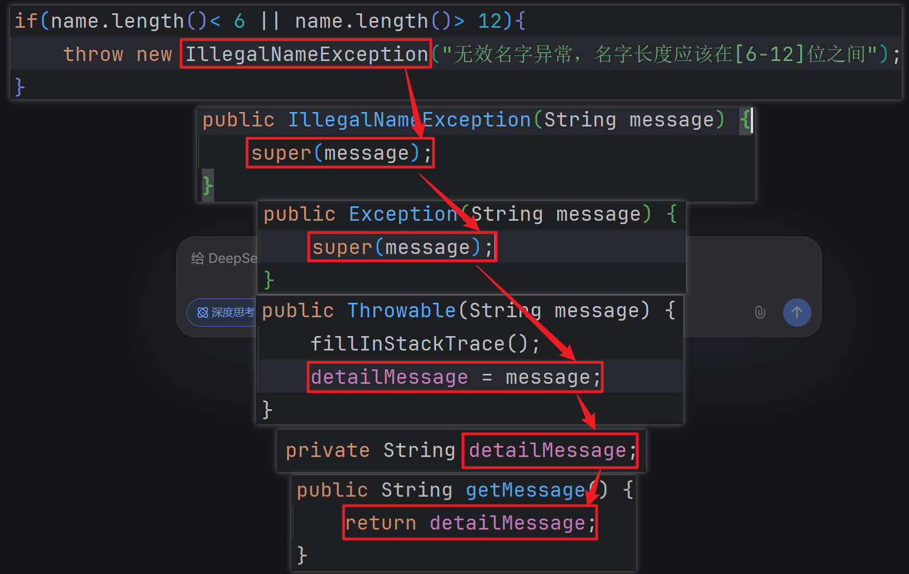

```java
package com.powernode.javase.exceptionmethod;

import com.powernode.javase.exception.IllegalAgeException;
import com.powernode.javase.exception.IllegalNameException;

import java.util.Scanner;

public class ExceptionTest07 {
    public static void main(String[] args) {

        Scanner scanner =new Scanner(System.in);
        System.out.println("欢迎使用本系统，先进行用户注册：");
        System.out.print("请输入用户名：");
        String name = scanner.next();
        System.out.print("请输入年龄：");
        int age = scanner.nextInt();

        // 注册
        UserService userService = new UserService();
        try {
            userService.register(name, age);
        } catch (IllegalNameException e) {
            // 这个方法可以获取当时创建异常对象时给异常构造方法传递的String message参数的值。
            String  message = e.getMessage();
            System.out.println(message);
        } catch (IllegalAgeException e) {
            String  message = e.getMessage();
            System.out.println(message);
        }
    }
}


class UserService {
    public void register(String name, int age) throws IllegalNameException, IllegalAgeException {
        System.out.println("正在注册，请稍后....");
        UserDao userDao = new UserDao();
        userDao.save(name, age);
        System.out.println("注册成功，欢迎[" + name +"]");
    }
}


class UserDao{
    public void save(String name, int age) throws IllegalNameException, IllegalAgeException {
        System.out.println("用户["+name+"]的信息正在保存....");
        if(name.length()< 6 || name.length()> 12){
            throw new IllegalNameException("无效名字异常，名字长度应该在[6-12]位之间");
        }
        if(age < 18){
            throw new IllegalAgeException("无效年龄异常，年龄需要大于18岁");
        }
        System.out.println("用户["+name+"]的信息保存成功！");
    }
}
```

> **测试结果:**
>
> 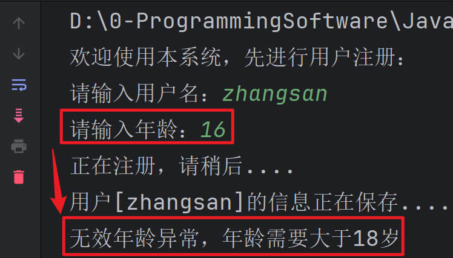
>
> 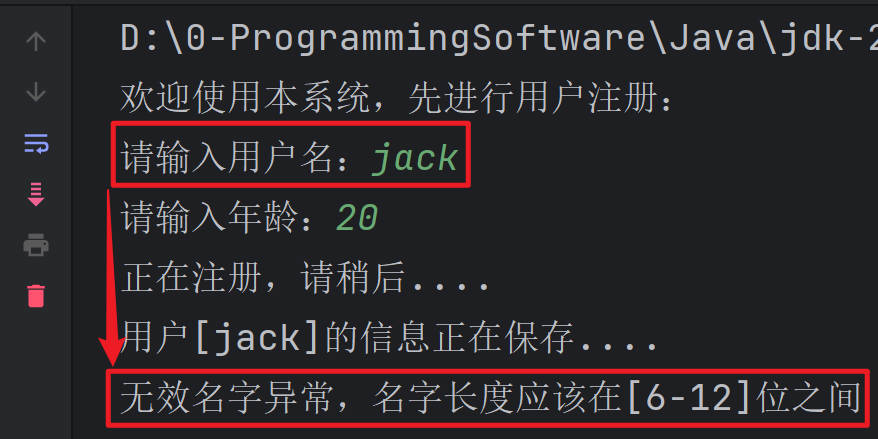


2. 打印异常堆栈信息：

+ `nexception.printStackTrace();`

```java
try {
        userService.register(name, age);
} catch (IllegalNameException e) {
        // 真正的开发中，这里不要空白。
        // 这个方法可以帮助我们程序员去调试程序。
        // 打印异常堆栈信息。
        e.printStackTrace();
} catch (IllegalAgeException e) {
        e.printStackTrace();
}
```

```java
package com.powernode.javase.exceptionmethod;

import com.powernode.javase.exception.IllegalAgeException;
import com.powernode.javase.exception.IllegalNameException;

import java.util.Random;
import java.util.Scanner;

public class ExceptionTest07 {
    public static void main(String[] args) {

        Scanner scanner =new Scanner(System.in);
        System.out.println("欢迎使用本系统，先进行用户注册：");
        System.out.print("请输入用户名：");
        String name = scanner.next();
        System.out.print("请输入年龄：");
        int age = scanner.nextInt();

        // 注册
        UserService userService = new UserService();
        try {
            userService.register(name, age);
        } catch (IllegalNameException e) {
            // 真正的开发中，这里不要空白。
            // 这个方法可以帮助我们程序员去调试程序。
            // 打印异常堆栈信息。
            e.printStackTrace();
        } catch (IllegalAgeException e) {
            e.printStackTrace();
        }

        Random r = new Random();
        int[] arr = new int[10000000];
        for (int i = 0; i < 10000000; i++) {
            arr[i] = r.nextInt(10000000);
        }
        System.out.println("hello world!");
    }
}


class UserService {
    public void register(String name, int age) throws IllegalNameException, IllegalAgeException {
        System.out.println("正在注册，请稍后....");
        UserDao userDao = new UserDao();
        userDao.save(name, age);
        System.out.println("注册成功，欢迎[" + name +"]");
    }
}


class UserDao{
    public void save(String name, int age) throws IllegalNameException, IllegalAgeException {
        System.out.println("用户["+name+"]的信息正在保存....");
        if(name.length()< 6 || name.length()> 12){
            throw new IllegalNameException("无效名字异常，名字长度应该在[6-12]位之间");
        }
        if(age < 18){
            throw new IllegalAgeException("无效年龄异常，年龄需要大于18岁");
        }
        System.out.println("用户["+name+"]的信息保存成功！");
    }
}
```

> **测试结果:**
>
> 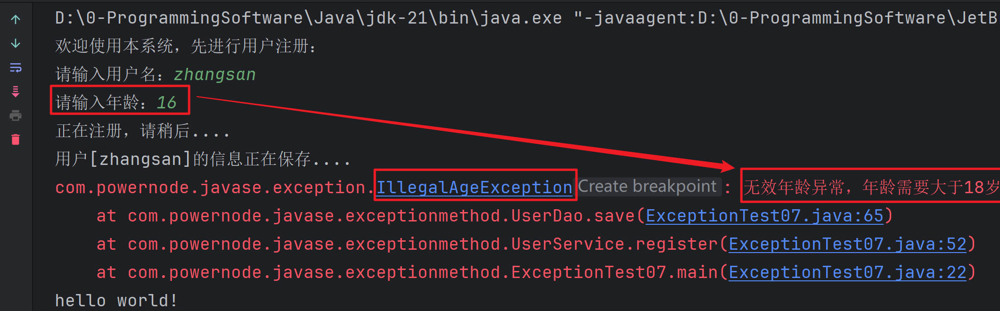

3. 要会看异常的堆栈信息：

+ 异常信息的打印是符合栈数据结构的。

+ 看异常信息主要看最开始的描述信息。看栈顶信息。

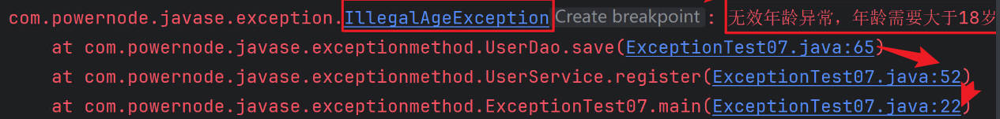


## finally语句块

1. finally语句块中的代码是一定会执行的。

2. finally语句块不能单独使用，至少需要配合try语句块一起使用：

+ try...finally

+ try...catch...finally

3. 通常在finally语句块中完成资源的释放

+ 资源释放的工作比较重要，如果资源没有释放会一直占用内存。

+ 为了保证资源的关闭，也就是说：不管程序是否出现异常，关闭资源的代码一定要保证执行。

+ 因此在finally语句块中通常进行资源的释放。

4. final、finally、finalize分别是什么？

+ final是一个关键字，修饰的类无法继承，修饰的方法无法覆盖，修饰的变量不能修改。

+ finally是一个关键字，和try一起使用，finally语句块中的代码一定会执行。

+ finalize是一个标识符，它是Object类中的一个方法名。


