## 数组概述

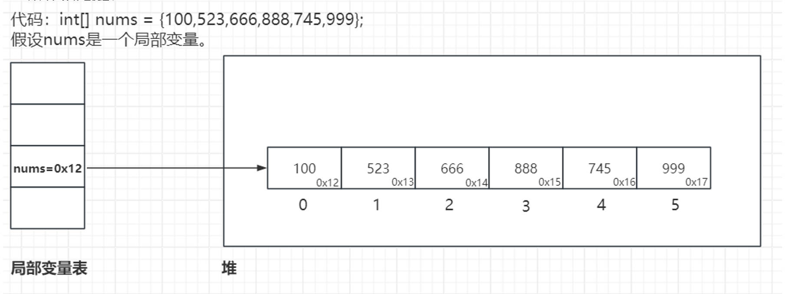

### 什么是数组？

1. 在Java中，数组是一种用于存储多个`相同数据类型元素`的容器。

2. 例如一个`存储整数`的数组：

   ```java
   int[] nums = {100, 200, 300};
   ```

3. 例如一个`存储字符串`的数组：

   ```java
   String[] names = {“jack”,“lucy”,“lisi”};
   ```

4. 数组是一种`引用数据类型`，`隐式继承Object`。因此数组也`可以调用Object类中的方法`。

5. 数组对象存储在`堆内存`中。

### 数组的分类？

1. 根据`维数`进行分类：`一维数组，二维数组，三维数组，多维数组`。

2. 根据`数组中存储的元素类型`分类：`基本类型数组，引用类型数组`。

3. 根据`数组初始化方式不同`分类：`静态数组，动态数组`。

### Java数组存储元素的特点？

1. `数组长度`一旦确定`不可变`。

2. 数组中元素`数据类型一致`，每个元素`占用空间大小相同`。

3. 数组中每个元素在空间存储上，内存地址是`连续的`。

4. 每个元素有索引，首元素`索引0`，`以1递增`。

5. 以`首元素的内存地址`作为`数组对象`在`堆内存中的地址`。

6. 所有数组对象`都有length属性`用来获取`数组元素个数`。`末尾元素`下标：`length-1`

### 数组优点？

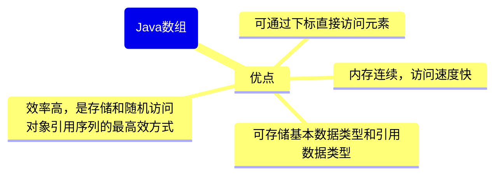
```mermaid
mindmap
  root(Java数组)
    优点
      内存连续，访问速度快
      可通过下标直接访问元素
      可存储基本数据类型和引用数据类型
      效率高，是存储和随机访问对象引用序列的最高效方式
```

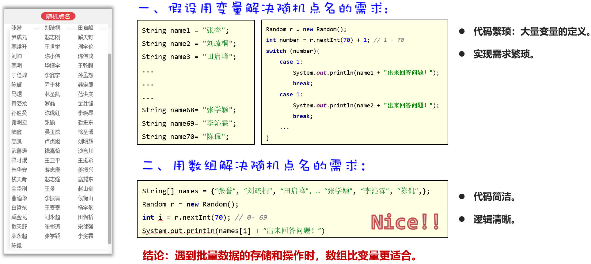

1. 根据`下标查询某个元素的效率极高`。数组中有100个元素和有100万个元素，`查询效率相同`。时间复杂度`O(1)`。也就是说在数组中根据下标查询某个元素时，不管数组的长短，`耗费时间是固定不变的`。

2. **原因：知道`首元素内存地址`，元素在`空间存储上内存地址`又是`连续的`，每个元素`占用空间大小相同`，只要知道下标，就可以通过数学表达式计算出来要查找元素的内存地址。`直接通过内存地址定位元素`。**

### 数组缺点？

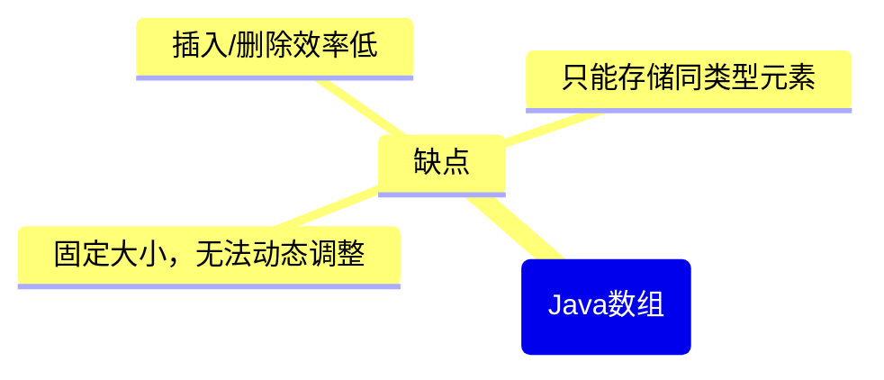
```mermaid
mindmap
  root(Java数组)
    缺点
      固定大小，无法动态调整
      插入/删除效率低
      只能存储同类型元素
```

1. 随机`增删元素的效率较低`。因为随机增删元素时，为了保证数组中元素的`内存地址连续`，就需要涉及到后续元素的`位移问题`。时间复杂度`O(n)`。O(n)表示的是`线性阶`，随着问题规模n的不断增大，时间复杂度不断增大，算法的执行`效率越低`。**（不过需要注意的是：对`数组末尾元素`的`增删效率是不受影响`的。）**

2. `无法存储大量数据`，因为很难在内存上找到`非常大的一块连续的内存`。


## 数组的定义和访问

数组有两种初始化的方式，一种是`静态初始化`、一种是`动态初始化`。我们先用`静态初始化来学习数组的操作。

### 数组的静态初始化

**所谓静态初始化指的是：在`定义数组时`直接给`数组中的数据赋值`。**

#### **静态初始化标准格式：**

```java
数据类型[] 变量名 = new 数据类型[]{元素1,元素2,元素3};
```

按照格式定义int类型、double类型数组

```java
//定义数组，用来存储多个年龄
int[] ages = new int[]{12, 24, 36}
//定义数组，用来存储多个成绩
double[] scores = new double[]{89.9, 99.5, 59.5, 88.0};
```


#### **静态初始化简化格式**

Java语言的设计者为了简化定义数组的写法，还为静态初始化提供了一种简化写法

```java
数据类型[] 变量名 = {元素1,元素2,元素3};
```

使用简化格式定义int类型、double类型数组

```java
//定义数组，用来存储多个年龄
int[] ages = {12, 24, 36}
//定义数组，用来存储多个成绩
double[] scores = {89.9, 99.5, 59.5, 88.0};
```


#### **注意哟！！**

- 定义数组时， `数据类型[] 数组名` 也可写成 `数据类型 数组名[]` 

```java
//以下两种写法是等价的。但是建议大家用第一种，因为这种写法更加普遍
int[] ages = {12, 24, 36};
int ages[] = {12, 24, 36}
```


#### **数组在计算机中的基本原理**

我们知道数组是怎么定义的之后，那么接下来看一下数组在计算机中的基本原理。

我们以`int[] ages = {12,24,36};`这句话为例，看一下这句话到底在计算机中做了那些事情。

- 首先，左边`int[] ages` 表示定义了一个数组类型的变量，变量名叫ages
- 其次，右边`{12,24,36}`表示创建一个数组对象，你完全可以把它理解成一个能装数据的东西。这个对象在内存中会有一个地址值`[I@4c873330`，每次创建一个数组对象都会有不用的地址值。
- 然后，把右边的地址值`[I@4c873330`赋值给左边的ages变量
- 所以，ages变量就可以通过地址值，找到数组这个东西。

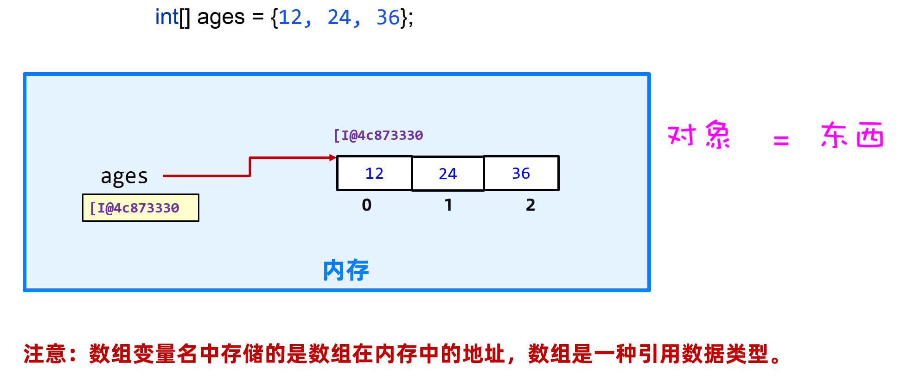


### 数组的元素访问

各位同学，通过刚才的学习，我们知道数组是用来存储数据的。那么数组中存储的数据又如何访问呢？这里所说的访问，意思就是获取中数组中数据的值、或者给数组中的数据赋值。

这里先给大家统一几个概念，数组中存储的数据我们叫做元素；而且数组中的每一个元素都有一个编号与之对应，我们把这个编号叫做索引，这个索引是从0依次递增的整数。如下图所示

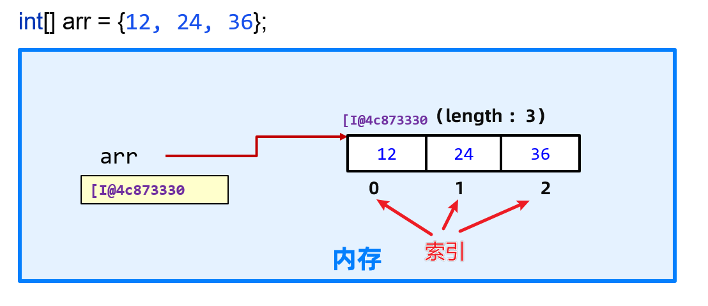

要想访问数组中的元素，格式如下

```java
//数组名可以找到数组对象的地址，再通过索引就可以定位到具体的元素了
数组名[索引]
```

接下来用代码来演示一下

```java
//索引：	   0   1   2
int[] arr = {12, 24, 36};
// 1、访问数组的全部数据
System.out.println(arr[0]); //12
System.out.println(arr[1]); //24
System.out.println(arr[2]); //36
//下面代码没有3索引，会出现ArrayIndexOutOfBoundsException 索引越界异常
//System.out.println(arr[3]); 

// 2、修改数组中的数据
arr[0] = 66;
arr[2] = 100;
System.out.println(arr[0]); //66
System.out.println(arr[1]); 0
System.out.println(arr[2]); //100
```

除了访问数组中的元素，我们可以获取数组中元素的个数，后面我们统称为数组的长度。

```java
// 3、访问数组的元素个数：数组名.length
System.out.println(arr.length);

// 技巧：获取数组的最大索引: arr.length - 1(前提是数组中存在数据)
System.out.println(arr.length - 1);

int[] arr2 = {};
System.out.println(arr2.length - 1);
```


### 数组的遍历

各位同学，接下来我们学习一个对数组最最最常见的操作——`数组遍历`。所谓遍历意思就是`将数组中的元素一个一个的取出来`。

#### **普通遍历:**

我们刚才学习了数组中元素的访问，访问元素必须用到索引，如下列代码。

```java
int[] ages = {12, 24, 36};
System.out.println(ages[0]);
System.out.println(ages[1]);
System.out.println(ages[2]);
```

但是，如果数组中有很多很多元素，索引靠自己一个一个数肯定是不行的！我们可以使用for循环从0开始一直遍历到长度-1的位置，就可以获取所有的索引了。 

当你获取到每一个索引，那么每一个元素不就获取到了吗？上代码吧

```java
int[] ages = {12, 24, 36};

// 从前往后遍历
for (int i = 0; i < ages.length; i++) {
    // i的取值 = 0,1,2
    System.out.println(ages[i]); // 12 24 36
}

// 从后往前遍历
for (int i = ages.length-1; i >= 0; i--) {
    System.out.println(ages[i]); // 36 24 12
}
```


#### **for-each遍历(优点是代码简洁,缺点是没有下标):**

```java
增强for循环/for-each循环。JDK5的新特性。

for each语法结构：
     for(数据中元素的数据类型 变量名 : 数组名){

     }

 注意：变量名 代表数组中的每个元素。

for each的优点：代码简洁，可读性强。

for each的缺点：没有下标。（如果需求中需要使用到下标，这种方式就差一点。）
```

```java
package com.powernode.javase;

public class ArrayTest02 {
    public static void main(String[] args) {
        // 静态初始化一维数组
        int[] arr = {100, 200, 300};
        String[] names = {"jack", "lucy", "tom"};

        // 遍历arr数组(for-each)
        for(int num : arr){
            // num代表数组中的每个元素
            System.out.println(num);
        }

        // 需求：遍历数组arr，最后一个元素翻倍。
        for (int i = 0; i < arr.length; i++) {
            if(i == arr.length - 1){
                System.out.println(arr[i] * 2);
            }else{
                System.out.println(arr[i]);
            }
        }

        // 遍历names数组(for-each)
        for(String name : names){
            System.out.println(name);
        }
    }
}
```

> **测试结果:**
>
> 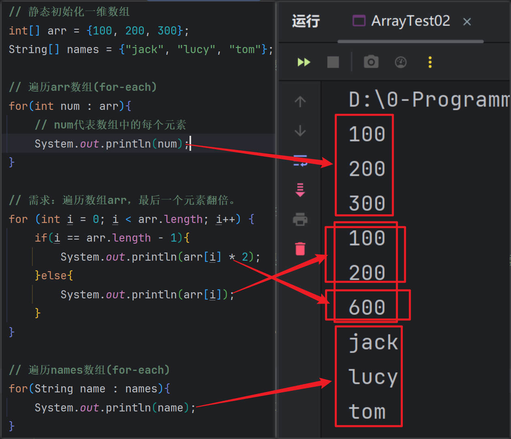


### 数组静态初始化案例

```java
需求：获取10个学生成绩，然后把成绩保存在数组中，接着遍历数组获得学生成绩，最后计算总分和平均分

需求分析：
	1.输入功能：获取10个学生的成绩
      double[] scores = {0,0,0,0,0,0,0,0,0,0};

        Scanner scanner = new Scanner(System.in);
        for (int i = 0; i < 10; i++) {
            System.out.print("请输入第"+(i + 1)+"个学生的成绩：");
            // 接收输入的成绩
            double score = scanner.nextDouble();
            // 将成绩存放到容器中
            scores[i] = score;
        }

     2.存储功能：将成绩保存在数组中
       // 遍历这个数组中的每个数据。
        double sum = 0.0;
        for (int i = 0; i < scores.length; i++) {
            System.out.println("学生" +(i + 1) + "的成绩是" + scores[i]);
            // i = 0  1  2  3  4  5  6  7  8  9
            sum += scores[i];
        }

     3.处理功能：计算总分和平均分
       System.out.println("总分:" + sum);
       System.out.println("平均分:" + sum / scores.length);
```

按照分析的思路来写代码

```java
package com.powernode.javase;

import java.util.Scanner;

/**
 * 获取10个学生成绩，然后把成绩保存在数组中，接着遍历数组获得学生成绩，最后计算总分和平均分
 */
public class ArrayTest03 {
    public static void main(String[] args) {
        // 定义一个一维数组（提醒：数组当中存储的元素类型是一致的。）
        // 容器：存放学生的成绩。
        double[] scores = {0,0,0,0,0,0,0,0,0,0};

        Scanner scanner = new Scanner(System.in);
        for (int i = 0; i < 10; i++) {
            System.out.print("请输入第"+(i + 1)+"个学生的成绩：");
            // 接收输入的成绩
            double score = scanner.nextDouble();
            // 将成绩存放到容器中
            scores[i] = score;
        }

        // 遍历这个数组中的每个数据。
        double sum = 0.0;
        for (int i = 0; i < scores.length; i++) {
            System.out.println("学生" +(i + 1) + "的成绩是" + scores[i]);
            // i = 0  1  2  3  4  5  6  7  8  9
            sum += scores[i];
        }

        // 计算总分和平均分
        System.out.println("总分:" + sum);
        System.out.println("平均分:" + sum / scores.length);
    }
}
```

> **测试结果:**
>
> 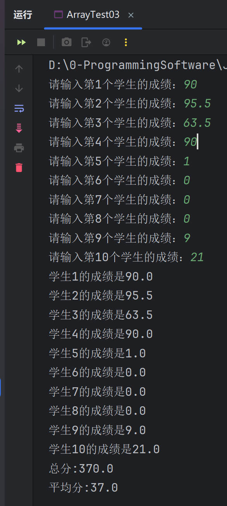


### 数组的动态初始化

各位同学，刚才我们初始化数组时，都是直接将元素写出来。但是还有另一个初始化数组的方式叫 **动态初始化**。

**动态初始化不需要我们写出具体的元素，而是`指定元素类型和长度就行`。**格式如下

```java
//数据类型[]  数组名 = new 数据类型[长度];
int[] arr = new int[3];
```

> **温馨提示:**
>
> 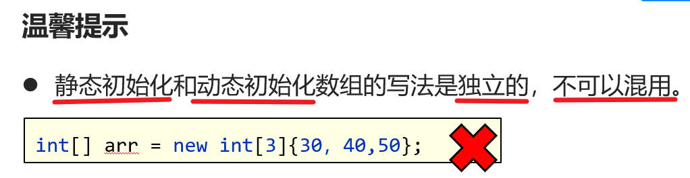

```java
// 后赋值
arr[0] = 10;
System.out.println(arr[0]); // 10
```

下面是动态初始化数组的原理图。我们发现`int[] arr` 其实就是一个变量，它记录了`数组对象的地址值`，而且数组中的`元素默认值是0`。

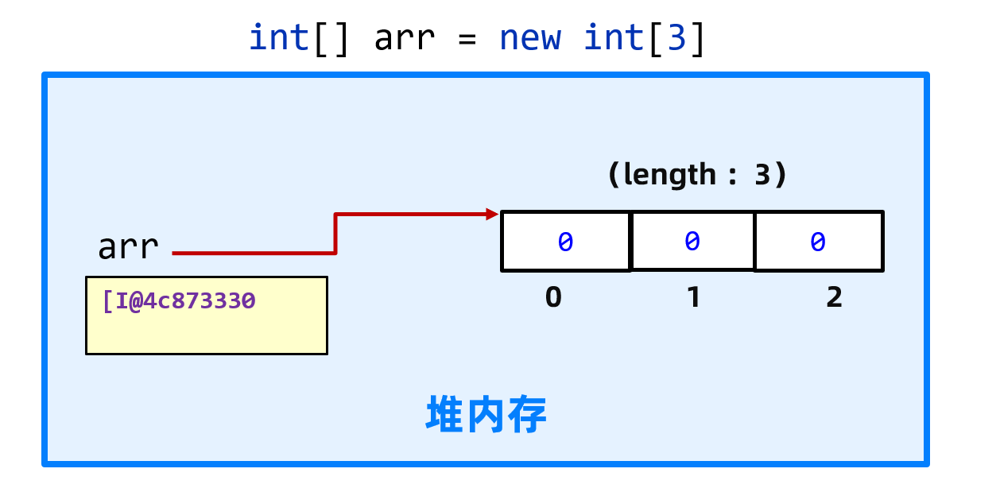

**注意：**

**使用`动态初始化定义数组`时，根据`元素类型不同`，`默认值也有所不同`。**

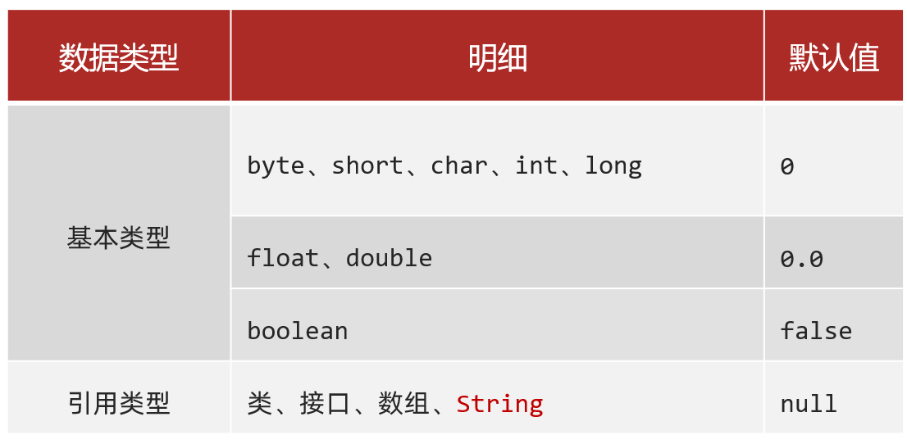


### 数组动态初始化案例

各位同学，接下来我们做一个数组动态初始化的案例。

```java
案例需求：
	某歌唱比赛，需要开发一个系统：可以录入6名评委的打分，录入完毕后立即输出平均分做
	选手得分

需求分析：
	1.需要录入6名评委的分数，可以用一个数组来保存。
	   因为在评委没有录入分数之前，还不确定数组中应该存哪些数据。
	   所以可以使用数组的动态初始化
	2.遍历数组中的每一个位置，并录入分数，将分数存入数组中
	3.遍历数组中的每一个元素，对元素求和
```

代码如下

```java
// 1、定义一个动态初始化的数组，负责后期存储6个评委的打分。
double[] scores = new double[6];

Scanner sc  = new Scanner(System.in);

// 2、遍历数组中的每个位置，录入评委的分数，存入到数组中去
for (int i = 0; i < scores.length; i++) {
    // i = 0 1 2 3 4 5
    System.out.println("请您输入当前第" + (i + 1) +"个评委的分数：");
    double score = sc.nextDouble();
    scores[i] = score;
}

// 3、遍历数组中的每个元素进行求和
double sum  = 0;
for (int i = 0; i < scores.length; i++) {
    sum += scores[i];
}
System.out.println("选手最终得分是：" + sum / scores.length);
```


## 三、数组在计算机中的执行原理

好的各位同学，在前面我们已经学习了数组的基本使用，也理解了数组的基本原理。由于数组是一个容器，变量也是一个容器，在理解他们执行原理的时候，有些同学就容易搞混，现在我把他们放在一起带着大家回顾一下他们的会执行原理，顺便带着大家详细理解一下Java程序的执行的内存原理。

### 3.1 数组的执行原理，Java程序的执行原理

我们以下面的代码，来讲解变量、数组的执原理。

> **例1:**

```java
public class ArrayDemo1 {
    public static void main(String[] args) {
        int a = 10;
        System.out.println(a);

        int[] arr = new int[]{11, 22, 33};
        System.out.println(arr);

        System.out.println(arr[1]);

        arr[0] = 44;
        arr[1] = 55;
        arr[2] = 66;

        System.out.println(arr[0]);
        System.out.println(arr[1]);
        System.out.println(arr[2]);
    }
}
```

前面我们给大家讲过，程序是在内存中执行的。实际上Java程序是把编译后的字节码加载到Java虚拟机中执行的。

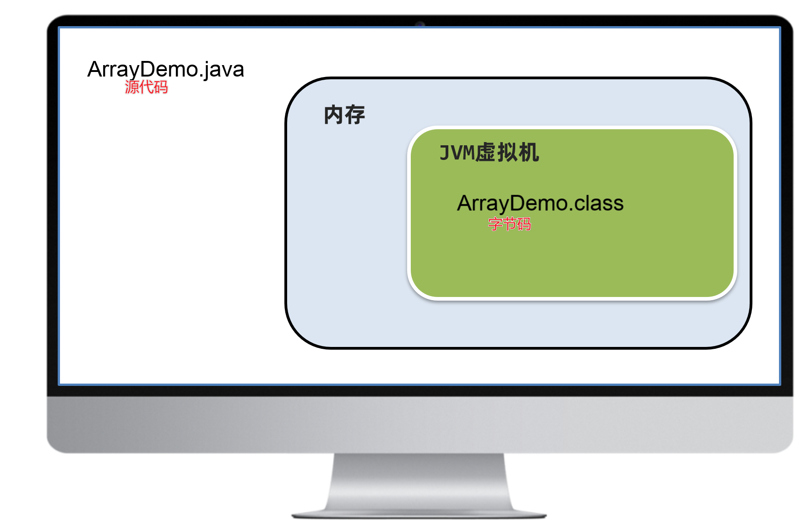

Java为了便于虚拟机执行Java程序，将虚拟机的内存划分为 方法区、栈、堆、本地方法栈、寄存器 这5块区域。同学们需要重点关注的是  **方法区、栈、堆**。

下面把每一个块内存区域作用介绍一下，我们大致只需要知道每一部分存储什么内容就行。

- **方法区**：字节码文件先加载到这里
- **栈**：方法运行时所进入的内存区域，由于变量在方法中，所以变量也在这一块区域中
- **堆**：存储new出来的东西，并分配地址。由于数组是new 出来的，所以数组也在这块区域。

下面是上面案例执行的内存原理如下图所示，按照① ② ③ ④ ⑤ ⑥ 的标记的顺序来看

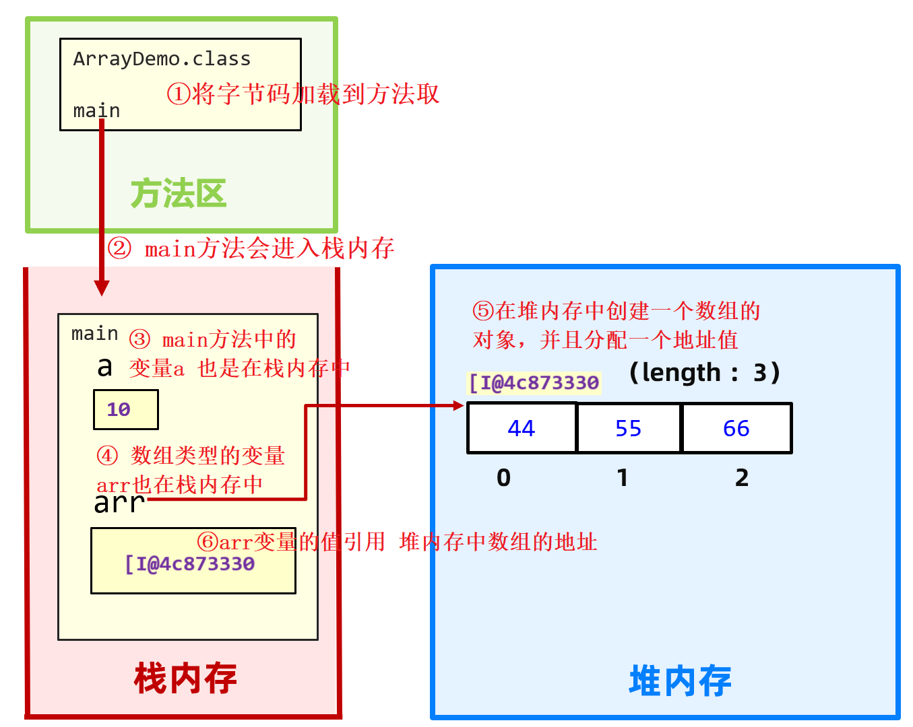

**总结一下`int a = 10`与 `int[] arr = new int[]{11,22,33}的区别`**

- **a**是一个变量，在栈内存中，**a**变量中存储的数据就是**10**这个值。
- **arr**也是一个变量，在栈中，存储的是数组对象在堆内存中的地址值

```java
// 这里的int a是一个基本类型变量，存储的是一个数值
int a = 10 ; 
//这里的int[] arr是一个引用类型的变量，存储的是一个地址值
int[] arr = new int[]{44,55,66};
```


> **例2:**

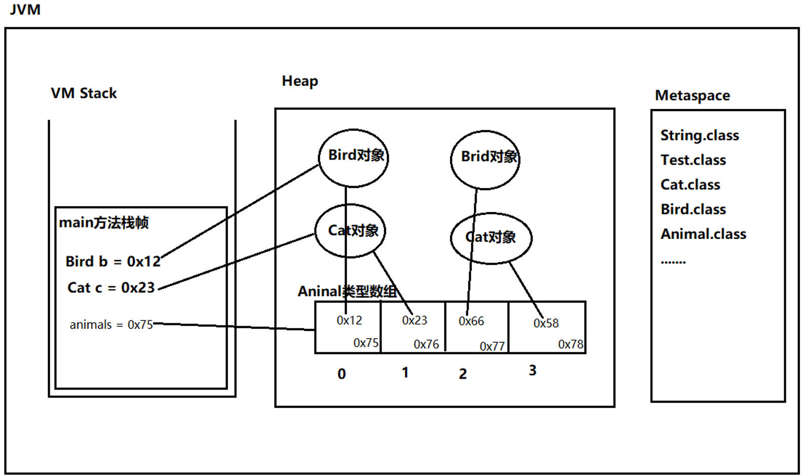

```java
package com.powernode.javase.oo;

/**
 * 父类
 */
public class Animal {
}
```

```java
package com.powernode.javase.oo;

public class Cat extends Animal {

    public void catcMouse() {
        System.out.println("猫吃老鼠!");
    }
}
```

```java
package com.powernode.javase.oo;

public class Bird extends Animal {

    public void fly(){
        System.out.println("鸟儿在飞翔！");
    }
}
```

```java
package com.powernode.javase.oo;

public class Test {
    public static void main(String[] args) {

        Bird b = new Bird();
        Cat c = new Cat();

        // 创建一个数组，让该数组既可以存储Cat，又可以存储Bird
        // 数组中存储的不是对象本身，实际上是对象在堆内存当中的地址。存储的是引用。
        Animal[] animals = {b, c, new Bird(), new Cat()};

        // 请遍历Animal数组，然后取出的Cat让它抓老鼠。取出的Bird让它飞。
        for (Animal animal : animals) {
            // 向下转型
            if(animal instanceof Cat){
                Cat cat = (Cat) animal;
                cat.catcMouse();
            }else if(animal instanceof Bird){
                Bird bird = (Bird) animal;
                bird.fly();
            }
        }

        /*// 创建一个数组，既能够存储A，又能存储B
        A a = new A();
        B b = new B();
        Cat c = new Cat();
        Object[] objs = {a, b, c};

        Bird bird = new Bird();
        // 编译报错。类型不统一/不一致。
        //Cat[] cats = {c, bird};
        // 这个可以。
        Object[] objs2 = {c, bird};*/
    }
}


class A {

}

class B {
}
```

> **测试结果:**
>
> 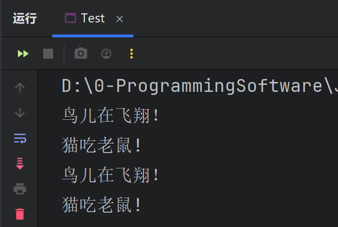


### 3.2 多个变量指向同一个数组的问题

各位同学，我们了解了数组在内存中的执行原理。我们知道数组类型的变量，指向的是堆内存中数组对象的地址。但是在实际开发中可能存在一种特殊情况，就是多个变量指向同一个数组对象的形式。

讲解这个知识点的目的，是让同学们注意多个变量指向同一个数组对象存在什么问题？

我们先看一段代码

```java
public class ArrayDemo2 {
    public static void main(String[] args) {
        // 目标：认识多个变量指向同一个数组对象的形式，并掌握其注意事项。
        int[] arr1 = {11, 22, 33};

        // 把int类型的数组变量arr1赋值给int类型的数组变量arr2
        int[] arr2 = arr1;

        System.out.println(arr1);
        System.out.println(arr2);

        arr2[1] = 99;
        System.out.println(arr1[1]);

        arr2 = null; // 拿到的数组变量中存储的值是null
        System.out.println(arr2);

        //System.out.println(arr2[0]);
        //System.out.println(arr2.length);
    }
}
```

我们重点关注这一段代码

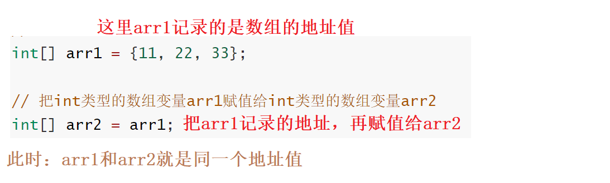

刚执行完`int[] arr1 = {11,22,33};`时，内存原理如下

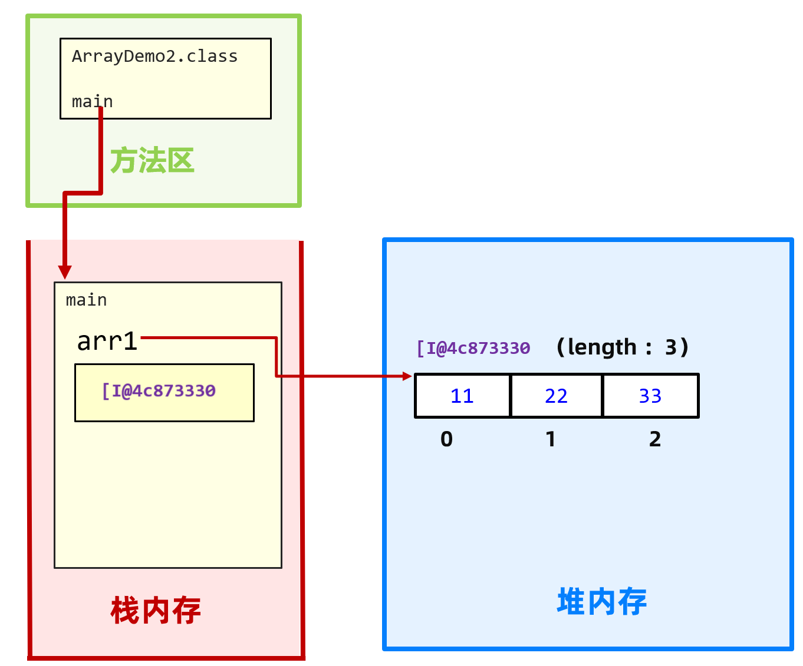

当执行完`int[] arr2 = arr1;`后，内存原理如下

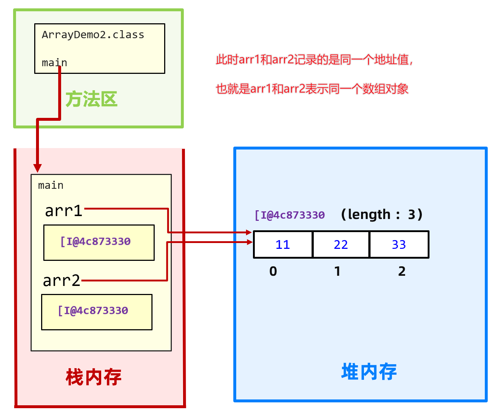

当执行到`arr2[1]=99;时`，内存原理如下

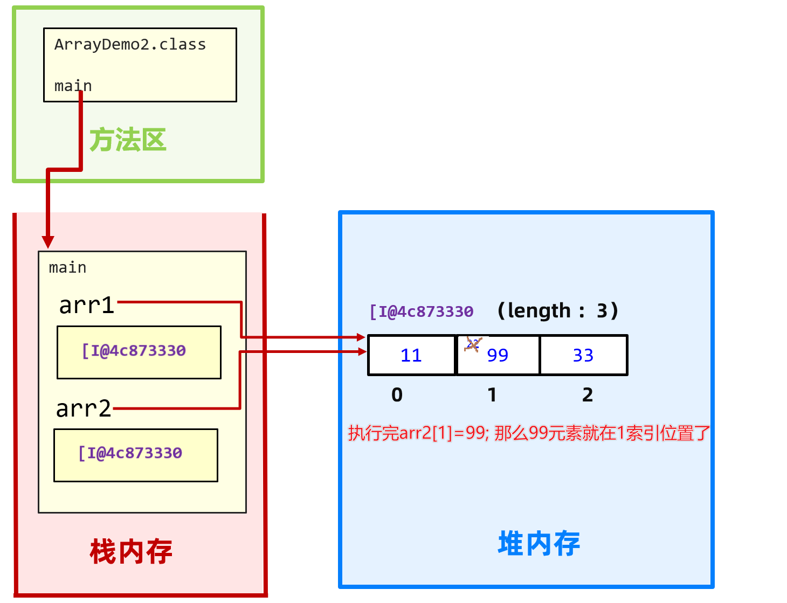

**总结一下：**

- 两个变量指向同一个数组时，两个变量记录的是同一个地址值。

- 当一个变量修改数组中的元素时，另一个变量去访问数组中的元素，元素已经被修改过了。

到这里有关数组的基本操作，和内存原理我们就全部学习完了。

## 四、数组专项练习

接下来我们做一些专项练习题，把数组的常见操作练习一下。在学习这个案例时，重点掌握数组求最值的思路，代码只是用来表达你的思路的。

### 4.1 数组求最值

> **例1:**

```java
需求：定义一个int类型数组，求数组中元素的最大值，并打印最大值
```

我们先看一下选美比赛，是怎么选出颜值最高的人的。然后再以此思路，来写代码找出数组中元素的最大值。


```java
数组求最大值思路：
	1)先找出数组中0索引的元素，假设为最大值，用max表示【擂主】
	2)遍历后面的每一个元素和max比较，把较大的元素值重新赋值给max(擂主换人)
    3)最后max就是所有元素的最大值(最后站在台上的擂主)
```

```java
public class Test1 {
    public static void main(String[] args) {
        // 1、把颜值数据拿到程序中来，用数组装起来
        int[] faceScores = {15, 9000, 10000, 20000, 9500, -5};

        // 2、定义一个变量用于最终记住最大值。
        int max = faceScores[0];

        // 3、从数组的第二个位置开始遍历。
        for (int i = 1; i < faceScores.length; i++) {
            // i = 1  2  3  4  5
            // 判断一下当前遍历的这个数据，是否大于最大值变量max存储的数据，
            //如果大于，当前遍历的数据需要赋值给max
            if(faceScores[i] > max ){
                max = faceScores[i];
            }
        }
        System.out.println("最高颜值是：" + max);
    }
}
```

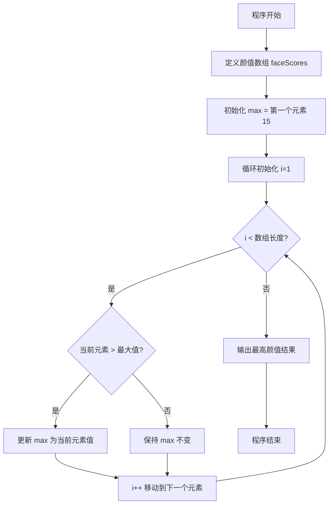
```mermaid
flowchart TD
    A[程序开始] --> B[定义颜值数组 faceScores]
    B --> C[初始化 max = 第一个元素 15]
    C --> D[循环初始化 i=1]
    D --> E{i < 数组长度?}
    
    E -- 是 --> F{当前元素 > 最大值?}
    F -- 是 --> G[更新 max 为当前元素值]
    F -- 否 --> H[保持 max 不变]
    
    G --> I[i++ 移动到下一个元素]
    H --> I
    I --> E
    
    E -- 否 --> J[输出最高颜值结果]
    J --> K[程序结束]
```

> **例2:**

```java
package com.powernode.javase;

/**
 * 找最值。
 */
public class ArrayTest06 {
    public static void main(String[] args) {
        int[] arr = {1,3,3,4,45,56,6,7,87,8,8898,1,2,1};
        System.out.println(arr.length);
        int max = searchMax(arr);
        System.out.println("最大值是:" + max);

        int maxIndex = searchMaxIndex(arr);
        System.out.println("最大值的下标是：" + maxIndex);
    }

    /**
     * 找最大值的下标
     * @param arr 数组
     * @return 最大值的下标
     */
    public static int searchMaxIndex(int[] arr) {
        // 假设第一个元素是最大的。
        int maxIndex = 0;
        // 遍历数组
        for (int i = 0; i < arr.length; i++) {
            if(arr[i] > arr[maxIndex]) {
                maxIndex = i;
            }
        }
        return maxIndex;
    }

    /**
     * 从arr数组中找最大值
     * @param arr
     * @return
     */
    public static int searchMax(int[] arr) {
        // 假设第一个是最大的
        int max = arr[0];
        // 遍历数组
        /*for (int num : arr) {
            if(num > max){
                max = num;
            }
        }*/

        for (int i = 0; i < arr.length; i++) {
            if (arr[i] > max) {
                max = arr[i];
            }
        }
        return max;
    }
}
```

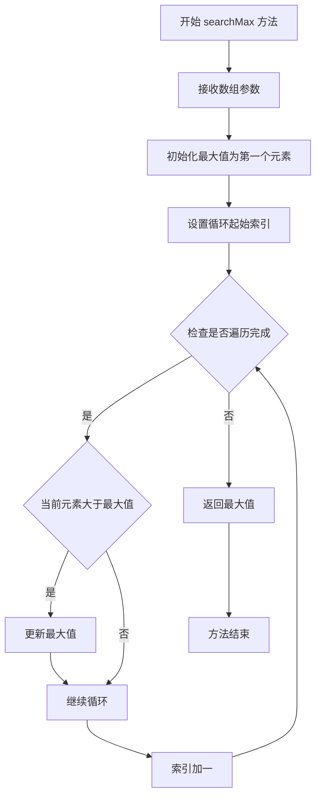
```mermaid
flowchart TD
    A[开始 searchMax 方法] --> B[接收数组参数]
    B --> C[初始化最大值为第一个元素]
    C --> D[设置循环起始索引]
    D --> E{检查是否遍历完成}
    E -- 是 --> F{当前元素大于最大值}
    F -- 是 --> G[更新最大值]
    F -- 否 --> H[继续循环]
    G --> H
    H --> I[索引加一]
    I --> E
    E -- 否 --> J[返回最大值]
    J --> K[方法结束]
```

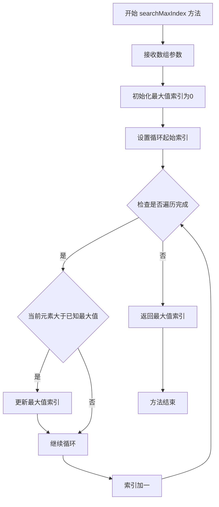
```mermaid
flowchart TD
    A[开始 searchMaxIndex 方法] --> B[接收数组参数]
    B --> C[初始化最大值索引为0]
    C --> D[设置循环起始索引]
    D --> E{检查是否遍历完成}
    E -- 是 --> F{当前元素大于已知最大值}
    F -- 是 --> G[更新最大值索引]
    F -- 否 --> H[继续循环]
    G --> H
    H --> I[索引加一]
    I --> E
    E -- 否 --> J[返回最大值索引]
    J --> K[方法结束]
```


### 4.2 数组元素反转

```java
需求：某个数组有5个数据：10,20,30,40,50，请将这个数组中的数据进行反转。
      [10, 20, 30, 40, 50]  反转后 [50, 40, 30, 20, 10]
```

数组元素反转的核心，其实是数组中两个数据的交换。我们可以认为两个数据分别存储在两个水杯中。想要交换两个水杯中的东西，我们得借助第三个水杯，如下图所示

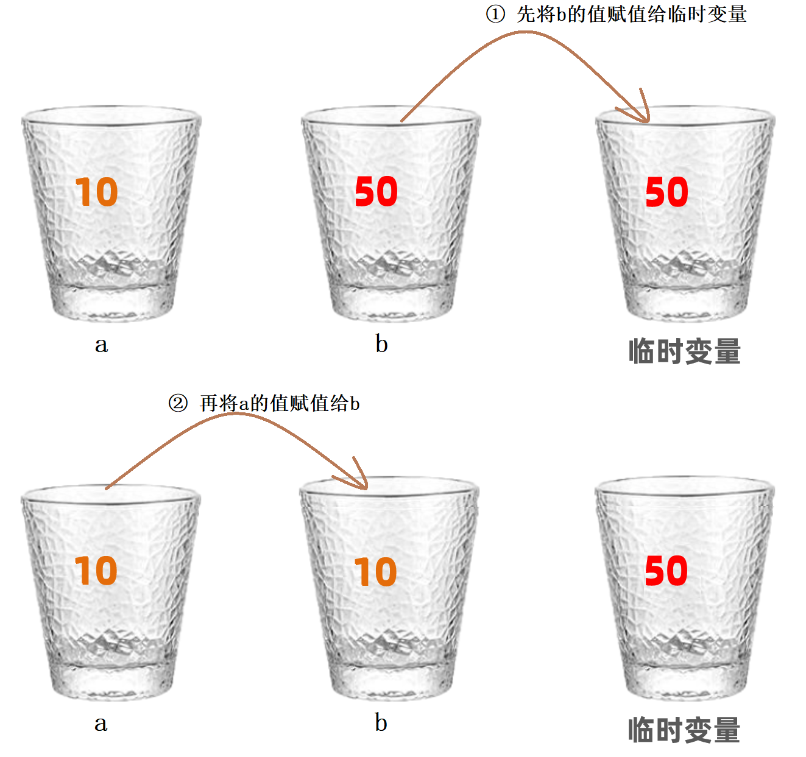

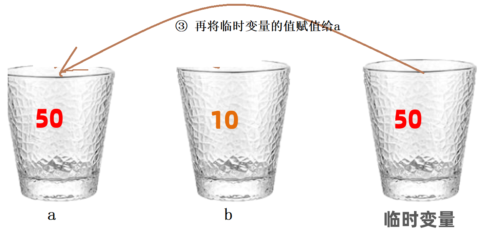

数组中元素交换，就是用的借用第三方变量的思想。 我们把数组中的每一个元素当做一个水杯，然后索引控制哪两个元素互换位置。

怎么样，才能达到元素反转的效果呢？我们只需将第一个和最后一个元素互换、第二个和倒数第二个互换、依次内推.... 如下图所示

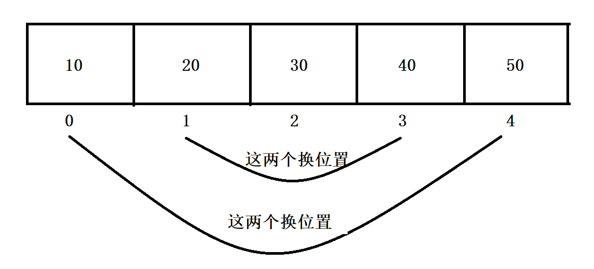

怎么样写代码，才能达到上面的效果呢？我们继续分析

```java
1.每次交换，需要有左右两边的两个索引，我们可以用i和j表示
	刚开始i=0，j=数组长度-1;
2.每次让i和j索引位置的两个元素互换位置
	arr[i]和arr[j]互换位置
3.每次还完位置之后，让i往右移动一位，让j往前移动一位
```

具体代码如下

```java
public class Test2 {
    public static void main(String[] args) {
        // 目标：完成数组反转。
        // 1、准备一个数组
        int[] arr = {10, 20, 30, 40, 50};  

        // 2、定义一个循环，设计2个变量，一个在前，一个在后
        for (int i = 0, j = arr.length - 1; i < j; i++, j--) {
            // arr[i]   arr[j]
            // 交换
            // 1、定义一个临时变量记住后一个位置处的值
            int temp = arr[j];
            // 2、把前一个位置处的值赋值给后一个位置了
            arr[j] = arr[i];
            // 3、把临时变量中记住的后一个位置处的值赋值给前一个位置处
            arr[i] = temp;
        }

        // 3、遍历数组中的每个数据，看是否反转成功了
        for (int i = 0; i < arr.length; i++) {
            System.out.print(arr[i] + " ");
        }
    }
}
```

**总结一下：**

通过上面的案例，需要我们掌握元素互换位置的编程思路；以后遇到数据互换问题，都这样做。

### 4.3 随机排名

各位同学，通过数组元素反转的案例，我们学会了如何对两个数据进行交换。接下来，我们再学习随机排名案例，将数据交换的思路再巩固一下。

先来看一下需求

```java
需求：某公司开发部5名开发人员，要进行项目进展汇报演讲，现在采取随机排名后进行汇报。请先依次录入5名员工的工号，然后展示出一组随机的排名顺序。
```

分析一下随机排名的思路

```java
1.在程序中录入5名员工的工号存储起来 ---> 使用动态初始化数组的方式。
2.依次遍历数组中的每个数据。
3.每遍历到一个数据，都随机一个索引值出来，让当前数据与该索引位置处的数据进行交换。
```

如下图所示，每次遍历到一个元素，随机将当前位置元素和随机索引元素换位置。

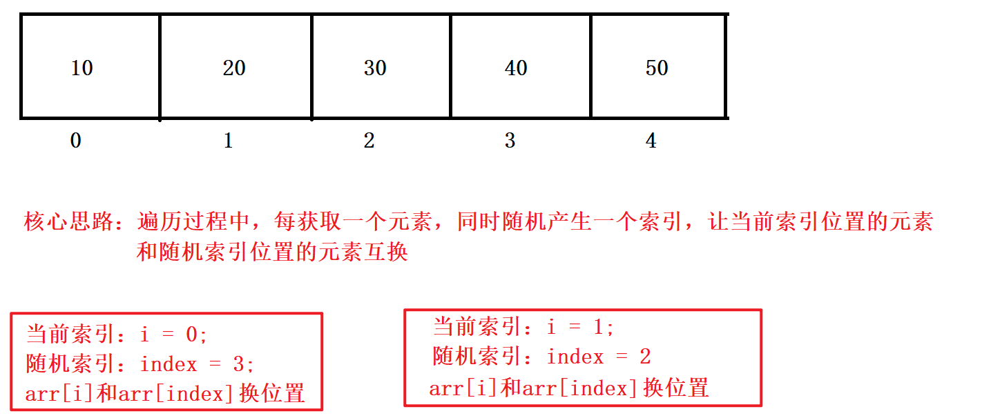

代码如下

```java
public class Test3 {
    public static void main(String[] args) {
        // 目标：完成随机排名
        // 1、定义一个动态初始化的数组用于存储5名员工的工号
        int[] codes = new int[5];

        // 2、提示用户录入5名员工的工号。
        Scanner sc = new Scanner(System.in);
        for (int i = 0; i < codes.length; i++) {
            // i = 0 1 2 3 4
            System.out.println("请您输入第" + (i + 1) +"个员工的工号：");
            int code = sc.nextInt();
            codes[i] = code;
        }

        // 3、打乱数组中的元素顺序。
        // [12, 33, 54, 26, 8]
        //  i       index
        Random r =  new Random();
        for (int i = 0; i < codes.length; i++) {
            // codes[i]
            // 每遍历到一个数据，都随机一个数组索引范围内的值。
            //然后让当前遍历的数据与该索引位置处的值交换。
            int index = r.nextInt(codes.length); // 0 - 4
            // 定义一个临时变量记住index位置处的值
            int temp = codes[index];
            // 把i位置处的值赋值给index位置处
            codes[index] = codes[i];
            // 把index位置原来的值赋值给i位置处
            codes[i] = temp;
        }

        // 4、遍历数组中的工号输出即可
        for (int i = 0; i < codes.length; i++) {
            System.out.print(codes[i] + " ");
        }
    }
}
```
