## 网络编程概述


### 什么是网络编程？

**`网络编程`是指`利用计算机网络实现程序之间通信的一种编程方式`。在网络编程中，程序需要通过`网络协议（如 TCP/IP）`来进行通信，以实现不同计算机之间的`数据传输和共享`。**


### 在网络编程中，通常有三个基本要素

+ **`IP 地址`：定位网络中某台计算机**

+ **`端口号port`：定位计算机上的某个进程（某个应用）**

+ **`通信协议`：通过IP地址和端口号定位后，如何保证数据可靠高效的传输，这就需要依靠通信协议了。**

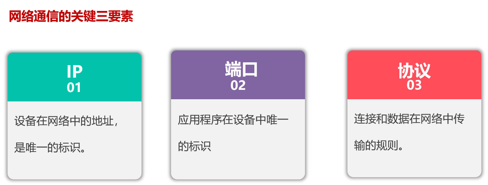

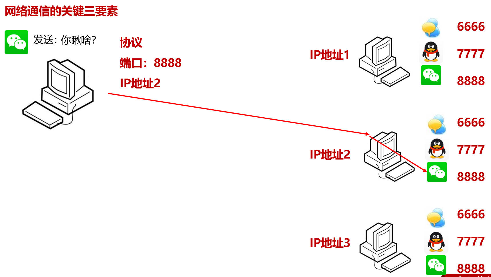


## 网络编程三要素


### IP地址

+ **IP 地址用于`唯一标识网络中的每一台计算机`。在 Internet 上，使用` IPv4 或 IPv6 地址`来表示 `IP 地址`。通常 `IPv4 地址`格式为 `xxx.xxx.xxx.xxx`，其中`每个 xxx `都表示`一个 8 位的二进制数`（`每一个xxx的取值范围是0-255`），组合起来可以表示 `2^32 个不同的 IP 地址`。**

+ **IPv4 地址的`总数量是4294967296 个`，但并`不是所有的 IPv4 地址都可以使用`。IPv4 地址被分为网络地址和主机地址两部分，`前3个字节`用于`表示网络（省市区）`，`最后1个字节`用于`表示主机（家门牌）`。而一些 IP 地址被保留或者被私有机构使用，不能用于公网的地址分配。另外，一些 IP 地址被用作多播地址，仅用于特定的应用场景。因此实际上可供使用的 IPv4 地址数量要少于总数量，而且随着 IPv4 地址的逐渐枯竭，IPv6 地址已经开始逐渐普及，IPv6 地址数量更是相当巨大。**

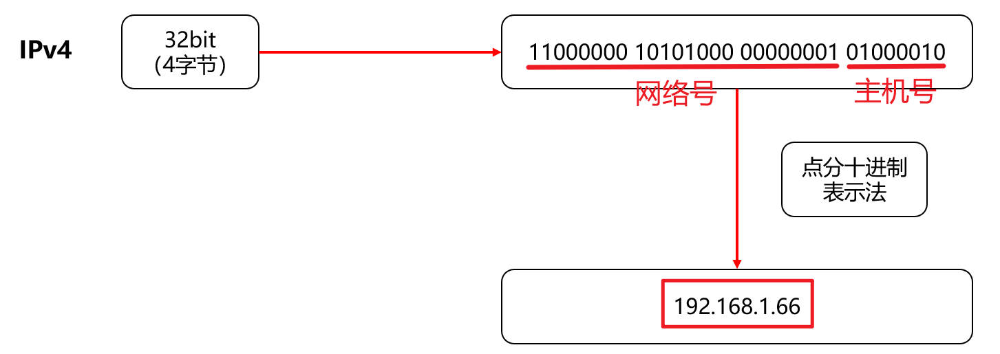

+ **IPv6使用`16个字节`表示`IP地址(128位)`，这样就解决了网络地址资源数量不够的问题。IPv6 地址`由 8 组 16 位十六进制数`表示，每组之间用`冒号分隔`，如：`3ffe:3201:1401:1280:c8ff:fe4d:db39:1984`**

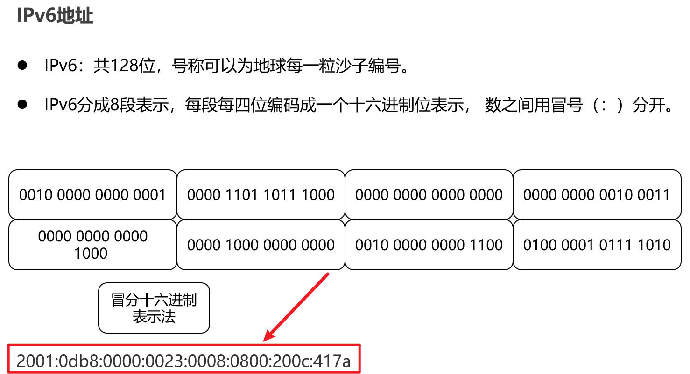

+ **`本机地址`：`127.0.0.1`，主机名：`localhost`。**

+ **`局域网地址`: `192.168.0.0-192.168.255.255`为`私有地址`，属于`非注册地址`，专门为`组织机构内部使用`。**


#### 域名与DNS 

+ **域名**

**IP地址毕竟是数字标识，使用时不好记忆和书写，因此在IP地址的基础上又发展出一种符号化的地址方案，来代替数字型的IP地址。`每一个符号化的地址`都与`特定的IP地址`对应。这个与网络上的`数字型IP地址相对应的字符型地址`，就被称为`域名`。**

**目前域名已经成为互联网品牌、网上商标保护必备的要素之一，除了识别功能外，还有引导、宣传等作用。如：`www.baidu.com`**

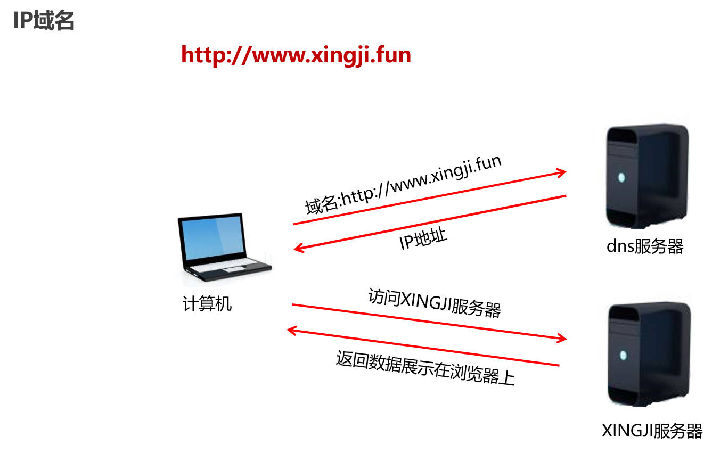

+ **DNS**

**在Internet上域名与IP地址之间是`一对一（或者多对一）`的，域名虽然便于人们记忆，但机器之间只能互相认识IP地址，它们之间的转换工作称为域名解析，域名解析需要由专门的域名解析服务器来完成，`DNS（Domain Name System域名系统）`就是进行`域名解析的服务器`，域名的最终指向是IP。**

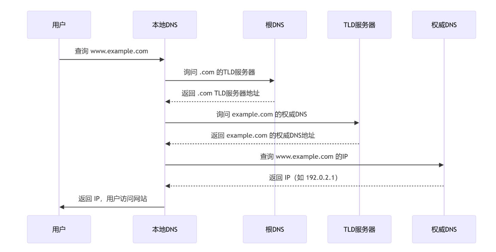


### 端口号（port）

1.**在计算机中，`不同的应用程序`是通过`端口号区分的`。 **

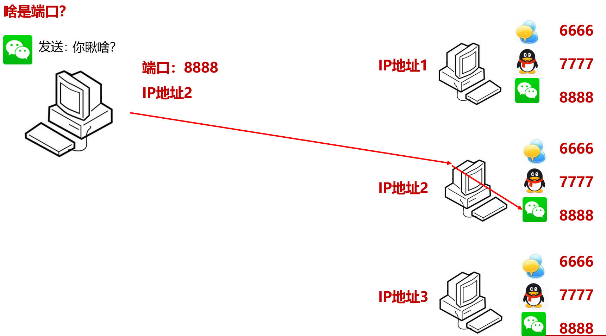


2.**端口号是用两个字节（无符号）表示的，它的`取值范围是0~65535`，而这些计算机端口可分为3大类：**

+ **`公认端口`：`0~1023`。被预先定义的`服务通信占用`（如：`HTTP占用端口80，FTP占用端口21，Telnet占用端口23`等）**

+ **`注册端口`：`1024~49151`。分配给`用户进程或应用程序`。（如：`Tomcat占用端口8080，MySQL占用端口3306，Oracle占用端口1521`等）。**

+ **`动态/私有端口`：`49152~65535`。**

3.**通常情况下，`服务器程序`使用`固定的端口号`来`监听客户端的请求`，而`客户端`则使用`随机端口`连接`服务器`。**

4.**IP地址好比每个人的地址（门牌号），端口好比是房间号。必须同时指定IP地址和端口号才能够正确的发送数据。接下来通过一个图例来描述IP地址和端口号的作用，如图所示: **

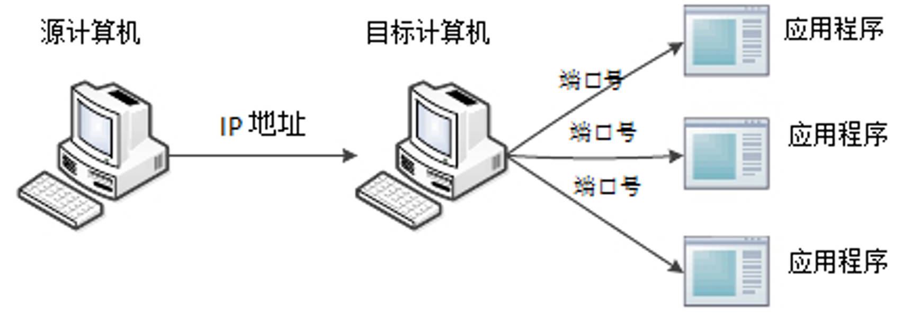


### 通信协议


1.**通过计算机网络可以使多台计算机实现连接，位于同一个网络中的计算机在进行连接和通信时需要遵守一定的规则。就像两个人想要顺利沟通就必须使用同一种语言一样，如果一个人只懂英语而另外一个人只懂中文，这样就会造成没有共同语言而无法沟通。**

2.**在计算机网络中，这些连接和通信的规则被称为网络通信协议，它对数据的传输格式、传输速率、传输步骤等做了统一规定，通信双方必须同时遵守才能完成数据交换。**

3.**在计算机网络中，`常用的协议有 TCP、UDP、HTTP、FTP `等。这些协议规定了数据传输的格式、传输方式和传输顺序等细节。其中，`TCP（传输控制协议）`是`一种可靠的面向连接的协议`，它提供`数据传输的完整性保证`；而` UDP（用户数据报协议）`则是`一种无连接的协议`，`传输效率高`。在网络编程中，需要选取合适的协议类型来实现数据传输。**


#### OSI参考模型

1.**世界上第一个网络体系结构由IBM公司提出（1974年，SNA），以后其他公司也相继提出自己的网络体系结构如：Digital公司的DNA，美国国防部的TCP/IP等，多种网络体系结构并存，其结果是若采用IBM的结构，只能选用IBM的产品，只能与同种结构的网络互联。**

2.**为了促进计算机网络的发展，国际标准化组织ISO（International Organization for Standardization）于1977年成立了一个委员会，在现有网络的基础上，提出了不基于具体机型、操作系统或公司的网络体系结构，称为开放系统互连参考模型，即OSI/RM （Open System Interconnection Reference Model）。`OSI模型`把网络通信的工作分为`7层`，分别是`物理层`、`数据链路层`、`网络层`、`传输层`、`会话层`、`表示层`和`应用层`。OSI七层协议模型如图所示：**

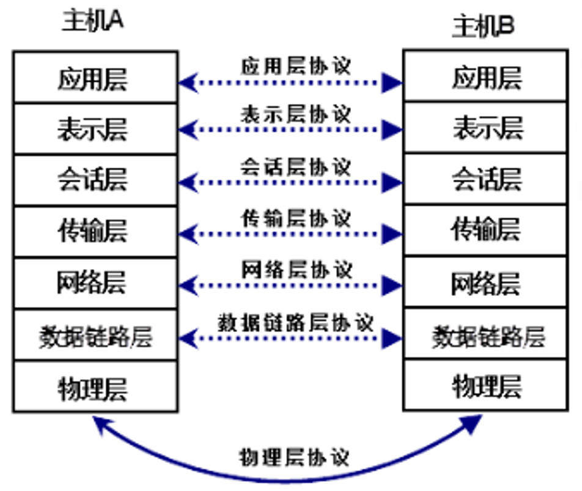


#### TCP/IP参考模型

1.**OSI参考模型的初衷是提供全世界范围的计算机网络都要遵循的统一标准，但是由于存在模型和协议自身的缺陷，迟迟没有成熟的产品推出。TCP/IP协议在实践中不断完善和发展取得成功，作为网络的基础，Internet的语言，可以说没有TCP/IP参考模型就没有互联网的今天。**

2.**`TCP/IP`，即`Transmission Control Protocol/Internet Protocol`的简写，中译名为`传输控制协议/因特网互联协议`，是Internet最基本的协议、Internet国际互联网络的基础。**

3.**TCP/IP协议是一个开放的网络协议簇，它的名字主要取自最重要的网络层IP协议和传输层TCP协议。TCP/IP协议定义了电子设备如何连入因特网，以及数据如何在它们之间传输的标准。`TCP/IP参考模型`采用`4层的层级结构`，每一层都呼叫它的下一层所提供的协议来完成自己的需求，这4个层次分别是：`网络接口层`、`互联网层（IP层）`、`传输层（TCP层）`、`应用层`。**

4.**OSI模型与TCP/IP模型的对应关系如图所示：**

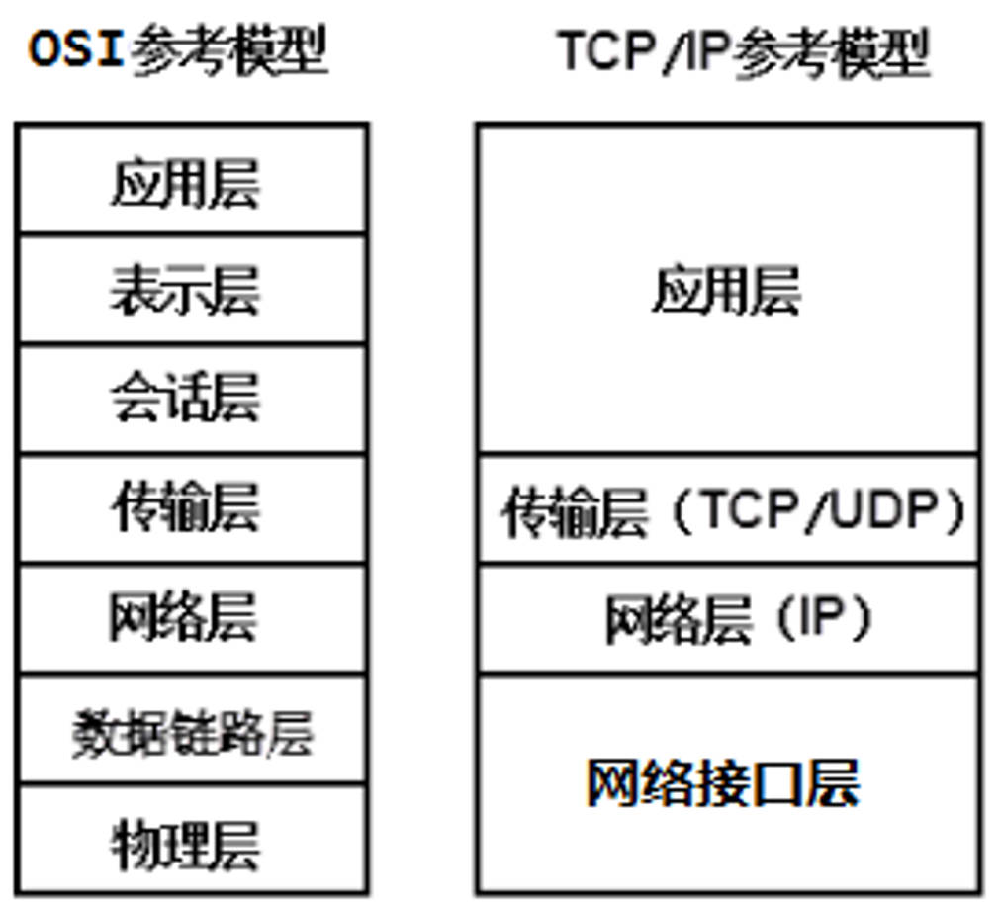


#### OSI参考模型 与 TCP/IP参考模型区别

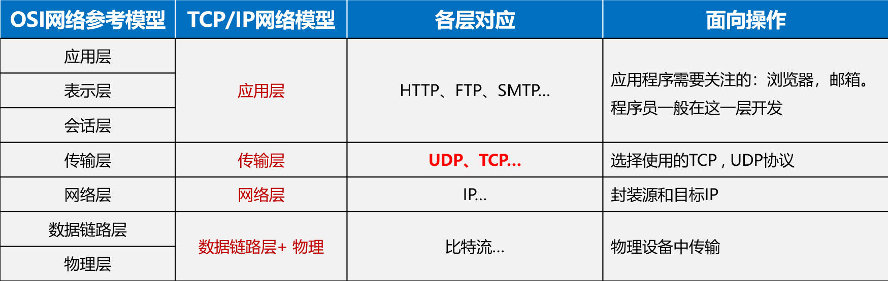

1.**`OSI 参考模型`是`理论上的`，而 `TCP/IP 参考模型`是`实践上的`。TCP/IP 参考模型被许多实际的协议（如 `IP、TCP、HTTP` 等）所支持和实现，而 OSI 参考模型则主要是作为理论框架和标准进行研究和讨论。**

2.**`OSI 参考模型`是`由国际标准化组织提出的网络通信协议框架`，其中分为 7 层，各层之间明确了功能的划分，从物理层到应用层，逐层向上升，每层只对自己下一层提供服务，并`依次封装和解封数据`。OSI 参考模型是一种理论上的协议框架，用于描述计算机系统间的通信原理和规范。**

3.**`TCP/IP 参考模型（也称互联网参考模型）`是`实际应用中最广泛的协议框架`。它将网络协议划分为 4 层：`网络接口层、网络层、传输层和应用层`。TCP/IP 参考模型与 OSI 参考模型之间有着相对应的层次结构，但是其中的每一层都是实际存在的协议，而不是纯粹的框架。TCP/IP 参考模型被广泛应用于互联网上，是计算机系统间进行通信的重要基础。**


## 网络编程基础类


### InetAddress类

```java
1.java.net.IntAddress类用来封装计算机的IP地址和DNS（没有端口信息），它包括一个主机名和一个IP地址，是java对IP地址的高层表示。大多数其它网络类都要用到这个类，包括Socket、ServerSocket、URL、DatagramSocket、DatagramPacket等
    
2.常用静态方法
	static InetAddress getLocalHost() 得到本机的InetAddress对象，其中封装了IP地址和主机名
	static InetAddress getByName(String host) 传入目标主机的名字或IP地址得到对应的InetAddress对象，其中封装了IP地址和主机名（底层会自动连接DNS服务器进行域名解析）
    
3.常用实例方法
	public String getHostAddress() 获取IP地址
	public String getHostName() 获取主机名/域名
```

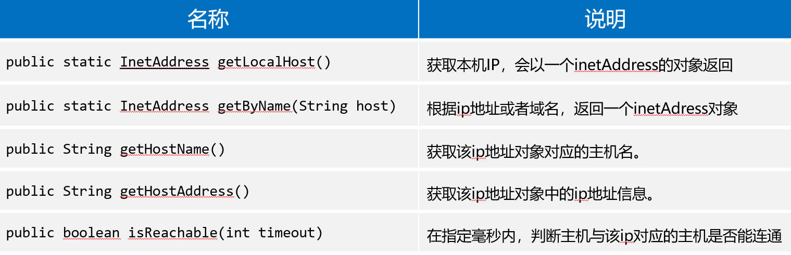

```java
package com.powernode.javase.net;

import java.net.InetAddress;

public class InetAddressTest {
    public static void main(String[] args) throws Exception {
        // 获取本机的IP地址和主机名的封装对象：InetAddress
        InetAddress ia = InetAddress.getLocalHost();

        // 获取本机的IP地址
        String hostAddress = ia.getHostAddress();
        System.out.println("本机IP地址：" + hostAddress); // 本机IP地址：192.168.219.1

        // 获取本机的主机名
        String hostName = ia.getHostName();
        System.out.println("本机的主机名：" + hostName); // 本机的主机名：LAPTOP-5HCUL9AK

        // 通过域名来获取InetAddress对象
        InetAddress ia2 = InetAddress.getByName("www.baidu.com");
        System.out.println(ia2.getHostName()); // www.baidu.com
        System.out.println(ia2.getHostAddress()); // 157.148.69.151
    }
}
```


### URL类

```java
1.URL是统一资源定位符，对可以从互联网上得到的资源的位置和访问方法的一种简洁的表示，是互联网上标准资源的地址。互联网上的每个文件都有一个唯一的URL，它包含的信息指出文件的位置以及浏览器应该怎么处理它。
    
2.URL由4部分组成：协议、存放资源的主机域名、端口号、资源文件名。如果未指定该端口号，则使用协议默认的端口。例如HTTP协议的默认端口为80。在浏览器中访问网页时，地址栏显示的地址就是URL。
    
3.URL标准格式为：<协议>://<域名或IP>:<端口>/<路径>。其中，<协议>://<域名或IP>是必需的，<端口>/<路径>有时可省略。如：https://www.baidu.com。

4.为了方便程序员编程，JDK中提供了URL类，该类的全名是java.net.URL，该类封装了大量复杂的涉及从远程站点获取信息的细节，可以使用它的各种方法来对URL对象进行分割、合并等处理。
    
5.URL类的构造方法：URL url = new URL(“http://127.0.0.1:8080/oa/index.html?name=zhangsan#tip”);
                            
6.URL类的常用方法：
	获取协议：url.getProtocol()	获取域名：url.getHost()  获取默认端口：url.getDefaultPort()
	获取端口：url.getPort()		获取路径：url.getPath()	获取资源：url.getFile()		
	获取数据：url.getQuery()		获取锚点：url.getRef()
                              
7.使用URL类的openStream()方法可以打开到此URL的连接并返回一个用于从该连接读入的InputStream，实现最简单的网络爬虫
```

```java
package com.powernode.javase.net;


import java.net.URL;

/**
 *URL包括四部分：协议，IP地址，端口号，资源名称
 *URL是网络中某个资源的地址。某个资源的唯一标识。
 *通过URL是可以真实的定位到资源的。
 *在Java中，java类库提供了一个URL类，来提供对URL的支持。
 *
 * URL类的构造方法
 *      URL url = new URL("url");
 *
 * URL类的常用方法
 *      url.getXxx();
 */
public class URLTest01 {
    public static void main(String[] args) throws Exception {
        // 创建URL类型的对象
        URL url = new URL("http://www.baidu.com:8888/oa/index.html?name=zhangsan&password=123#tip");

        // 获取URL中的信息
        String protocol = url.getProtocol();
        System.out.println("协议：" + protocol);

        // 获取资源路径
        String path = url.getPath();
        System.out.println("资源路径：" + path);

        // 获取默认端口（HTTP协议的默认端口是80）
        int defaultPort = url.getDefaultPort();
        System.out.println("默认端口：" + defaultPort);

        // 获取当前的端口
        int port = url.getPort();
        System.out.println("当前端口号：" + port);

        // 获取URL中的IP地址
        String host = url.getHost();
        System.out.println("主机地址：" + host);

        // 获取URL准备传送的数据
        String query = url.getQuery();
        System.out.println("需要提交给服务器的数据：" + query);

        // 获取锚点
        String ref = url.getRef();
        System.out.println("获取锚点：" + ref);

        // 获取 资源路径 + 数据
        String file = url.getFile();
        System.out.println("资源路径+数据：" + file);
    }
}
```

```java
协议：http
资源路径：/oa/index.html
默认端口：80
当前端口号：8888
主机地址：www.baidu.com
需要提交给服务器的数据：name=zhangsan&password=123
获取锚点：tip
资源路径+数据：/oa/index.html?name=zhangsan&password=123
```


#### 模拟网络爬虫(openStream()方法)

> **使用`URL类`的`openStream()方法`可以打开到此URL的连接并返回一个用于从该连接读入的`InputStream`，实现`最简单的网络爬虫`**

```java
package com.powernode.javase.net;

import java.io.BufferedReader;
import java.io.InputStream;
import java.io.InputStreamReader;
import java.net.URL;

public class URLTest02 {
    public static void main(String[] args) throws Exception {
        URL url = new URL("https://tianqi.qq.com/");
        InputStream inputStream = url.openStream();
        BufferedReader br = new BufferedReader(new InputStreamReader(inputStream));

        String s = null;
        while ((s = br.readLine()) != null) {
            System.out.println(s);
        }

        br.close();
    }
}
```

```html
<!DOCTYPE html>
<html lang="zh-CN">

<head>
  <meta charset="UTF-8">
  <title>腾讯天气</title>
  <meta http-equiv=X-UA-Compatible content="IE=Edge,chrome=1">
  <!--[if lte IE 7]><meta http-equiv="refresh" content="0; url=http://sports.qq.com/kbsweb/upgrade.htm"><![endif]-->
  <meta name="description" content="腾讯天气">
  <meta name="keywords" content="天气 腾讯天气 天气预报 空气质量">
  <link rel="shortcut icon" href="//mat1.gtimg.com/www/icon/favicon2.ico" />
  <link rel="stylesheet" href="https://mat1.gtimg.com/rain/apub2019/820a05b640db.main_20251024.css">
</head>
...
</html>
```


## TCP与UDP协议


### Socket套接字概述

①我们开发的网络应用程序位于应用层，TCP和UDP属于传输层协议，在应用层如何使用传输层的服务呢？在应用层和传输层之间，则是使用套接Socket来进行分离。

②套接字就像是传输层为应用层开的一个小口，应用程序通过这个小口向远程发送数据，或者接收远程发来的数据。而这个小口以内，也就是数据进入这个口之后，或者数据从这个口出来之前，是不知道也不需要知道的，也不会关心它如何传输，这属于网络其它层次工作。

③Socket实际是传输层供给应用层的编程接口。Socket就是应用层与传输层之间的桥梁。使用Socket编程可以开发客户机和服务器应用程序，可以在本地网络上进行通信，也可通过Internet在全球范围内通信。

④TCP协议和UDP协议是传输层的两种协议。Socket是传输层供给应用层的编程接口，所以Socket编程就分为TCP编程和UDP编程两类。

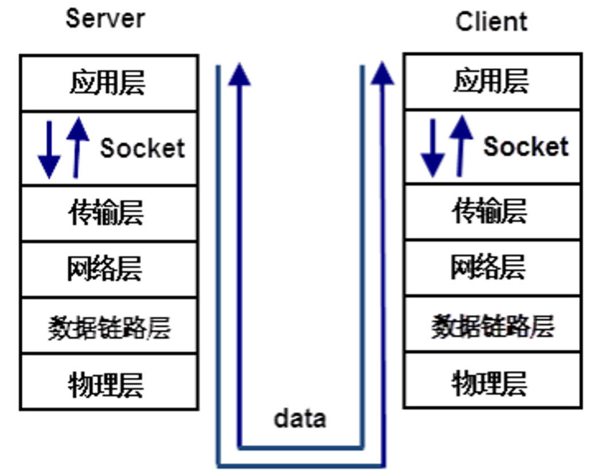


