## 集合概述

①什么是集合，有什么用？

1. **`集合`是一种`容器`，用来`组织和管理数据的`。非常重要。**

2. **Java的`集合框架`对应的这套类库其实就是`对各种数据结构的实现`。**

3. **`每一个集合类底层`采用的`数据结构不同`，例如`ArrayList集合`底层采用了`数组`，`LinkedList集合`底层采用了`双向链表`，`HashMap集合`底层采用了`哈希表`，`TreeMap集合`底层采用了`红黑树`。**

4. **我们不用写数据结构的实现了。`直接用就行了`。但我们需要知道的是在哪种场合下选择哪一个集合效率是最高的。**

②集合中存储的是`引用`，不是把堆中的对象存储到集合中，是`把对象的地址存储到集合`中。

③默认情况下，**如果不使用泛型的话**，集合中`可以存储任何类型的引用`，只要是`Object的子类`都`可以存储`。

④Java集合框架相关的类都在` java.util `包下。

⑤Java集合框架分为两部分：

1. **Collection结构：元素以`单个形式存储`。**

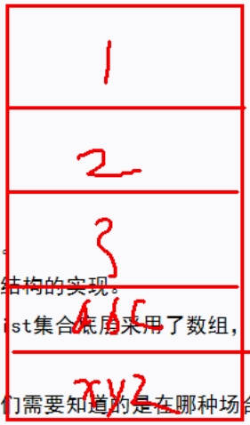

2. **Map结构：元素以`键值对的映射关系存储`。**

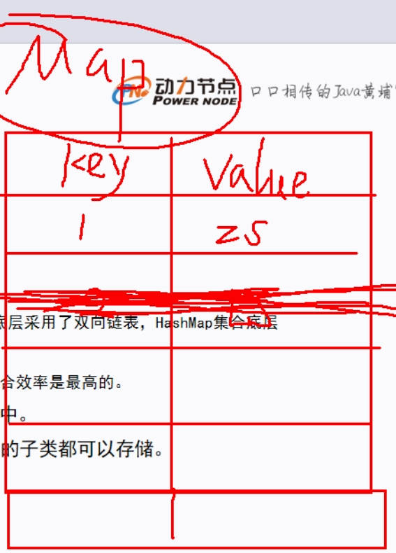


## Collection继承结构

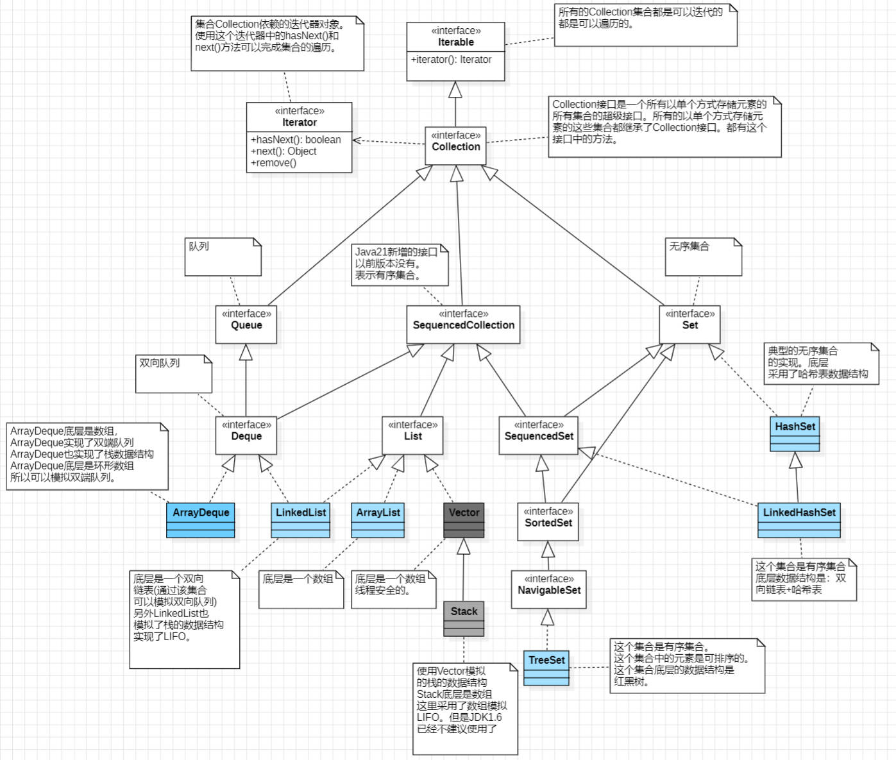

①`SequencedCollection`和`SequencedSet接口`都是`Java21新增的接口`。

②上图中`蓝色的`是`实现类`。其它的都是`接口`。

③6个实现类中`只有HashSet是无序集合`。剩下的`都是有序集合`。

1. 有序集合：集合中存储的元素有下标**或者**集合中存储的元素是可排序的。

2. 无序集合：集合中存储的元素没有下标**并且**集合中存储的元素也没有排序。

④每个集合实现类对应的数据结构如下：

1. **LinkedList:双向链表（不是队列数据结构，但使用它可以模拟队列）**

2. **ArrayList：数组**

3. **Vector：数组（线程安全的）**

4. **HashSet：哈希表**

5. **LinkedHashSet：双向链表和哈希表结合体**

6. **TreeSet：红黑树**

⑤**`List集合`中存储的元素`可重复`。`Set集合`中存储的元素`不可重复`。**


## Collection接口

### Collection接口的通用方法

①**boolean add(E e); 向集合中添加元素**

```java
// 创建一个集合对象
Collection c = new ArrayList();
// 添加元素
c.add(100); // 自动装箱
c.add(3.14); // 自动装箱
c.add(false); // 自动装箱
c.add("jack");
c.add(new Object());
```


②**int size(); 获取集合中元素个数**

```java
package com.powernode.javase.collection;

import java.util.ArrayList;
import java.util.Collection;

public class CollectionTest02 {
    public static void main(String[] args) {
        // 创建一个集合对象
        Collection c = new ArrayList();
        // 添加元素
        c.add(100);
        c.add(3.14);
        c.add(false);
        c.add("jack");
        c.add(new Object());
        // 查看集合中元素个数
        System.out.println("集合中元素个数：" +c.size()); // 集合中元素个数：5
    }
}
```


③**boolean addAll(Collection c); 将参数集合中`所有元素`全部加入`当前集合`**

```java
package com.powernode.javase.collection;

import java.util.ArrayList;
import java.util.Collection;

public class CollectionTest02 {
    public static void main(String[] args) {
        // 创建一个集合对象
        Collection c = new ArrayList();
        // 添加元素
        c.add(100); // 自动装箱
        c.add(3.14); // 自动装箱
        c.add(false); // 自动装箱
        c.add("jack");
        c.add(new Object());
        // 查看集合中元素个数
        System.out.println("集合中元素个数：" +c.size()); // 集合中元素个数：5

        // 再创建一个集合对象
        Collection c2 = new ArrayList();
        c2.add("zhangsan");
        c2.add("lisi");
        c2.add("wangwu");
        // 一次添加多个，将一个集合中所有的元素添加到当前集合对象中
        c.addAll(c2);
        System.out.println("集合中元素个数：" + c.size()); // 集合中元素个数：8
    }
}
```


④**boolean contains(Object o); 判断集合中是否包含对象o（底层到底包含o还是不包含o，调用equals方法进行比对。）**

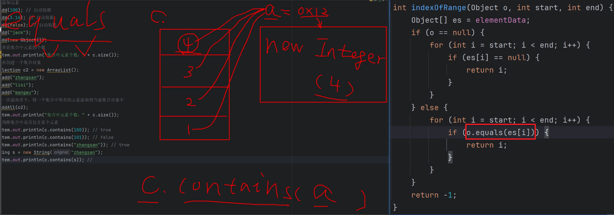

```java
// 判断集合中是否包含某个元素
System.out.println(c.contains(100)); // true
System.out.println(c.contains(101)); // false
System.out.println(c.contains("zhangsan")); // true

// 底层到底包含o还是不包含o，调用equals方法进行比对
String s = new String("zhangsan");
System.out.println(c.contains(s)); // true
```

> **相关示例:**
>
> ```java
> package com.powernode.javase.collection;
> 
> import java.util.Objects;
> 
> public class Date {
>     private int year;
>     private int month;
>     private int day;
> 
>     @Override
>     public boolean equals(Object obj) {
>         if (obj == null) return false;
>         if (this == obj) return true;
>         if (obj instanceof Date) {
>             Date date = (Date) obj;
>             return this.year == date.year && this.month == date.month && this.day == date.day;
>         }
>         return false;
>     }
> 
>     @Override
>     public int hashCode() {
>         return Objects.hash(year, month, day);
>     }
> 
>     public Date(int year, int month, int day) {
>         this.year = year;
>         this.month = month;
>         this.day = day;
>     }
> 
>     public int getYear() {
>         return year;
>     }
> 
>     public void setYear(int year) {
>         this.year = year;
>     }
> 
>     public int getMonth() {
>         return month;
>     }
> 
>     public void setMonth(int month) {
>         this.month = month;
>     }
> 
>     public int getDay() {
>         return day;
>     }
> 
>     public void setDay(int day) {
>         this.day = day;
>     }
> }
> ```
>
> 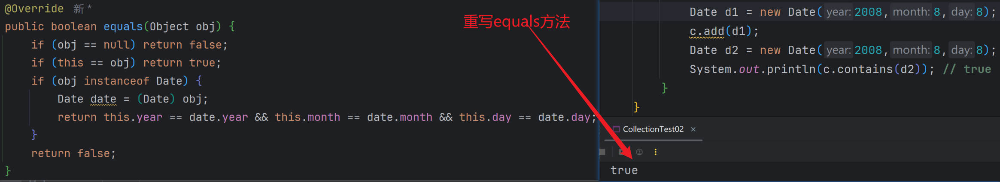
>
> 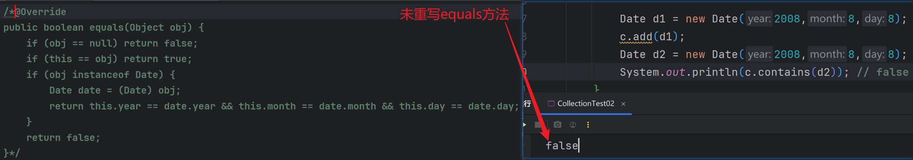


⑤**boolean remove(Object o); 从集合中删除对象o（底层也会调用equals方法来完成删除。）**

```java
// 删除集合中的某个元素（底层也会调用equals方法来完成删除。）
System.out.println(c.size()); // 9
c.remove(d2);
System.out.println(c.size()); // 8
```


⑥**void clear(); 清空集合**

```java
// 清空集合
System.out.println(c.isEmpty()); // false
c.clear();
System.out.println(c.size()); // 0
System.out.println(c.isEmpty()); // true
```


⑦**boolean isEmpty(); 判断集合中元素个数是否为0**

```java
// 清空集合
System.out.println(c.isEmpty()); // false
c.clear();
System.out.println(c.size()); // 0
System.out.println(c.isEmpty()); // true
```


⑧**Object[] toArray(); 将集合转换成`一维数组`**

```java
// 创建一个集合对象
Collection c = new ArrayList();
// 添加元素
c.add(100); // 自动装箱
c.add(3.14); // 自动装箱
c.add(false); // 自动装箱
c.add("jack");
c.add(new Object());

// 将集合转换成Object数组
Object[] objs = c.toArray();
for(Object obj : objs){
     System.out.println(obj);
    /*
    100
    3.14
    false
    jack
    java.lang.Object@b4c966a
    */
}
```


### Collection的遍历（集合的通用遍历方式）

```java
关于Collection集合的通用迭代方式/遍历方式
     1. 以下遍历方式适用于所有Collection的子。通用的。
     2. 遍历其实本质上就是将集合中每一个元素逐一获取到。
     3. 怎么遍历/迭代？3步
         第一步：获取集合依赖的迭代器对象
             Iterator it = collection.iterator();
         第二步：判断当前光标指向的位置是否存在元素
             boolean has = it.hasNext();
             true:表示当前光标指向的位置有数据。
             false:表示当前光标指向的位置没有数据。
         第三步：取出当前光标指向位置的元素，并且将光标向下移动一位。
             Object obj = it.next();
```

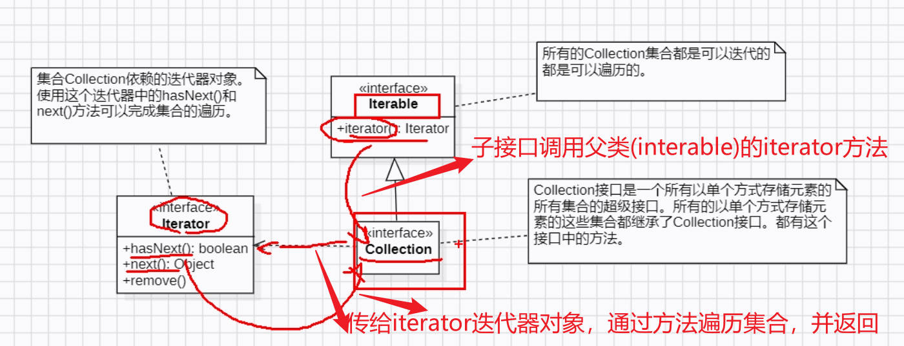

```java
1.第一步：获取当前集合依赖的迭代器对象

Iterator it = collection.iterator();

2.第二步：编写循环，循环条件是：当前光标指向的位置是否存在元素。

while(it.hasNext()){}

3.第三步：如果有，将光标指向的当前元素返回，并且将光标向下移动一位。

Object obj = it.next();
```

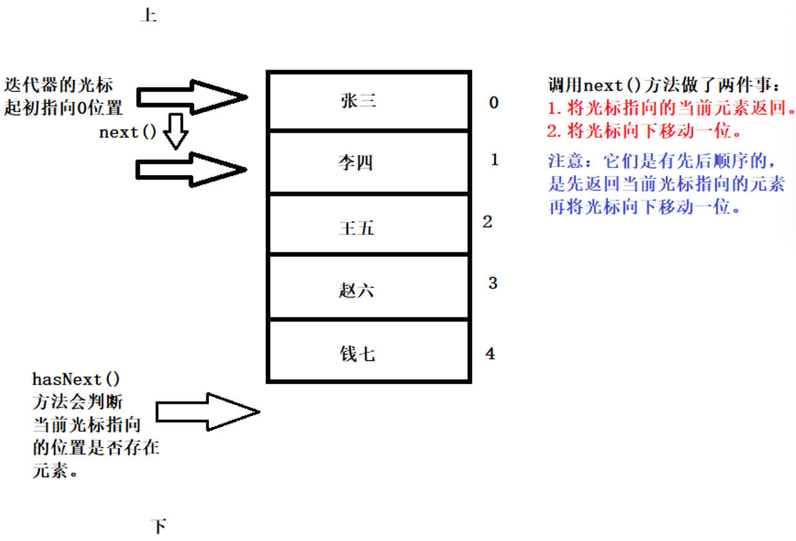

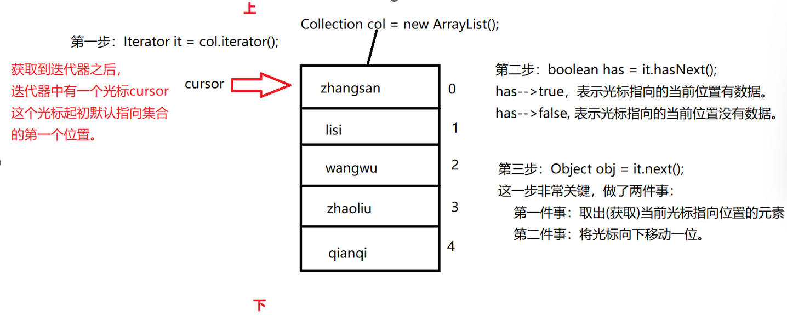

```java
package com.powernode.javase.collection;

import java.util.ArrayList;
import java.util.Collection;
import java.util.Iterator;

public class CollectionTest03 {
    public static void main(String[] args) {
        // 创建集合对象
        Collection col = new ArrayList();
        // 修改成这个代码之后底层数据结构就变成了链表的结构，但是后续的代码不需要进行任何修改。
        // 这是因为后续所有的代码都是面向接口编程的。去更换数据结构，后续的迭代程序不需要修改。
        //Collection col = new LinkedList();

        // 向集合中添加元素
        col.add("zhangsan");
        col.add("lisi");
        col.add("wangwu");
        col.add("zhaoliu");
        col.add("qianqi");

        // 迭代/遍历
        /*// 第一步：获取迭代器
        Iterator it = col.iterator();
        // 第二步：判断当前光标指向的位置有没有数据
        boolean has = it.hasNext();
        // 第三步：如果has是true，表示当前光标指向的位置有数据
        if(has){
            // 1. 先将光标指向的当前位置的元素获取到。
            // 2. 再将cursor向下移动一位。
            Object obj = it.next();
            System.out.println(obj);
        }

        has = it.hasNext();
        if(has){
            Object obj = it.next();
            System.out.println(obj);
        }*/

        Iterator it = col.iterator();
        System.out.println("输出迭代器：" + it);
        while(it.hasNext()){
            Object obj = it.next();
            System.out.println(obj);
        }

        // for循环也是可以的
        // for (初始化表达式; 条件表达式; 更新表达式){}
        /*for(Iterator it = col.iterator(); it.hasNext(); ){
            // 循环体
            Object obj = it.next();
            System.out.println(obj);
        }*/
    }
}
```


## SequencedCollection接口

> **所有的`有序集合`都实现了`SequencedCollection接口`**

①**SequencedCollection接口是`Java21版本新增的`。**

②**SequencedCollection接口中的方法：**

1. **`void addFirst(Object o)`：向头部添加**

2. **`void addLast(Object o)`：向末尾添加**

3. **`Object removeFirst()`：删除头部**

4. **`Object removeLast()`：删除末尾**

5. **`Object getFirst()`：获取头部节点**

6. **`Object getLast()`：获取末尾节点**

7. **`SequencedCollection reversed(); `反转集合中的元素**

```java
package com.powernode.javase.collection;

import java.util.ArrayList;
import java.util.Iterator;
import java.util.SequencedCollection;

/**
 * 有序集合的祖宗接口。测试一下它的公共通用方法：
 *      addFirst()
 *      addLast()
 *      removeFirst()
 *      removeLast()
 *      getFirst()
 *      getLast()
 *      reversed()
 */
public class SequencedCollectionTest {
    public static void main(String[] args) {
        // 创建集合对象
        SequencedCollection sc = new ArrayList();

        // 添加元素
        sc.add(1);
        sc.add(2);
        sc.add(3);
        sc.add(4);

        // 向头部添加一个元素
        sc.addFirst(0);
        /*
        0
        1
        2
        3
        4
         */

        // 向尾部添加一个元素
        sc.addLast(5);
        /*
        0
        1
        2
        3
        4
        5
         */

        // 遍历
        Iterator it = sc.iterator();
        while(it.hasNext()) {
            Object obj = it.next();
            System.out.println(obj);
            /*
            0
            1
            2
            3
            4
            5
             */
        }

        // 获取头
        System.out.println(sc.getFirst()); // 0

        // 获取尾
        System.out.println(sc.getLast()); // 5

        // 删除头
        sc.removeFirst();
        /*
        1
        2
        3
        4
        5
         */

        // 删除尾巴
        sc.removeLast();
        /*
        1
        2
        3
        4
         */

        System.out.println("======================");

        // 遍历
        it = sc.iterator();
        while(it.hasNext()) {
            Object obj = it.next();
            System.out.println(obj);
            /*
            1
            2
            3
            4
             */
        }

        System.out.println("======================");

        // 反转
        SequencedCollection reversed = sc.reversed();
        it = reversed.iterator();
        while(it.hasNext()) {
            Object obj = it.next();
            System.out.println(obj);
            /*
            4
            3
            2
            1
             */
        }
    }
}
```

③**`ArrayList，LinkedList，Vector，LinkedHashSet，TreeSet,Stack` 都可以`调用这个接口`中的方法。**


## 泛型

①**泛型是`Java5的新特性`，属于`编译阶段的功能`。**

②**泛型可以让开发者在编写代码时`指定集合中存储的数据类型`**

③**泛型作用：**

1. **`类型安全`：指定了集合中元素的类型之后，编译器会在`编译时进行类型检查`，如果尝试将错误类型的元素添加到集合中，就会在`编译时报错`，避免了在`运行时出现类型错误的问题`。**

2. **`代码简洁`：使用泛型可以`简化代码`，避免了`繁琐的类型转换操作`。比如，在没有泛型的时候，需要`使用 Object 类型`来保存集合中的元素，并在使用时`强制类型转换成实际类型`，而有了泛型之后，只需要在`定义集合时指定类型即可`。**

④**在集合中使用泛型**

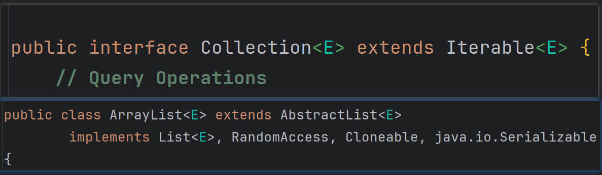

```java
Collection<String> strs = new ArrayList<String>();

1.这就表示该集合只能存储字符串，存储其它类型时编译器报错。

2.并且以上代码使用泛型后，避免了繁琐的类型转换，集合中的元素可以直接调用String类特有的方法。
```

> **示例:**
>
> ```java
> package com.powernode.javase.collection;
> 
> public class User {
>     private String name;
> 
>     public User(String name) {
>         this.name = name;
>     }
> 
>     public String getName() {
>         return name;
>     }
> 
>     public void setName(String name) {
>         this.name = name;
>     }
> 
>     public void pay() {
>         System.out.println(this.name + "正在支付...");
>     }
> }
> ```
>
> ```java
> package com.powernode.javase.collection;
> 
> import java.util.ArrayList;
> import java.util.Collection;
> import java.util.Iterator;
> 
> /**
>  * 当前程序先不使用泛型，分析存在什么缺点？
>  *      不好看，代码写的比较多。每一次从集合中取出的元素要想访问子类中特有的方法，必须向下转型。
>  *      大部分都是要写向下转型的。因为Object类中的方法肯定是不够用的。一定会调用子类方法。
>  */
> public class GenericTest01 {
>     public static void main(String[] args) {
>         // 创建集合对象
>         Collection c = new ArrayList();
> 
>         // 创建User类型的对象
>         User u1 = new User("张三");
>         User u2 = new User("李四");
>         User u3 = new User("王五");
> 
>         // 添加到集合中
>         c.add(u1);
>         c.add(u2);
>         c.add(u3);
> 
>         // 遍历集合
>         Iterator it = c.iterator();
>         while (it.hasNext()) {
>             Object obj = it.next();
>             if (obj instanceof User) {
>                 // 支付
>                 // 这里没有使用泛型机制，那么要想调用pay()方法，必须进行向下转型
>                 User user = (User) obj;
>                 user.pay();
>                 /*
>                 张三正在支付...
>                 李四正在支付...
>                 王五正在支付...
>                  */
>             }
>         }
>     }
> }
> ```
>
> ```java
> package com.powernode.javase.collection;
> 
> import java.util.ArrayList;
> import java.util.Collection;
> import java.util.Iterator;
> 
> /**
>  * 使用泛型机制。
>  */
> public class GenericTest02 {
>     public static void main(String[] args) {
>         // 程序编写的时候，是否可以使用泛型，看哪里？
>         // 看帮助文档中有没有“<>”符号。
>         // 有这个符号的都可以使用泛型。
>         // 创建一个集合，要求这个集合中只能存放User类型的对象。不能存储其他类型。
>         // Collection<User> users = new ArrayList<User>();
>         Collection<User> users = new ArrayList<>();
> 
> 
>         // 向集合中添加User对象
>         User u1 = new User("张三");
>         User u2 = new User("李四");
>         User u3 = new User("王五");
>         users.add(u1);
>         users.add(u2);
>         users.add(u3);
> 
>         // 编译器报错，不能添加其他类型，只能添加User类型。
>         //users.add("abc");
> 
>         // 遍历集合
>         Iterator<User> it = users.iterator();
>         while (it.hasNext()) {
>             User user = it.next();
>             user.pay();
>             /*
>             张三正在支付...
>             李四正在支付...
>             王五正在支付...
>             */
>         }
>     }
> }
> ```


⑤**Java7的新特性：`钻石表达式`**

```java
Collection<String> strs = new ArrayList<>();

//Collection<String> strs = new ArrayList<String>();
// java7的新特性：钻石表达式。
Collection<String> strs = new ArrayList<>();
strs.add("jack");
strs.add("lisi");
strs.add("lucy");
strs.add("tom");
Iterator<String> it2 = strs.iterator();
while(it2.hasNext()){
     String str = it2.next();
     System.out.println(str.charAt(1));
     /*
     a
     i
     u
     o
     */
}
```


### 泛型的擦除与补偿（了解）

①**泛型的出现提高了编译时的安全性，正因为编译时对添加的数据做了检查，则程序运行时才不会抛出类型转换异常。因此泛型本质上是编译时期的技术，是`专门给编译器用的`。加载类的时候，会`将泛型擦除掉`（擦除之后的类型为Object类型），这个称为`泛型擦除`。**

②**为什么要有泛型擦除呢？其本质是为了让JDK1.4和JDK1.5能够兼容同一个类加载器。在JDK1.5版本中，程序编译时期会对集合添加的元素进行安全检查，如果检查完是安全的、没有错误的，那么就意味着添加的元素都属于同一种数据类型，则加载类时就可以把这个泛型擦除掉，将泛型擦除后的类型就是Object类，这样擦除之后的代码就与JDK1.4的代码一致。**

③**由于加载类的时候，会默认将类中的泛型擦除为Object类型，所以添加的元素就被转化为Object类型，同时取出的元素也默认为Object类型。而我们获得集合中的元素时，按理说取出的元素应该是Object类型，为什么取出的元素却是实际添加的元素类型呢？**

④**这里又做了一个默认的操作，我们称之为`泛型的补偿`。在程序运行时，通过`获取元素的实际类型进行强转`，这就叫做`泛型补偿`（不必手动实现强制转换）。获得集合中的元素时，虚拟机会根据获得元素的实际类型进行向下转型，也就是会恢复获得元素的实际类型，因此我们就`无需手动执行向下转型操作`，从本质上`避免了抛出类型转换异常`。**


### 泛型的使用


#### 在类上定义泛型

```java
语法：
    class 类名<泛型1,泛型2,泛型3...>{}
```

> **示例:**
>
> ```java
> package com.powernode.javase.collection;
> 
> /**
>  * 在类上自定义泛型。
>  */
> public class MyClass<T> { // 这一行代码的作用是：表示在类声明的时候，给类声明/定义一个泛型。
>     private T name;
> 
>     public MyClass(T name) {
>         this.name = name;
>     }
> 
>     public T getName() {
>         return name;
>     }
> 
>     public void setName(T name) {
>         this.name = name;
>     }
> 
>     public static void main(String[] args) {
>         MyClass<String> myClass = new MyClass<>("zhangsan");
>         myClass.setName("lisi");
> 
>         MyClass<Integer> myClass2 = new MyClass<>(100);
>         myClass2.setName(120);
>     }
> }
> ```
>
> ```java
> package com.powernode.javase.collection;
> 
> public class Vip<NameType, AgeType> {
>     private NameType name;
>     private AgeType age;
> 
>     public Vip(NameType name, AgeType age) {
>         this.name = name;
>         this.age = age;
>     }
> 
>     public NameType getName() {
>         return name;
>     }
> 
>     public void setName(NameType name) {
>         this.name = name;
>     }
> 
>     public AgeType getAge() {
>         return age;
>     }
> 
>     public void setAge(AgeType age) {
>         this.age = age;
>     }
> 
>     public static void main(String[] args) {
>         // 创建Vip对象
>         Vip<String, Integer> vip = new Vip<>("zhangsan", 20);
> 
>         // 编译报错
>         //Vip<String, Integer> vip2 = new Vip<>("zhangsan", "20");
> 
>         String name = vip.getName();
>         Integer age = vip.getAge();
>         System.out.println(name); // "zhangsan"
>         System.out.println(age); // 20
>     }
> }
> ```


#### 在静态方法上定义泛型

**在`类上定义的泛型`，在`静态方法中无法使用`。如果在静态方法中使用泛型，则需要再方法返回值类型前面进行`泛型的声明`。**

```java
语法：
    <泛型1, 泛型2, 泛型3, ...> 返回值类型 方法名(形参列表) {}
```

```java
package com.powernode.javase.collection;

//public class Customer<T> {
public class Customer {

    /*public void shopping(T type){

    }*/

    /**
     * 在静态方法上使用泛型之前，类型必须是提前定义好之后才能用。
     * 在静态方法中定义泛型需要在返回值类型前面定义/声明。
     *
     */
    public static <T> void shopping(T type){

    }

    public static <E> void print(E[] elts){
        for (E elt : elts){
            System.out.println(elt);
        }
    }

    public static void main(String[] args) {
        /*Customer<String> c = new Customer<String>();
        c.shopping("abc");*/

        //Customer.shopping();

        String[] strs = {"zhangsan","lisi"};
        Customer.print(strs);
    }
}
```


#### 在接口上定义泛型

①**语法格式：**

```java
interface 接口名<泛型1,泛型2,...> {}
```


②**例如：**

```java
public interface Flayable<T>{}
```


③实现接口时，如果知道具体的类型，则：

```java
public class MyClass implements Flyable<Bird>{}
```


④实现接口时，如果不知道具体的类型，则：

```java
public class MyClass<T> implements Flyable<T>{}
```

> **示例:**
>
> ```java
> package com.powernode.javase.collection;
> 
> /**
>  * 在接口上定义泛型
>  * @param <T>
>  */
> public interface MyComparable<T> {
>     int compareTo(T o);
> }
> ```
>
> ```java
> package com.powernode.javase.collection;
> 
> // 第一种实现接口的方式。
> public class Product implements MyComparable<Product>{
> 
>     // 单价
>     private int price;
> 
>     public Product(int price) {
>         this.price = price;
>     }
> 
>     public int getPrice() {
>         return price;
>     }
> 
>     public void setPrice(int price) {
>         this.price = price;
>     }
> 
>     @Override
>     public int compareTo(Product o) {
>         // 编写比较规则
>         return this.price - o.price;
>     }
> 
>     public static void main(String[] args) {
>         Product p1 = new Product(7);
>         Product p2 = new Product(6);
> 
>         System.out.println(p1.compareTo(p2)); // 1
>     }
> }
> ```
>
> ```java
> package com.powernode.javase.collection;
> 
> // 第二种实现接口的方式。
> public class Order<T> implements MyComparable<T>{
>     @Override
>     public int compareTo(T o) {
>         return 0;
>     }
> }
> ```


### 泛型通配符

①**泛型是在限定数据类型，当在集合或者其他地方使用到泛型后，那么这时一旦明确泛型的数据类型，那么在使用的时候只能给其传递和数据类型匹配的类型，否则就会报错。**

②**有的情况下，我们在定义方法时，根本无法确定集合中存储元素的类型是什么。为了解决`这个“无法确定集合中存储元素类型”问题`，那么Java语言就提供了`泛型的通配符`。**

③**通配符的几种形式：**

1. **无限定通配符，`<?>`，此处`“？”可以为任意引用数据类型`。**

```java
package com.powernode.javase.collection;

import java.util.ArrayList;

/**
 * 注意，以下讲解内容是泛型通配符。这个是站在使用泛型的角度来说的。不属于泛型定义的相关内容。
 * 别人把泛型定义好了，我来使用。使用的时候可以使用泛型通配符。
 *
 * 1. 无限定通配符，<?>，此处“？”可以为任意引用数据类型。
 * 2. 上限(界)通配符，<? extends Number>，此处“？”必须为Number及其子类。
 * 3. 下限(界)通配符，<? super Number>，此处“？”必须为Number及其父类。
 */
public class GenericTest03 {

    public static void print(ArrayList<?> list){}

    public static void main(String[] args) {
        print(new ArrayList<String>());
        print(new ArrayList<Object>());
        print(new ArrayList<Integer>());
        print(new ArrayList<User>());
    }
}
```

2. **上限(界)通配符，`<? extends Number>`，此处“？”必须为`Number及其子类`。**

```java
package com.powernode.javase.collection;

import java.util.ArrayList;

/**
 * 注意，以下讲解内容是泛型通配符。这个是站在使用泛型的角度来说的。不属于泛型定义的相关内容。
 * 别人把泛型定义好了，我来使用。使用的时候可以使用泛型通配符。
 *
 * 1. 无限定通配符，<?>，此处“？”可以为任意引用数据类型。
 * 2. 上限(界)通配符，<? extends Number>，此处“？”必须为Number及其子类。
 * 3. 下限(界)通配符，<? super Number>，此处“？”必须为Number及其父类。
 */
public class GenericTest03 {

    public static void print2(ArrayList<? extends Number> list){}

    public static void main(String[] args) {

        print2(new ArrayList<Integer>());
        print2(new ArrayList<Double>());
        print2(new ArrayList<Byte>());

        // 编译报错
        //print2(new ArrayList<String>());
    }
}
```

3. **下限(界)通配符，`<? super Number>`，此处“？”必须为`Number及其父类`。**

```java
package com.powernode.javase.collection;

import java.util.ArrayList;

/**
 * 注意，以下讲解内容是泛型通配符。这个是站在使用泛型的角度来说的。不属于泛型定义的相关内容。
 * 别人把泛型定义好了，我来使用。使用的时候可以使用泛型通配符。
 *
 * 1. 无限定通配符，<?>，此处“？”可以为任意引用数据类型。
 * 2. 上限(界)通配符，<? extends Number>，此处“？”必须为Number及其子类。
 * 3. 下限(界)通配符，<? super Number>，此处“？”必须为Number及其父类。
 */
public class GenericTest03 {

    public static void print3(ArrayList<? super String> list){}

    public static void print4(ArrayList<? super B> list){}

    public static void main(String[] args) {

        print3(new ArrayList<Object>());
        print3(new ArrayList<String>());
        print3(new ArrayList<String>());

        // 编译报错
        //print3(new ArrayList<A>());

        print4(new ArrayList<B>());
        print4(new ArrayList<A>());
        // 报错
        //print4(new ArrayList<C>());
    }
}


class A{

}

class B extends A{

}

class C extends B{
}
```


## 迭代时删除元素

```java
package com.powernode.javase.collection;

import java.util.ArrayList;
import java.util.Collection;
import java.util.Iterator;

/**
 * 集合迭代过程中元素的删除问题
 */
public class CollectionTest04 {
    public static void main(String[] args) {
        // 创建集合元素
        Collection<String> names = new ArrayList<>();

        // 添加元素
        names.add("zhangsan");
        names.add("lisi");
        names.add("wangwu");
        names.add("zhaoliu");
        names.add("zhoubapi");

        // 迭代集合，删除集合中的某个元素
        Iterator<String> it = names.iterator();
        while (it.hasNext()) {
            String name = it.next(); // java.util.ConcurrentModificationException 并发修改异常 modCount expectedModCount
            if ("lisi".equals(name)) {
                // 删除元素（使用集合带的remove方法删除元素）
                //names.remove(name);
                // 删除元素（使用迭代器的remove方法删除元素）
                it.remove();
            }
            System.out.println(name);
            /*
            zhangsan
            lisi
            wangwu
            zhaoliu
            zhoubapi
             */
        }

        System.out.println(names.size()); // 4
        System.out.println("============================");
        // 再次迭代
        Iterator<String> it2 = names.iterator();
        while (it2.hasNext()) {
            String name = it2.next();
            System.out.println(name);
            /*
            zhangsan
            wangwu
            zhaoliu
            zhoubapi
             */
        }
    }
}
```

①**迭代集合时删除元素**

+ **使用“`集合对象.remove(元素)`”：会出现`ConcurrentModificationException异常`。**

+ **使用“`迭代器对象.remove()`”：`不会出现异常`。**

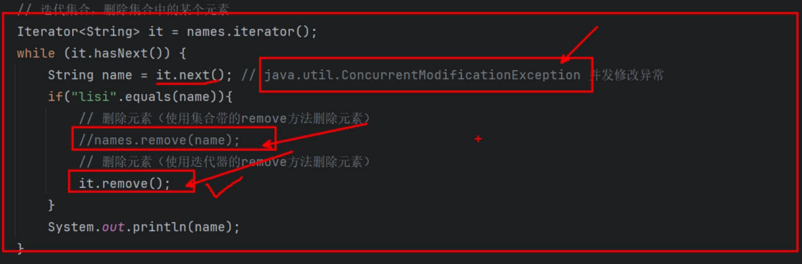

②**关于集合的`并发修改问题`**

+ **想象一下，有两个线程：A和B。`A线程`负责`迭代遍历集合`，`B线程`负责`删除集合中的某个元素`。当这两个线程同时执行时会有什么问题？**

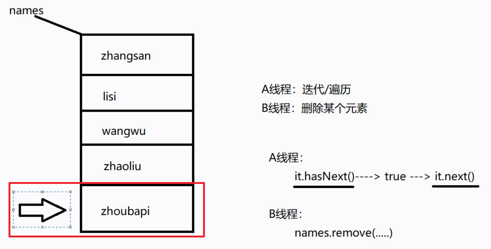

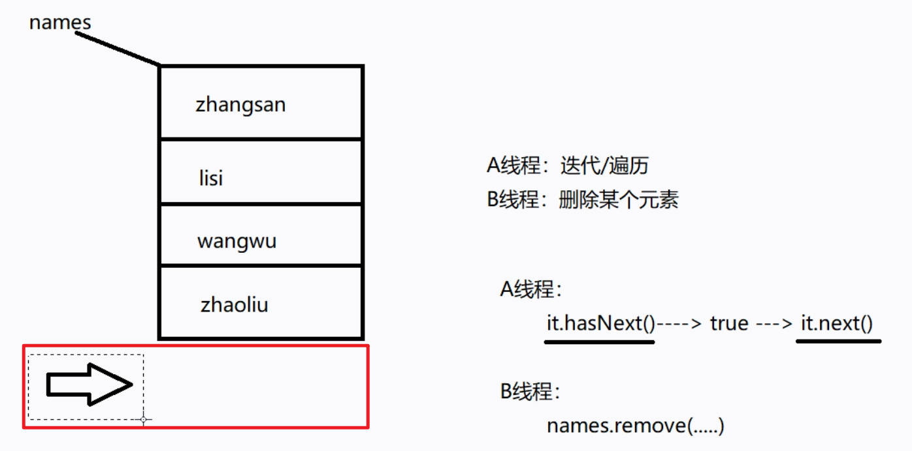


③**如何`解决并发修改问题`：`fail-fast机制(快速失败机制)`**

+ **fail-fast机制又被称为：`快速失败机制`。也就是说只要程序发现了程序对集合进行了并发修改。就会`立即让其失败`，以防`出现错误`。**

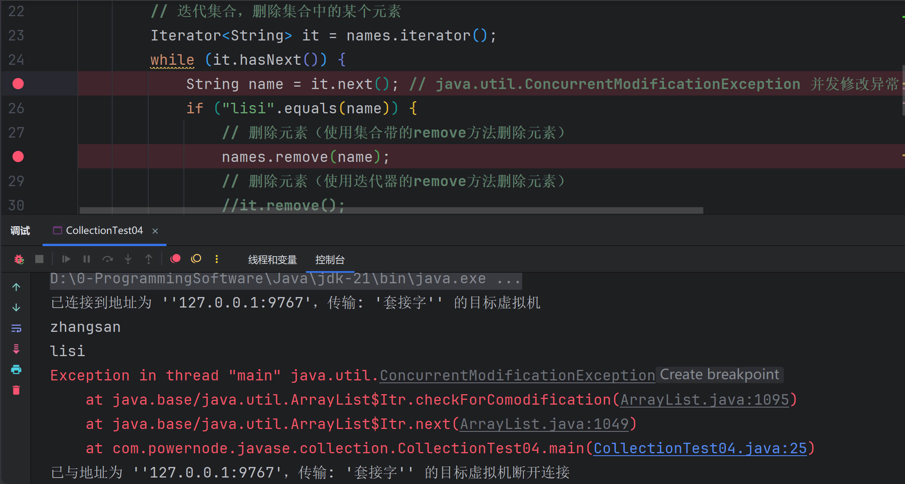

④**fail-fast机制是如何实现的？以下是源码中的实现原理：**

+ **集合中设置了一个modCount属性，用来记录修改次数，使用集合对象执行增，删，改中任意一个操作时，modCount就会自动加1。**

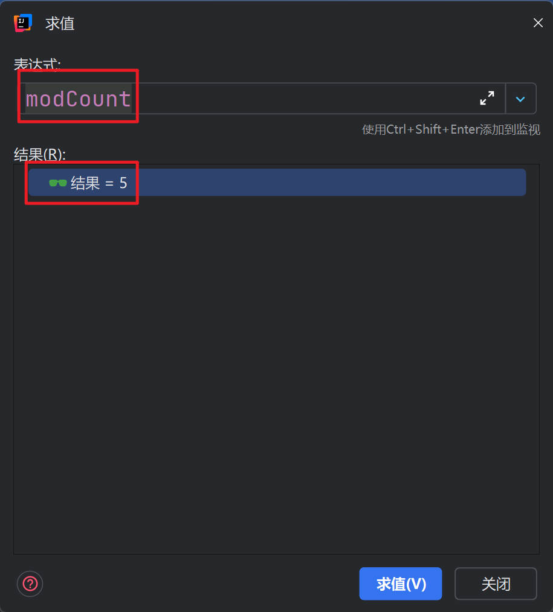

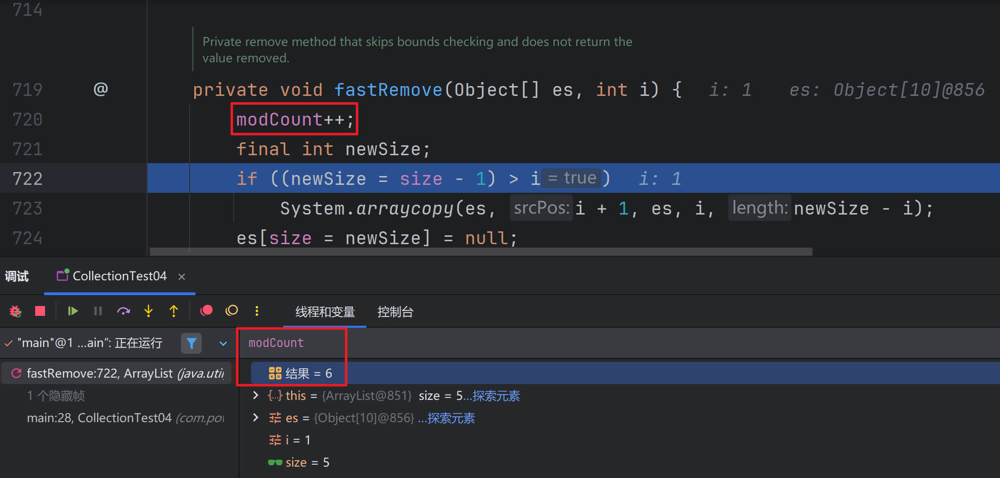

+ **获取迭代器对象的时候，会给迭代器对象初始化一个expectedModCount属性。并且将expectedModCount初始化为modCount，即：int expectedModCount = modCount;**

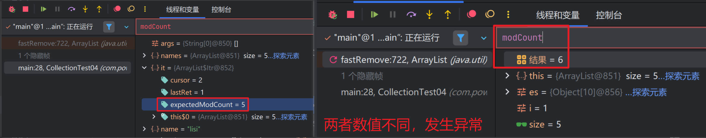

+ **当使用`集合对象删除元素`时：`modCount会加1`。但是迭代器中的`expectedModCount不会加1`。而当迭代器对象的`next()方法执行`时，会检测`expectedModCount和modCount是否相等`，如果`不相等`，则抛出：`ConcurrentModificationException异常`。**

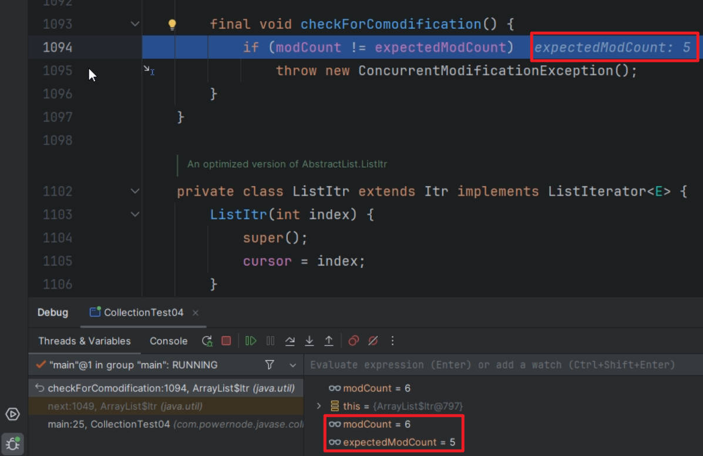

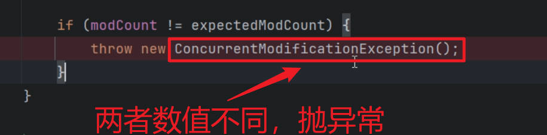

+ **当使用`迭代器删除元素`的时候：`modCount会加1`，并且`expectedModCount也会加1`。这样当迭代器对象的`next()方法执行`时，检测到的`expectedModCount和modCount相等`，则`不会出现ConcurrentModificationException异常`。**


⑤**注意：虽然我们当前写的程序是单线程的程序，并没有使用多线程，但是通过`迭代器去遍历`的同时`使用集合去删除元素`，这个行为将被认定为`并发修改`。**

⑥**结论：迭代集合时，删除元素要使用“`迭代器对象.remove()`”方法来删除，避免使用“`集合对象.remove(元素)`”。主要是为了`避免ConcurrentModificationException异常`的发生。注意：`迭代器的remove()方法删除的是next()方法的返回的那个数据`。`remove()方法调用`之前一定是`先调用了next()方法`，如果不是这样的，就会报错。**


## List接口

### List接口常用方法

①**List集合存储元素特点：`有序可重复`。**

1. **有序：是因为List集合中的元素`都是有下标的`，从0开始，以1递增。**

2. **可重复：`存进去1`，还可以`再存一个1`。**

```java
package com.powernode.javase.collection;

import java.util.ArrayList;
import java.util.Iterator;
import java.util.List;

/**
 * java.util.List:接口 （List家族）
 * 1. List家族特点：有序可重复（有序：每个元素有下标，从0开始，以1递增。可重复：存储了一个1，可以再存储一个1。）
 */
public class ListTest01 {
    public static void main(String[] args) {
        // 创建一个List集合
        List<Integer> nums = new ArrayList<>();

        nums.add(1);
        nums.add(2);
        nums.add(3);
        nums.add(4);
        nums.add(5);
        nums.add(6);
        nums.add(1);

        // 遍历
        Iterator<Integer> iterator = nums.iterator();
        while (iterator.hasNext()) {
            Integer num = iterator.next();
            System.out.println(num);
            /*
            1
            2
            3
            4
            5
            6
            1
             */
        }
    }
}
```


②**List接口下常见的实现类有：**

1. **ArrayList：数组**

2. **Vector、Stack：数组（线程安全的）**

3. **LinkedList：双向链表**

③**List接口特有方法：（在`Collection`和`SequencedCollection`中`没有的方法`，`只适合List家族`使用的方法，这些方法`都和下标有关系`。）**

1. **void add(int index, E element) 在`指定索引处插入元素`**

```java
package com.powernode.javase.collection;

import java.util.ArrayList;
import java.util.Iterator;
import java.util.List;

public class ListTest02 {
    public static void main(String[] args) {
        // 创建List集合对象
        List<String> list = new ArrayList<String>();

        // 添加元素
        list.add("1");
        list.add("2");
        list.add("3");
        list.add("4");
        list.add("5");
        list.add("6");

        // 在指定位置添加元素
        list.add(1,"zhangsan");

        // 遍历
        Iterator<String> iterator = list.iterator();
        while (iterator.hasNext()) {
            String s = iterator.next();
            System.out.println(s);
            /*
            1
            zhangsan
            2
            3
            4
            5
            6
             */
        }
    }
}
```


2. **E set(int index, E element); `修改索引处的元素`**

```java
package com.powernode.javase.collection;

import java.util.ArrayList;
import java.util.Iterator;
import java.util.List;

public class ListTest02 {
    public static void main(String[] args) {
        // 创建List集合对象
        List<String> list = new ArrayList<String>();

        // 添加元素
        list.add("1");
        list.add("2");
        list.add("3");
        list.add("4");
        list.add("5");
        list.add("6");

        // 在指定位置添加元素
        list.add(1,"zhangsan");

        // 修改索引处的元素
        list.add(1,"李四");

        // 遍历
        Iterator<String> iterator = list.iterator();
        while (iterator.hasNext()) {
            String s = iterator.next();
            System.out.println(s);
            /*
            1
            李四
            2
            3
            4
            5
            6
             */
        }
    }
}
```


3. **E get(int index); 根据`索引获取元素`（通过这个方法List集合具有自己特殊的遍历方式：根据下标遍历）**

```java
package com.powernode.javase.collection;

import java.util.ArrayList;
import java.util.Iterator;
import java.util.List;

public class ListTest02 {
    public static void main(String[] args) {
        // 创建List集合对象
        List<String> list = new ArrayList<String>();

        // 添加元素
        list.add("1");
        list.add("2");
        list.add("3");
        list.add("4");
        list.add("5");
        list.add("6");

        list.add("1");
        // 获取某个对象在当前集合中第一次出现处的下标
        int index = list.indexOf("1");
        System.out.println("第一次出现处的下标：" + index); // 0

        // 获取某个对象在当前集合中最后一次出现处的下标
        int lastIndex = list.lastIndexOf("1");
        System.out.println("最后一次出现处的下标：" + lastIndex); // 6

        // 遍历
        Iterator<String> iterator = list.iterator();
        while (iterator.hasNext()) {
            String s = iterator.next();
            System.out.println(s);
            /*
            1
            2
            3
            4
            5
            6
            1
             */
        }
    }
}
```


4. **E remove(int index); 删除索引处的元素**

```java
package com.powernode.javase.collection;

import java.util.ArrayList;
import java.util.Iterator;
import java.util.List;

public class ListTest02 {
    public static void main(String[] args) {
        // 创建List集合对象
        List<String> list = new ArrayList<String>();

        // 添加元素
        list.add("1");
        list.add("2");
        list.add("3");
        list.add("4");
        list.add("5");
        list.add("6");

        // 在指定位置添加元素
        list.add(1,"zhangsan");

        // 修改索引处的元素
        list.add(1,"李四");

        // 删除下标1处的元素
        list.remove(1);

        // 遍历
        Iterator<String> iterator = list.iterator();
        while (iterator.hasNext()) {
            String s = iterator.next();
            System.out.println(s);
            /*
            1
            2
            3
            4
            5
            6
             */
        }
    }
}
```


5. **int indexOf(Object o); 获取对象o在当前集合中第一次出现时的索引。**

6. **int lastIndexOf(Object o); 获取对象o在当前集合中最后一次出现时的索引。**

```java
package com.powernode.javase.collection;

import java.util.ArrayList;
import java.util.Iterator;
import java.util.List;

public class ListTest02 {
    public static void main(String[] args) {
        // 创建List集合对象
        List<String> list = new ArrayList<>();

        // 添加元素
        list.add("1");
        list.add("2");
        list.add("3");
        list.add("4");
        list.add("5");
        list.add("6");

        list.add("1");
        // 获取某个对象在当前集合中第一次出现处的下标
        int index = list.indexOf("1");
        System.out.println("第一次出现处的下标：" + index); // 0

        // 获取某个对象在当前集合中最后一次出现处的下标
        int lastIndex = list.lastIndexOf("1");
        System.out.println("最后一次出现处的下标：" + lastIndex); // 6

        // 遍历
        Iterator<String> iterator = list.iterator();
        while (iterator.hasNext()) {
            String s = iterator.next();
            System.out.println(s);
            /*
            1
            2
            3
            4
            5
            6
            1
             */
        }
    }
}
```


7. **`List<E> subList(int fromIndex, int toIndex); `截取子List集合生成一个新集合（对原集合无影响）。`[fromIndex, toIndex)`**

```java
package com.powernode.javase.collection;

import java.util.ArrayList;
import java.util.Iterator;
import java.util.List;

public class ListTest02 {
    public static void main(String[] args) {
        // 创建List集合对象
        List<String> list = new ArrayList<>();

        // 添加元素
        list.add("1");
        list.add("2");
        list.add("3");
        list.add("4");
        list.add("5");
        list.add("6");

        // 再次添加元素
        list.add("1");
        // 遍历
        Iterator<String> it = list.iterator();
        while (it.hasNext()) {
            String s = it.next();
            System.out.println(s);
            /*
            1
            2
            3
            4
            5
            6
            1
            */
        }

        // 截取一个子List集合
        List<String> newList = list.subList(3, 5); // [3,5)  最终截取的下标对应的是：3,4下标
        // 遍历（对于List集合来说有特殊的遍历方式，这种方式只适合于List集合的家族）
        for (int i = 0; i < newList.size(); i++) {
            String s = newList.get(i);
            System.out.println(s);
            /*
            4
            5
             */
        }
    }
}
```


8. **`static List<E> of(E... elements);`静态方法，返回`包含任意数量元素的不可修改列表`。（获取的集合是`只读的`，`不可修改的`。）**

```java
package com.powernode.javase.collection;

import java.util.ArrayList;
import java.util.Iterator;
import java.util.List;

public class ListTest02 {
    public static void main(String[] args) {
        // 创建List集合对象
        List<String> list = new ArrayList<>();

        // 获取一个不可修改的集合，只读的集合。
        List<Integer> nums = List.of(1, 2, 3, 43, 45, 5, 6, 76, 7);
        for (int i = 0; i < nums.size(); i++) {
            Integer num = nums.get(i);
            System.out.println(num);
            /*
            1
            2
            3
            43
            45
            5
            6
            76
            7
             */
        }
        
        // 尝试修改（出现异常，该集合是不可修改的，只读的。）
        //nums.set(0, 110); // java.lang.UnsupportedOperationException
    }
}
```


### List接口特有迭代

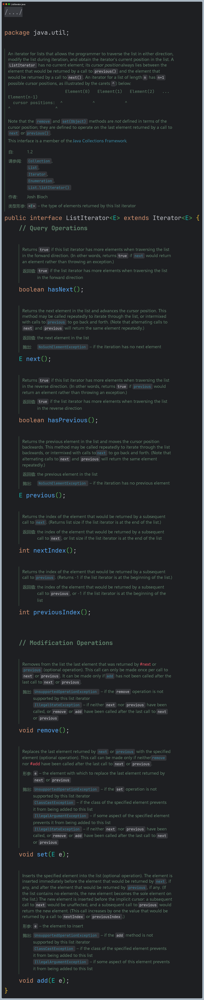

①**特有的迭代方式**

+ **`ListIterator<E> listIterator(); `获取`List集合特有的迭代器`（该迭代器功能更加强大，但`只适合于List集合`使用）**

+ **`ListIterator<E> listIterator(int index); `从列表中的`指定位置开始`，返回`列表中元素`的列表迭代器**

```java
package com.powernode.javase.collection;

import java.util.ArrayList;
import java.util.List;
import java.util.ListIterator;

/**
 * java.util.ListIterator：List接口专用的迭代器。Set集合不能使用。
 */
public class ListIteratorTest {
    public static void main(String[] args) {
        // 创建集合List对象
        List<String> names = new ArrayList<>();

        // 添加元素
        names.add("zhangsan");
        names.add("lisi");
        names.add("wangwu");
        names.add("zhaoliu");

        /*// 使用普通的通用迭代器遍历
        Iterator<String> it = names.iterator();
        while (it.hasNext()) {
            String name = it.next();
            System.out.println(name);
            *//*
            zhangsan
            lisi
            wangwu
            zhaoliu
             *//*
        }*/

        // 使用ListIterator进行遍历
        ListIterator<String> li = names.listIterator();
        while (li.hasNext()) {
            String name = li.next();
            System.out.println(name);
            /*
            zhangsan
            lisi
            wangwu
            zhaoliu
             */
        }
    }
}
```


②**ListIterator接口中的常用方法：**

+ **boolean hasNext();  判断光标当前指向的位置是否存在元素。**

+ **E next(); 将当前光标指向的元素返回，然后将光标向下移动一位。**

+ **void remove(); 删除`上一次next()方法返回的那个数据`(删除的是集合中的)。`remove()方法调用的前提`是：你先调用`next()方法`。不然`会报错`。**

```java
package com.powernode.javase.collection;

import java.util.ArrayList;
import java.util.List;
import java.util.ListIterator;

public class ListIteratorTest {
    public static void main(String[] args) {
        // 创建集合List对象
        List<String> names = new ArrayList<>();

        // 添加元素
        names.add("zhangsan");
        names.add("lisi");
        names.add("wangwu");
        names.add("zhaoliu");
        
        // remove方法：通过迭代器去删除
        //li.remove(); // java.lang.IllegalStateException（调用迭代器的remove方法之前也是需要调用了next()/previous()方法。）
        //删除上一次next()方法返回的那个数据(删除的是集合中的)。remove()方法调用的前提是：你先调用next()方法。不然会报错。
        ListIterator<String> li = names.listIterator();
        while (li.hasNext()) {
            String name = li.next();
            if("lisi".equals(name)){
                // 删除
                li.remove();
            }
        }

        System.out.println(names); // [zhangsan, wangwu, zhaoliu]
    }
}
```


+ **void add(E e); 添加元素（将元素`添加到光标指向的位置`，然后`光标向下移动一位`。）**

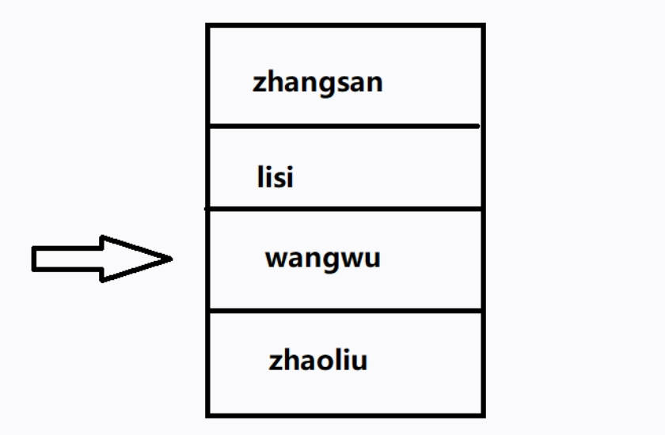

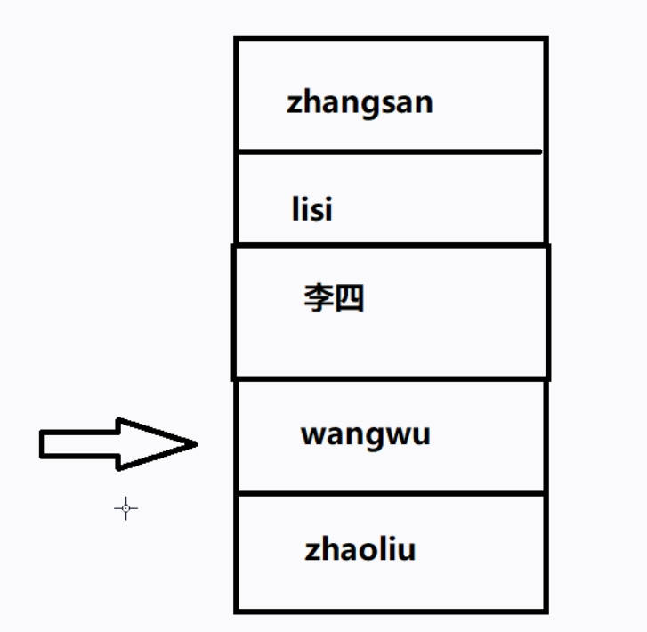

```java
package com.powernode.javase.collection;

import java.util.ArrayList;
import java.util.List;
import java.util.ListIterator;

public class ListIteratorTest {
    public static void main(String[] args) {
        // 创建集合List对象
        List<String> names = new ArrayList<>();

        // 添加元素
        names.add("zhangsan");
        names.add("lisi");
        names.add("wangwu");
        names.add("zhaoliu");

        // 使用ListIterator进行遍历
        // 测试的add方法
        ListIterator<String> li = names.listIterator();
        while (li.hasNext()) {
            String name = li.next();
            if ("lisi".equals(name)) {
                li.add("李四");
            }
            System.out.println(name);
            /*
            zhangsan
            lisi
            wangwu
            zhaoliu
             */
        }
        //System.out.println(names); // [zhangsan, lisi, 李四, wangwu, zhaoliu]
    }
}
```


+ **boolean hasPrevious(); 判断`当前光标指向位置`的上一个位置`是否存在元素`。**

```java
package com.powernode.javase.collection;

import java.util.ArrayList;
import java.util.List;
import java.util.ListIterator;

public class ListIteratorTest {
    public static void main(String[] args) {
        // 创建集合List对象
        List<String> names = new ArrayList<>();

        // 添加元素
        names.add("zhangsan");
        names.add("lisi");
        names.add("wangwu");
        names.add("zhaoliu");

        // 测试hasPrevious()方法
        // 判断是否有上一个
        // 判断当前光标指向位置的上一个位置是否存在元素。
        ListIterator<String> li = names.listIterator();
        System.out.println("光标当前指向的位置的上一个位置是否有元素：" + li.hasPrevious()); // false

        while (li.hasNext()) {
            String name = li.next();
            System.out.println(name);
            /*
            zhangsan
            lisi
            wangwu
            zhaoliu
             */
        }

        System.out.println("光标当前指向的位置的上一个位置是否有元素：" + li.hasPrevious()); // true
    }
}
```


+ **E previous(); 获取`上一个元素`（将`光标向上移动一位`，然后`将光标指向的元素返回`）**

```java
package com.powernode.javase.collection;

import java.util.ArrayList;
import java.util.List;
import java.util.ListIterator;

public class ListIteratorTest {
    public static void main(String[] args) {
        // 创建集合List对象
        List<String> names = new ArrayList<>();

        // 添加元素
        names.add("zhangsan");
        names.add("lisi");
        names.add("wangwu");
        names.add("zhaoliu");

        // E previous(); 获取上一个元素（将光标向上移动一位，然后将光标指向的元素返回）
        ListIterator<String> li = names.listIterator();
        while (li.hasNext()) {
            String name = li.next();
            System.out.println(name);
        }

        System.out.println("========================");

        System.out.println(li.previous()); // zhaoliu
        System.out.println(li.previous()); // wangwu
        System.out.println(li.previous()); // lisi
        System.out.println(li.previous()); // zhangsan
        //System.out.println(li.previous()); // java.util.NoSuchElementException(没有元素异常)*/
    }
}
```


+ **int nextIndex(); 获取光标指向的那个位置的下标**

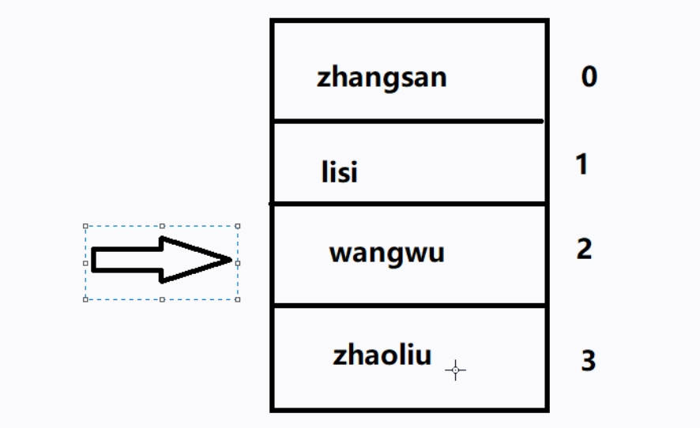

+ **int previousIndex(); 获取光标指向的那个位置的上一个位置的下标**

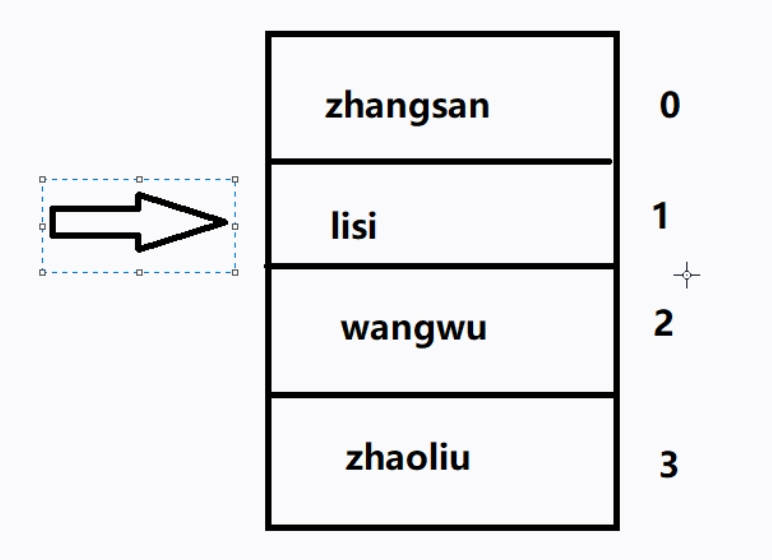

```java
package com.powernode.javase.collection;

import java.util.ArrayList;
import java.util.List;
import java.util.ListIterator;

public class ListIteratorTest {
    public static void main(String[] args) {
        // 创建集合List对象
        List<String> names = new ArrayList<>();

        // 添加元素
        names.add("zhangsan");
        names.add("lisi");
        names.add("wangwu");
        names.add("zhaoliu");
        
        //int nextIndex(); 获取光标指向的那个位置的下标
        ListIterator<String> li = names.listIterator();
        while (li.hasNext()) {
            String name = li.next();
            if("lisi".equals(name)){ // 当前取出的元素是"lisi"
                System.out.println(li.nextIndex()); //2
                // int previousIndex();	获取光标指向的那个位置的上一个位置的下标
                System.out.println(li.previousIndex()); // 1
            }
            System.out.println(name);
        }
    }
}
```


+ **void set(E e); 修改的是`上一次next()方法返回的那个数据`（修改的是`集合中的`）。set()方法调用的前提是：你先调用了`next()方法`。不然会`报错`。**

```java
package com.powernode.javase.collection;

import java.util.ArrayList;
import java.util.List;
import java.util.ListIterator;

public class ListIteratorTest {
    public static void main(String[] args) {
        // 创建集合List对象
        List<String> names = new ArrayList<>();

        // 添加元素
        names.add("zhangsan");
        names.add("lisi");
        names.add("wangwu");
        names.add("zhaoliu");

        // void set(E e);修改的是上一次next()方法返回的那个数据（修改的是集合中的）。set()方法调用的前提是：你先调用了next()方法。不然会报错。
        ListIterator<String> li = names.listIterator();

        // set方法不能随意使用，set调用的前提是：之前调用了next()或者previous()
        // li.set("xxxxxxxxxxxxxx"); // java.lang.IllegalStateException

        while (li.hasNext()) {
            String name = li.next();
            // 在这里时可以调用set方法
            if("lisi".equals(name)) {
                li.set("李四");
            }
            System.out.println(name);
        }

        System.out.println(names); // [zhangsan, 李四, wangwu, zhaoliu]
    }
}
```


### List接口使用Comparator排序

①**回顾数组中自定义类型是如何排序的？**

+ **所有自定义类型排序时`必须指定排序规则`。（`int不需要指定`，`String不需要指定`，因为他们都有`固定的排序规则`。int按照`数字大小`。String按照`字典中的顺序`）**

+ **如何给自定义类型指定排序规则？让自定义类型实现`java.lang.Comparable接口`，然后`重写compareTo方法`，在该方法中`指定比较规则`。**

```java
package com.powernode.javase.collection.arraysort;

public class User implements  Comparable<User> {
    private String name;
    private int age;

    public User(String name, int age) {
        this.name = name;
        this.age = age;
    }

    public String getName() {
        return name;
    }

    public void setName(String name) {
        this.name = name;
    }

    public int getAge() {
        return age;
    }

    public void setAge(int age) {
        this.age = age;
    }

    @Override
    public String toString() {
        return "User{" +
                "name='" + name + '\'' +
                ", age=" + age +
                '}';
    }

    /*
    关于compareTo方法的返回值：
        a - b == 0   a == b
        a - b > 0    a > b
        a - b < 0    a < b

        当compareTo方法执行结束之后，返回结果是0，表示：a == b
        当compareTo方法执行结束之后，返回结果大于0，表示：a > b
        当compareTo方法执行结束之后，返回结果小于0，表示：a < b
     */
    @Override
    public int compareTo(User user) { // 这个int是compareTo方法的返回值。相当于a - b之后的结果。
        // 这里提供比较规则
        // 可以按照名字进行排序，也可以按照年龄进行排序。
        // return this.age - user.age; // this放前表示升序。
        //return user.age - this.age; // this放后表示降序。

        // 按照姓名排序
        //return this.name.compareTo(user.name); // 升序
        return user.name.compareTo(this.name); // 降序
    }
}
```

```java
package com.powernode.javase.collection.arraysort;

import java.util.Arrays;

public class ArraySort {
    public static void main(String[] args) {
        User u1 = new User("abc", 20);
        User u2 = new User("bbc", 18);
        User u3 = new User("abb", 19);
        User u4 = new User("cbc", 25);
        User u5 = new User("acb", 6);

        User[] users = {u1, u2, u3, u4, u5};


        // 排序
        // class User cannot be cast to class Comparable
        // Arrays数组工具类在对User类型的数组进行排序的时候出现了：java.lang.ClassCastException
        // 因为User对象不是可比较的。User没有实现 java.lang.Comparable接口。
        // 换句话说：User没有提供比较规则。程序无法进行比较。
        // 怎么让User是可排序的。让User实现Comparable接口，实现compareTo方法，在该方法中编写比较规则。
        Arrays.sort(users);

        System.out.println(Arrays.toString(users));
        /*
        // 按照年龄排
        return this.age - user.age; // this放前表示升序。 // [User{name='acb', age=6}, User{name='bbc', age=18}, User{name='abb', age=19}, User{name='abc', age=20}, User{name='cbc', age=25}]
        return user.age - this.age; // this放后表示降序。 // [User{name='cbc', age=25}, User{name='abc', age=20}, User{name='abb', age=19}, User{name='bbc', age=18}, User{name='acb', age=6}]

        // 按照姓名排
        return this.name.compareTo(user.name); // 升序 // [User{name='abb', age=19}, User{name='abc', age=20}, User{name='acb', age=6}, User{name='bbc', age=18}, User{name='cbc', age=25}]
        return user.name.compareTo(this.name); // 降序 // [User{name='cbc', age=25}, User{name='bbc', age=18}, User{name='acb', age=6}, User{name='abc', age=20}, User{name='abb', age=19}]
         */
    }
}
```


②**List集合的排序**

+ **`default void sort(Comparator<? super E> c);` 对List集合中元素排序可以`调用此方法`。**

+ **sort方法需要一个参数: `java.util.Comparator`。我们把这个参数叫做`比较器`。这是`一个接口`。**

+ **如何给`自定义类型指定比较规则`？可以对Comparator提供一个`实现类`，并`重写compare方法`来指定比较规则。**

```java
package com.powernode.javase.collection.listsort;

public class Person {
    private String name;
    private int age;

    public Person(String name, int age) {
        this.name = name;
        this.age = age;
    }

    public String getName() {
        return name;
    }

    public void setName(String name) {
        this.name = name;
    }

    public int getAge() {
        return age;
    }

    public void setAge(int age) {
        this.age = age;
    }

    @Override
    public String toString() {
        return "Person{" +
                "name='" + name + '\'' +
                ", age=" + age +
                '}';
    }
}
```

```java
package com.powernode.javase.collection.listsort;

import java.util.Comparator;

/**
 * 一个单独的比较器。在这个比较器中编写Person的比较规则。
 */
public class PersonComparator implements Comparator<Person> {
    @Override
    public int compare(Person o1, Person o2) {
        // 按照年龄排序
        // 按照名字排序
        //return o1.getAge() - o2.getAge(); // 升序
        /*
        Person{name='acb', age=6}
        Person{name='bbc', age=18}
        Person{name='abb', age=19}
        Person{name='abc', age=20}
        Person{name='cbc', age=25}
         */
        //return o2.getAge() - o1.getAge(); // 降序
        /*
        Person{name='cbc', age=25}
        Person{name='abc', age=20}
        Person{name='abb', age=19}
        Person{name='bbc', age=18}
        Person{name='acb', age=6}
         */

        return o1.getName().compareTo(o2.getName());
        /*
        Person{name='abb', age=19}
        Person{name='abc', age=20}
        Person{name='acb', age=6}
        Person{name='bbc', age=18}
        Person{name='cbc', age=25}
         */
        //return o2.getName().compareTo(o1.getName());
        /*
        Person{name='cbc', age=25}
        Person{name='bbc', age=18}
        Person{name='acb', age=6}
        Person{name='abc', age=20}
        Person{name='abb', age=19}
         */
    }
}
```

```java
package com.powernode.javase.collection.listsort;

import java.util.ArrayList;
import java.util.List;

public class ListSort {
    public static void main(String[] args) {
        // 创建Person对象
        Person p1 = new Person("abc", 20);
        Person p2 = new Person("bbc", 18);
        Person p3 = new Person("abb", 19);
        Person p4 = new Person("cbc", 25);
        Person p5 = new Person("acb", 6);

        // 创建List集合
        List<Person> persons = new ArrayList<>();

        persons.add(p1);
        persons.add(p2);
        persons.add(p3);
        persons.add(p4);
        persons.add(p5);

        // 排序
        persons.sort(new PersonComparator());

        // 遍历
        for (int i = 0; i < persons.size(); i++) {
            System.out.println(persons.get(i));
            // 按照年龄排序
            // 按照名字排序
            //return o1.getAge() - o2.getAge(); // 升序
        /*
        Person{name='acb', age=6}
        Person{name='bbc', age=18}
        Person{name='abb', age=19}
        Person{name='abc', age=20}
        Person{name='cbc', age=25}
         */
            //return o2.getAge() - o1.getAge(); // 降序
        /*
        Person{name='cbc', age=25}
        Person{name='abc', age=20}
        Person{name='abb', age=19}
        Person{name='bbc', age=18}
        Person{name='acb', age=6}
         */

            //return o1.getName().compareTo(o2.getName());
        /*
        Person{name='abb', age=19}
        Person{name='abc', age=20}
        Person{name='acb', age=6}
        Person{name='bbc', age=18}
        Person{name='cbc', age=25}
         */
            //return o2.getName().compareTo(o1.getName());
        /*
        Person{name='cbc', age=25}
        Person{name='bbc', age=18}
        Person{name='acb', age=6}
        Person{name='abc', age=20}
        Person{name='abb', age=19}
         */
        }
    }
}
```


+ **当然，`Comparator接口的实现类`也`可以采用匿名内部类`的方式。**

```java
package com.powernode.javase.collection.listsort;

import java.util.ArrayList;
import java.util.Comparator;
import java.util.List;

/**
 * 使用匿名内部类
 */
public class ListSort2 {
    public static void main(String[] args) {
        // 创建Person对象
        Person p1 = new Person("abc", 20);
        Person p2 = new Person("bbc", 18);
        Person p3 = new Person("abb", 19);
        Person p4 = new Person("cbc", 25);
        Person p5 = new Person("acb", 6);

        // 创建List集合
        List<Person> persons = new ArrayList<>();

        persons.add(p1);
        persons.add(p2);
        persons.add(p3);
        persons.add(p4);
        persons.add(p5);

        // 排序
        persons.sort(new Comparator<Person>() {
            @Override
            public int compare(Person o1, Person o2) {
                return o1.getAge() - o2.getAge();
                /*
                Person{name='acb', age=6}
                Person{name='bbc', age=18}
                Person{name='abb', age=19}
                Person{name='abc', age=20}
                Person{name='cbc', age=25}
                 */
            }
        });


        for (int i = 0; i < persons.size(); i++) {
            System.out.println(persons.get(i));
        }
    }
}
```


## ArrayList

①**ArrayList集合底层采用了`数组`这种数据结构。**

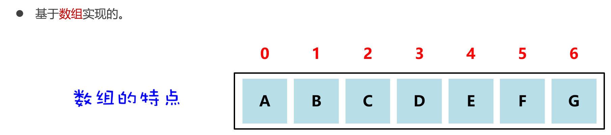

②**ArrayList集合优点：**

+ 底层是数组，因此根据下标查找元素的时间复杂度是O(1)。因此检索效率高。

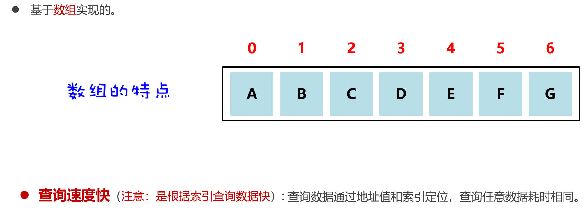

③**ArrayList集合缺点：**

+ 随机增删元素效率较低。不过只要数组的容量还没满，对末尾元素进行增删，效率不受影响。

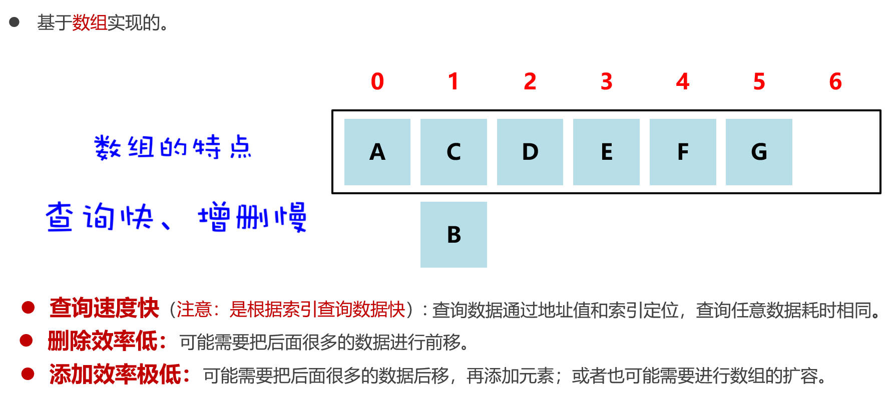

④**ArrayList集合适用场景：**

+ 需要频繁的检索元素，并且很少的进行随机增删元素时建议使用。

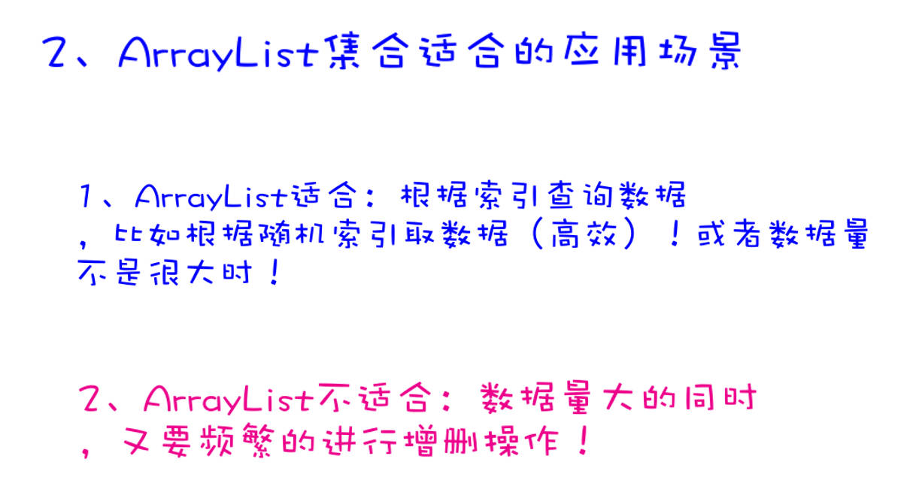

⑤**ArrayList默认初始化容量？**

+ 从源码角度可以看到，当`调用无参数构造方法`时，`初始化容量0`。
+ 当`第一次调用add方法`时将`ArrayList容量`初始化为`10个长度`。

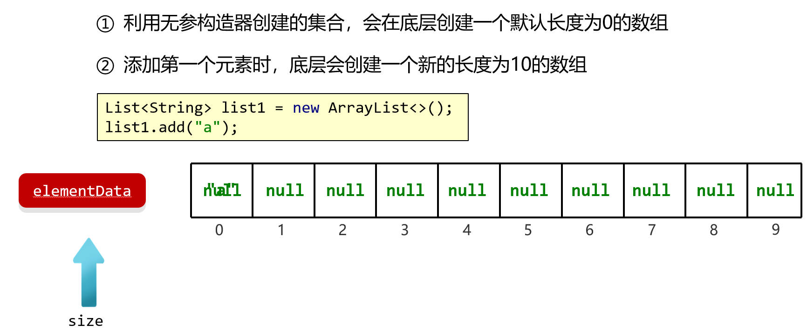

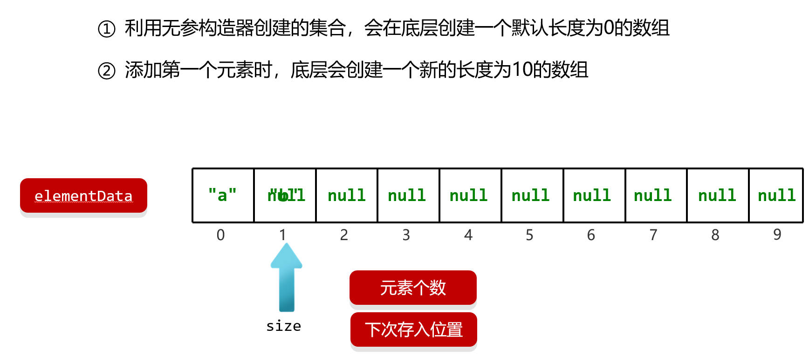

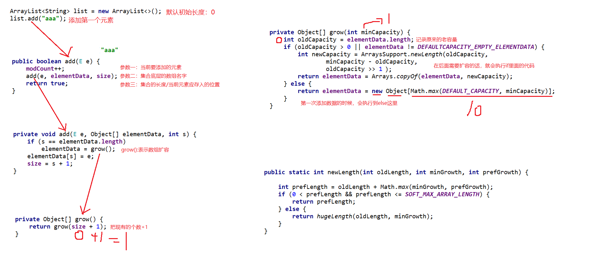

⑥**ArrayList集合扩容策略？**

+ 底层扩容会`创建一个新的数组`，然后使用`数组拷贝`。扩容之后的新容量是原容量的**1.5**倍。

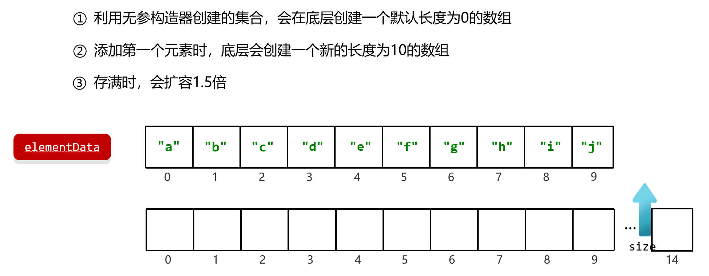

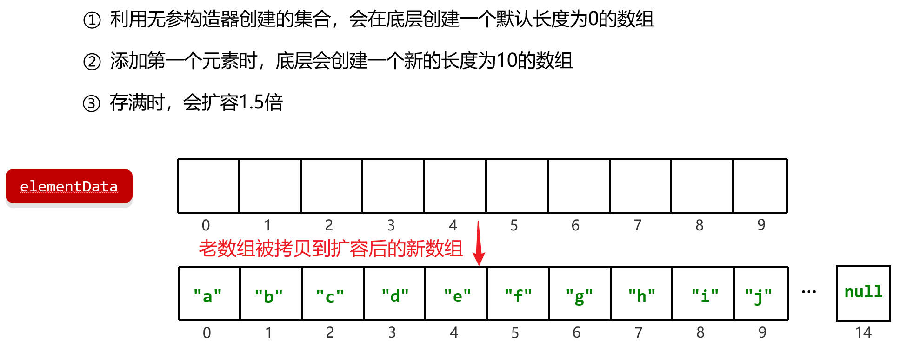

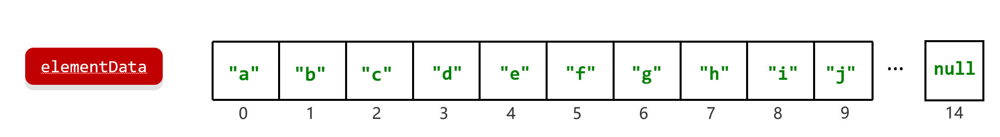

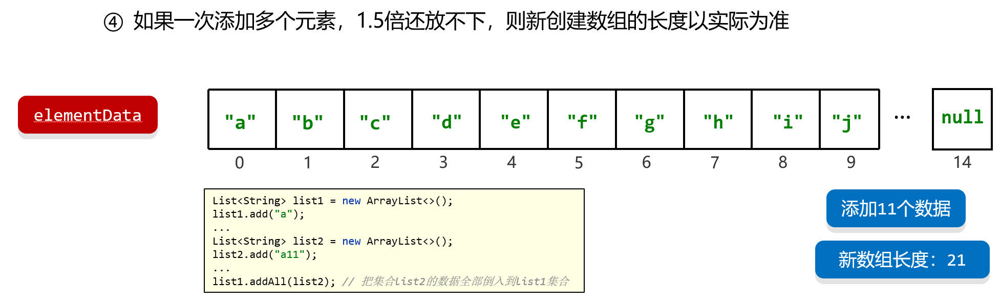

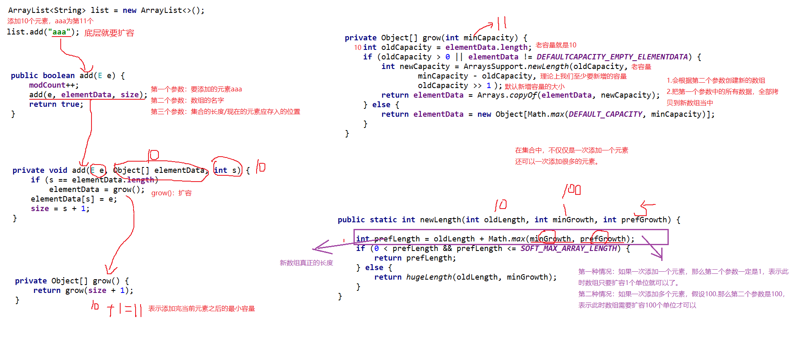

⑦**ArrayList集合源码分析：**

+ **属性分析**

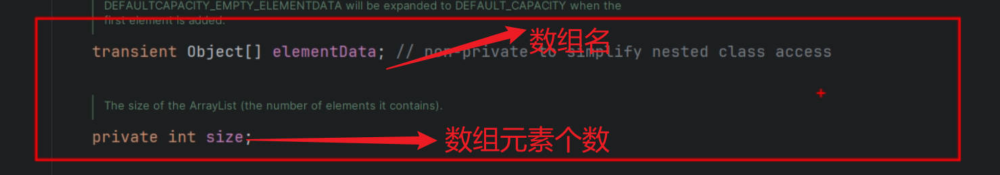

+ **构造方法分析（使用ArrayList集合时`最好也是预测大概数量`，给定`初始化容量`，减少`扩容次数`。）**

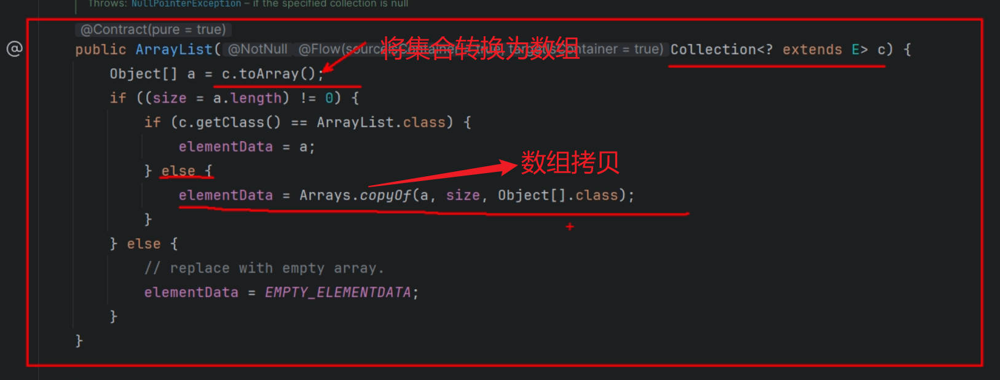

+ 添加元素

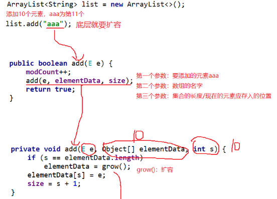

+ 修改元素

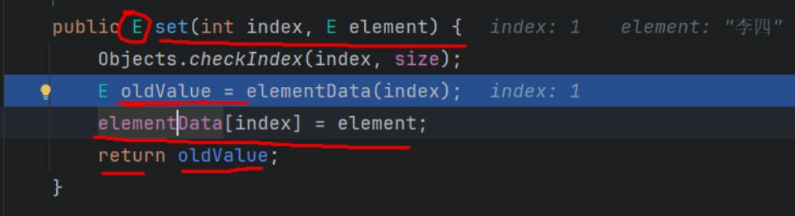

+ 插入元素

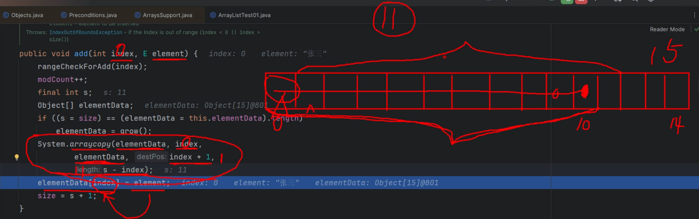

+ 删除元素

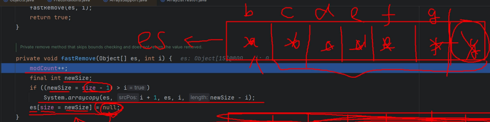

> **示例:**
>
> ```java
> package com.powernode.javase.collection;
> 
> import java.util.ArrayList;
> import java.util.List;
> 
> public class ArrayListTest01 {
>     public static void main(String[] args) {
>         // 创建一个ArrayList
>         // 1. 调用ArrayList集合的无参数构造方法时，默认初始化的容量是0
>         List<String> names = new ArrayList<>();
> 
>         // 向ArrayList集合中添加元素
>         // 第一次调用add方法的时候，初始化容量变为10
>         names.add("zhangsan");
>         names.add("lisi");
>         names.add("lisi");
>         names.add("lisi");
>         names.add("lisi");
>         names.add("lisi");
>         names.add("lisi");
>         names.add("lisi");
>         names.add("lisi");
>         names.add("lisi");
>         // ArrayList集合的增长/扩容策略？扩容之后的新容量是原容量的1.5倍。
>         names.add("lisi11");
> 
>         // 修改ArrayList集合中的某个元素
>         String oldData = names.set(1, "李四");
>         System.out.println(oldData); // lisi
> 
>         // 插入元素
>         names.add(0, "张三");
> 
>         // 删除元素
>         names.remove(0);
>     }
> }
> ```


## Vector

①**Vector底层也是`数组`，和ArrayList相同。**

②**不同的是Vector几乎所有的方法都是`线程同步`的（被synchronized修饰：线程排队执行，不能并发），因此Vector是`线程安全的`，但由于`效率较低`，`很少使用`。因为控制线程安全有新方式。**

③**Vector初始化容量：`10`**

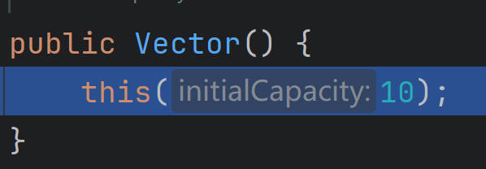

④**Vector扩容策略：扩容之后的容量是`原容量的2倍`。**

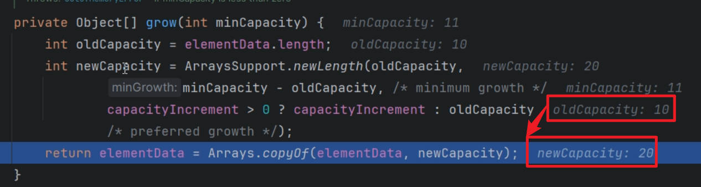

> **示例:**
>
> ```java
> package com.powernode.javase.collection;
> 
> import java.util.List;
> import java.util.Vector;
> 
> /**
>  * Vector中所有的方法都有synchronized修饰。所有的方法都是线程安全的。
>  * 整体执行效率较低。已经很少使用了。因为现在保证线程安全有新手段。
>  */
> public class VectorTest01 {
>     public static void main(String[] args) {
>         // 创建Vector集合（Vector底层也是一个数组，线程安全的数组。）
>         // 分析源码：看看初始化容量是多少？
>         List<String> list = new Vector<>();
> 
>         // 分析源码：看看怎么扩容的？扩容之后的容量是原容量的2倍。
>         list.add("1");
>         list.add("2");
>         list.add("3");
>         list.add("4");
>         list.add("5");
>         list.add("6");
>         list.add("7");
>         list.add("8");
>         list.add("9");
>         list.add("10");
>         list.add("11");
>     }
> }
> ```


## 链表存储结构

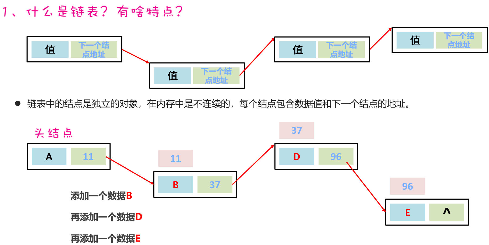

①单向链表

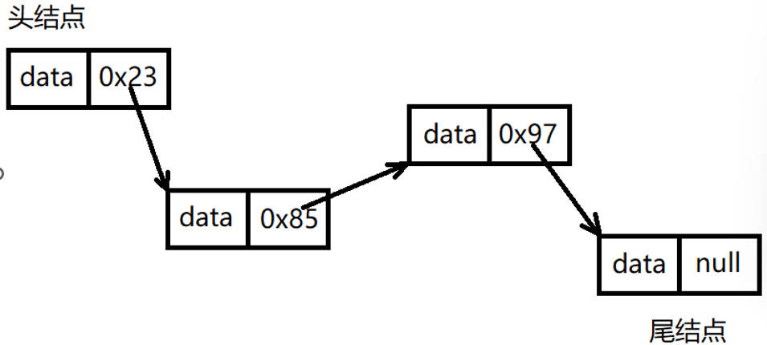

> **给单向链表添加下标索引：**

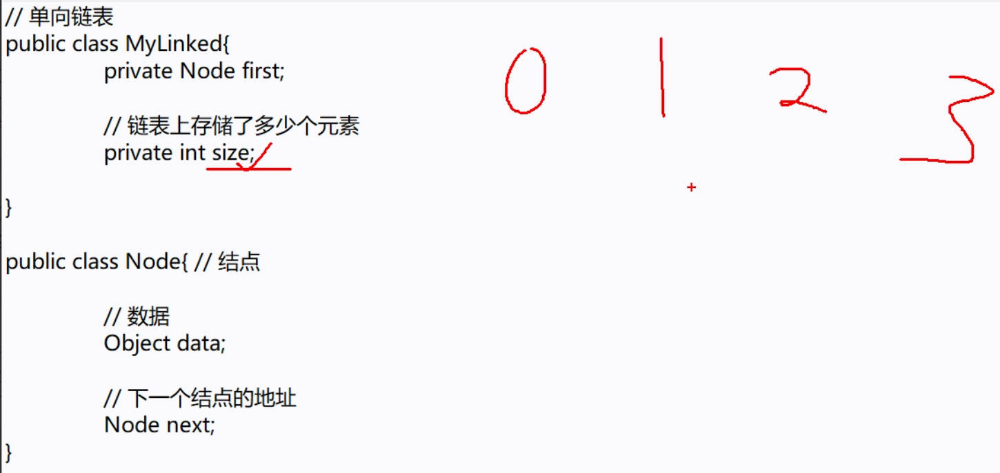

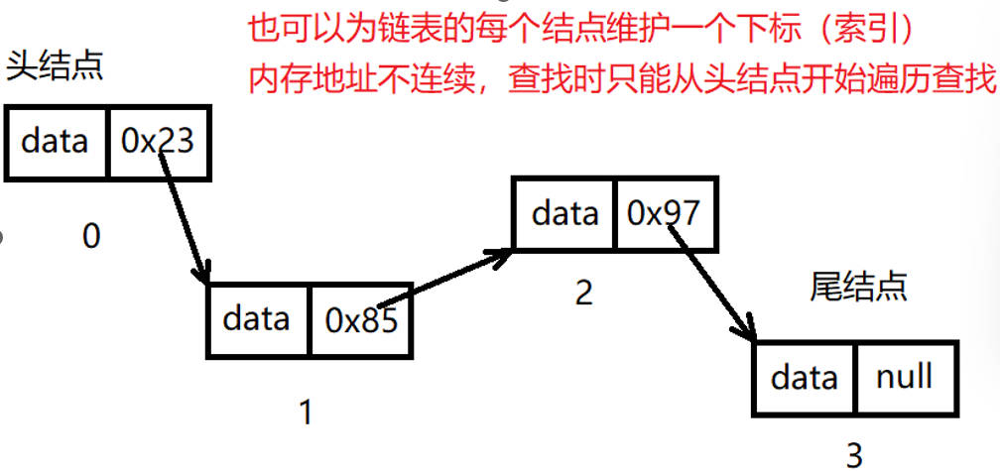

> **删除结点：**

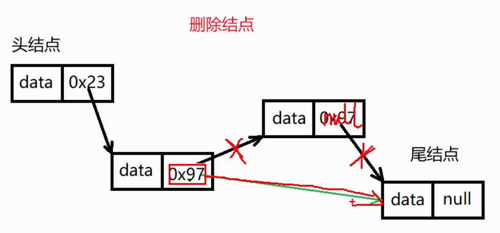

> **新增结点：**

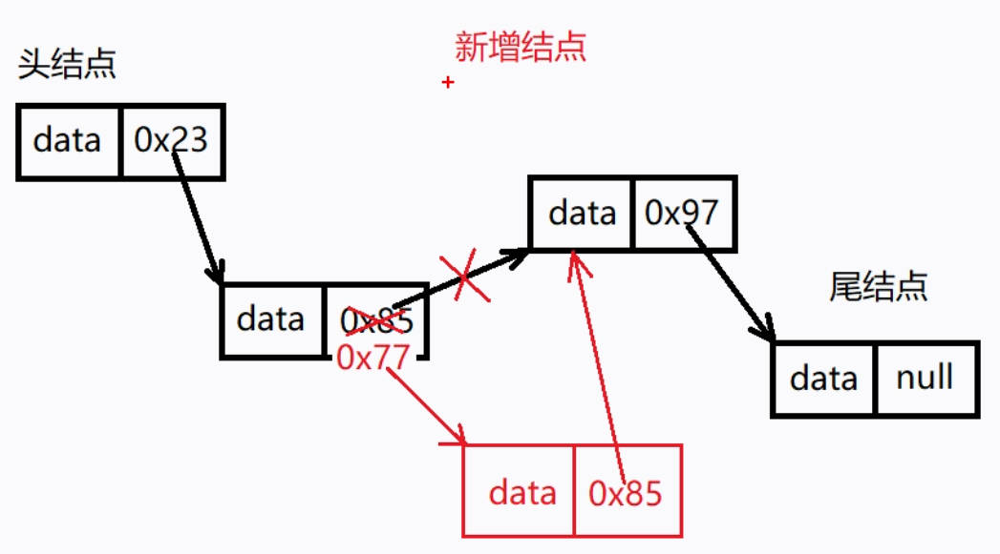

②双向链表


③环形链表

环形单链表


环形双链表


④**链表优点：**

**因为链表节点在空间存储上，内存地址`不是连续的`。因此删除某个结点时不需要涉及到元素位移的问题。因此`随机增删元素效率较高`。`时间复杂度O(1)`**

⑤**链表缺点：**

**链表中元素在查找时，只能从某个节点开始`顺序查找`，因为链表结点的`内存地址在空间上不是连续的`。链表`查找元素效率较低`，`时间复杂度O(n)`**


⑥**链表的适用场景：**

**需要`频繁进行随机增删`，但`很少的查找`的操作时。**


## LinkedList

①**LinkedList是`一个双向链表`**


②源码分析：

> **属性分析**


构造方法分析

> **添加元素**


> **修改元素**


> **插入元素**


> **删除元素**


> **示例:**
>
> ```java
> package com.powernode.javase.collection;
> 
> import java.util.LinkedList;
> 
> /**
>  * LinkedList集合底层是一个双向链表的数据结构
>  */
> public class LinkedListTest {
>     public static void main(String[] args) {
>         // 创建一个双向链表 集合。
>         // LinkedList是一个双向链表
>         // 调用无参数构造方法，创建了一个空链表。
>         LinkedList<String> ll = new LinkedList<>();
> 
>         // 新增
>         ll.add("1");
>         ll.add("2");
>         ll.add("3");
>         ll.add("4");
>         ll.add(2, "5");
> 
>         // 修改
>         String oldVal = ll.set(1, "110");
>         System.out.println(oldVal); // 2
> 
>         // 删除
>         String removedValue = ll.remove(1);
>         System.out.println(removedValue); // 110
> 
>         // 根据下标查询元素
>         String s = ll.get(ll.size() - 1);
>         System.out.println(s); // 4
>     }
> }
> ```


③**手写单向链表**

```java
package com.powernode.javase.collection;

/**
 * 自定义的单向链表
 */
public class MyLinked<E> {
    /**
     * 元素个数
     */
    private int size;
    /**
     * 单向链表的头结点
     */
    private Node<E> first;

    /**
     * 构建一个空链表
     */
    public MyLinked() {

    }


    /**
     * 获取集合中元素的个数
     * @return 个数
     */
    public int size(){
        return size;
    }

    /**
     * 向单向链表的末尾添加一个元素。
     * @param data 数据
     */
    public void add(E data) {
        // 如果first是空，表示是一个空链表
        if(first == null){
            first = new Node<>(data, null);
            size++;
            return;
        }
        // 找到末尾结点
        Node<E> last = findLast();
        last.next = new Node<>(data, null);
        size++;
    }

    /**
     * 找到单向链表的末尾结点
     * @return 末尾结点
     */
    private Node<E> findLast() {
        if(first == null){
            // 空链表
            return null;
        }
        // 程序指定到这里，first肯定不是null，不是一个空链表
        // 假设第一个结点就是最后一个结点。
        Node<E> last = first;
        while(last.next != null){
            // 把last.next看做是最后一个结点
            last = last.next;
        }
        return last;
    }

    /**
     * 将元素添加到指定索引处
     * @param index 下标
     * @param data 数据
     */
    public void add(int index, E data) {
        // 这里按说应该进行下标的检查，防止越界。
        // 创建新的结点对象
        Node<E> newNode = new Node<>(data, null);
        // 后期再写node(int)方法，这个方法可以根据下标找到对应的结点对象
        Node<E> prev = node(index - 1);
        newNode.next = prev.next;
        prev.next = newNode;
        size++;
    }

    /**
     * 返回索引处的结点对象
     * @param index 索引
     * @return 结点对象
     */
    private Node<E> node(int index) {
        // 假设头结点是下一个结点
        Node<E> next = first;
        for (int i = 0; i < index; i++) {
            next = next.next;
        }
        return next;
    }

    /**
     * 删除指定索引处的元素
     * @param index 索引
     */
    public void remove(int index) {
        // 检查index是否越界
        // 假如删除的结点是头结点
        if(index == 0){
            Node<E> oldFirst = first;
            first = first.next;
            oldFirst.next = null;
            return;
        }
        // 删除的不是头结点
        // 被删除的结点的上一个结点
        Node<E> prev = node(index - 1);
        // 获取被删除的那个结点
        Node<E> removed = node(index);
        prev.next = removed.next;
        removed.next = null;
        removed.item = null;
        size--;
    }

    /**
     * 修改指定索引处的数据
     * @param index 索引
     * @param data 数据
     */
    public void set(int index, E data) {
        Node<E> node = node(index);
        node.item = data;
    }

    /**
     * 根据下标获取数据
     * @param index 下标
     * @return 数据
     */
    public E get(int index) {
        return node(index).item;
    }

    /**
     * 单向链表当中的结点（建议定义为静态内部类。）
     */
    private static class Node<E> {
        /**
         * 数据
         */
        E item;
        /**
         * 下一个结点的内存地址
         */
        Node<E> next;

        /**
         * 构造一个结点对象
         * @param item 结点中的数据
         * @param next 下一个结点的内存地址。
         */
        public Node(E item, Node<E> next) {
            this.item = item;
            this.next = next;
        }
    }
}
```

> **测试示例：**
>
> ```java
> package com.powernode.javase.collection;
> 
> public class MyLinkedTest {
>     public static void main(String[] args) {
>         // 创建一个单向链表对应的集合对象
>         MyLinked<String> myLinked = new MyLinked<>();
> 
>         // 添加元素
>         myLinked.add("zhangsan");
>         myLinked.add("lisi");
>         myLinked.add("wangwu");
>         myLinked.add("zhaoliu");
> 
>         //在指定位置添加元素
>         myLinked.add(1, "李四");
> 
>         // 遍历
>         for (int i = 0; i < myLinked.size(); i++) {
>             System.out.println(myLinked.get(i));
>         }
>         /*
>         zhangsan
>         李四
>         lisi
>         wangwu
>         zhaoliu
>          */
> 
>         // 删除下标位置上的元素
>         myLinked.remove(1);
> 
>         System.out.println("=========================");
> 
>         // 遍历
>         for (int i = 0; i < myLinked.size(); i++) {
>             System.out.println(myLinked.get(i));
>         }
>         /*
>         zhangsan
>         lisi
>         wangwu
>         zhaoliu
>          */
> 
>         // 修改
>         myLinked.set(1,"李四2");
> 
> 
>         System.out.println("=========================");
> 
>         // 遍历
>         for (int i = 0; i < myLinked.size(); i++) {
>             System.out.println(myLinked.get(i));
>         }
>         /*
>         zhangsan
>         李四2
>         wangwu
>         zhaoliu
>          */
>     }
> }
> ```


## 栈数据结构

①**LIFO原则（Last In，First Out）：`后进先出`**


②**实现栈数据结构，可以用数组来实现，也可以用`双向链表`来实现。**


③**用`数组实现`的代表是：`Stack、ArrayDeque`**

①`Stack`：`Vetor的子类`，实现了`栈数据结构`，除了`具有Vetor的方法`，还扩展了其它方法，完成了`栈结构的模拟`。不过`在JDK1.6（Java6）之后就不建议`使用了，因为它是`线程安全的`，太慢了。Stack中的方法如下：

+ E push(E item)：压栈

+ E pop()：弹栈（将栈顶元素删除，并返回被删除的引用）

+ int search(Object o)：查找栈中元素（返回值的意思是：以1为开始，从栈顶往下数第几个）

+ E peek()：窥视栈顶元素（不会将栈顶元素删除，只是看看栈顶元素是什么。注意：如果栈为空时会报异常。）

②ArrayDeque

+ E push(E item)

+ E pop()

④**用`链表实现`的代表是：`LinkedList`**

①LinkedList

+ E push(E item)

+ E pop()


> **测试示例：**
>
> ```java
> package com.powernode.javase.collection;
> 
> import java.util.ArrayDeque;
> import java.util.LinkedList;
> import java.util.Stack;
> 
> /**
>  * java.util.Stack：底层是数组，线程安全的，JDK1.6不建议用了。
>  * java.util.ArrayDeque：底层是数组（实现LIFO的同时，又实现了双端队列。）
>  * java.util.LinkedList：底层是双向链表（实现LIFO的同时，又实现了双端队列。）
>  * 以上三个类都实现了栈数据结构。都实现了LIFO。
>  */
> public class StackTest {
>     public static void main(String[] args) {
>         // 创建栈
>         Stack<String> stack1 = new Stack<>();
>         LinkedList<String> stack2 = new LinkedList<>();
>         ArrayDeque<String> stack3 = new ArrayDeque<>();
> 
>         // 压栈
>         stack1.push("1");
>         stack1.push("2");
>         stack1.push("3");
>         stack1.push("4");
> 
>         // seach方法
>         System.out.println("位置：" + stack1.search("1")); // 位置：4
> 
>         // 弹栈
>         System.out.println(stack1.pop()); // 4
>         System.out.println(stack1.pop()); // 3
>         System.out.println(stack1.pop()); // 2
>         // 窥视
>         System.out.println("此时栈顶元素：" + stack1.peek()); // 此时栈顶元素：1
>         //System.out.println(stack1.pop()); // 1
>         // java.util.EmptyStackException 栈已空异常
>         //System.out.println(stack1.pop());
> 
>         System.out.println("====================");
> 
>         // 压栈
>         stack2.push("1");
>         stack2.push("2");
>         stack2.push("3");
>         stack2.push("4");
>         // 弹栈
>         System.out.println(stack2.pop()); // 4
>         System.out.println(stack2.pop()); // 3
>         System.out.println(stack2.pop()); // 2
>         System.out.println(stack2.pop()); // 1
> 
>         System.out.println("====================");
> 
>         // 压栈
>         stack3.push("1");
>         stack3.push("2");
>         stack3.push("3");
>         stack3.push("4");
>         // 弹栈
>         System.out.println(stack3.pop()); // 4
>         System.out.println(stack3.pop()); // 3
>         System.out.println(stack3.pop()); // 2
>         System.out.println(stack3.pop()); // 1
>     }
> }
> ```


## 队列数据结构

①队列是一种特殊的线性表，特殊之处在于它只允许在表的前端（front）进行删除操作，而在表的后端（rear）进行插入操作，队列是一种操作受限制的线性表。进行插入操作（入口）的端称为队尾，进行删除操作（出口）的端称为队头。

②队列的插入操作只能在队尾操作，队列的删除操作只能在队头操作，因此队列是一种先进先出（First In First Out）的线性表，简称FIFO表。

③Queue接口是一种基于FIFO（先进先出）的数据结构，而Deque接口则同时支持FIFO和LIFO（后进先出）两种操作。因此Deque接口也被称为“双端队列”。

④Java集合框架中队列的实现：

①链表实现方式：LinkedList

②数组实现方式：ArrayDeque

③LinkedList和ArrayDeque都实现了Queue、Deque接口，因此这两个类都具备队列和双端队列的特性。

④LinkedList底层是基于双向链表实现的，因此它天然就是一个双端队列，既支持从队尾入队，从队头出队，也支持从队头入队，从队尾出队。用Deque的实现方式来说，就是它既实现了队列的offer()和poll()方法，也实现了双端队列的offerFirst()、offerLast()、pollFirst()和pollLast()方法等。

⑤ArrayDeque底层是使用环形数组实现的，也是一个双端队列。它比LinkedList更加高效，因为在数组中随机访问元素的时间复杂度是O(1)，而链表中需要从头或尾部遍历链表寻找元素，时间复杂度是O(N)。循环数组：index = (start + i) % capacity


