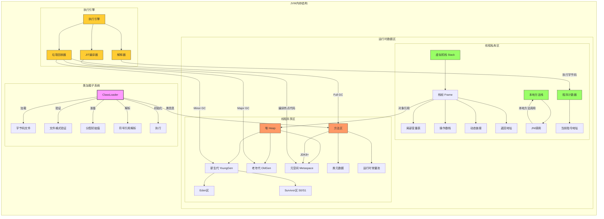

# 面向对象概述

软件开发方法：`面向过程`和`面向对象`

1. **面向过程：`关注点`在`实现功能的步骤上`。**
+ PO：Procedure Oriented。代表语言：C语言

+ 面向过程就是分析出解决问题`所需要的步骤`，然后用函数把这些步骤一步一步实现，使用的时候一个一个依次调用就可以了。

+ 例如开汽车：`启动、踩离合、挂挡、松离合、踩油门、车走了`。

+ 再例如装修房子：`做水电、刷墙、贴地砖、做柜子和家具、入住`。

+ 对于简单的流程是适合使用面向过程的方式进行的。复杂的流程`不适合使用面向过程的开发方式`。

2. **面向对象：`关注点`在`实现功能需要哪些对象的参与`。**
+ `OO`：Object Oriented `面向对象`。包括OOA,OOD,OOP。`OOA`：Object Oriented Analysis `面向对象分析`。`OOD`：Object Oriented Design `面向对象设计`。`OOP`：Object Oriented Programming `面向对象编程`。代表语言：Java、C#、Python等。

+ 人类是以面向对象的方式去认知世界的。所以采用面向对象的思想更加`容易处理复杂的问题`。

+ 面向对象就是分析出解决这个问题都需要哪些对象的参加，然后让对象与对象之间协作起来形成一个系统。

+ 例如开汽车：`汽车对象、司机对象`。司机对象有一个驾驶的行为。`司机对象驾驶汽车对象`。

+ 再例如装修房子：水电工对象，油漆工对象，瓦工对象，木工对象。每个对象都有自己的行为动作。最终完成装修。

+ 面向对象开发方式`耦合度低，扩展能力强`。例如采用面向过程生产一台电脑，不会分CPU、内存和硬盘，它会按照电脑的工作流程一次成型。采用面向对象生产一台电脑，`CPU是一个对象`，`内存条是一个对象`，`硬盘是一个对象`，如果觉得`硬盘容量小`，`后期是很容易更换的`，这就是`扩展性`。


**面向对象三大特征：`封装、继承、多态`**
+ 封装（Encapsulation）
+ 继承（Inheritance）
+ 多态（Polymorphism）


## 类与对象

### 类

+ 现实世界中，`事物与事物之间具有共同特征`，例如：刘德华和梁朝伟都有`姓名、身份证号、身高`等`状态`，都有`吃、跑、跳`等`行为`。将这些共同的`状态和行为`提取出来，`形成了一个模板，称为类`。

+ 类实际上是人类大脑思考`总结的一个模板`，`类`是一个`抽象的概念`。

+ `状态`在程序中对应`属性`。`属性`通常`用变量来表示`。

+ `行为`在程序中对应`方法`。`方法`通常`用函数来表示`。

+ **类 = 属性 + 方法。**


### 对象

+ `实际存在`的`个体`。

+ `对象`又称为`实例（instance）`。

+ 通过类这个模板可以`实例化n个对象`。（`通过类可以创造多个对象`）

+ 例如通过`“明星类”`可以创造出`“刘德华对象”和“梁朝伟对象”`。

+ 明星类中有一个`属性姓名`：`String name;`

+ `“刘德华对象”和“梁朝伟对象”`由于是通过`明星类`造出来的，所以这两个都有`name属性`，但是**值是不同的**。因此这种属性被称为`实例变量`。


# 对象的创建和使用

## 类的定义

**语法格式:**
```java title="Java"
[修饰符列表] class 类名 {
    // 属性（描述状态）
    // 方法（描述行为动作）
}
```

> **例如：学生类**

```java title="Student.java"
package com.powernode.javase.oop01;
/*
1.定义类的语法格式:
     [修饰符列表] class 类名{
          类体 = 属性 + 方法

     //属性(实例变量)，描述的是状态

     //方法，描述的是行为动作

     }

2.为什么定义类？
   因为要通过类实例化对象，有了对象，让对象和对象之间协作起来形成系统

3.一个类可以实例化多个java对象，(通过一个类可以造出多个java对象)

4. 实例变量是一个对象一份，比如创建3个学生对象，每个学生对象中应该都有name变量。

5. 实例变量属于成员变量，成员变量如果没有手动赋值，系统会赋默认值
    数据类型        默认值
    ----------------------
    byte            0
    short           0
    int             0
    long            0L
    float           0.0F
    double          0.0
    boolean         false
    char            \u0000
    引用数据类型      null
 */
public class Student {

    //属性：姓名，年龄，性别，它们都是实例变量

    //姓名
    String name;

    //年龄
    int age;

    //性别
    boolean gender;
}
```

## 对象的创建和使用

**语法格式:**
```java title="Java"
类名 对象名 = new 类名();
```

**对象的创建：**
```java title="Java"
Student s = new Student();
```
> 在Java中，使用`class定义的类`，属于`引用数据类型`。所以`Student`属于`引用数据类型`。类型名为：Student。

> `Student s`; 表示`定义一个变量`。数据类型是`Student`。变量名是`s`。

**对象的使用：**
```java title="Java"
读取属性值：s.name
修改属性值：s.name = “jackson”;
```

**通过一个类可以实例化多个对象：**
```java title="Java"
Student s1 = new Student();
Student s2 = new Student();
```


> **例如：创建一个学生对象**

```java title="StudentTest01.java"
package com.powernode.javase.oop01;

public class StudentTest01 {
    public static void main(String[] args) {
        // 局部变量
        int i = 10;

        // 通过学生类Student实例化学生对象（通过类创造对象）
        // Student s1; 是什么？s1是变量名。Student是一种数据类型名。属于引用数据类型。
        // s1也是局部变量。和i一样。
        // s1变量中保存的是：堆内存中Student对象的内存地址。
        // s1有一个特殊的称呼：引用
        // 什么是引用？引用的本质上是一个变量，这个变量中保存了java对象的内存地址。
        // 引用和对象要区分开。对象在JVM堆当中。引用是保存对象地址的变量。
        Student s1 = new Student();

        // 访问对象的属性（读变量的值）
        // 访问实例变量的语法：引用.变量名
        // 两种访问方式：第一种读取，第二种修改。
        // 读取：引用.变量名 s1.name; s1.age; s1.gender;
        // 修改：引用.变量名 = 值; s1.name = "jack"; s1.age = 20; s1.gender = true;
        System.out.println("姓名：" + s1.name); // null
        System.out.println("年龄：" + s1.age); // 0
        System.out.println("性别：" + (s1.gender ? "男" : "女"));

        // 修改对象的属性（修改变量的值，给变量重新赋值）
        s1.name = "张三";
        s1.age = 20;
        s1.gender = true;

        System.out.println("姓名：" + s1.name); // 张三
        System.out.println("年龄：" + s1.age); // 20
        System.out.println("性别：" + (s1.gender ? "男" : "女")); // 男

        // 再创建一个新对象
        Student s2 = new Student();

        // 访问对象的属性
        System.out.println("姓名=" + s2.name); // null
        System.out.println("年龄=" + s2.age); // 0
        System.out.println("性别=" + (s2.gender ? "男" : "女"));

        // 修改对象的属性
        s2.name = "李四";
        s2.age = 20;
        s2.gender = false;

        System.out.println("姓名=" + s2.name); // 李四
        System.out.println("年龄=" + s2.age); // 20
        System.out.println("性别=" + (s2.gender ? "男" : "女")); // 女
    }
}
```


## JVM内存分析


+ `堆内存`：存储`new出来的对象`。堆内存中的`对象是有生命周期的`。堆内存中的`对象不使用时，由GC回收`。

+ `栈内存`：存储`局部变量`。栈内存中的`局部变量`使用完毕，`立即出栈`，空间被释放。

+ `方法区`：存储`类信息`。方法区中的`类信息`不会被回收。



---

# 封装

## 面向对象三大特征之一：封装

1. 现实世界中封装：

`液晶电视`也是一种`封装好的电视设备`，它`将电视所需的各项零部件封装在一个整体`的`外壳`中，提供给用户一个简单而便利的使用接口，让用户可以轻松地切换频道、调节音量、等。液晶电视内部包含了很多复杂的技术，如显示屏、LED背光模块、电路板、扬声器等等，而这些`内部结构`对于大多数普通用户来说是`不可见的`，用户只需要通过遥控器就可以完成电视的各种设置和操作，这就是封装的好处。液晶电视的封装不仅提高了用户的便利程度和使用效率，而且还起到了保护设备内部部件的作用，防止灰尘、脏物等干扰。同时，液晶电视外壳材料的选择也能起到防火、防潮、防电等效果，为用户的生活带来更安全的保障。

2. 什么是封装？

封装是一种将数据和方法加以包装，使之成为一个独立的实体，并且把它与外部对象隔离开来的机制。具体来说，封装是将一个对象的所有“状态（属性）”以及“行为（方法）”统一封装到一个类中，从而隐藏了对象内部的具体实现细节，向外界提供了有限的访问接口，以实现对对象的保护和隔离。

3. 封装的好处？

封装通过限制外部对对象内部的直接访问和修改，保证了数据的安全性，并提高了代码的可维护性和可复用性。

4. 在代码上如何实现封装？

属性私有化，对外提供getter和setter方法。

## 封装概述

+ `封装`是面向对象三大特性之一。

+ `封装`就是把对象的`属性`和`方法`结合成一个独立的体，对外隐藏内部实现细节。

+ `封装`的好处：`隐藏实现细节`，`提高安全性和易用性`。

+ `封装`的体现：`方法`就是一种封装。`类`也是一种封装。

## 封装的实现方式

+ 将属性私有化（private），提供公共的（public）方法访问私有属性。

+ 例如：学生类

```java title="Student.java"
package com.powernode.javase.oop02;

public class Student {
    // 属性：姓名，年龄，性别，它们都是实例变量
    // 姓名
    private String name;
    // 年龄
    private int age;
    // 性别
    private char gender;// true表示男，false表示女


    public void setName(String name) { // 设置姓名

        this.name = name;
    }

    public String getName() { // 获取姓名
        return name;
    }

    public void setAge(int age) { // 设置年龄
        this.age = age;
    }

    public int getAge() { // 获取年龄
        return age;
    }

    public void setGender(char gender) { // 设置性别
        this.gender = gender;
    }

    public char getGender() { // 获取性别
        return gender;
    }
    public void show() { // 显示信息
        System.out.println("姓名：" + name);
        System.out.println("年龄：" + age);
        System.out.println("性别：" + (gender ? "男" : "女"));
    }
}
```

## 封装的使用

```java title="StudentTest02.java"
package com.powernode.javase.oop02;

public class StudentTest02 {
    public static void main(String[] args) {
        // 创建学生对象
        Student s = new Student();

        // 读取属性值
        // System.out.println("姓名：" + s.name); // 编译错误。name是私有的，不能直接访问。
        // System.out.println("年龄：" + s.age); // 编译错误。age是私有的，不能直接访问。
        // System.out.println("性别：" + s.gender); // 编译错误。gender是私有的，不能直接访问。

        // 修改属性值   
        s.setName("张三");
        s.setAge(20);
        s.setGender(true);

        // 读取属性值
        System.out.println("姓名：" + s.getName()); // 张三
        System.out.println("年龄：" + s.getAge()); // 20
        System.out.println("性别：" + (s.getGender() ? "男" : "女")); // 男


        // 调用方法
        s.show();
    }
}
```

----

# 构造方法(Constructor(构造器))

```java title="Student.java"
package com.powernode.javase.oop09;

/**
 * 构造方法/Constructor/构造器
 *
 * 1. 构造方法有什么作用？
 *    作用1：对象的创建（通过调用构造方法可以完成对象的创建）
 *    作用2：对象的初始化（给对象的所有属性赋值就是对象的初始化）
 * 2. 怎么定义构造方法呢？
 *  [修饰符列表] 构造方法名(形参列表){
 *      构造方法体;
 *  }
 *  注意：
 *      构造方法名必须和类名一致。
 *      构造方法不需要提供返回值类型。
 *      如果提供了返回值类型，那么这个方法就不是构造方法了，就变成普通方法了。
 *
 * 3. 构造方法怎么调用呢？
 *  使用new运算符来调用。
 *  语法：new 构造方法名(实参);
 *  注意：构造方法最终执行结束之后，会自动将创建的对象的内存地址返回。但构造方法体中不需要提供“return 值;”这样的语句。
 *
 * 4.在java语言中，如果一个类没有显示的去定义构造方法，系统会默认提供一个无参数的构造方法。（通常把这个构造方法叫做缺省构造器。）
 *
 * 5.一个类中如果显示的定义了构造方法，系统则不再提供缺省构造器。所以，为了对象创建更加方便，建议把无参数构造方法手动的写出来。
 *
 * 6.在java中，一个类中可以定义多个构造方法，而且这些构造方法自动构成了方法的重载(overload)。
 *
 * 7. 构造方法中给属性赋值了？为什么还需要单独定义set方法给属性赋值呢？
 *  在构造方法中赋值是对象第一次创建时属性赋的值。set方法可以在后期的时候调用，来完成属性值的修改。
 *
 * 8.构造方法执行原理？
 *  - 构造方法执行包括两个重要的阶段：
 *      第一阶段：对象的创建
 *      第二阶段：对象的初始化
 *  - 对象在什么时候创建的？
 *      new的时候，会直接在堆内存中开辟空间。然后给所有属性赋默认值，完成对象的创建。（这个过程是在构造方法体执行之前就完成了。）
 *  - 对象初始化在什么时候完成的？
 *      构造方法体开始执行，标志着开始进行对象初始化。构造方法体执行完毕，表示对象初始化完毕。
 *
 * 9. 构造代码块？
 *  语法格式：
 *      {}
 *  构造代码块什么时候执行，执行几次？
 *      每一次在new的时候，都会先执行一次构造代码块。
 *      构造代码块是在构造方法执行之前执行的。
 *
 * 10. 构造代码块有什么用？
 *  如果所有的构造方法在最开始的时候有相同的一部分代码，不妨将这个公共的代码提取到构造代码块当中，这样代码可以得到复用。
 */

public class Student {

    //构造代码块
    {
        //System.out.println("构造代码块执行！");
        // 这里能够使用this，这说明，构造代码块执行之前对象已经创建好了，并且系统也完成了默认赋值。
        //System.out.println(this.name);

        for(int i = 0; i < 10; i++){
            System.out.println("iiiiiiiiiii = " + i);
        }
    }

    /**
     * 无参数的构造方法显示的定义出来。
     */
    public Student(){
        /*for(int i = 0; i < 10; i++){
            System.out.println("i = " + i);
        }*/
        System.out.println("Student类的无参数构造方法执行了");
    }

    public Student(String name, int age,boolean sex,String address) {
        /*for(int i = 0; i < 10; i++){
            System.out.println("i = " + i);
        }*/
        this.name = name;
        this.age = age;
        this.sex = sex;
        this.address = address;
    }

    public Student(String name){
        /*for(int i = 0; i < 10; i++){
            System.out.println("i = " + i);
        }*/
        this.name=name;
    }

    public Student(String name,int age){
        /*for(int i = 0; i < 10; i++){
            System.out.println("i = " + i);
        }*/
        this.name=name;
        this.age=age;
    }


    /**
     * 姓名
     */
    private String name;

    /**
     * 年龄
     */
    private int age;

    /**
     * 性别
     */
    private boolean sex;

    /**
     * 家庭住址
     */
    private String address;

    public String getName() {
        return name;
    }

    public void setName(String name) {
        this.name = name;
    }

    public int getAge() {
        return age;
    }

    public void setAge(int age) {
        this.age = age;
    }

    public boolean isSex() {
        return sex;
    }

    public void setSex(boolean sex) {
        this.sex = sex;
    }

    public String getAddress() {
        return address;
    }

    public void setAddress(String address) {
        this.address = address;
    }
}
```

```java title="ConstructorTest01.java"
package com.powernode.javase.oop09;

public class ConstructorTest01 {
    public static void main(String[] args) {
        // 调用Student类的构造方法来完成Student类型对象的创建。
        // 以下代码本质上是：通过new运算符调用无参数的构造方法来完成对象的实例化。
        // s1是一个引用。保存了内存地址指向了堆内存当中的Student类型的对象。
        // 这样就完成了学生对象的创建以及初始化。
        // 无参数构造方法没有给属性手动赋值，但是系统会赋默认值
        Student s1 = new Student();

        System.out.println("姓名：" + s1.getName());
        System.out.println("年龄：" + s1.getAge());
        System.out.println("性别：" + (s1.isSex() ? "男" : "女"));
        System.out.println("住址：" + s1.getAddress());

        // 通过调用另一个有参数的构造方法来创建对象，完成对象的初始化。
        Student zhangsan = new Student("张三", 20, true, "北京朝阳");
        System.out.println("姓名：" + zhangsan.getName());
        //修改名字
        zhangsan.setName("张三2");
        System.out.println("姓名：" + zhangsan.getName());
        System.out.println("年龄：" + zhangsan.getAge());
        System.out.println("性别：" + (zhangsan.isSex() ? "男" : "女"));
        System.out.println("住址：" + zhangsan.getAddress());

        Student wangwu = new Student("王五");
        System.out.println("姓名：" + wangwu.getName());
        System.out.println("年龄：" + wangwu.getAge());
        System.out.println("性别：" + (wangwu.isSex() ? "男" : "女"));
        System.out.println("住址：" + wangwu.getAddress());

        Student zhaoliu = new Student("赵六", 30);
        System.out.println("姓名：" + zhaoliu.getName());
        System.out.println("年龄：" + zhaoliu.getAge());
        System.out.println("性别：" + (zhaoliu.isSex() ? "男" : "女"));
        System.out.println("住址：" + zhaoliu.getAddress());
    }
}

```

```java title="ConstructorTest02.java"
package com.powernode.javase.oop09;

public class ConstructorTest02 {
    public static void main(String[] args) {
        new Student();
        /*new Student();
        new Student();
        new Student();*/

        new Student("zhangsan");
    }
}

```


## 构造方法有什么作用？
   
> **作用1**：**`对象的创建`（`通过调用构造方法可以完成对象的创建`）**

> **作用2**：**`对象的初始化`（`给对象的所有属性赋值就是对象的初始化`）**


## 怎么定义构造方法呢？


```java title="Java"
[修饰符列表] 构造方法名(形参列表){
       构造方法体;
}

注意：

1. 构造方法名必须和类名一致。
   
2. 构造方法不能有返回值。构造方法不需要提供返回值类型。

3. 构造方法不能有返回值。 如果提供了返回值类型，那么这个方法就不是构造方法了，就变成普通方法了。
```


## 构造方法怎么调用呢？

```java title="Java"
1. 使用new运算符来调用。

2. 语法：new 构造方法名(实参);

3. 注意：构造方法最终执行结束之后，会自动将创建的对象的内存地址返回。但构造方法体中不需要提供“return 值;”这样的语句。
```


## 无参构造方法

> 在java语言中，如果`一个类没有显示的去定义构造方法`，系统会默认提供一个`无参数的构造方法`。（通常把`这个构造方法`叫做`缺省构造器`。）


> 一个类中`如果显示的定义了构造方法`，系统则`不再提供缺省构造器`。所以，为了对象创建更加方便，**建议把`无参数构造方法`手动的写出来**。 


## 方法的重载(overload)

> 在java中，`一个类`中可以`定义多个构造方法`，而且这些构造方法`自动构成了方法的重载(overload)`。

> 方法重载：在同一个类中，`方法名相同`，`参数列表不同`（参数的类型、个数、顺序不同），`返回值类型可以相同也可以不同`。


## 构造方法赋值和set方法赋值区别

> **构造方法赋值**

**构造方法赋值**：**对象`第一次创建时`属性赋的值**

> **set方法赋值**

**set方法赋值**：**可以在`后期的时候调用`，来完成`属性值的修改`**

```java title="Java"
Student zhangsan = new Student("张三", 20, true, "北京朝阳"); // 构造方法赋值

        System.out.println("姓名：" + zhangsan.getName()); // 张三

        //修改名字
        zhangsan.setName("张三2"); // set方法赋值

        System.out.println("姓名：" + zhangsan.getName()); // 张三2
        System.out.println("年龄：" + zhangsan.getAge());
        System.out.println("性别：" + (zhangsan.isSex() ? "男" : "女"));
        System.out.println("住址：" + zhangsan.getAddress());
```

```java title="Java"
姓名：张三
姓名：张三2
年龄：20
性别：男
住址：北京朝阳
```


## 构造方法执行原理？

> 构造方法执行包括两个重要的阶段：

>> 第一阶段：对象的创建
    
>> 第二阶段：对象的初始化


> **对象在什么时候创建的？**
    
>> `new的时候`，会直接在`堆内存中开辟空间`。然后给`所有属性赋默认值`，完成`对象的创建`。（这个过程是**在构造方法体`执行之前`就完成了**。）


> **对象初始化在什么时候完成的？**
    
>> `构造方法体开始执行`，标志着`开始进行对象初始化`。构造方法体`执行完毕`，表示`对象初始化完毕`。


## 构造代码块？

> **对象的创建和初始化过程梳理**：

+ **new的时候在堆内存中开辟空间，给所有属性赋默认值**

+ **执行构造代码块进行初始化**

+ **执行构造方法体进行初始化**

+ **构造方法执行结束，对象初始化完毕。**

> **构造代码块**：`{}`，**在`构造方法体执行之前`，先执行构造代码块。**

> **执行次数** ：`类中定义了多少个构造代码块，创建多少个对象，构造代码块就执行多少次。`


### 构造代码块有什么用？

> 如果`所有的构造方法`在最开始的时候`有相同的一部分代码`，不妨将`这个公共的代码提取到构造代码块当中`，这样代码`可以得到复用`。


## 构造方法练习

1. **请定义一个`交通工具Vehicle类`，属性：`品牌brand，速度speed，尺寸长length,宽width,高height`等，`属性封装`。方法：`移动move()，加速speedUp()，减速speedDown()`等。最后在`测试类中实例化一个交通工具对象`，并通过构造方法给它`初始化brand,speed,length,width,height的值`，`调用加速，减速的方法`对`速度进行改变`。**

```java title="Vehicle.java"
package com.powernode.javase.oop10;

/**
 * 请定义一个交通工具Vehicle类，属性：品牌brand，速度speed，尺寸长length,宽width,高height等，属性封装。
 * 方法：移动move()，加速speedUp()，减速speedDown()等。最后在测试类中实例化一个交通工具对象，并通过构造
 * 方法给它初始化brand,speed,length,width,height的值，调用加速，减速的方法对速度进行改变。
 */
public class Vehicle {
    /**
     * 品牌
     */
    private String brand;

    /**
     * 速度
     */
    private int speed;

    /**
     * 长(毫米)
     */
    private int length;

    /**
     * 宽(毫米)
     */
    private int width;

    /**
     * 高(毫米)
     */
    private int height;

    public Vehicle(String brand, int speed, int length, int width, int height) {
        this.brand = brand;
        this.speed = speed;
        this.length = length;
        this.width = width;
        this.height = height;
    }

    /**
     * 移动
     */
    public void move(){
        //System.out.println(this.brand);
        //System.out.println(brand);
        System.out.println(this.getBrand() + "正在以" + this.getSpeed() + "迈的速度行驶");
        //System.out.println(getBrand());
    }

    /**
     * 加速
     */
    public void speedUp(){
        //每次加10迈
        System.out.println("加速10迈");
        this.setSpeed(this.getSpeed() + 10);
        this.move();
    }

    /**
     *减速
     */
    public void speedDown(){
        //每次减10迈
        System.out.println("减速10迈");
        this.setSpeed(this.getSpeed() - 10);
        this.move();
    }


    public String getBrand() {
        return brand;
    }

    public void setBrand(String brand) {
        this.brand = brand;
    }

    public int getSpeed() {
        return speed;
    }

    public void setSpeed(int speed) {
        this.speed = speed;
    }

    public int getLength() {
        return length;
    }

    public void setLength(int length) {
        this.length = length;
    }

    public int getWidth() {
        return width;
    }

    public void setWidth(int width) {
        this.width = width;
    }

    public int getHeight() {
        return height;
    }

    public void setHeight(int height) {
        this.height = height;
    }
}
```


```java title="VehicleTest.java"
package com.powernode.javase.oop10;

public class VehicleTest {
    public static void main(String[] args) {
        //创建交通工具对象
        Vehicle bmw535li = new Vehicle("BMW535li",0,5200,1800,1500);

        //加速
        bmw535li.speedUp();

        //加速
        bmw535li.speedUp();

        //减速
        bmw535li.speedDown();

        // 单独调用move()方法
        bmw535li.move();
    }
}
```

```java title="输出结果.java"
加速10迈
BMW535li正在以10迈的速度行驶
加速10迈
BMW535li正在以20迈的速度行驶
减速10迈
BMW535li正在以10迈的速度行驶
BMW535li正在以10迈的速度行驶
```

2. **编写 Java 程序，`模拟简单的计算器`。定义名为 `Number 的类`，其中有`两个int类型属性n1,n2`，`属性封装`。编写`构造方法为n1和n2`赋初始值，再为该类定义 `加(add)、减(sub)、乘(mul)、除(div)`等`实例方法`，分别对`两个属性执行加、减、乘、除的运算`。在`main方法中创建Number类的对象，调用各个方法`，并显示计算结果。**

```java title="Number.java"
package com.powernode.javase.oop10;

/**
 * 编写 Java 程序，模拟简单的计算器。定义名为 Number 的类，
 * 其中有两个int类型属性n1,n2，属性封装。编写构造方法为n1和n2赋初始值，
 * 再为该类定义 加(add)、减(sub)、乘(mul)、除(div)等实例方法，
 * 分别对两个属性执行加、减、乘、除的运算。在main方法中创建Number类
 * 的对象，调用各个方法，并显示计算结果。
 */
public class Number {
    public void add() {
        System.out.println(this.getN1() + "+" + this.getN2() + "=" + (this.getN1() + this.getN2()));
    }

    public void sub() {
        System.out.println(this.getN1() + "-" + this.getN2() + "=" + (this.getN1() - this.getN2()));
    }

    public void mul() {
        System.out.println(this.getN1() + "*" + this.getN2() + "=" + (this.getN1() * this.getN2()));
    }

    public void div() {
        System.out.println(this.getN1() + "/" + this.getN2() + "=" + (this.getN1() / this.getN2()));
    }

    private int n1;

    private int n2;

    public Number() {
    }

    public Number(int n1, int n2) {
        this.n1 = n1;
        this.n2 = n2;
    }

    public int getN1() {
        return n1;
    }

    public void setN1(int n1) {
        this.n1 = n1;
    }

    public int getN2() {
        return n2;
    }

    public void setN2(int n2) {
        this.n2 = n2;
    }
}

```

```java title="NumberTest.java"
package com.powernode.javase.oop10;

public class NumberTest {
    public static void main(String[] args) {
        //创建Number对象
        Number number = new Number(10,2);

        //调用相关方法完成加减乘除
        number.add();
        number.sub();
        number.mul();
        number.div();
    }
}
```

```java title="输出结果.java"
10+2=12
10-2=8
10*2=20
10/2=5
```


3.**定义一个`网络用户类`，要处理的信息有`用户id、用户密码、 email地址`。在`建立类的实例`时，把以上三个信息都`作为构造方法的参数输入`，其中用`户id和用户密码是必须的`，`缺省的 email 地址是用户id加上字符串"@powernode.com"`**

```java title="NetworkUser.java"
package com.powernode.javase.oop10;

/**
 * 定义一个网络用户类，要处理的信息有用户id、用户密码、 email地址。在建立类的实例时，把以上三个信息都作为构造方法的参数输入，
 * 其中用户id和用户密码是必须的，缺省的 email 地址是用户id加上字符串"@powernode.com"
 *
 * 1. 不能定义无参数构造方法。
 * 2. 提供两个构造方法：
 *      一个是两个参数的：id和用户密码
 *      一个是三个参数的：id和用户名和email
 */
public class NetworkUser {
    private String userId;

    private String password;

    private String email;

    /**
     * 打印网络用户信息
     */
    public void display() {
        System.out.println("用户ID：" + this.getUserId() + "，密码：" + this.getPassword() + "，邮箱：" + this.getEmail());
    }

    public NetworkUser(String userId, String password) {
        this.userId = userId;
        this.password = password;
        this.email = this.getUserId() + "@powernode.com";
    }

    public NetworkUser(String userId, String password, String email) {
        this.userId = userId;
        this.password = password;
        this.email = email;
    }

    public String getUserId() {
        return userId;
    }

    public void setUserId(String userId) {
        this.userId = userId;
    }

    public String getPassword() {
        return password;
    }

    public void setPassword(String password) {
        this.password = password;
    }

    public String getEmail() {
        return email;
    }

    public void setEmail(String email) {
        this.email = email;
    }
}
```

```java title="NetworkUserTest.java"
package com.powernode.javase.oop10;

public class NetworkUserTest {
    public static void main(String[] args) {
        //新建网络用户对象
        NetworkUser user1 = new NetworkUser("123456","abc");

        user1.display();

        NetworkUser user2 = new NetworkUser("789456","abc123","lisi@123.com");

        user2.display();
    }
}
```

```java title="输出结果.java"
用户ID：123456，密码：abc，邮箱：123456@powernode.com
用户ID：789456，密码：abc123，邮箱：lisi@123.com
```