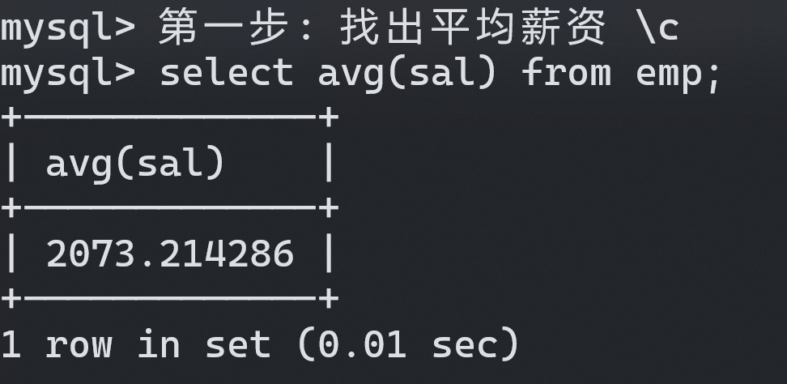
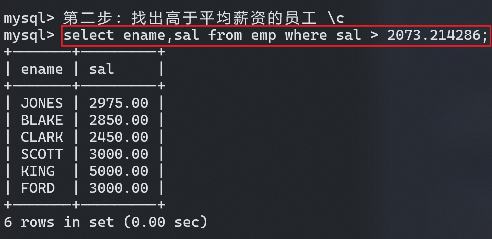

---

## 什么是子查询

1. select语句中`嵌套select语句`就叫做`子查询`。
2. select语句可以嵌套在哪里？
   1. `where后面、from后面、select后面`都是可以的。

```sql [SQL]
select ..(select)..
from ..(select)..
where ..(select)..
```


## where后面使用子查询

> 案例：找出`高于平均薪资`的`员工姓名和薪资`。

>> **`错误的示范`：**

```sql [SQL]
mysql> select ename,sal from emp where sal > avg(sal);

ERROR 1111 (HY000): Invalid use of group function
```
>> **错误原因：`where后面不能`直接使用`分组函数`。**

>> **`正确的示范`：**

1. 找出平均薪资：



```sql [SQL]
mysql> 第一步: 找出平均薪资 \c
mysql> select avg(sal) from emp;
+-------------+
| avg(sal)    |
+-------------+
| 2073.214286 |
+-------------+
1 row in set (0.01 sec)
```

2. 找出高于平均薪资的员工：



```sql [SQL]
mysql> 第二步: 找出高于平均薪资的员工 \c
mysql> select ename,sal from emp where sal > 2073.214286;
+-------+---------+
| ename | sal     |
+-------+---------+
| JONES | 2975.00 |
| BLAKE | 2850.00 |
| CLARK | 2450.00 |
| SCOTT | 3000.00 |
| KING  | 5000.00 |
| FORD  | 3000.00 |
+-------+---------+
6 rows in set (0.00 sec)
```

可以使用子查询：
```sql [SQL]
mysql> select ename,sal from emp where sal > (select avg(sal) from emp);

+-------+---------+
| ename | sal     |
+-------+---------+
| JONES | 2975.00 |
| BLAKE | 2850.00 |
| CLARK | 2450.00 |
| SCOTT | 3000.00 |
| KING  | 5000.00 |
| FORD  | 3000.00 |
+-------+---------+
6 rows in set (0.01 sec)
```


## from后面使用子查询

小窍门：from后面的子查询可以看做一张临时表。

案例：找出每个部门的平均工资的等级。
第一步：先找出每个部门平均工资。
```sql [SQL]
select deptno, avg(sal) avgsal from emp group by deptno;
```


第二步：将以上查询结果当做临时表t，t表和salgrade表进行连接查询。条件：t.avgsal between s.losal and s.hisal
```sql [SQL]
select t.*,s.grade from (select deptno, avg(sal) avgsal from emp group by deptno) t join salgrade s on t.avgsal between s.losal and s.hisal;
```


## select后面使用子查询
```sql [SQL]
select e.ename,(select d.dname from dept d where e.deptno = d.deptno) as dname from emp e;
```

## exists、not exists
在 MySQL 数据库中，EXISTS（存在）用于检查子查询的查询结果行数是否大于0。如果子查询的查询结果行数大于0，则 EXISTS 条件为真。（即存在查询结果则是true。）

主要应用场景：

- EXISTS 可以与 SELECT、UPDATE、DELETE 一起使用，用于检查另一个查询是否返回任何行；
- EXISTS 可以用于验证条件子句中的表达式是否存在；
- EXISTS 常用于子查询条件过滤，例如查询有订单的用户等。

```sql [SQL]
drop table if exists t_customer;
drop table if exists t_order;

create table t_customer(
  customer_id int,
  customer_name varchar(32)
);

create table t_order(
  order_id int,
  order_price decimal(5,1),
  customer_id int
);

insert into t_customer(customer_id,customer_name) values(1,'zhangsan');
insert into t_customer(customer_id,customer_name) values(2,'lisi');
insert into t_customer(customer_id,customer_name) values(3,'wangwu');

insert into t_order(order_id, order_price, customer_id) values(10, 1000.0, 1);
insert into t_order(order_id, order_price, customer_id) values(20, 2000.0, 1);
insert into t_order(order_id, order_price, customer_id) values(30, 3000.0, 2);
insert into t_order(order_id, order_price, customer_id) values(40, 4000.0, 2);

commit;
select * from t_customer;
select * from t_order;
```
现在我们来看一个简单的案例，假设我们要查询先前有过订单的顾客，而订单信息保存在 t_order 表中，顾客信息保存在 t_customer 表中。我们可以使用以下 sql 语句：

```sql [SQL]
select * from t_customer c where exists(select * from t_order o where o.customer_id=c.customer_id);
```

在这个查询语句中，子查询用于检查是否有订单与每个客户相关联。如果子查询返回至少一行，则表示该顾客已经下过订单，并返回此客户的所有信息，否则该顾客将不被包含在结果中。

以下是这个查询语句的执行过程：

1.  首先查询表 t_customer 中的所有顾客信息（以下简称为顾客表）； 
2.  对于顾客表中的每一行，都执行一次子查询，子查询查询该顾客有没有订单，如果有，则在结果集中保留该顾客信息；如果没有，则将该顾客排除； 
3.  最终返回有订单顾客的所有信息。 

除了 EXISTS，也可以使用 NOT EXISTS 条件从 SELECT、UPDATE、DELETE 语句中获取子查询的返回结果。NOT EXISTS 用于检查一个子查询是否返回任何行，如果没有行返回，那么 NOT EXISTS 将返回 true。

例如，我们想要查找所有没有下过订单的顾客，可以使用以下 sql 语句：

```sql [SQL]
select * from t_customer c where not exists(select * from t_order o where o.customer_id=c.customer_id);
```

在这个查询语句中，如果没有任何与顾客相关联的订单，则 NOT EXISTS 子查询将返回一个空结果集，这时候 WHERE 条件为 true，并将返回所有顾客信息。如果顾客有订单，则 NOT EXISTS 子查询的结果集将不为空，WHERE 条件为 false，则不会返回该顾客的信息。

总之，无论是 EXISTS 还是 NOT EXISTS，都是非常有用的 SQL 工具。可以通过它们来结合子查询来动态过滤查询结果，使 SQL 查询变得更加灵活和高效。

## in和exists区别
IN 和 EXISTS 都是用于关系型数据库查询的操作符。不同之处在于：

1.  IN 操作符是根据指定列表中的值来判断是否满足条件，而 EXISTS 操作符则是根据子查询的结果是否有返回记录集来判断。 
2.  EXISTS 操作符通常比 IN 操作符更快，尤其是在子查询返回记录数很大的情况下。因为 EXISTS 只需要判断是否存在符合条件的记录，而 IN 操作符需要比对整个列表，因此执行效率相对较低。 
3.  IN 操作符可同时匹配多个值，而 EXISTS 只能匹配一组条件。 

下面是一个简单的示例，用于演示 IN 和 EXISTS 之间的区别。假设我们有两个表 orders 和 products，orders 表中记录了订单信息，products 表中记录了商品信息。现在我们想查询所有“手机”和“平板电脑”这两种商品中，至少有一笔订单销售了 $1000 以上的商品：

使用 IN 操作符：

```sql [SQL]
SELECT *
FROM products
WHERE product_name IN ('手机', '平板电脑')
AND product_id IN (
  SELECT product_id
  FROM orders
  WHERE order_amount > 1000
);
```

使用 EXISTS 操作符：

```sql [SQL]
SELECT *
FROM products
WHERE product_name IN ('手机', '平板电脑')
AND EXISTS (
  SELECT *
  FROM orders
  WHERE orders.product_id = products.product_id
  AND order_amount > 1000
);
```

总之，IN 和 EXISTS 都是用于条件过滤的操作符，但其实现方式和性能特点都不同，需要根据具体情况进行选择和使用。
# union&union all
不管是union还是union all都可以将两个查询结果集进行合并。
union会对合并之后的查询结果集进行去重操作。
union all是直接将查询结果集合并，不进行去重操作。（union all和union都可以完成的话，优先选择union all，union all因为不需要去重，所以效率高一些。）


案例：查询工作岗位是MANAGER和SALESMAN的员工。
```sql [SQL]
select ename,sal from emp where job='MANAGER'
union all
select ename,sal from emp where job='SALESMAN';
```
以上案例采用or也可以完成，那or和union all有什么区别？考虑走索引优化之类的选择union all，其它选择or。
两个结果集合并时，列数量要相同：


# limit

1. limit作用：查询第几条到第几条的记录。通常是因为表中数据量太大，需要分页显示。
2. limit语法格式：
   1. limit 开始下标, 长度
3. 案例：查询员工表前5条记录
```sql [SQL]
select ename,sal from emp limit 0, 5;
```
如果下标是从0开始，可以简写为：
```sql [SQL]
select ename,sal from emp limit 5;
```

4. 查询工资排名在前5名的员工（limit是在order by执行之后才会执行的）
```sql [SQL]
select ename,sal from emp order by sal desc limit 5;
```

5. 通用的分页sql

假设每页显示3条记录：pageSize = 3
第1页：limit 0, 3
第2页：limit 3, 3
第3页：limit 6, 3
第pageNo页：limit (pageNo - 1)*pageSize, pageSize