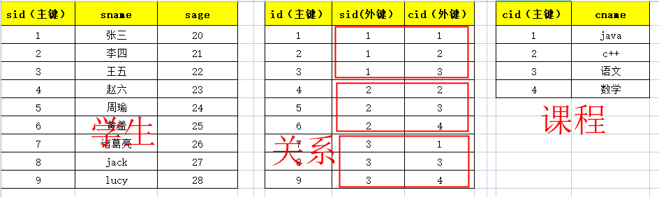

---

## 什么是数据库设计三范式

**数据库表`设计的原则`。教你怎么`设计数据库表有效`，并且`节省空间`。**

## 三范式

1. **第一范式：`任何一张表`都应该有`主键`，`每个字段是原子性的不能再分`**
   1. 以下表的设计不符合第一范式：无主键，并且联系方式可拆分。

   2. 应该这样设计：

2. **第二范式：建立在第一范式基础上的，另外要求`所有非主键字段完全依赖主键`，`不能产生部分依赖`**
   1. 以下表存储了学生和老师的信息

> **虽然`符合第一范式`，但是`违背了第二范式`，学生姓名、老师姓名都`产生了部分依赖`。导致`数据冗余`。**

   2. 以下这种设计方式就是符合第二范式的：

3. **第三范式：建立在第二范式基础上的，`非主键字段不能传递依赖于主键字段`**
   1. 以下设计方式就是违背第三范式的

> **以上因为产生了`传递依赖`，导致`班级名称冗余`。**

   2. 以下这种方式就是符合第三范式的：

## 一对多怎么设计

> **口诀：`一对多两张表，多的表加外键`。**

## 多对多怎么设计

> **口诀：`多对多三张表`，`关系表`添加`外键`。**

## 一对一怎么设计

两种方案：

1. **第一种：`主键共享`**

2. **第二种：`外键唯一`**

## 最终的设计

**最终以满足客户需求为原则，有的时候会拿`空间换速度`。**